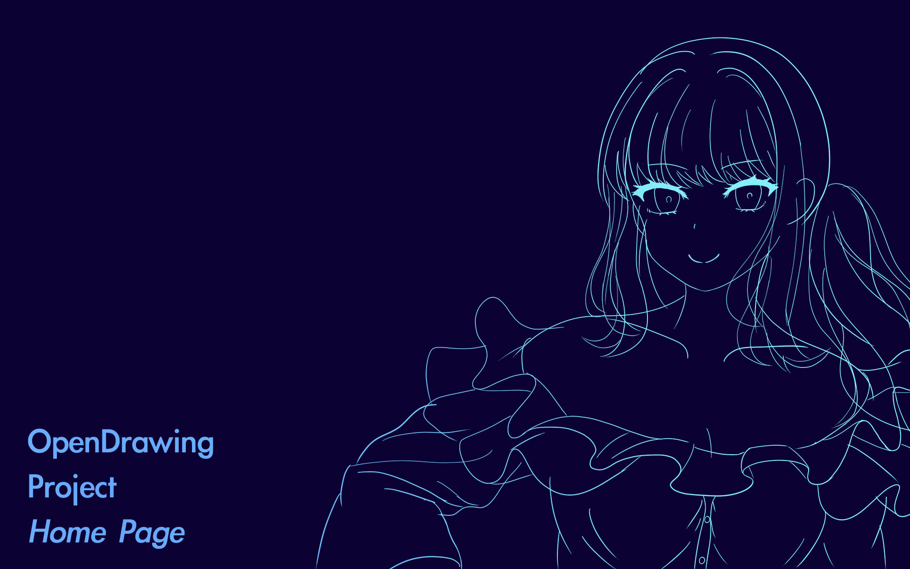
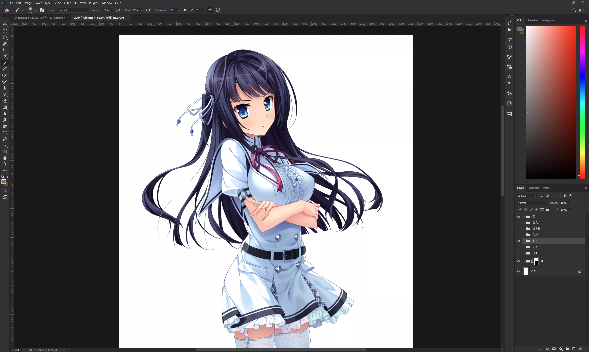
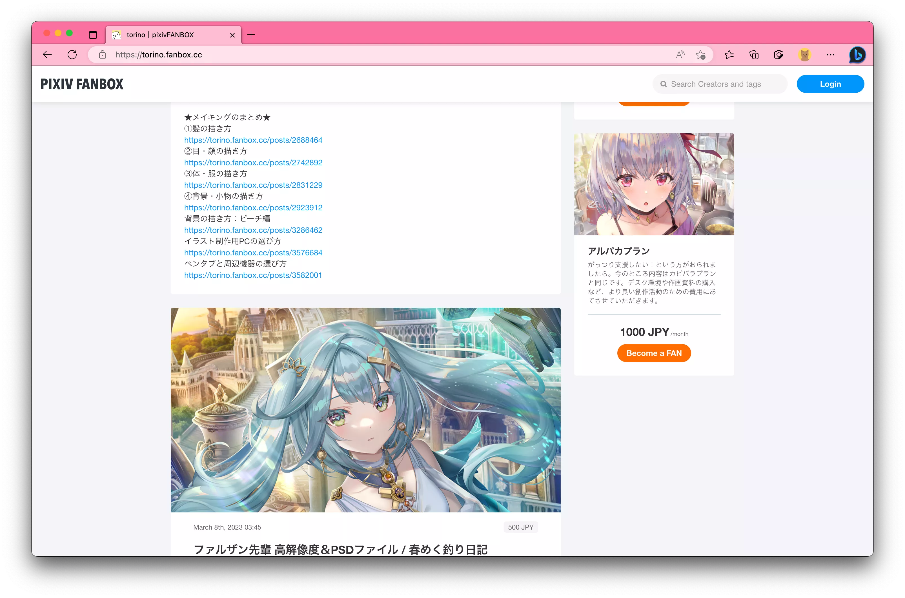

  頁面施工中，，，
   
  🚧本頁面仍在製作中。

請熱愛美少女的你一起來體驗美少女插畫的樂趣！

## Contents

  * [🧭 Quick Start](#Quick-Start)
    * [🛠️ 準備工作](#準備工作)
    * [🔰 繪畫入門](#繪畫入門)
    * [💻 使用繪畫軟件](#使用繪畫軟件)
    * [🧠 繪畫基礎知識](#繪畫基礎知識)
    * [✏️ 漫畫美少女繪製技術](#漫畫美少女繪製技術)
    * [👗 高級美少女繪製技術](#高級美少女繪製技術)
    * [🎨 上色技術](#上色技術)
    * [🤯 硬核作畫技術](#硬核作畫技術)

  * [🛰️ 插畫繪製流程](#插畫師作畫-Workflow)

## Quick Start

好的！現在你有了一個新任務：繪製一張美少女的插畫。但是你可能會覺得自己不會畫畫或者沒有美術素養/藝術細菌，覺得繪製插畫是一個高不可攀的任務。

但是事實並非如此，因爲我們的目的不是和推特上面的畫師們內卷或者成爲頂級插畫家，我們身爲 Galgame 玩家，目的也只是體驗一下親手製造出自己最喜歡的美少女的快樂。因此我們將會介紹一些基礎知識來幫助你快速走上作畫的道路。

  請注意！
   
  1. 如果你的目標是成爲職業插畫家，那麼本網站的內容不適合你。
   
  2. 和其他所有的藝術學科一樣，繪畫需要腳踏實地地練習，無法速成。
   
  3. 要把你的作品發給群友看。

但是這又怎麼樣？我們是以插畫爲樂的人，最重要的是開心。

準備好加入 OpenDrawing Project 了嗎？那麼就請來看看我們準備的學習資料罷。

### 準備工作

OpenDrawing Project 是一個開源項目，因此我們在電腦上作畫。使用電腦作畫相比紙張作畫的優點在於：

 * 便於修改
 * 便於濫用科技
 * 開源

因此你需要準備能在電腦上作畫的設備。

首先是電腦，你需要一臺能運行 Photoshop 的電腦，至少 16G 內存，顯示器不求頂尖級別，至少色彩不能拉跨。如果你覺得你的電腦顯示器相比你的手機屏幕的顏色明顯黯淡很多，那麼不行，，，

然後你需要一塊數位板。由於數位板上的每一個點都和電腦屏幕上的位置一一對應，所以數位板尺寸不能太小，否則就會遇到難以操作線條的窘境。接近 A4 紙大小的尺寸是合適的。其次數位板附帶的筆尖需要是硬筆，不可以是伸縮的彈簧筆尖，購買的時候請注意！

我的數位板是 Wacom CTL-672，牠雖然滿足上述兩點要求，但是牠是一坨答辯。

### 繪畫入門

這本書介紹了繪畫的一些基礎知識和需要注意的方面。

------

<book-info no=1 title="Keys to Drawing" author="Bert Dodson" uid="ktd" cover="images/index/KeysToDrawing-Cover.webp">
  

    一本繪畫入門書，零基礎可學。裏面講述了一些繪畫的基本技術，作畫時候應當養成的好習慣以及一些常見畫法等等。
  

  

    不需要全部看完，你只需要看到第四章（光影的畫法）即可！裏面的每一章都有一些簡單的作畫練習，你可以畫也可以不畫。這本書的目的是讓你對作畫技術有一個最基本的了解。
  

  

    只有英文版，但是我覺得不算難懂。 
    下載地址：
  

</book-info>

------

就這？就這！此時講太多理論無用，看完這個就已經可以開始畫畫了。
先從臨摹別人的畫開始，比如說找一些結構簡單的黑白漫畫然後臨摹，畫上那麼十張二十張，建立好捕捉形狀的能力，，，

當你需要更複雜的畫法和更精深的知識的時候再往下看。

### 使用繪畫軟件

選擇一個繪畫軟件來學習。

|                    |    **Photoshop**           |     **SAI 2**    | **Clip Studio Paint** |  **Krita**   |
| :----------------- | :-------------------- |:------------------ |:---------------------|:------------------ |
| **功能**           |       頂級       |    畫畫夠用      |      很強       |     還行       |
| **畫筆引擎**           |   依託答辯        |   很強       |     還行       |      還行      |
| **性能**       |         還行      |      很強       |         依託答辯    |     還行       |
| **操作系統**    |   Windows 🍎    |   Windows     |    Windows 🍎      |      Windows 🍎 🐧    |   
| **總評**         |   很強      |    還行    |   還行     |    依託答辯   |
| **推薦？**         |      推薦           |       還行      |     勉強推薦        |     開源拖拉機，別用      |

如果我不從中選一個地球就會爆炸的話呢？Photoshop。

針對 Photoshop，我們有一個神必培訓班的教學視頻：

  
➡️點此展開

  <video controls preload="metadata" width='100%'>
    <source src="https://dl.galgamer.eu.org/20%E5%B9%B4%E6%97%A5%E7%B3%BB%E4%BA%8C%E6%AC%A1%E5%85%83%E6%8F%92%E7%94%BB%E7%8F%AD/20%E5%B9%B4%E6%97%A5%E7%B3%BB%E6%8F%92%E7%94%BB%E8%AE%AD%E7%BB%83%E8%90%A5%E3%80%90%E5%9F%BA%E7%A1%80%E8%AF%BE%E3%80%91/1.%E9%80%8F%E8%A7%86/1.%E6%89%BE%E5%88%B0%E8%A7%86%E5%B9%B3%E7%BA%BF%E5%92%8C%E6%B6%88%E5%A4%B1%E7%82%B9/1-1%20PS%E7%BB%98%E7%94%BB%E5%B8%B8%E7%94%A8%E5%8A%9F%E8%83%BD%E5%AD%A6%E4%B9%A0.mp4" type="video/mp4" />
    
 To view this video please enable JavaScript

    </video>

 

### 繪畫基礎知識

下面是透視的畫法。雖然學習這個並不緊迫，但是稍微了解之後能讓你免於觸犯一些視角安排上的低級錯誤，因此列於基礎知識的分類。

------

<book-info no=2 title="The Art of Perspective" author="Phil Metzger" uid="pers" cover="images/index/Perspective-Cover.webp">
  

    本書介紹了透視的畫法，具有相當工程製圖的味道，是在繪製 3D 空間的時候的必備知識。
  

  

    雖然繪製美少女不一定會立馬用到這些知識，但是牠裏面還是教授了如何通過相當簡單的配色來營造空間感，我覺得相當有趣。 
    有兩百頁，但是大多都是圖，可以花上那麼兩個小時快快掃完，會大有裨益。
  

  

    只有英文版，但是我覺得非常好懂。 
    下載地址：
  

</book-info>

------

### 漫畫美少女繪製技術

畫畫就是不停地 Copy，Copy！！下面介紹幾本魔法書供你 Copy！

------

<book-info no=3 title="360°どんな角度もカンペキマスター！ マンガキャラデッサン入門" author="藤井英俊" uid="360d" cover="images/index/360-Cover.webp">
  

    這本書是漫畫角色作畫的速查手冊，內容包括了從人物的人體姿勢，到各個部位、衣服的畫法，同時提供了模特的照片，這本書我看得非常多。
  

  

    各種部位都分別提供了非常多的範例，你總能在裏面找到你想畫的東西， 
    並且都各自標註了注意事項，是非常好的作畫參考。
  

  

    只有日文版，文字不多，基本上都是插圖，一般人也能看懂。 
    下載地址：
  

</book-info>

------

<book-info no=4 title="メルヘンでかわいい女の子の衣装デザインカタログ" author="佐倉おりこ" uid="kawai" cover="images/index/Clothes1-Cover.webp">
  

    美少女服裝的速查手冊，內容包括了各種日常常見衣服和各種幻想系的奇妙衣服的畫法，另外還有各種飾品的畫法。
  

  

    找到你喜歡的 Copy 就完事了。
  

  

    只有日文版，文字不多，基本上都是插圖，一般人也能看懂。 
    下載地址：
  

</book-info>

------

<book-info no=5 title="How to Create Manga Drawing Clothing and Accessories" author="Studio Hard Deluxe" uid="mangacl" cover="images/index/MangaClothes-Cover.webp">
  

    服裝的速查手冊，內容主要是日常服裝的作畫參考，另外着重講解了令人頭痛的衣服褶皺和陰影，也提供了繪製衣服的一般方法。
  

  

    群友提供，我只簡單看了一下，但是我覺得 
    找到你喜歡的 Copy 就完事了。
  

  

    只有英文版。 
    下載地址：
  

</book-info>

------

### 高級美少女繪製技術

讓我們的美少女更加 fancy！畫技跟不上就一起來濫用科技吧！！

------

<book-info no=6 title="かがやく瞳の描き方" author="玄光社" uid="hitomi" cover="images/index/hitomi-Cover.webp">
  

    美少女的眼睛作畫最佳 Practice。
  

  

    群友提供，實在是一本好書，我經常看。 
    首先眼睛的作畫並不複雜也沒有煩人的光影計算，而且稍微按照裏面的教程畫一下就能得到非常美麗的美少女眼睛，絕對值得一試。
  

  

    只有日文版。 
    下載地址：
  

</book-info>

------

<book-info no=7 title="ファンタジー衣装の描き方" author="もくり" uid="fantasy" cover="images/index/fantasy-Cover.webp">
  

    大的來了，是幻想系美少女服裝的作畫指南。
  

  

    群友提供，非常高級。但是我的技術只能支撐我畫最簡單的衣服，這種實在是畫不來。 
    時間多的可以試一下。
  

  

    只有日文版。 
    下載地址：
  

</book-info>

------

### 上色技術

學習專業畫師的上色工作流。

------

<book-info no=8 title="とことん解説 キャラクターの「塗り」入門教室" author="乃樹坂 くしお" uid="coloring1" cover="images/index/coloring-Cover.webp">
  

    上色入門教程，講得非常詳細，只要跟着跑一遍就能畫出 GNU 意義上能跑的上色。
  

  

    提供的步驟遵循了一般畫師的工作流程，先上底色，然後是陰影和高光，多跟着做幾次大腦中就會有概念，非常有趣。 
    只需要看完前兩種上色方法，第三種可以直接跳過。
  

  

    只有日文版。 
    下載地址：
  

</book-info>

------

<book-info no=9 title="mignonがしっかり教える「肌塗り」の秘訣 おなかに見惚れる作画流儀。" author="mignon" uid="skin" cover="images/index/skin-Cover.webp">
  

    膚色上色教程。一開始的作畫用不到這麼高級的技術，因爲需要人體繪畫知識的配合。
  

  

    但是牠裏面的第一章介紹了 Galgame 業界常用的立繪上色手段「遮罩上色」的方法， 
    因此第一章非常值得一看。
  

  

    只有日文版。 
    下載地址：
  

</book-info>

------

除了教材之外，還有兩個很有用的資料。

第一個是 Galgame 公司 MOONSTONE 公開的遊戲立繪的 PSD 文件，如圖。

  <a class="fancybox fancybox.image" href="images/index/moonstone-psd.webp" itemscope="" itemtype="http://schema.org/ImageObject" itemprop="url" data-fancybox="default" rel="default" title="みさき立ち絵" data-caption="みさき立ち絵">
みさき立ち絵
</a>

建議親自分析一下這個 PSD 的結構，弄清楚每一個圖層的作用，就可以極大地加深對 Galgame 立繪上色手法的了解。
下載：

------

第二個是著名插畫家 torino 的 fanbox 上的文章。

上面還有 PSD 文件，如果你想要一窺大師的作畫世界，那麼捐贈 500 塊錢解鎖這些資料絕對是物超所值。出於對大師的尊重我無法公開這些資料，但是之後有機會可能會分享一篇使用 torino style 上色的博客文章。

### 硬核作畫技術

任何一種藝術都離不開勤懇的練習，包括繪畫，因此放一本素描的教材。

------

<book-info no=10 title="The Natural Way to Draw" author="Nicolaides" uid="natural" cover="images/index/natural-Cover.webp">
  

    素描和速寫教程。
  

  

    專業畫師和每一個美術生的必經之路，但是 OpenDrawing 的新手可以先不用考慮。 
    當然如果你有興趣的話。
  

  

    下載地址：
  

</book-info>

------

## 插畫師作畫 Workflow

下面介紹繪製一張插畫的完整流程。

## 寫在最後

Happy Open Drawing！



  

    

      {title}
    

    

        作者：
      
         {author}
      
    

  

  

    

      
    

    

    

  



