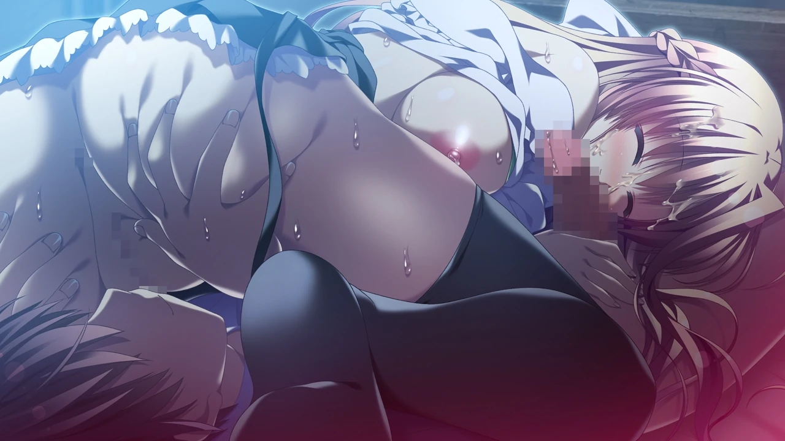
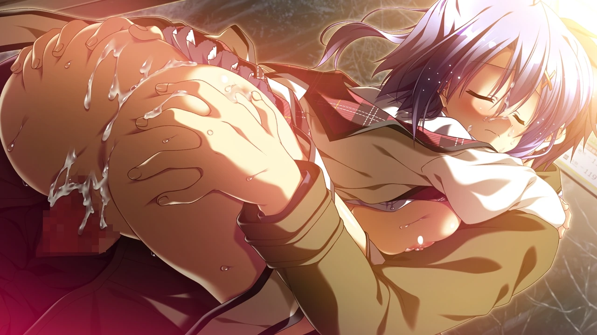

| 資訊一覽     |                 |
| :----------- | :------------------------------------ |
| **開發商**   | minori |
| **攻略人數** |   3     |
| **遊戲時長** | 20-30h |
| **類型**     | 拔作       |
| **難度**     |  0(无选择)  |
| **分級**     | R-18      |
| **遊戲引擎**   |     Musica       |

## 故事

12月24日，繁华的大街上，一名孤独的少女低头从人潮中穿过。
不知是生日与圣诞节重叠的缘故，还是那个只会躲在房间里并拒绝与自己见面的父亲，
就当她准备直面父亲时，突然开始失去知觉，恐惧中她将手伸向了烛光...

降旗直人过着悠闲的校园生活，这天，他在高台的台阶上遇到了瑞香，
对方丝毫不掩饰对他的好感，与他进行紧密的身体接触，
两人的感情极速升温，但是直人发现了杏铃对自己的好感，
即使知道三人的感情不可能回到从前的亲密无间，
直人仍想找到不伤害她的方法...

## 登场人物

<style>
  .charname {
    font-size: 150%;
  }
  .namearea hr {
    margin: 1.5rem 0;
  }
  .sp-character img, .img-shade {
    filter: drop-shadow(0 0 6px #000c);
  }
  .sp-character {
    border-radius: 20px;
    overflow: hidden;
    box-shadow: 0 5px 11px 0 rgb(0 0 0 / 18%), 0 4px 15px 0 rgb(0 0 0 / 15%);

    -webkit-backdrop-filter: blur(1px);
    backdrop-filter: blur(1px);
    
    background-color: var(--chara-card-color);
    
    /* background-color: transparent;
    background-image: var(--this-bg);
    background-position: center;
    background-repeat: no-repeat;
    background-size: cover; */

  }
  .sp-character .char-overlay {
    background-color: var(--chara-card-color);
    min-height: 400px;
    background-image: var(--right-bg);
    background-repeat: no-repeat;
    background-position: bottom 0px right calc(100% * 0.3 - 130px);
    background-size: auto 400px;

    margin: 0;
    padding: 0;
  }
  :root { /* 配色 */
    --chara-card-color: #ffffffcf;
  }
  [data-user-color-scheme='dark'] {
    --chara-card-color: #1a1a1aa6;
  }
  @media screen and (max-width: 767px) {
    .namearea hr {
      margin: 1rem 0;
    }
    .pc-left {
      -webkit-backdrop-filter: blur(3px);
      backdrop-filter: blur(3px);
      
      background: var(--chara-card-color);
      transition: opacity 0.3s;
    }
    .pc-left.touch {
      opacity: 0.1;
    }
    .sp-character {
     /*background: unset;*/
      /*-webkit-backdrop-filter: unset;
    backdrop-filter: unset;*/
    }
    .sp-character .char-overlay {
      min-height: 400px;
      background-size: contain;
      background-position: bottom 0px right 0px; 
    }
    :root { /* 配色 */
      --chara-card-color: #ffffff87;
    }
    [data-user-color-scheme='dark'] {
      --chara-card-color: #1a1a1aa6;
    }
  }
</style>



<div class={`row sp-character ${uid}`} style={`--this-bg: url(../image/12eve/chars/${no}b.webp)`}>
  <div class="col-12 char-overlay row" style={`--right-bg: url(../image/12eve/chars/${no}.webp)`}>
    <div class="pc-left col-12 col-md-8">
      <div class="namearea col-12 pt-2">
        <div class="charname font-serif font-weight-bold font-italic">
          {name}
        </div>
        <div class="yomi font-italic">
          {yomi}
        </div>
        <hr />
      </div>
      <div class="infoarea col-12" html={html}>
      </div>  
    </div>
  </div>  
</div>


<sp-character no=0 name="降旗 直人" yomi="huruhata naoto" uid="naoto">
  <p>
    本作无脸男主。
  </p>
  <p>
    亚萨西大法持有者，但是人并不渣(不多开)，也不死板(该上就上)，<br>
    椎名姐妹的青梅竹马，彼此父母都不在家，大小节日都是一起过的。 <br>
    察觉到了椎名姐妹对自己的好感，试图找出不会让三人决裂的方法。
  </p>
</sp-character>
<br>
<sp-character no=1 name="宇奈原 由紀" yomi="unahara yuki" uid="yuki">
  <p>
    元气活泼的学妹。
  </p>
  <p>
    神秘的转学生，目前寄宿在凛的公寓里。<br>
    会在恰当的时机推一把直人。<br>
    吐槽役，总是为一些奇怪的事情而感慨。
  </p>
</sp-character>
<br>
<sp-character no=2 name="椎名 杏鈴" yomi="shiina annzu" uid="annzu">
  <p>
    认真傲娇的椎名妹妹。
  </p>
  <p>
    家务全能，承包椎名家的家务。<br>
    不擅长应付姐姐，被耍的团团转就算了，胸部也经常遭到姐姐的蹂♀躏。<br>
    说到关于性的话题会脸红，会无意地透露出对直人的好感，
  </p>
</sp-character>
<br>
<sp-character no=3 name="椎名 瑞香" yomi="shiina mizuka" uid="mizuka">
  <p>
    大智若愚的椎名姐姐。
  </p>
  <p>
    表面上悠闲迟钝，经常入戏，平地摔，向妹妹撒娇，做出笨蛋发言。<br>
    实则成绩拔尖，直觉敏锐，能巧妙套出直人的话。
    喜欢猫，擅长逗猫。
  </p>
</sp-character>


## 游戏 CG（含有 R-18）








## 给新玩家的推荐理由

7个G的游戏，285张CG，非常好冲，
由于各个条线的作者不同，剧情风格有较大的不同，结局仍是大圆满结局，
本作采用了双视角来叙述故事，剧情跌宕起伏，男女主角历经考验修成正果，
希望该作能为各位带来一个特别的平安夜。


## 资源和下载

[🔗️Telegram下载地址](https://t.me/ACGNyouxifenxiang/320)

百度网盘秒传链接：(需使用秒传补丁，请自行搜索下载，解压密码：tmhtmiao.com)

```
618CA51112E9C8EBABCB4821B1E867B9#EA30B7BE0AA582165D08C093561E9D58#8226522910#无尽的平安夜[12月EVE,12月的夏娃][汉化硬盘版].wim
```

<style>
details {
    border: 1px solid #aaa;
    border-radius: 4px;
    padding: .5em .5em 0;
}

summary {
    font-weight: bold;
    margin: -.5em -.5em 0;
    padding: .5em;
}

details[open] {
    padding: .5em;
}

details[open] summary {
    border-bottom: 1px solid #aaa;
    margin-bottom: .5em;
}
</style>

<script>
  //document.documentElement.setAttribute('data-user-color-scheme', 'dark');
  document.addEventListener("DOMContentLoaded", function(){
    let pclefts = document.querySelectorAll('.pc-left');
    pclefts.forEach((el) => {
      el.addEventListener('touchstart', function(){
        el.classList.add('touch');
      })
      el.addEventListener('touchend', function(){
        el.classList.remove('touch');
      })
    });
    //setTimeout(() => document.documentElement.setAttribute('data-user-color-scheme', 'light'), 1000)
  })
</script>


