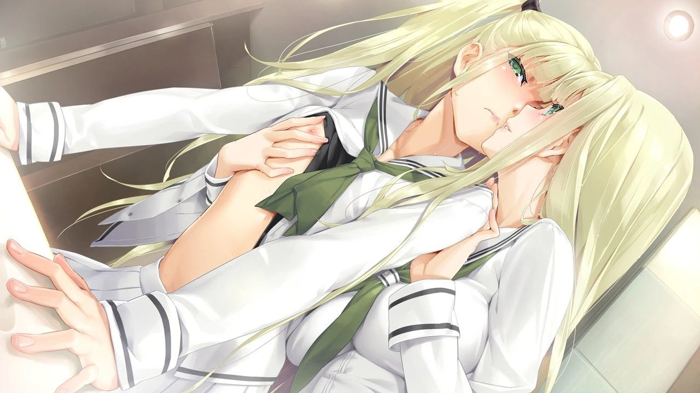
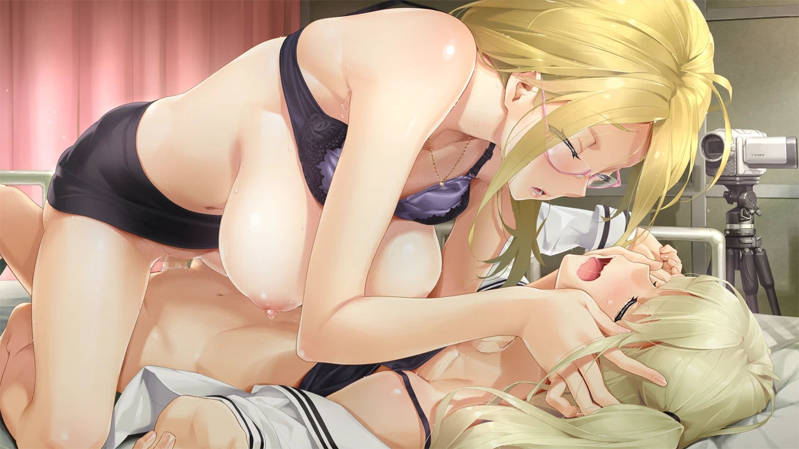
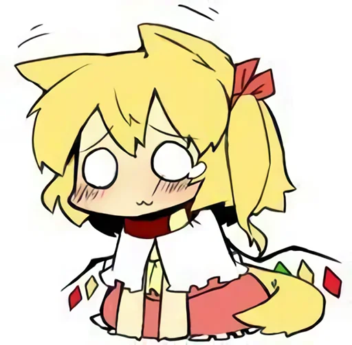

| 資訊一覽     |                 |
| :----------- | :------------------------------------ |
| **開發商**   | ωstar |
| **攻略人數** | 4         |
| **遊戲時長** | 15-20h        |
| **類型**     | 拔作       |
| **難度**     | 低 |
| **分級**     | R-18      |
| **遊戲引擎**   |     QLIE       |

## 故事

我们分享同一个子宫，自出生就属于彼此——

<span class="text-danger">“我几乎已经死了。”</span>主角觋夕摩已经在疗养院里孤独地度过了一年，<br class="d-none d-md-inline">但心中对双胞胎姐姐夕莉的思慕却依旧如闷烧的火焰，令他几近疯狂。

在火灾狂暴的焰舌将母亲夕香里吞没之后，他就被嫌恶的父亲送到这里，幽禁在一成不变的病房之中，仿佛鸟笼中的百合花。
这天，转机终于到来，在如骤雨般的蝉鸣中，夕摩和舅舅夕纪夫在母亲坟前献上花束，
舅舅双手合十，低头忏悔：
<span class="text-danger">“让你感到孤单了吧，真的对不起。”</span>
然后，舅舅突然休克发作，撒手人寰。

数日后，夕摩怀揣思念，半睡半醒时被熟悉的声音唤醒：<br class="d-none d-md-inline">“你还是像冬眠的青蛙一样呆呆的呢，嘛，虽然也挺可爱的。”
一看，与自己长相神似的美少女——夕莉正站在那里。

闲聊几句，夕摩正开始收拾东西准备出院时，
夕莉却露出了恶作剧般的兴奋眼神，
她强势地按住夕摩的头，夕摩眼神与姐姐丰满的胸部对上，<br class="d-none d-md-inline">他羞耻地表达感谢，姐姐这才放开。

姐姐带他来到新家，回到家的他仍然受到父亲的冷眼。
姐姐和父亲外出后，倍感寂寞的他来到了姐姐的房间，<br class="d-none d-md-inline">他闻着房间内充盈的体香，穿上女装在床上用姐姐的胖次自慰起来。

“啊啊啊~夕莉~~”——却不巧被前来送校服的姐姐撞见这一幕，
姐姐再次露出恶作剧般的兴奋眼神狠狠玩弄了他。
事后姐姐拿出女校校服，要求夕摩与她一起就读女校，<br class="d-none d-md-inline">就这样，夕摩的女校生活拉开帷幕...

## 登场人物

<style>
  .charname {
    font-size: 150%;
  }
  .namearea hr {
    margin: 1.5rem 0;
  }
  .sp-character img, .img-shade {
    filter: drop-shadow(0 0 6px #000c);
  }
  .sp-character {
    border-radius: 20px;
    overflow: hidden;
    box-shadow: 0 5px 11px 0 rgb(0 0 0 / 18%), 0 4px 15px 0 rgb(0 0 0 / 15%);

    -webkit-backdrop-filter: blur(1px);
    backdrop-filter: blur(1px);
    
    background-color: var(--chara-card-color);
    
    /* background-color: transparent;
    background-image: var(--this-bg);
    background-position: center;
    background-repeat: no-repeat;
    background-size: cover; */

  }
  .sp-character .char-overlay {
    background-color: var(--chara-card-color);
    min-height: 400px;
    background-image: var(--right-bg);
    background-repeat: no-repeat;
    background-position: bottom 0px right calc(100% * 0.3 - 130px);
    background-size: auto 400px;

    margin: 0;
    padding: 0;
  }
  :root { /* 配色 */
    --chara-card-color: #ffffffcf;
  }
  [data-user-color-scheme='dark'] {
    --chara-card-color: #1a1a1aa6;
  }
  @media screen and (max-width: 767px) {
    .namearea hr {
      margin: 1rem 0;
    }
    .pc-left {
      -webkit-backdrop-filter: blur(3px);
      backdrop-filter: blur(3px);
      
      background: var(--chara-card-color);
      transition: opacity 0.3s;
    }
    .pc-left.touch {
      opacity: 0.1;
    }
    .sp-character {
     /*background: unset;*/
      /*-webkit-backdrop-filter: unset;
    backdrop-filter: unset;*/
    }
    .sp-character .char-overlay {
      min-height: 400px;
      background-size: contain;
      background-position: bottom 0px right 0px; 
    }
    :root { /* 配色 */
      --chara-card-color: #ffffff87;
    }
    [data-user-color-scheme='dark'] {
      --chara-card-color: #1a1a1aa6;
    }
  }
</style>


<div class={`row sp-character ${uid}`} style={`--this-bg: url(../image/Bishoujo_Mangekyou-Tsumi_to_Batsu_no_Shoujo-/chars/${no}b.webp)`}>
  <div class="col-12 char-overlay row" style={`--right-bg: url(../image/Bishoujo_Mangekyou-Tsumi_to_Batsu_no_Shoujo-/chars/${no}.webp)`}>
    <div class="pc-left col-12 col-md-8">
      <div class="namearea col-12 pt-2">
        <div class="charname font-serif font-weight-bold font-italic">
          {name}
        </div>
        <div class="yomi font-italic">
          {yomi}
        </div>
        <hr />
      </div>
      <div class="infoarea col-12" html={html}>
      </div>  
    </div>
  </div>  
</div>


<sp-character no=0 name="覡夕摩" yomi="kannagi yuuma" uid="yuuma">
  <p>
    本作主角，和姐姐长相神似，时常被姐姐捉弄但他乐在其中。
  </p>
  <p>
    因家庭原因住院一年，出院后和姐姐一起读女校，<br>
    有诗人般的敏感，能精准捕捉生活中的小确幸。
  </p>
  <p>
    饱读诗书，<del>我青年时代就读过</del>《恶之花》（也作恶之华）<br class="d-none d-md-inline">
    《山羊之歌》《麦田的守望者》《鲜花圣母》《地狱一季》（这本好像没有中译本）
  </p>
</sp-character>
<br>
<sp-character no=1 name="覡夕莉" yomi="kannagi yuuri" uid="yuuri">
  <p>
    夕摩的双胞胎姐姐，学习优秀，运动万能，<br>料理上手，是学校里有名的冰山美人。
  </p>
  <p>
    意外地有宅的一面，给弟弟安利姐控向gal，书柜里也有轻小说，<br>
    重度弟控，严重到不想让弟弟吃其他女人做的饭。
  </p>
</sp-character>
<br>
<sp-character no=2 name="铃森伊千果" yomi="suzumori ichika" uid="ichika">
  <p>
    夕摩的同班同学，胆小&天然呆，喜欢小动物。
  </p>
  <p>
    读不懂空气(KY)，把握不好当代年轻人轻浮的气球社交，<br>
    在班里是存在感比较低的存在，这大概是她偶尔会通宵玩gal的原因。
  </p>
</sp-character>
<br>
<sp-character no=3 name="御殿场镜子" yomi="gotenba kyouko" uid="kyouko">
  <p>
    夕摩的同班同学，电波系，半边脸用头发遮住。
  </p>
  <p>
    文艺部部长，涉猎范围广泛，尤其喜欢看克苏鲁神话，<br>
    是文艺部部室种种怪谈的制造者。
  </p>
</sp-character>
<br>
<sp-character no=4 name="藤堂咲" yomi="toudou saki" uid="saki">
  <p>
    保健室的老师，热情成熟，人气很高。
  </p>
  <p>
    但在学生中流传着一些关于她的不好的传言。
  </p>
</sp-character>
<br>
<sp-character no=5 name="覡礼次郎" yomi="kannagi reijirou" uid="reijirou">
  <p>
    夕摩的父亲，职场精英，对子女要求严格。
  </p>
</sp-character>

## 游戏 CG（含有 R-18）




## 给新玩家的推荐理由

<div class="row align-items-center">
  <p class="col" style="font-size:75%;">本来想展开给大家分析一波，但是我写不出来（</p>
  </img>
</div>

<div class="row align-items-center">
  <p class="col" style="font-size:75%;">我就说的简单点罢</p>
  </img>
</div>

镜4把压抑的往事与温馨的日常结合叙述，其中不乏喜剧要素，<br class="d-none d-md-inline">H场景大多是是压抑与温馨的变换，背德感拉满，动态CG也非常涩。

BGM选用古典乐变调，章节的衔接、场景的变换引用严肃文学很恰当地反应了角色的心境<del>志賀直哉直呼内行</del>
游戏中伦理剧的要素也很多，这使得角色们之间的爱都比较扭曲<del>扭曲怪狂喜</del>

另外值得一提的是，夕摩自述的口吻你们有木有觉得有亿点熟悉啊，
没错，他是以一种太宰治式的手法，把自己的丑剖析成美的，<br class="d-none d-md-inline">夕摩，太宰治，还有郁达夫，他们都是擅长此道，而且极度敏感的人，
推荐各位推完镜4去读下郁达夫的《沉沦》，或许会有惊喜。

## 笔者与镜4的亿点小故事

*要素过多&话痨警告 无剧透*

镜4是我玩的第一个gal，那还是20年5月，我在家里封了小半年，<br class="d-none d-md-inline">我到现在还没弄清covid-19到底是哪发源的，到底是不是吃蝙蝠吃到身上来的，
一会儿辟谣一会儿宣布，瑞典生物学家威尔逊爱德华兹或成最大赢家。

然后我无意发现了镜4，哇哦，是没有玩过的船新游戏，
我也有个亲姐不过她比我大N岁，我念国中的时候她都大学毕业了。<br class="d-none d-md-inline">我们分多聚少，每次她问我想不想她，老实说我内心是不怎么想的。

她在我的成长过程中基本上都缺席了，我的心里已经没有她的位置了（无情）
她给我的感觉更像是，出于义务的对我好，一种没有私心的，单纯是她认为应该这样。

费孝通说过中国的家庭关系是垂直的，以亲子关系为主轴，<br class="d-none d-md-inline">（大概是这么个意思，欢迎懂哥指正）
然后夫妻之间大概就是这种义务性的爱，
“说不上几句话就下地干活去了，在一起的时候没啥可说的”。
然而夕莉姐姐的爱与之不同，她非常的主动、强气，<br class="d-none d-md-inline">给当时精神分裂长期摆烂的我带来了巨大的精神治愈。

然后我玩通了镜4，我就好奇西方以夫妻为主轴的家庭，他们的社会，<br class="d-none d-md-inline">他们的意识形态，他们的社会结构真的有宣传机器说的那么不堪吗？

适逢后浪事件，b站及主流媒体一边倒的地唱赞歌，引起了我极大的不适，
我翻出同学发我的vpn，去外网寻找答案，
然后我找到了编程随想的博客，接触了自由主义思想，<br class="d-none d-md-inline">尤其是哈耶克的书，直接让我醍醐灌顶，
不久我就顺利成了一个自由民主派政治异见人士。

*編者註：動態清零把人家的愛國心都給動態清零了啦，而且還成爲了入坑下作 Galgame 文化圈的契機，我直接笑死，，，*

## 还在犹豫是否下载？

这里有一个试玩录像

<video controls preload="metadata" width='100%' poster='../image/Bishoujo_Mangekyou-Tsumi_to_Batsu_no_Shoujo-/movie.webp'>
<source src="https://s3static-zone0.galgamer.eu.org/video-2d35/bishojo4/bishojo4-movie.mp4" type="video/mp4">
</video>


## 资源和下载

```
magnet:?xt=urn:btih:2e5d478eae065325c939044da0a84d9fb4df9ce7
```

文件名：[瑞树×萌你妹]美少女万华镜-罪与罚的少女-.rar

种子来自琉璃神社：https://www.hacg.cat/wp/51477.html

**其他版本：**

安卓直装: 

pc版: 

ONS版: 


<style>
details {
    border: 1px solid #aaa;
    border-radius: 4px;
    padding: .5em .5em 0;
}

summary {
    font-weight: bold;
    margin: -.5em -.5em 0;
    padding: .5em;
}

details[open] {
    padding: .5em;
}

details[open] summary {
    border-bottom: 1px solid #aaa;
    margin-bottom: .5em;
}
</style>

<script>
  //document.documentElement.setAttribute('data-user-color-scheme', 'dark');
  document.addEventListener("DOMContentLoaded", function(){
    let pclefts = document.querySelectorAll('.pc-left');
    pclefts.forEach((el) => {
      el.addEventListener('touchstart', function(){
        el.classList.add('touch');
      })
      el.addEventListener('touchend', function(){
        el.classList.remove('touch');
      })
    });
    //setTimeout(() => document.documentElement.setAttribute('data-user-color-scheme', 'light'), 1000)
  })
</script>
