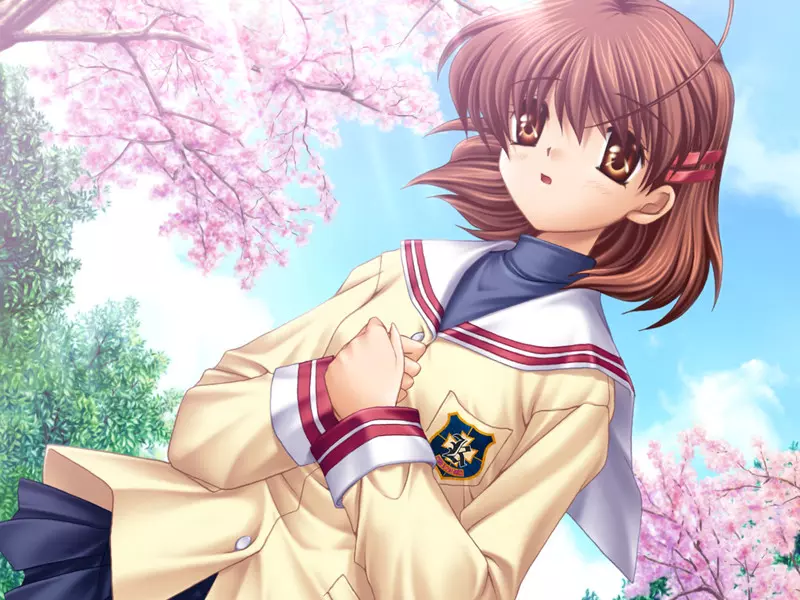
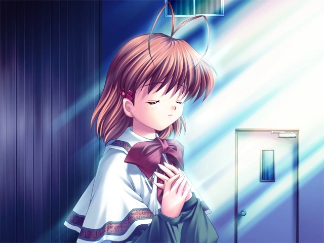
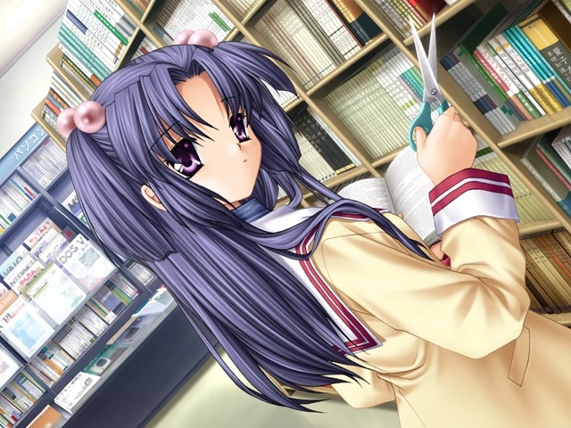
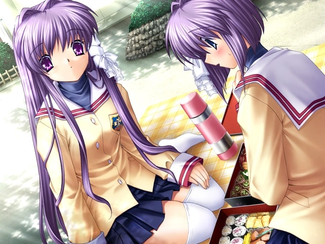
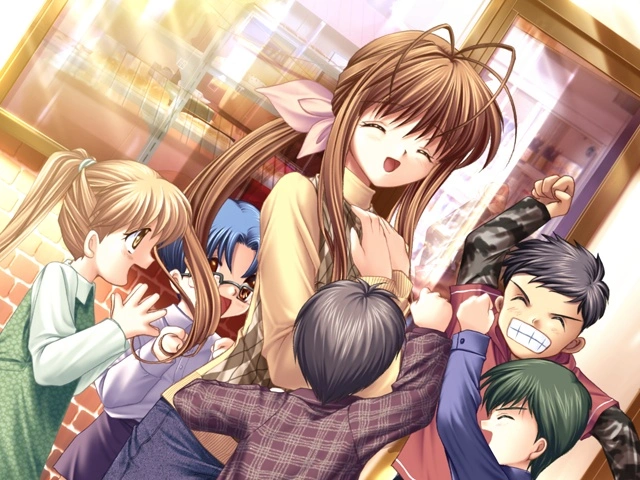
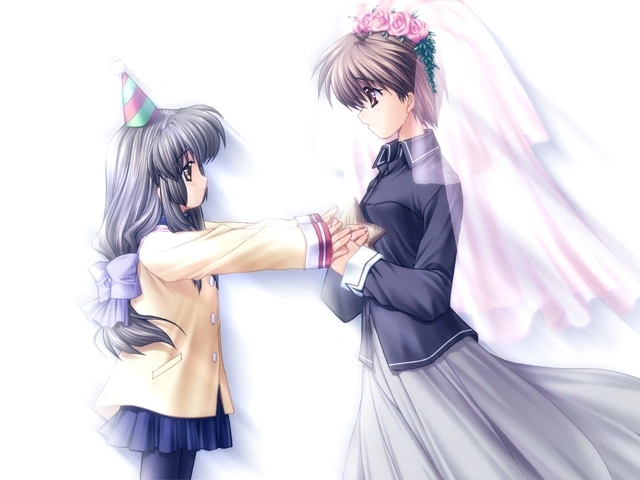
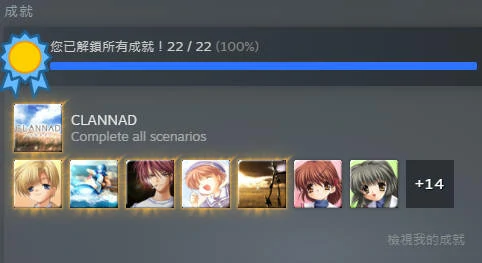

`作者: Patchouli Knowledge`

  <b>“紅豆麵包~ 你喜歡這所學校嗎？我非常非常喜歡！”</b> 
  <b>“但是，無論任何事物…都不可能永遠不變的，開心的事…快樂的事…全部…全部…都不會保持不變的”</b> 
  <b>“即便如此，你還是喜歡這個地方嗎？”</b> 

| 資訊一覽     |                  |
|:--------:|:---------------- |
| **開發商**  | Key |
| **遊戲時長** | 60 - 70 H          |
| **類型**   | 校園 劇情 成長 催淚        |
| **難度**   | 較高（你驚擾了風子                |
| **分級**   | 全年齡             |

## 故事梗概

在某個不知名的小鎮上，男主角***岡崎朋也***因爲家庭原因失去了生活的色彩，只想離開這個小鎮。因此在光坂高等學院就讀的他和好基友***春原陽平***一直過著混吃等死的生活。

就在即將畢業的高三，一如既往翹課遲到的朋也正在校門口前的櫻花坡道悠閑地走著，一名柔弱的女生向其搭話，説出了上面那段話，給朋也留下了深刻的印象。

 

 

午飯時間，朋也看到早上的女孩一個人孤獨地在中庭吃麵包，同爲邊緣人的他動了惻隱之心，上前搭話，得知了女孩名叫***古河渚***，交談中得知渚想重振演劇部，並想在學園祭登臺表演。

也不知是一見鍾情還是命運使然（其實就是玩家的選擇），朋也開始協助渚重建演劇部並準備節目，期間又和許多貌美的女學生建立下深厚的羈絆（當然得看玩家的選擇），最終渚如願以償，與朋也的感情也急劇升溫，朋也頹廢的生活也逐漸被染上色彩，一切的一切都在穩中向好，然而……

 

## 人物介紹

該作人物衆多且每個人都有自己的綫（甚至岳父都有），這裏只介紹 TV 動畫中有綫的女主角們和男主。

### 岡崎 朋也（cv：伊藤 健太郎）
 

  

    
  

  

    

      全校聞名的不良，外表帥氣但總是甩著張臭臉讓人不敢靠近。
    

    

      以體育特長生的身份入讀學校，但因爲某些原因而無法繼續打籃球，便從此自甘墮落，每日和基友春原鬼混，課也是愛上不上，
    

    

      但其實他内心十分善良還樂於助人，雖然看起來是不良但從未做過什麽壞事（除了惡搞春原 對待感情十分的專一，每條綫對女主都是不離不棄的好男人
    

  

### 古河 渚（cv：中原 麻衣）
 

  

    
  

  

    

      在櫻花飄散的坡道上與朋也相遇，堅強溫柔，樂觀向上，但同時性格也十分內向不自信，總是認爲自己不行。
    

    

      身體不好，經常因此休學，這也是造成她性格內向主要原因，還會開玩笑的稱自己也是個“不良”
    

    

      在朋也的支持下，逐漸變得自信起來，最終也達成了自己重建演藝部的願望。  十分喜歡糰子大家族
    

  

### 藤林 杏（cv：廣橋 涼）
 

  

    
  

  

    

      一頭飄逸的紫色長髮+豪爽的性格在校內自然是人氣王，無論在男生還是女生中都頗受歡迎
    

    

      有一個雙胞胎妹妹，每天都騎着小電驢上學，還時不時把自己的寵物豬“牡丹”帶到學校，你比朋也還不良
    

    

      豪爽的外在內心確也十分細膩，擅長料理，察言觀色十分強  扔字典是一絕，但對朋也無效
    

  

### 藤林 椋（cv：神田 朱未）
 

  

    
  

  

    
杏的雙胞胎妹妹，爲了區分剪了短髮，同時也是朋也班上的班長
    

    
彷彿和姐姐是正負極一樣，性格內向，不擅長料理，運動也不行，典型的弱女子  喜歡占卜，且占卜的非常準

  

### 一之瀨 琴美（cv：能登 麻美子）
 

  

    
  

  

    
總是獨自呆在閱覽室的文學少女，似乎不上課也沒人會管她，還時不時要把書上某些部分剪下來 其實是天才少女，所以上不上課無所謂    

    
對朋也一見如故，十分依賴朋也  喜歡拉小提琴，但其音色是殺傷性武器

  

### 坂上 智代（cv：桑島 法子）
 

  

    
  

  

    
朋也的學妹，因爲家庭原因成爲不良少女，在小鎮上四處教訓不良，成爲傳說。

    
爲了保護學校前的櫻花坡道，競選學生會長  性格十分正經，勢要把朋也和春原帶回正規，每天都去叫這兩人上學拒絕遲到
    

    
人氣非常高，key社爲其做了專門的番外遊戲智代after

  

### 伊吹 風子（cv：野中 藍）
 

  

    
  

  

    
每天都在舊校舍雕刻木海星的蜜汁少女，只有朋也和渚能夠看到她的身影。

    
據她本人說法木海星是爲了當姐姐婚禮上的請帖，請大家都來參加姐姐的婚禮。

    
性格古靈精怪，完全就是個小孩子，喜歡幻想

  

## 遊戲 OP & TV OP

動畫來自被牆的油管和steam，請翻牆



<iframe id='y2b' loading="lazy" src="https://www.youtube-nocookie.com/embed/oHdZOKm5xzo" title="YouTube video player" frameborder="0" allow="encrypted-media; picture-in-picture" allowfullscreen></iframe>

## 簡評

  
優點：

  </img>

 * 堪稱天花板級別的校園日常系劇本，key社代表作，有歡笑，有淚水，完美展示了岡崎朋也的成長歷程，每條綫劇情都十分飽滿。
 * 沒有一個工具人，所有人都是爲了自己的信念而生活，多少老二次元在這部作品中看到一點自己的身影。
 * BGM 那更是神中神，每首都是二次元金曲。
 * 該作值得一切贊美，是日系galgame乃至整個二次元的明星（無論是galgame還是動畫的各種榜單你總能看到這部作品名列前茅，其優秀相信也不用贅述
 

  
缺點：

  </img>

 * 桶媽臉（動畫算是被京阿尼潤色了不少，但游戲内只能説適應了也挺萌的不是嗎 :)

如果有新手找我推薦 galgame 遊玩，那麼 CLANNAD 永遠是我的不二之選，沒有令人不適的重口情節，更不是白開水般的廢萌劇情，也沒有花裏胡哨的遊玩系統，每一部分都是標準到不能再標準，可謂是 galgame 的標杆級別作品，並且是高貴的全年齡，讓你可以在任何地方都可以愉快玩耍。

京阿尼的動畫化那更是 galgame 動畫化的天花板，相信無數 key 社粉絲都期待着京阿尼可以再次與 key 社合作。（爲了寫這篇筆者又看了一次動畫，看完依然像當年一樣好多天沒緩過來

| 評分        |      |
|:---------:|:----- |
| **人設**    | 10/10 |
| **立繪 & CG** | 7/10 |
| **劇情**    | 10/10 |
| **音樂**    | 10/10 |
| **綜合**    | 10/10 |

## CG鑑賞

### 部分來自TV


../image/CLANNAD/11.webp
../image/CLANNAD/12.webp
../image/CLANNAD/13.webp
../image/CLANNAD/14.webp


## 遊戲資源



盜版： 

