`作者: Patchouli Knowledge`

  筆者沒有體驗過所有型月作品，咀嚼所有設定集，但該作還是認真游玩全結局通關 
  還請月球警察嘴下留情 

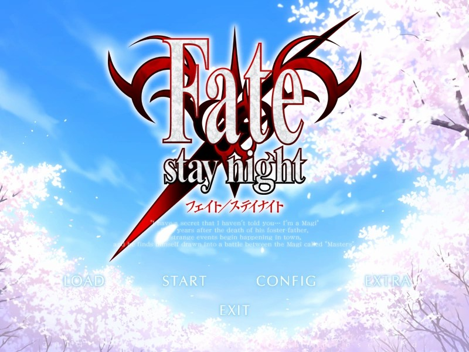

先來一段月球聖經詠唱配上エミヤ。
<audio preload="metadata" style="width: 100%" src="https://s3static-zone0.galgamer.eu.org/audio-2d35/stay+night++%5BUnlimited+Blade+Works%5D+OST+II+++Emiya+UBW+Epic.mp3" controls="controls">

  <i>I am the bone of my sword.</i> 
  <i>Steel is my body, and fire is my blood.</i> 
  <i>I have created over a thousand blades.</i> 
  <i>Unknown to Death.</i> 
  <i>Nor known to Life.</i> 
  <i>Have withstood pain to create many weapons.</i> 
  <i>Yet, those hands will never hold anything.</i> 
  <i>So as I pray, "<b>Unlimited Blade Works</b>".</i> 

| 資訊一覽     |                  |
|:--------:|:---------------- |
| **開發商**  | Type Moon |
| **遊戲時長** |60 H          |
| **類型**   | 戰鬥 劇情 型月 經典     |
| **難度**   | 较高            |
| **分級**   | R-18             |

## 故事梗概
在和平的冬木市，每隔數十年就會出現能實現夢想的萬能許願機“聖杯”，七位魔術師（御主MASTER）和自己召喚出來的使魔（從者SERVANT）兩兩一組展開你死我活的搏殺，只有活到最後的才有資格獲得聖杯，許下願望。
冬木學院的高二生***遠坂 凜***繼承了父親的遺志參加聖杯戰爭並召喚出了不聼話的神必紅色緊身衣男子作爲從者，職介為Archer。
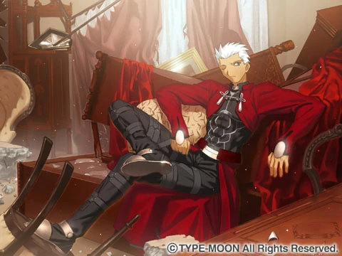
次日，凜發現有人在學校佈置了吸取學生精氣作爲自己魔力的結界，便在深夜開始調查，並偶遇一個神必藍色緊身衣男子開始交戰，刀光槍影之間，居然還有路人經過，沒想到都深夜了還有卷王在學校沒走，藍色緊身衣男子馬上前往滅口，簡單一槍就刺穿了路人的胸口，這個卷王正是我們的男主***衛宮 士郎***。凜看到傷及無辜馬上爲其療傷並迅速離開，士郎從昏迷中醒來，大難不死的他也自行回家避難。
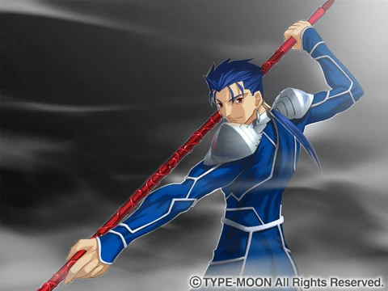
藍色緊身衣男子做事謹慎發現士郎沒死後馬上追到家中，士郎回到家后也陰差陽錯通過家中倉庫的魔法陣召喚了一位身材矮小的金髮美少女……
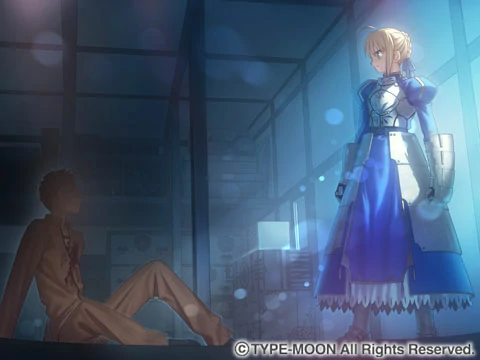
簡單的交談后兩人便確立了主僕關係，面對來犯的藍色緊身衣男子，金髮美少女馬上展現出了驚人的實力，幾下就擊退了藍色緊身衣男子，並與前來關心的遠坂凜主僕交戰起來，聖杯戰爭就此打響……
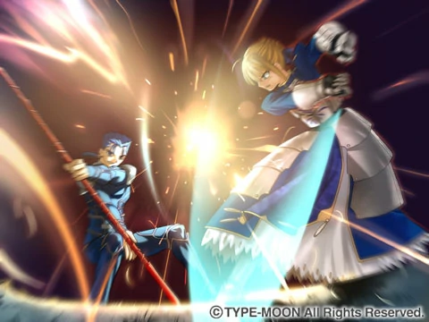

## 人物介紹（只介紹早期角色，中後期角色難免劇透

    

        
    

    

衛宮 士郎

CV: 杉山 紀彰

 
繼承了去世老爹遺產，一個人住在大宅子裏，眼神直率、人生目標是“成爲正義的夥伴”的紅髮少年，究極老好人，對任何弱勢群體都無法坐視不管，女難之相。 
會一點點魔術，僅僅只能强化手中的物品，因爲沒人教而無法進步。 
危急時刻召喚出了“SSR”Saber，稀里糊塗毫無準備的參加了聖杯戰爭。 

奈須：『Fate』存在有三條路線。雖然通盤來說有著“與自己的戰鬥”這個主題，但每條路線也存在各自的主題。第一條路線是「理想的形態」。下一條路線是「與理想的自己對決、並且打破」。第三條是「理想與現實的摩擦、並且歸還」。在本作當中，每條路線都有一名獨自的女主角，但男主角始終只有衛宮士郎一人。某種意義上，士郎是作品中精神上最有問題的人物，我們想具體描寫出他成長的過程。先用最初的路線展示出士郎凝固的思想，然後用接下來的路線描寫出對這種思想的解決，再在最後的路線中提示出作為“人類”對這種思想的另一種解答。當然，《Fate》是一個在遊戲層面上構築的故事，每條路線的結局都是等價的，認為它們是對同一個問題形式不同的解答就好了。
 

    

        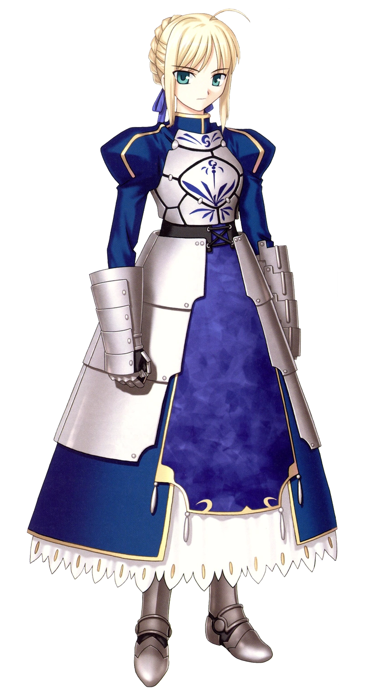
    

    

Saber

CV: 川澄 綾子

 
本作可攻略女主之一，小巧的金髮美少女騎士，但劍術十分精湛很能打，似乎是西洋的流派。 
劍上總是纏繞著風的加護看起來就像無形一般，這讓敵人在交戰時無法判斷劍的攻擊距離。面板能力非常全面且優秀，似乎因爲士郎魔力稀缺無法發揮全部實力。 
性格和士郎很合得來，信仰騎士道，對歪門邪道十分痛恨，很欣賞士郎的做事風格，同時也是個大胃王被家政EX的士郎牢牢地抓住了胃。

    

        
    

    

遠坂 凛

CV: 植田 佳奈

 
士郎的同学，本作可攻略女主之一，标志是黑色双马尾以及驰名二次元的绝对领域和黑丝美腿。 
继承父亲的遗志参加圣杯战争，本来想召唤最强Servent-Saber，但召唤出的却是自己真名都不记得的Archer。 
冬木御三家远坂的正统继承人，魔术天分极高，但要借宝石发动故经费十分紧张，本人也因此十分爱财。在學校是品學兼優的好學生，但在熟人面前偶爾會展現出脫綫的一面，標准的傲嬌性格還帶有一點小惡魔屬性。
 

    

        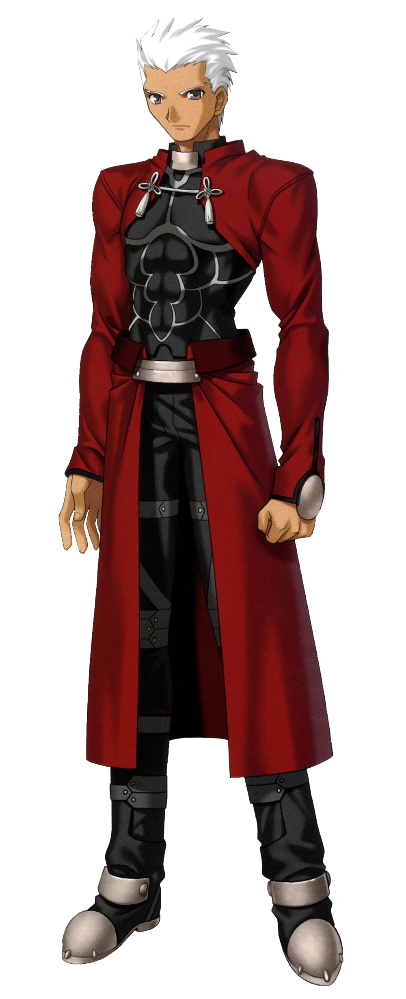
    

    

Archer

CV: 諏訪部 順一

 
遠坂凜所召喚出的英靈，身著紅色緊身衣，聲稱自己召喚時出了問題也不記得自己是誰。 
作爲弓兵自然擅長弓箭，同時近戰也十分精通，但在神仙打架的聖杯戰爭中他的各項能力值都顯得不怎麽夠看。 
但意外的擅長家務，最開始似乎和凜相性不夠，但後來這對主僕可以説是最佳CP。
 

    

        
    

    

間桐 桜

CV: 下屋 則子

 
士郎的學妹，本作可攻略女主之一，一襲紫色的長髮和傲人的身材，但著裝除了校服就是樸素的長裙，十分保守。 
性格十分的沉穩且亞薩西，每天就在士郎家做家務，純純的士郎小嬌妻，看似隨波逐流，但在士郎的問題上會意外的堅持自己的主張。 
每天的日常就是弓道部練習弓道，去士郎家中待一會幫忙做做家務，回家休息的規律生活，似乎和暗地中的聖杯戰爭毫無關聯……
 

該作角色衆多，其餘角色介紹或多或少會涉及到劇透，請各位到游戲中自行體會(^o^∋)，不過這種傳世經典估計大火也都知道了

## 遊戲 OP & TV OP

 

<iframe id='y2b' loading="lazy" src="https://www.youtube-nocookie.com/embed/OEUwZcEfw24" title="YouTube video player" frameborder="0" allow="encrypted-media; picture-in-picture" allowfullscreen></iframe>

<iframe id='y2b' loading="lazy" src="https://www.youtube-nocookie.com/embed/xtxUqqb-f38" title="YouTube video player" frameborder="0" allow="encrypted-media; picture-in-picture" allowfullscreen></iframe>

## 簡評

  
優點：

  </img>

 * 完整的敘事結構，完美的起承轉合，看似是攻略幾位女主，實則是一位少年的病態成長過程。
 * 即使你早看完了 FSN 的所有動畫，型月的其他作品也涉獵甚多，回來重玩這部經典也能深深的沉浸，其中有許多經典 BE 和細節是只有游戲才有的。
 * 除了畫風有點古早（但要的就是内味），該作基本無可挑剔，全語音，音樂個個 ACG 金曲，沒有它奠定的基礎就不會有後續的Fate。
 

  
缺點：

  </img>

 * 型月重工和蘑菇一些個人惡趣味設定。
 * 硬黑就是武内崇早期畫風，不過那個時代都這樣啦~

Fate 系列的開端，批評空間90點守門員，你可以説只接觸過 Fate 系列的不是月廚，但不可否認 FSN 是型月最成功的作品。無論你自詡資深月廚還是想接觸這個 IP 系列的萌新，該作都是不可能繞過的，就像東方的紅魔鄉和偶像大師的 765。
整體難度較高，如果想不看攻略通關一定要多存檔，但許多 BE 也值得品味，這些都是成爲正義的夥伴路上的考驗，但成爲正義的夥伴真的可以拯救蒼生嗎，這些答案就還請到游戲中尋找吧！

| 評分        |      |
|:---------:|:----- |
| **人設**    | 10/10 |
| **立繪 & CG** | 8/10 |
| **劇情**    | 10/10 |
| **音樂**    | 10/10 |
| **綜合**    | 10/10 |

## CG鑑賞

  
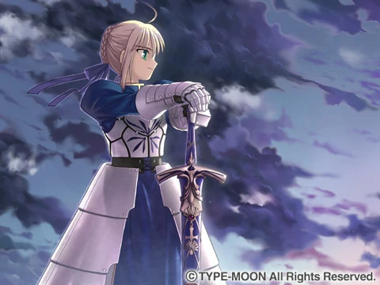

  
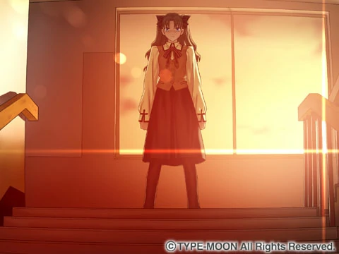

  
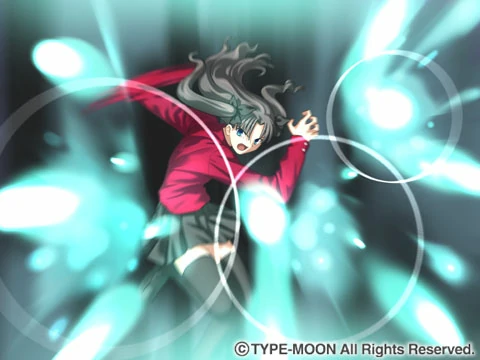

  
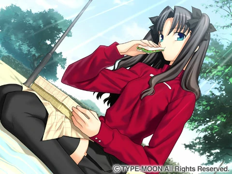

  
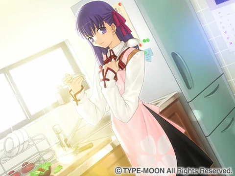

  
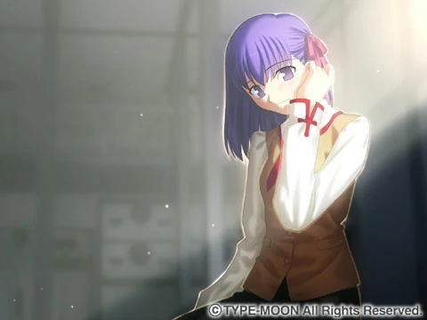

  
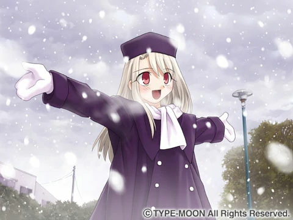

  
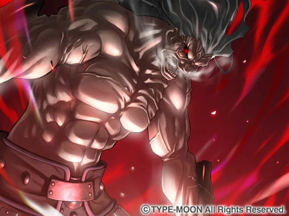


../image/FSN/11.webp
../image/FSN/12.webp
../image/FSN/13.webp

 

## 遊戲資源

盜版(KRKR漢化)： 
盜版(PC漢化)： [磁力鏈接（請勿使用迅雷）,08年的種子至今依然有數十人保種，大概這就是Fate和互聯網的魅力吧](magnet:?xt=urn:btih:f9963b499a8d71c8651df790f422b152cae5f7e2&dn=fate&tr=http%3a%2f%2ftracker.prq.to%2fannounce&tr=http%3a%2f%2ftk.greedland.net%2fannounce&tr=http%3a%2f%2ftk2.greedland.net%2fannounce&tr=http%3a%2f%2fwww.17yy.com%3a8020%2fannounce%20&tr=http%3a%2f%2fbtmitan.3322.org%3a8000%2fannouce&tr=http%3a%2f%2fbtmitan.3322.org%3a8000%2fannouce%20Damitan.Com&tr=http%3a%2f%2fyxcxybt.3322.org%3a6969%2fannounce&tr=http%3a%2f%2fbt.zxmovie.com%3a8080%2fannounce&tr=http%3a%2f%2fbtcitynet.vicp.net%3a6969%2fannounce&tr=http%3a%2f%2fupdate.vnetcool.net%3a6969%2fannounce&tr=http%3a%2f%2fstarfiret.vicp.net%3a7070%2fannounce&tr=http%3a%2f%2fbt.xsbbs.net%3a6969%2fannounce&tr=http%3a%2f%2fbt.buyfan.com%3a8000%2fannounce&tr=http%3a%2f%2fbt.spymovie.net%3a8080%2fannounce&tr=http%3a%2f%2fbt.21sun.net%3a6969%2fannounce&tr=http%3a%2f%2fbt.yhcmovie.com%3a6969%2fannounce&tr=http%3a%2f%2fbt.hxloo.com%2fannounce&tr=http%3a%2f%2fbtfans.3322.org%3a6969%2fannounce&tr=http%3a%2f%2fwww.imagegarden.net%3a6969%2fannounce&tr=http%3a%2f%2fbt.yhcmovie.com%2fannounce&tr=http%3a%2f%2fbtfans.3322.org%3a8000%2fannounce%20&tr=http%3a%2f%2fmy.tracker%3a6969%2fannounce&tr=http%3a%2f%2fbtmitan1.3322.org%3a8000%2fannounce&tr=http%3a%2f%2fbt.zingking.com%3a6969%2fannounce&tr=http%3a%2f%2fbt.itbbs.net%3a6969%2fannounce&tr=http%3a%2f%2fbt.dlmoviebbs.net%3a6688%2fannounce&tr=http%3a%2f%2fbt.acnow.net%3a6969%2fannounce&tr=http%3a%2f%2fbt.cnxp.com%3a8080%2fannounce&tr=http%3a%2f%2fcocodul.meibu.com%3a6969%2fannounce&tr=http%3a%2f%2fbt.greedland.net%3a7070%2fannounce&tr=http%3a%2f%2ftracker.frozen-layer.com%3a6969%2fannounce&tr=http%3a%2f%2fbt.gamesir.com%3a6969%2fannounce&tr=http%3a%2f%2fbt.055.cn%3a6969%2fannounce&tr=http%3a%2f%2fbt1.btbbt.com%3a7000%2fannounce&tr=http%3a%2f%2fbt.btbbt.com%3a6969%2fannounce&tr=http%3a%2f%2fbt.gamesir.com%3a8080%2fannounce&tr=http%3a%2f%2fwww.92bt.com%3a5678%2fannounce&tr=http%3a%2f%2fbt.racity.cc%3a6969%2fannounce&tr=http%3a%2f%2fwww.zjbase.com%3a6969%2fannounce)
盜版(日文原版)：等筆者中古到了再説

