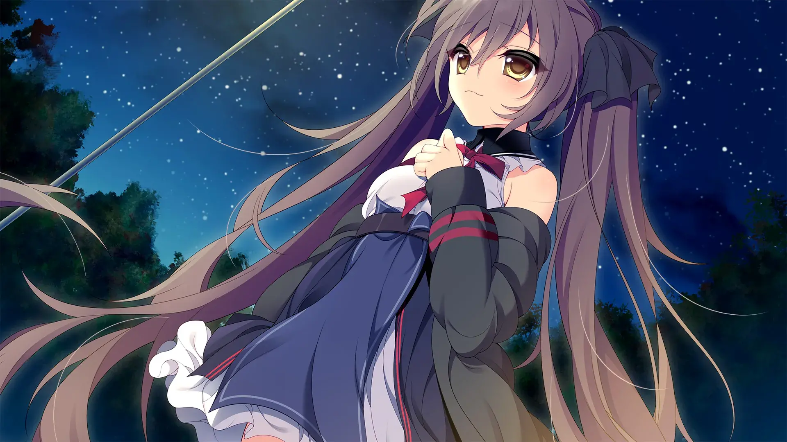

`作者：Sacal & ling`

| 资讯一览     |                     |
| :----------- | :------------------ |
| **开发商**   | ウグイスカグラ       |
| **可攻略人数** | 4                   |
| **游戏时长** | 20 - 30H             |
| **类型**     | 校园 戏剧 妹妹 白毛 | 
| **难度**     | 低                  |
| **分級**     | R-18                |

## 作品简介

---
真正的天才，是令普通人绝望的存在，其压倒性的演技会将同台的演员乃至同时代出道的同行的存在感吃干抹净。
**瀬和環**，曾经因机缘巧合大放异彩，却因实在没什么天赋，被同时代的天才--**折原氷狐**所顶替。
可是**氷狐**却在舞台上离奇死亡，众人对此议论纷纭，随着时间的推移，一切也都逐渐趋于平静。
经历种种变故的環放弃了演剧之路，迎来了平静的高中生的生活。

随着一个舞台的落幕，一个新的舞台开始呈现在众人的目光下...

这天，剧团**labyrinth**进行着公演，**環**他青梅竹马--**仓科双叶**一同观看着剧团**labyrinth**所演出的《哈姆雷特》，对戏剧陌生的**双叶**开始产生了对演剧的憧憬。
**環**便陪同她参加剧团**labyrinth**面试，对方提出的要求是演剧，環便开始为其培训，但是双叶这种新人只能做配角。
巧的是，環正巧遇到了同样憧憬演剧的**架桥琥珀**，并且她具备惊人的扮演能力，于是三人一起向入部考核，可到了考核前一天。
却被告知，要以公演的形式开始考核，**双叶**自然表现得不尽人意，但意外地被破格录取。

**環**再次和步入戏剧之中，但这次不再是面向观众了...

環开始接触到剧团**labyrinth**形形色色的人们，也得知即将准备一场大型公演。
有着曾经的天才少女**折原氷狐**样貌的**折原京子**的出现，虽然只是样貌上相同，但也唤醒众人对**折原氷狐**的过往。
与此同时，一位少女的存在证明被抹去，她的身影在世人眼中逐渐褪去，甚至家人都将其遗忘，**環**也开始寻找着这位少女。

真实与虚构的界限开始模糊...

## 主要登场人物

(由于在不剧透的情况下很难写京子这个角色，所以不会出现)

 
<!--- 最外層的圓角卡片 -->
  

  <!--- 和最外層圓角卡片一樣大的 div，目的是能夠將人物立繪以背景圖片的形式設置 -->
    

    <!--- 展示人物信息的 div，靠右，在 PC 上佔 8 寬度，餘下的 4 寬度顯示上層的人物立繪 -->
    <!-- 手機上佔據全部的 12 寬度，並且設置背景模糊，使得上層人物立繪隱約可見 -->
      

        

        仓科双叶
        

        

          CV：東シヅ
        

        

      

      

      

        
瀬和環的青梅竹马，是个性格阴沉的lesbian，并且很花心，见一个爱一个。

        
在labyrinth的公演中被匂宫巡饰演的哈姆雷特所惊艳，产生了对演剧的憧憬。

    

  

  

 

  

    

      

        

        天使奈奈菜
        

        

          CV：梅木ちはる
        

        

      

      

        
被遗忘的，曾经的超人气偶像，

        
虽然弱气，甚至有痛苦的经历，但是在剧团众人的努力下，变得坚强。

        
非常可爱，是仓科双叶见一个爱一个中最爱的一个。

      

    

  

 

  

    

      

        

        匂宫巡
        

        

          CV：小波すず
        

        

      
  
      

        
古灵精怪，剧团labyrinth的核心成员

        
从小就受其爷爷的斯巴达式教育，演技出众，但也对其产生了一定不满。

      

    

  

 

  

    

      

        

        架桥琥珀
        

        

          CV：奏雨
        

        

      

      

        
醉心演技的无知天才，与瀬和環偶遇，

        
天然呆，但也善于倾听，乐于助人

      

    

  

  

## 游戏 OP

<video controls preload="metadata" width='100%' poster="../image/MeikeinoLupercalia/op.webp">
    <source src="https://s3static-zone0.galgamer.eu.org/video-2d35/meikei/op.mp4" type="video/mp4">
</video>

## 简评(无剧透)

### 剧情
本作大体上可以分为俩部分，前面以剧团**labyrinth(迷途)**为中心，围绕着戏剧演出，随着《菲利亚》公演的结束，天乐来来一行人的离场，开始讲述各自的过往。
剧情方面主要的亮点都在群像群像，所以玩的话一定要玩到群像部分！在多视角下(群像)，拼凑出了一个完成度极高的故事！
剧情设定方面也很出众。而且剧情总体上没有太多糖分，老少适宜!(rukuru的剧情，一贯的亮点)
但是在结尾部分的剧情感觉有点都和主义了(可能是我没好好推?)

但是本作有不少rukuru之前作品的影子，如果你游玩过**纸上的魔法使**，那么请一定不要错过这作。
由于是戏剧题材，也引入了一点文学要素(例:加缪的卡利古拉)，本作虽然围绕戏剧，但戏剧演出只是为了过渡到群像部分的，想通过黄油代替原著是不可能的，并且非常建议先阅读《卡里古拉》。

### 音乐
作曲仍是由出道一直负责的Metomate制作，有着几首特别耐听的bgm，并且bgm很贴合剧情，游戏中的ライムライトの残火piano_version这首超好听，但是这首只会在结尾部分出现一次。
当然无论是她的游戏配乐还是她的个人专辑(Metomate厨路过)都很好听，容我附上Metomate的<a href="https://music.youtube.com/playlist?list=OLAK5uy_k3VYjCPMCNKQZf8O4qFfFOT7TgsNL9-RY">Collection</a>(Youtube Music)
值得一提 meto在fanbox上进行的2022年末の雑談回中透露 她也是rukuru厨!

#### 以下是meto的原文

うぐいすかぐら様のはなし
限定公開なので少し独り言
今年あったことで1番衝撃というか切なくなったのはウグイスカグラ様の活動が実質停止なされたことです

私がBGMのご依頼を初めて受けたときというのはなんっっにも実績もない、知名度もなにもない横の繋がりもない他人という状況で、ウグイスカグラ様にまったくメリットがなかったと思うのに声をかけていただいたというのは本当にありがたかいお話で、運良く目に止めていただいて、感謝の言葉では表しきれない恩を感じています

しかも私ルクル様のシナリオがすごく好きでですね、そのうえ媚びてると思われたくなくて言えなかったのですが白髪赤目という設定といいますか桐葉さんとルクルさんが描くキャラ一人一人が凄く好きで、ほんとうにウグイスカグラ様の作品には個人的にも大好きが詰まっていました
なので1ファンとしてもう桐葉さんとルクルさんの新作が出ない……というのは悲しいことではありますが、
そんな好きな作品に音楽としてかかわれて幸せ者でありました

### CG和立绘
本作在这方面有一定的争议，但我肯定是属于桐叶警察那派(误)，如果你发现角色立绘有点怪怪的，请你务必忽略，否则就要出警了！。一个坏消息，由于桐叶在推特发布了退出うぐいすかぐら，我们估计看不到rukuru和桐叶共同的下作了。

---

综上，本作属于抛开cg立绘方面的争议来说，是一部各方面都不错的剧情向的作品，并且还会增加一点你的文学点数。如果你是妹控，这部作品一定能够给你带来不少欢乐(妹控限定)。
针对剧情方面糖度不高这方面，请不用怕刀子，结局大家都成长了。

### 个人评分 

| 项目           |  得分    |
| :---------------- | :--- |
| **人设**          | 9   |
| **cg&立绘**       | ?  |
| **音乐&声优表现** | 9   |
| **剧情**          | 8   |
| **综合**          | 6.4 + ?/4  |

## 游戏 CG (警告:桐叶玉图)

 

../image/MeikeinoLupercalia/cg/CG01_3.webp
../image/MeikeinoLupercalia/cg/CG11_0.webp
../image/MeikeinoLupercalia/cg/CG54_17.webp
../image/MeikeinoLupercalia/cg/CG56_1.webp
../image/MeikeinoLupercalia/cg/CG52_3.webp

 

../image/MeikeinoLupercalia/cg/CG03_1.webp
../image/MeikeinoLupercalia/cg/CG12.webp
../image/MeikeinoLupercalia/cg/CG13_0.webp

 

../image/MeikeinoLupercalia/cg/CG15_2.webp
../image/MeikeinoLupercalia/cg/CG44_2.webp
../image/MeikeinoLupercalia/cg/CG45_2.webp

 

../image/MeikeinoLupercalia/cg/CG81_5.webp
../image/MeikeinoLupercalia/cg/CG84_1.webp
../image/MeikeinoLupercalia/cg/CG58_5.webp
../image/MeikeinoLupercalia/cg/CG53_2.webp
../image/MeikeinoLupercalia/cg/CG51_1.webp

 

../image/MeikeinoLupercalia/cg/CG50_2.webp
../image/MeikeinoLupercalia/cg/CG41_2.webp
../image/MeikeinoLupercalia/cg/CG16_0.webp
../image/MeikeinoLupercalia/cg/CG08_2.webp
../image/MeikeinoLupercalia/cg/CG07_5.webp


 

## 还在犹豫是否下载？

<video controls preload="metadata" width='100%' poster="../image/MeikeinoLupercalia/movie.webp">
    <source src="https://s3static-zone0.galgamer.eu.org/video-2d35/meikei/17min-know.mp4" type="video/mp4">
</video>

## 资源和下载 

https://www.ryuugames.com/meikei-no-lupercalia-free-download/

