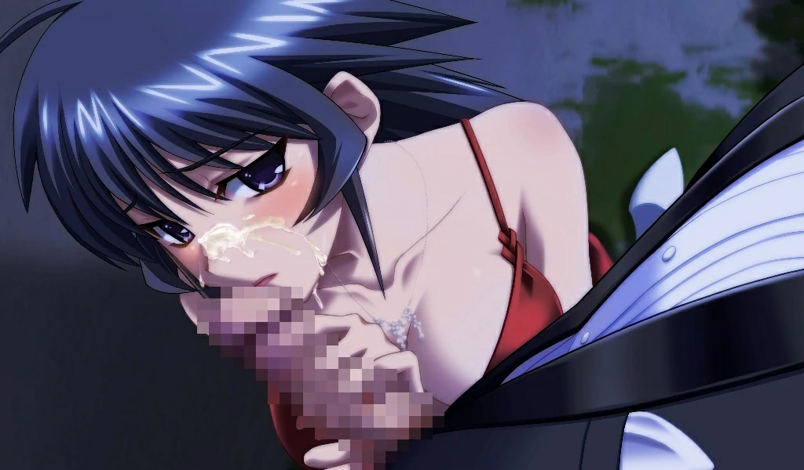
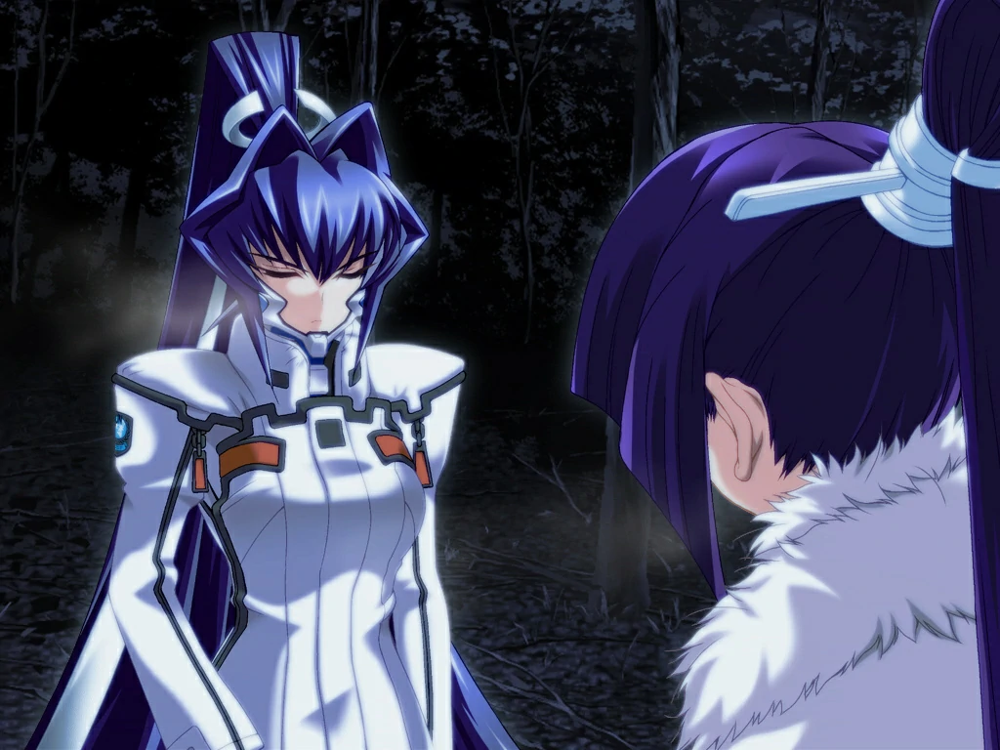

`作者: Patchouli Knowledge`

| 資訊一覽     |                  |
|:--------:|:---------------- |
| **開發商**  | âge |
| **遊戲時長** | 100 H          |
| **類型**   | 校園 劇情 成長 催淚 燃 機甲 戰爭    |
| **難度**   | 低（基本算是直接選人）            |
| **分級**   | R-18             |

## 故事梗概

### Muv-Luv EXTRA

一天早上，我們的男主***白銀 武***睡醒後發現自己身邊躺了一個美少女，與此同時，武的青梅竹馬——住在隔壁的***鋻 純夏***一如往常的來叫武起床，明牌喜歡武的純夏見到此景當場發飆，而那位美少女，御劍財團的千金***御劍 冥夜***自然也不會退讓，兩人瘋狂示愛，爭奪起武的歸屬權，吵吵鬧鬧的校園戀愛故事就此展開……

### Muv-Luv UNLIMITED (後續稱 UNL 篇)

書接 EXTRA 篇，在溫泉旅行途中的武一覺醒來發現世界末日已然到來，好不容易找到學校之後才發現學校變成了軍事基地，自己的老師們都成了司令官或者軍官，而同學們也成了預備軍。

原來武穿越了，并且這個世界被一種叫“BETA”的外星生物所侵略，地球很多地方都已淪陷。而武的任務就是協助自己以前的物理老師即現在的司令官***香月 夕呼***完成 ALTERNATIVE4 計劃，將 BETA 驅逐出地球，延續人類的生存。

### Muv-Luv ALTERNATIVE (後續稱 ALT 篇)

UNLIMITED 篇的三年後，武發現自己又回到了 UNLIMITED 篇最開始，而武要好好地利用一周目的經驗去改變歷史，引領人類走向勝利的未來……

## 人物介紹



  

    

      

        

          {name}
        

        

          {yomi}
        

        

      

      

      
  
    

  
  



<sp-character no=0 name="白銀 武" yomi="CV: 保志 總一郎" uid="a">
  

    本作男主，典型的日系亞薩西男主，戀愛原子核。 
    在校園篇可以説毫無塑造，就是一個桃花運非常好的男高中生。 
  

  

    來到 UNL 篇后也完全不適應，畢竟只是個高中生，在教官和戰友們的錘煉下逐漸成爲獨當一面的軍人，在不斷成長下人設也豐滿了不少。
  

  

    最喜歡的事是和基友一起去打機甲電動。
  

</sp-character>
 

<sp-character no=1 name="鑑 純夏" yomi="CV: 田口 宏子" uid="a">
  

    男主的青梅竹馬，從小玩到大的鄰家女孩。 
    在校園篇簡直就是個受氣的小媳婦，每天傻乎乎的跟著男主，看著男主被各種妹妹包圍還毫無辦法，只能在晚上隔著窗戶和男主聊聊天。 
  

  

    來到 UNL 篇直接人沒了，她的存在推動著整個劇情發展。
  

  

    最喜歡的就是男主，想永遠陪著男主。
  

</sp-character>
 

<sp-character no=2 name="御劍 冥夜" yomi="CV: 奧島 和美" uid="a">
  

    突然出現在男主被窩的神必美少女，實則是富可敵國的御劍集團千金，未來的繼承人。 
    在校園篇因爲某個原因瘋狂的追求著男主，上來就白給的天降係，不諳世事的大小姐，有點天然呆。 
  

  

    來到 UNL 篇則是一名底層的訓練兵，非常擅長近戰，經常開導想不開的男主。
  

  

    在末日中堪稱完人的存在，高潔的沒有一丁點瑕疵，令人敬仰。
  

</sp-character>
 

<sp-character no=3 name="榊 千鶴" yomi="CV: 倉田 雅世" uid="a">
  

    男主所在班級的班長，典型的好學生形象。 
    在校園篇爲了延續社團，將大家召集在一起組織了女子滾地球比賽，但總是和同班同學彩峰有所分歧。 
  

  

    來到 UNL 篇擔任主角團的小隊長，十分重視規則，有點死板也因此和彩峰天天吵架。
  

  

	  暗戀男主，只是礙於自己的人設罷了。
  

</sp-character>
 

<sp-character no=4 name="彩峰 慧" yomi="CV: 永島 由子" uid="a">
  

    男主的同班同學，總是擺著個臭臉。 
    在校園篇説實話沒什麽塑造，感覺就是爲了和班長對立才有的她。 
  

  

    來到 UNL 篇也是個底層訓練兵，身手矯健，但同樣也天天不服班長管。
  

  

    外冷内熱，暗戀男主也是理所當然的。
  

</sp-character>
 

<sp-character no=5 name="珠瀨 壬姬" yomi="CV: 一美" uid="a">
  

    男主的同班同學，小小的貓娘。 
    在校園篇家中是開弓道舘的，弓道非常厲害，但一有人在旁邊就會緊張到無法發揮，典型的大賽軟脚蝦。 
  

  

    來到 UNL 篇也是個底層訓練兵，是主角團的狙擊手，同時因爲是末日，早就摒棄了在校園篇中軟脚蝦的壞毛病。
  

  

    因爲男主的激勵而喜歡上男主，但女兒控的父親不答應。
  

</sp-character>
 

<sp-character no=6 name="凱衣 美琴" yomi="CV: 久保田 慧" uid="a">
  

    男主的好基友，非常喜歡野外生存，發言總是語出驚人。 
    在校園篇叫“尊人”，畫女硬説男，天天放學和男主去打電動，校園篇無法攻略。 
  

  

    來到 UNL 篇因爲世界綫的變動成了女的，也變得可攻略了，也是底層訓練兵，同樣擅長野外生存。
  

  

    最讓男主頭疼的存在，畢竟好兄弟變妹子了。
  

</sp-character>
 

<sp-character no=7 name="香月 夕呼" yomi="CV: 本井 英美" uid="a">
  

    男主的物理老師，對自己充滿自信的物理天才 
     
  

  

    來到 UNL 篇是軍事基地的司令，雖然是不可攻略角色，但對男主影響非常大，同時也是關鍵劇情人物，戲份完全不比純夏冥夜少。
  

  

    只喜歡比自己大的，男主不在狩獵範圍内。
  

</sp-character>
 

## 遊戲 OP

動畫來自 Steam。



## TV 動畫 OP

動畫來自被牆的油管，請翻牆。

<iframe id='y2b' loading="lazy" src="https://www.youtube-nocookie.com/embed/e-2laGs9HM8" title="YouTube video player" frameborder="0" allow="encrypted-media; picture-in-picture" allowfullscreen></iframe>

## 簡評

  
優點：

  </img>

 * 天花板級別的演出系統，僅通過立繪的放大縮小移動將劇情非常完美的詮釋，尤其是戰鬥環節甚至讓你感覺在看番劇。
 * Galgame 乃至日系 ACG 作品中少有對戰爭的精準把控，每一場戰爭都解釋的非常詳細有條理，為劇情打下扎實的基礎。（雖然大部分玩家可能都把戰況説明給 CTRL 過去了）
 * 關鍵劇情采用動畫，做工極其精緻，作畫厨必看。
 * 故事結構堪稱完美，設定合理，爲後面的穿越系 ACG 作品提供了很好的範本。
 

  
缺點：

  </img>

 * 人物立繪“古典”，頭髮棱角分明槽點過多，勸退點 x1
 * 校園篇劇情無聊，但爲了後面又不得不玩，勸退點 x2
 * 除了純夏和冥夜，其他女主分支結局同質嚴重、内容不足且性格過於刻意模板化，在校園篇白開水情節襯托下看的甚至有些尷尬，勸退點 x3

Muv 最大的問題就是前期非常勸退，EXTRA 篇校園日常纯纯的白開水，玩家隨便選個女主相愛最後啪啪啪就結束了，就冥夜綫還有點意思，而 UNLIMITED 篇來個超級大反轉男主直接穿越到世界末日，劇情上挖了一大堆坑也便草草結束令玩家摸不到頭腦。（前兩篇和最後一篇發售日期隔了三年，可見製作公司也是大膽，對作品質量非常自信）

真正將這系列推上神壇的全靠 ALTERNATIVE 篇，但能玩到這的玩家，即使只走了純夏和冥夜的綫，也至少有40h左右的游戲時間，經過了該作的“玩家篩選”，才能享受到最後真正的“大餐”，如果不是該作的超高風評，前兩章筆者都能棄坑十遍了。

故筆者持有這樣的一個觀點：能堅持玩到 ALTERNATIVE 篇的玩家已經是真愛玩家了，給的評價自然非常高，VNDB 上前兩篇評價都不高。理性看待，ALTERNATIVE 篇也是有些小瑕疵的，但並不妨礙其整體質量依然是頂級的。（筆者也通過篩選了，冥夜太棒了，婆爆

| 評分        |      |
|:---------:|:----- |
| **人設**    | 10/10 |
| **立繪 & CG** | 8/10 |
| **劇情**    | 10/10 |
| **音樂**    | 10/10 |
| **綜合**    | 10/10 |

## CG鑑賞


../image/Muv/cg11.webp
../image/Muv/cg12.webp
../image/Muv/cg13.webp
../image/Muv/cg14.webp
../image/Muv/cg15.webp
../image/Muv/cg19.webp


## 遊戲資源



盜版： 筆者暫時沒找到，找到了評論區補

