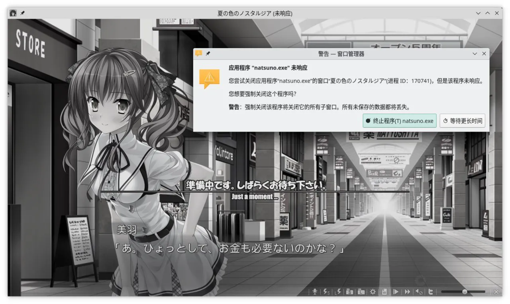

<style>
.ar16x9{
  aspect-ratio: 16/9;
}
body {
    background: var(--bg-url) no-repeat fixed center;
    background-size: cover;
    /*-webkit-font-smoothing: unset;*/
}
#banner {
    background: url('')!important;
    background-color: transparent!important;
}
#toc {
     background-color: var(--board-bg-color);
     padding: 20px 10px 20px 20px;
     border-radius: 10px;
}
#board {
    backdrop-filter: blur(5px);
    -webkit-backdrop-filter: blur(5px);
   /* background-color: #3337 !important;*/
}
.full-bg-img > .mask {
  background-color: rgba(0,0,0,0) !important;
}
.page-header  {
  background-color: rgba(0,0,0,0.5);
  padding: 3px;
  border-radius: 5px;
}
:root {
  --board-bg-color: rgba(255,255,255,0.85);
  --bg-url: url('../image/Natsunoiro/bg.webp')
}
[data-user-color-scheme='dark'] {
  --board-bg-color: rgba(0,0,0,0.85);
  /* --bg-url: url('../image/Natsunoiro/bg-d.webp') */
}
::selection {
    background-color: #fc0;
}
.page-header .mt-1 span.post-meta {
    /* 隱藏嚇人的字數統計 */
    display: none;
}
rt {
	font-size: 0.7rem;
}

</style>

`作者：桐遠暮羽`


## At A Glance

失去容身之所的少年少女們，會前往只屬於他們的樂園——又或者是前往永遠無法脫出的迷宮。

<p id="coverimage-warp">
  
</p>
<p id="changesrc">
  <a href="javascript:loadbigimg();" id="changebtn" class="btn btn-primary btn-sm" role="button">加載原圖（9258x12790, 4.0MB）⬆️️</a>
<p>


| 資訊一覽     |                 |
| :----------- | :------------------------------------ |
| **開發商**   | MOONSTONE           |
| **遊戲時長** | 25H（估計）                     |
| **攻略人數** | 4                     | 
| **類型**     | 懸疑 拔作            |
| **難度**     | 中                   |
| **分級**     | R-18（性行爲，恐怖）      |
| **遊戲引擎** | ExHIBIT           |


## 故事

男主角 **折口諒人** 和妹妹 **美羽** 有着一群兒時玩伴。

說是兒時玩伴，其實也只是一群由於種種原因在家裏待不下去的少年少女們，
出於逃避現實的目的不約而同地聚集在一起。
他們的家庭都有各種變故，導致他們的內心都有着不爲人知的陰暗面。
*（人話：一群無處可去的失足兒童聚在一起，正所謂物以類聚，，，）*

而三年前的一場大火，奪走了男主角的雙親，男主角和妹妹也只得前往東京的伯母家借宿。


這也使得這個貴物玩伴小團體四分五裂。

然而三年之後伯母去世，無依無靠的男主角和妹妹又搬回了父母生前的老家，灰土町。


這是闊別三年的故鄉，還有闊別三年的兒時玩伴們。
爲了能和大家一起上學，男主角和妹妹轉學進入了鎮上的學校。這所學校被美麗的向日葵田包圍，而盛開的向日葵相傳能給學生們帶來無限的好運。


兒時玩伴們因爲主角二人的回歸再次團聚，失去了容身之處的少年少女們似乎又有了能容納自己的樂園。
就像三年前那個快樂的夏天一樣。
然而，這也不過只是一種現實逃避。因爲接納他們的樂園是一個無法脫出的巨大迷宮。


## 登場人物

<style>
  .charname {
    font-size: 150%;
  }
  .namearea hr {
    margin: 1.5rem 0;
  }
  .sp-character img, .img-shade {
    filter: drop-shadow(0 0 6px #000c);
  }
  .sp-character {
    border-radius: 20px;
    overflow: hidden;
    box-shadow: 0 5px 11px 0 rgb(0 0 0 / 18%), 0 4px 15px 0 rgb(0 0 0 / 15%);

    -webkit-backdrop-filter: blur(1px);
    backdrop-filter: blur(1px);
    
    /*background-color: var(--chara-card-color);*/
    
    background-color: transparent;
    background-image: var(--this-bg);
    background-position: center;
    background-repeat: no-repeat;
    background-size: cover; 

  }
  .sp-character .char-overlay {
    background-color: var(--chara-card-color);
    min-height: 400px;
    background-image: var(--right-bg);
    background-repeat: no-repeat;
    background-position: top 20px right calc(100% * 0.3 - 130px);
    background-size: auto 600px;

    margin: 0;
    padding: 0;
  }
  :root { /* 配色 */
    --chara-card-color: #ffffffcf;
  }
  [data-user-color-scheme='dark'] {
    --chara-card-color: #1a1a1aa6;
  }
  @media screen and (max-width: 767px) {
    .namearea hr {
      margin: 1rem 0;
    }
    .pc-left {
      -webkit-backdrop-filter: blur(3px);
      backdrop-filter: blur(3px);
      
      background: var(--chara-card-color);
      transition: opacity 0.3s;
    }
    .pc-left.touch {
      opacity: 0.1;
    }
    .sp-character {
     /*background: unset;*/
      /*-webkit-backdrop-filter: unset;
    backdrop-filter: unset;*/
    }
    .sp-character .char-overlay {
      min-height: 375px;
      /* background-size: contain;*/
      background-position: top 30px right 0px; 
    }
    :root { /* 配色 */
      --chara-card-color: #ffffff87;
    }
    [data-user-color-scheme='dark'] {
      --chara-card-color: #1a1a1aa6;
    }
  }
</style>


<div class={`row sp-character ${uid}`} style={`--this-bg: url(../image/Natsunoiro/chars/bg.webp)`}>
  <div class="col-12 char-overlay row" style={`--right-bg: url(../image/Natsunoiro/chars/${no}.webp)`}>
    <div class="pc-left col-12 col-md-8">
      <div class="namearea col-12 pt-2">
        <div class="charname font-serif font-weight-bold font-italic">
          {name}
        </div>
        <div class="yomi font-italic">
          {yomi}
        </div>
        <hr />
      </div>
      <div class="infoarea col-12" html={html}>
      </div>  
    </div>
  </div>  
</div>


<sp-character no=00 name="真鶴みさき" yomi="Misaki" uid="Misaki">
  <p>
    兒時玩伴的其中一員，似乎和男主角關係最好。
  </p>
  <p>
    由於家庭關係不和而不喜歡待在家裏，<br>
    所以自然而然地成爲了玩伴小團體的一員。
  </p>
  <p>
    Misaki 會劍術，是一個又酷又美麗的少女，性格還具有正義感，<br>
    是本作的黑長直擔當。
  </p>
</sp-character>
<br>
<div class="alert alert-warning" role="alert">
  <span class="alert-heading font-weight-bold" style="font-size: 125%;">🏆大獎：我的最愛</span><br>
  <p>
    Misaki 是全劇中我最喜歡的角色！<br>
    爲此我將多插入一張她的 CG！
  </p>
</div>

<p>
  
</p>

<p>
  
</p>

<p>
  
</p>

<sp-character no=01 name="真乗寺文音" yomi="Ayane" uid="Ayane">
  <p>
    兒時玩伴的其中一員，是年紀大一歲的學姐。
  </p>
  <p>
    爲了逃避家裏某種喘不過氣的氛圍而加入了玩伴小團體。<br>
    具有成熟大姐姐的風韻，被大家憧憬着。<br>
    講話非常溫柔而且慢條斯理，總有一種誘惑的味道。。。
  </p>
  <p>
    有群友非常喜歡她的黑絲，<br>
    俺卻覺得這個角色有點湊數，，，
  </p>
</sp-character>

<p>
  
</p>

<p>
  
</p>

<sp-character no=02 name="折口美羽" yomi="妹妹" uid="Miu">
  <p>
    男主角的妹妹，黏人的嘔泥漿輸出機器。
  </p>
  <p>
    臉蛋可愛，髮型可愛，身材可愛，衣服可愛，講話語氣也可愛，<br>
    總之就是，<b>可愛————！！！</b><br>
    一整塊的可愛物質。
  </p>
  <p>
    因爲雙親的去世和哥哥相依爲命，<br>
    是個嚴重兄控，對其他男性都不感興趣，<br>
    因爲哥哥加入了玩伴小團體才跟着加入。
  </p>
</sp-character>

<p>
  
</p>

<p>
  
</p>

<sp-character no=03 name="摩庭祥子" yomi="Shoko" uid="Shoko">
  <p>
    兒時玩伴的其中一員，如同洋娃娃一般精緻的美少女。
  </p>
  <p>
    母親病臥在床，爲了躲避照顧母親的艱辛才加入了玩伴小團體。<br>
    性格令人琢磨不透，講話甚至有點天然呆，<br>
    實際上她並不喜歡講話，總是靜靜地守望着玩伴的各位。
  </p>
  <p>
    靜靜地，注視着，你——
  </p>
</sp-character>

<p>
  
</p>

<p>
  
</p>

## 遊戲 OP

請觀賞遊戲 OP。



<p class="font-italic" style="letter-spacing: 0.5rem;">
  這裏，就是那個夏日的<ruby>樂園<rp>(</rp><rt style="letter-spacing: normal;">伊甸園</rt><rp>)</rp></ruby>
  <br>
  抑或是，內心深處的<ruby>迷宮<rp>(</rp><rt style="letter-spacing: normal;">無限迴廊</rt><rp>)</rp></ruby>
</p>


<br>

下面是遊戲的最終 ED 曲。當我披荊斬棘（指在大量的 H 場景中瘋狂穿梭）
終於打到最終結局的時候，這首歌響起，我的眼淚流了下來。
這個遊戲配不上那麼好聽的歌，整個遊戲就這首歌最好聽了，，，

Galgame 金曲：<a href="/music/?id=46" target="_blank">🔗️夏の色が消えるとき</a>


## H 場景


../image/Natsunoiro/hcg/00.webp
../image/Natsunoiro/hcg/01.webp
../image/Natsunoiro/hcg/02.webp
../image/Natsunoiro/hcg/03.webp


## 遊戲畫面


../image/Natsunoiro/scn/03.webp
../image/Natsunoiro/scn/04.webp
../image/Natsunoiro/scn/05.webp
../image/Natsunoiro/scn/06.webp
../image/Natsunoiro/scn/00.webp
../image/Natsunoiro/scn/01.webp
../image/Natsunoiro/scn/02.webp


## 一句話點評

MOONSTONE 作爲一家以鬼片聞名的遊戲公司，近年來的恐怖懸疑系列也就只有區區 4 部作品，分別是 ***櫻之杜†凈夢者*** 的一二兩部，***來自昏暗的時間盡頭***，以及這篇文章的 ***追憶夏色年華***。然後新出的其他作品基本都是這種畫風：


完全不像一家做鬼片的公司。想必是因爲鬼片不夠賣座才變成如此境地，令人唏噓，，，

至於追憶夏色年華，其實是近年恐怖懸疑系列的第一部作品，恐怖程度也是最輕的，可以說是完全不恐怖。
一言蔽之，是 MOONSTONE 特色的苦味拔作。

本作是一個非常色情的沉重故事：一邊把主角們的家庭經歷寫得慘不忍睹，一邊又把發情的美少女畫得色🉐️批爆，甚至連在做愛的時候都不忘提一句家庭造成的心理陰影，請問編劇在兩個極端中間反覆橫跳的時候考慮過玩家的心理陰影嗎？所以說，如果你不喜歡那麼驚悚的恐怖氛圍，或者只是喜歡看發情的色情美少女，那麼我是非常歡迎你來玩這個遊戲的。

## 還在猶豫是否下載？

我手上沒有漢化版，並且剛開始的劇情上面也已經說過了，所以我有點不想放試玩錄像。

## 遊戲攻略提示

第四條線是最終結局，你需要打通前三條女主線才能進入第四條線。

## 資源和下載

Steam 版由 Hikari Field 發行，只支持中文。
前往 Hikari Field 商店購買還可以更便宜。



<br>

日文原版：

```
magnet:?xt=urn:btih:b226bf94cf73318eb45f82f8cf3e600bca1da67e
```

文件名：夏の色のノスタルジア

注意：日文版有 AlphaROM 保護，請自行使用 AlphaROMdie 進行破解。
你也可以下載我打好補丁的文件：

## Linux 玩家體驗

ExHIBIT 的 WINE 兼容性很爛，不僅 OP 播放不了不說，一點存檔/讀檔就卡死，可以不用試了。



<script>
  //document.documentElement.setAttribute('data-user-color-scheme', 'dark');
  function loadbigimg(){
    let cover = document.getElementById('coverimage');
    let btn =  document.getElementById('changesrc');
    let bigurl = cover.getAttribute('originimg');
    cover.setAttribute('src', '');
    cover.setAttribute('src', bigurl);
    cover.parentElement.setAttribute('href', bigurl);
    btn.parentElement.removeChild(btn);
  }
  document.addEventListener("DOMContentLoaded", function(){
    let pclefts = document.querySelectorAll('.pc-left');
    pclefts.forEach((el) => {
      el.addEventListener('touchstart', function(){
        el.classList.add('touch');
      })
      el.addEventListener('touchend', function(){
        el.classList.remove('touch');
      })
    });
    //setTimeout(() => document.documentElement.setAttribute('data-user-color-scheme', 'light'), 1000)
  })
</script>
