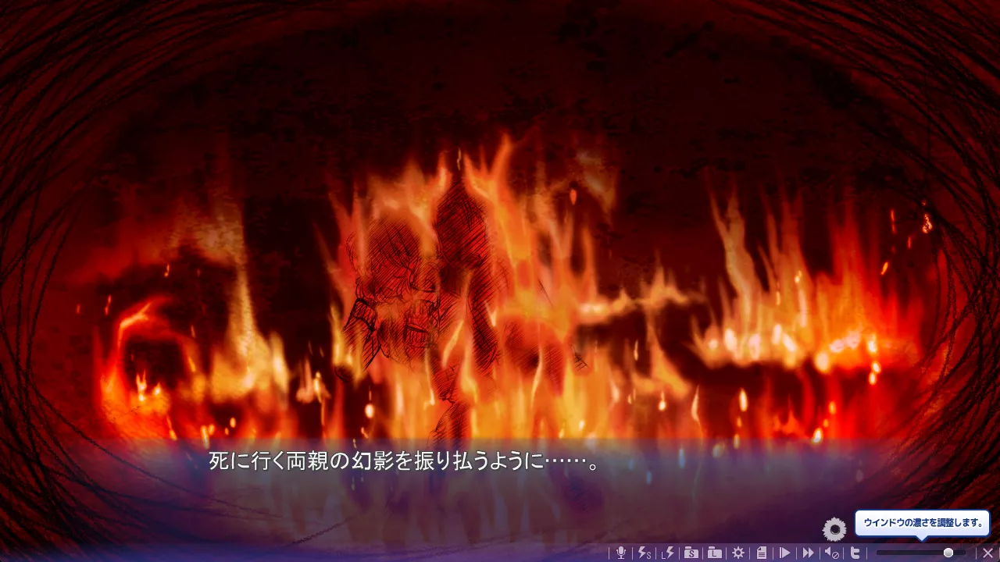
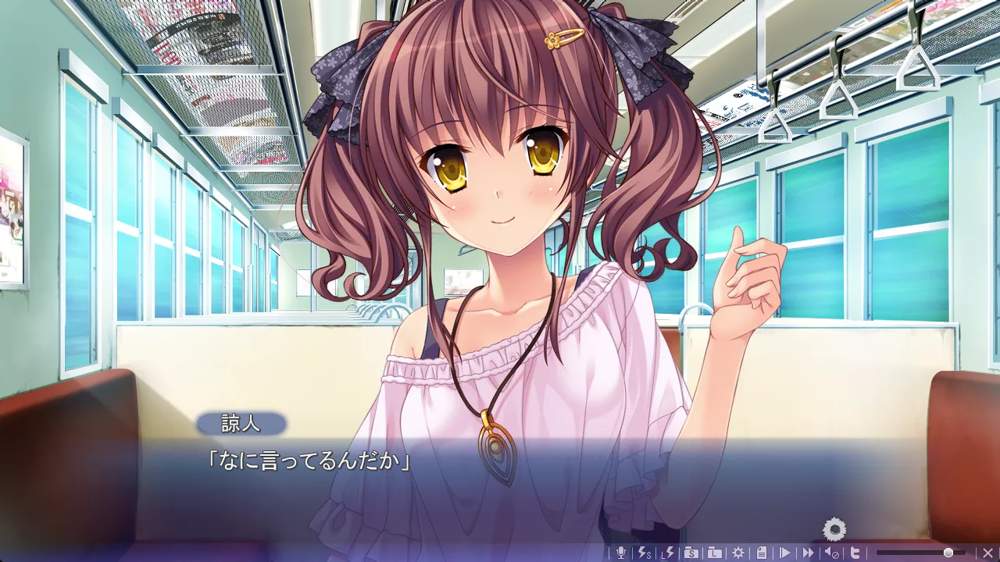
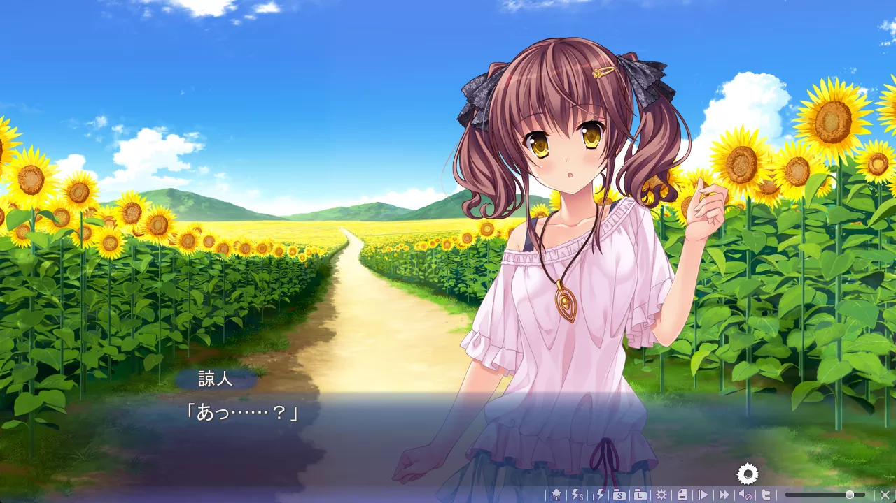
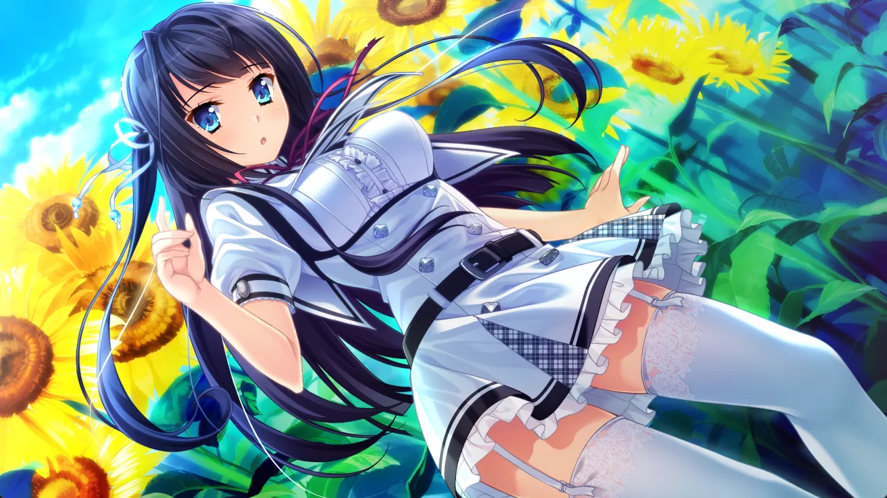
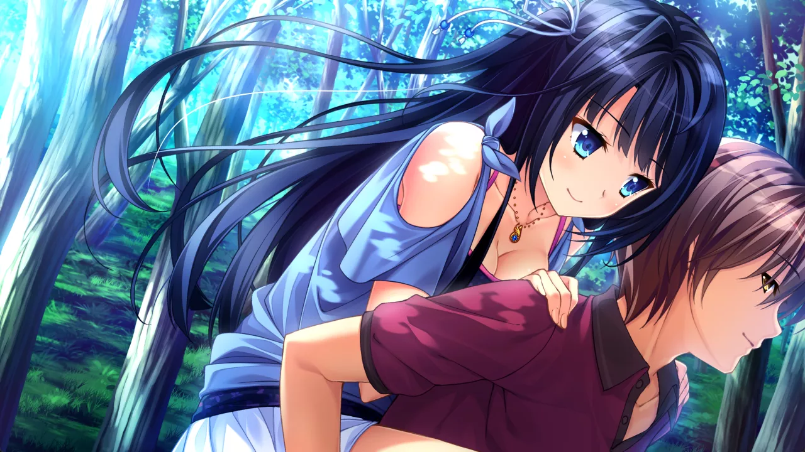
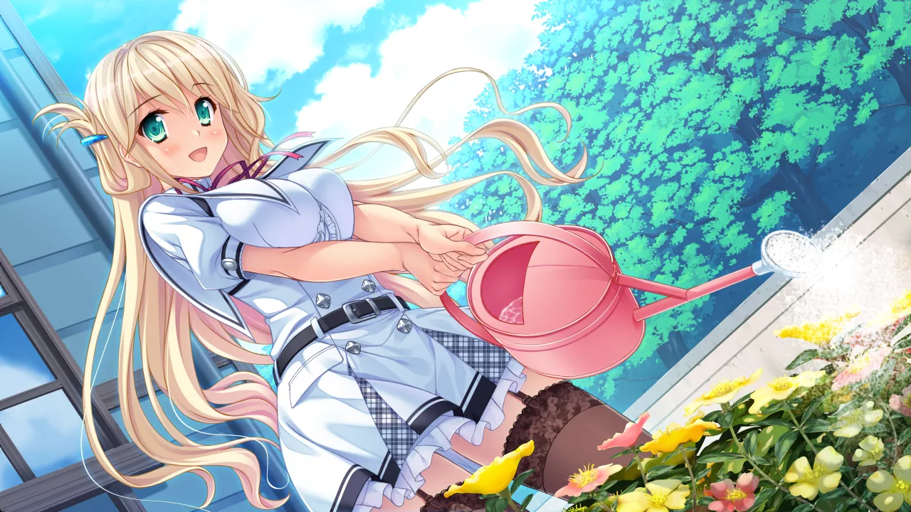
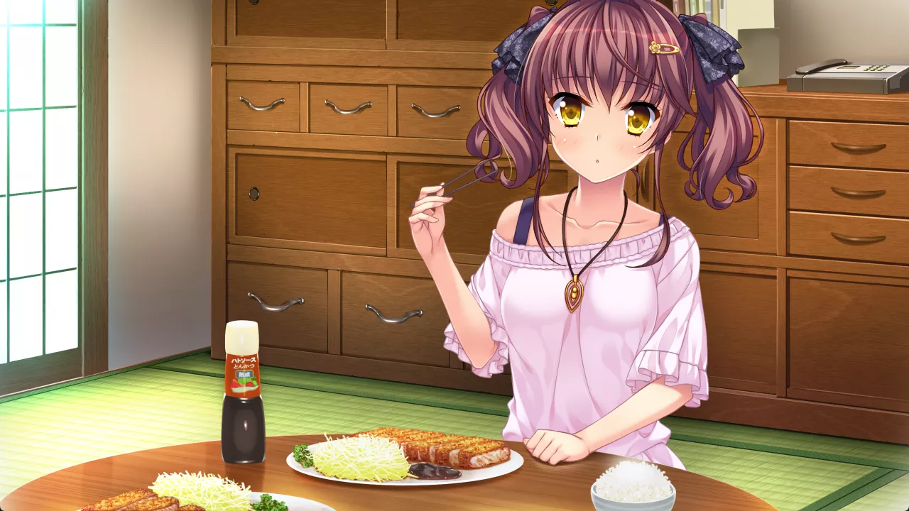
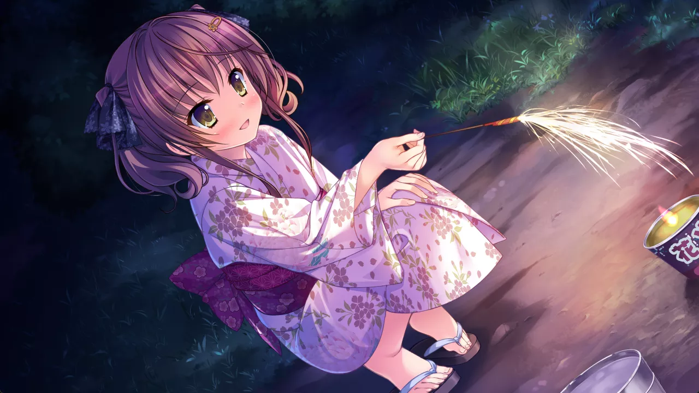

<style>
.ar16x9{
  aspect-ratio: 16/9;
}
body {
    background: var(--bg-url) no-repeat fixed center;
    background-size: cover;
    /*-webkit-font-smoothing: unset;*/
}
#banner {
    background: url('')!important;
    background-color: transparent!important;
}
#toc {
     background-color: var(--board-bg-color);
     padding: 20px 10px 20px 20px;
     border-radius: 10px;
}
#board {
    backdrop-filter: blur(5px);
    -webkit-backdrop-filter: blur(5px);
   /* background-color: #3337 !important;*/
}
.full-bg-img > .mask {
  background-color: rgba(0,0,0,0) !important;
}
.page-header  {
  background-color: rgba(0,0,0,0.5);
  padding: 3px;
  border-radius: 5px;
}
:root {
  --board-bg-color: rgba(255,255,255,0.85);
  --bg-url: url('../image/Natsunoiro/bg.webp')
}
[data-user-color-scheme='dark'] {
  --board-bg-color: rgba(0,0,0,0.85);
  /* --bg-url: url('../image/Natsunoiro/bg-d.webp') */
}
::selection {
    /*background-color: #f00;*/
}
.page-header .mt-1 span.post-meta {
    /* 隱藏嚇人的字數統計 */
    display: none;
}
</style>

`作者：桐遠暮羽`


## At A Glance

失去容身之所的少年少女們，會前往只屬於他們的樂園——又或者是前往永遠無法脫出的迷宮。

<p id="coverimage-warp">
  
</p>
<p id="changesrc">
  <a href="javascript:loadbigimg();" id="changebtn" class="btn btn-primary btn-sm" role="button">加載原圖（9258x12790, 4.0MB）⬆️️</a>
<p>


| 資訊一覽     |                 |
| :----------- | :------------------------------------ |
| **開發商**   | MOONSTONE           |
| **遊戲時長** | 25H（估計）                     |
| **攻略人數** | 4                     | 
| **類型**     | 懸疑 拔作          |
| **難度**     | 中              |
| **分級**     | R-18（性行爲，恐怖）      |
| **遊戲引擎** | ExHIBIT           |


## 故事

男主角 **折口諒人** 和妹妹 **美羽** 有着一群兒時玩伴。

說是兒時玩伴，其實也只是一群由於種種原因在家裏失去了容身之所的少年少女們，
出於逃避現實的目的不約而同地聚集在一起。
他們的家庭都有着各自的變故，導致內心都有着各自不爲人知的陰暗面。
*（人話：一群無處可去的失足兒童聚在一起，正所謂物以類聚，，，）*

而三年前的一場大火，奪走了男主角的雙親，男主角和妹妹也只得前往東京的伯母家借宿。



這也使得這個貴物玩伴小團體七零八落。

然而伯母去世，無依無靠的男主角和妹妹又搬回了父母生前的老家，灰土町。



這是闊別三年的故鄉。
還有闊別三年的兒時玩伴們。
爲了能和大家一起上學，男主角和妹妹轉學進入了鎮上的學校。這所學校被美麗的向日葵田包圍，而盛開的向日葵相傳能給學生們帶來無限的好運。



兒時玩伴們因爲男主角二人的回歸再次團聚，失去了容身之處的少年少女們似乎又有了能容納自己的港灣。
然而，這也不過是現實逃避而已。因爲接納他們的港灣是一個無法脫出的巨大迷宮。


## 登場人物

<style>
  .charname {
    font-size: 150%;
  }
  .namearea hr {
    margin: 1.5rem 0;
  }
  .sp-character img, .img-shade {
    filter: drop-shadow(0 0 6px #000c);
  }
  .sp-character {
    border-radius: 20px;
    overflow: hidden;
    box-shadow: 0 5px 11px 0 rgb(0 0 0 / 18%), 0 4px 15px 0 rgb(0 0 0 / 15%);

    -webkit-backdrop-filter: blur(1px);
    backdrop-filter: blur(1px);
    
    background-color: var(--chara-card-color);
    
    /* background-color: transparent;
    background-image: var(--this-bg);
    background-position: center;
    background-repeat: no-repeat;
    background-size: cover; */

  }
  .sp-character .char-overlay {
    background-color: var(--chara-card-color);
    min-height: 400px;
    background-image: var(--right-bg);
    background-repeat: no-repeat;
    background-position: bottom -80px right calc(100% * 0.3 - 130px);
    background-size: auto 550px;

    margin: 0;
    padding: 0;
  }
  :root { /* 配色 */
    --chara-card-color: #ffffffcf;
  }
  [data-user-color-scheme='dark'] {
    --chara-card-color: #1a1a1aa6;
  }
  @media screen and (max-width: 767px) {
    .namearea hr {
      margin: 1rem 0;
    }
    .pc-left {
      -webkit-backdrop-filter: blur(3px);
      backdrop-filter: blur(3px);
      
      background: var(--chara-card-color);
      transition: opacity 0.3s;
    }
    .pc-left.touch {
      opacity: 0.1;
    }
    .sp-character {
     /*background: unset;*/
      /*-webkit-backdrop-filter: unset;
    backdrop-filter: unset;*/
    }
    .sp-character .char-overlay {
      min-height: unset;
      /* background-size: contain;*/
      background-position: bottom -90px right 0px; 
    }
    :root { /* 配色 */
      --chara-card-color: #ffffff87;
    }
    [data-user-color-scheme='dark'] {
      --chara-card-color: #1a1a1aa6;
    }
  }
</style>


<div class={`row sp-character ${uid}`} style={`--this-bg: url(../image/Natsunoiro/chars/${no}b.webp)`}>
  <div class="col-12 char-overlay row" style={`--right-bg: url(../image/Natsunoiro/chars/${no}.webp)`}>
    <div class="pc-left col-12 col-md-8">
      <div class="namearea col-12 pt-2">
        <div class="charname font-serif font-weight-bold font-italic">
          {name}
        </div>
        <div class="yomi font-italic">
          {yomi}
        </div>
        <hr />
      </div>
      <div class="infoarea col-12" html={html}>
      </div>  
    </div>
  </div>  
</div>


<sp-character no=0 name="可可龍" yomi="Kokoro" uid="kokoro">
  <p>
    JK，家裏是開奶茶店（甜品店？咖啡店？）的，<br>
    由於家人只有老媽，再加上可可龍做飯過於難吃，<br>
    導致奶茶店的重擔都壓在老媽身上。
  </p>
  <p>
    過於天真無邪，甚至 sometimes naive，<br>
    所以能幹出隨便把男人撿回家的這種事情。
  </p>
  <p>
    但是老媽並沒有阻止此事，甚至覺得有趣，可見是有其母必有其女，，，
  </p>
</sp-character>
<br>
<sp-character no=1 name="響子" yomi="JK・巫女" uid="kyoko">
  <p>
    響子家裏是開神社的，於是她自動成爲了巫女。
  </p>
  <p>
    她具有「靈視」能力，也就是能看到鬼，甚至能摸到，<br>
    導致她有時候去找人搭話，講完話才發現對方是鬼。<br>
    再加上她在學校有時候會盯着幽靈看，甚至還會和幽靈互動，<br>
    這種抽象的舉動屬實把周圍同學嚇得不輕，，，
  </p>
  <p>
    但是她感受到了男主的神力，於是倒貼。
  </p>
</sp-character>
<br>
<sp-character no=2 name="愛" yomi="Mana・神仙青梅竹馬" uid="mana">
  <p>
    男主角的青梅竹馬，同樣屬於神人一族，擁有言靈能力。<br>
    兩人是村中唯二的年輕人，於是自動以身相許，<br>
    並且交配。
  </p>
  <p>
    在發現男主逃出了山村後，愛也跋山涉水地<br>
    來到可可龍家，找到了男主。<br>
    雖然她很想用言靈把男主角綁架回老家，但是卻沒有這麼幹。
  </p>
  <p>
    很強力的抖 S 女王，喜歡凌辱男主。
  </p>
</sp-character>
<br>
<sp-character no=3 name="惑塔輪" yomi="ほたる" uid="hotaru">
  <p>
    開朗活潑的嬌小少女，是可可龍的同班同學兼閨蜜。
  </p>
  <p>
    她具有非常升級的大腦，不僅是 KY 大師，<br>
    甚至還可以抵擋言靈的操控。<br>
    很會察言觀色，爲人着想，用賣萌來融洽人際關係。
  </p>
  <p>
    惑塔輪屬於群友所說的「非臉譜化角色」，擁有她自己獨特的線路和故事。
  </p>
</sp-character>

## 遊戲 OP

動畫來自被牆的 Youtube。

<video controls preload="metadata" width='100%' poster='../image/Natsunoiro/op.webp'>
<source src="https://s3static-zone0.galgamer.eu.org/video-2d35/Amatu-tumi/op.mp4" type="video/mp4">
</video>

本作的音樂非常動聽應景，特此添加兩首 Galgame 金曲：

<a href="/music/?id=27" target="_blank">🔗️こころに響く恋ほたる</a>

<a href="/music/?id=28" target="_blank">🔗️コトダマ紬ぐ未来</a>

## 遊戲 CG

<p>
  
</p>

<p>
  
</p>

<p>
  
</p>

<p>
  
</p>

<p>
  
</p>

<p>
  
</p>

<p>
  
</p>

<p>
  
</p>

<p>
  
</p>

<p>
  
</p>

## H 場景


../image/Natsunoiro/hcg/0.webp
../image/Natsunoiro/hcg/1.webp
../image/Natsunoiro/hcg/2.webp
../image/Natsunoiro/hcg/3.webp
../image/Natsunoiro/hcg/4.webp


## 遊戲畫面


../image/Natsunoiro/scn/00.webp
../image/Natsunoiro/scn/01.webp
../image/Natsunoiro/scn/02.webp
../image/Natsunoiro/scn/03.webp
../image/Natsunoiro/scn/04.webp
../image/Natsunoiro/scn/05.webp
../image/Natsunoiro/scn/06.webp
../image/Natsunoiro/scn/07.webp
../image/Natsunoiro/scn/08.webp
../image/Natsunoiro/scn/09.webp


## 一句話點評

**Q：《天津罪》是什麼意思？**
A：和那個挨動態清零的天津沒有任何關係，這裏的天津罪指的是日本神話裏面的某種罪，用在標題上對新玩家沒有特別的意義。反正你知道本作中有神仙出沒，具有一定聯繫就行了。

這次的天津罪也是群友推薦我玩的。不過天津罪似乎沒有完整漢化，那位群友玩的也只是漢化的體驗版，所以是基於「體驗版的體驗」得出的「這是個好遊戲」的結論。

所以天津罪是好遊戲嗎？我覺得很好啊，除了動不動就開始打炮影響劇情發展以及畫風時好時壞以外，算是挺別緻的遊戲（小別緻你長得真東西），具體來說以下有三。

作畫只要不崩，就非常色。你看上面那個巫女的 CG，一臉嬌羞 + 驚慌，栩栩如生；還有膚如凝脂的惑塔輪 + 細節到位的人物服飾，觀感上非常好。（除了崩得要死的可可龍以外）

然後故事上很有深意，一個不諳世事的超能力男主，來到人間，他會被帶成一個好人還是惡人呢？在遇到難題的時候他是怎麼抉擇的呢？該過程的心理描寫非常精彩，真實刻畫了男主不諳世事甚至純白無瑕的特點。

最後點名表揚 Purple 開發的 CMVS 引擎，本作雖然原生解析度是 720P，但是 CMVS 引擎會自動以本機分辨率進行渲染，使得遊戲在任何尺寸的屏幕上都能夠渲染清晰無比的文字和盡力減少立繪鋸齒，這一點屌打 CRYSTALiA 那不知道是什麼的糊的一比的狗屁引擎；而且 CMVS 在筆電上非常省電 + 省 CPU，這一點屌打 CIRCUS 那個能把全核直接佔滿的狗屁引擎。

請 Purple 再接再勵！對 CMVS 技術細節感興趣的群友可以去看看祂們的開發日記：
https://www.purplesoftware.jp/cgi/diary/nicky.cgi?page=119

## 還在猶豫是否下載？

我手上沒有漢化版，並且剛開始的劇情上面也已經說過了，所以我有點不想放試玩錄像。

不過群友有一個漢化的體驗版，感興趣的可以去玩一下。




## 生肉閱讀難度

本作可能漢化不完整或者漢化補丁根本不存在（具體請諮詢群友），我體感生肉閱讀難度如下：

| 體驗    |   所需日語級別              |
| :----------- | :------------------------------------ |
| **看懂 75%**   | 日語中級高手          |
| **看懂 95%** | 日語高手 - 中級摘帽      |

## 資源和下載

英文無修版（終於能跨越日語的障礙來遊玩本作辣！）：

https://www.ryuugames.com/eng-amatsutsumi-uncensored/


日文原版：

```
magnet:?xt=urn:btih:286226e279576da7555b57a83f3e4aa9f5ac0048
```

文件名：アマツツミ + 予約特典 +同梱特典

<script>
  //document.documentElement.setAttribute('data-user-color-scheme', 'dark');
  function loadbigimg(){
    let cover = document.getElementById('coverimage');
    let btn =  document.getElementById('changesrc');
    let bigurl = cover.getAttribute('originimg');
    cover.setAttribute('src', '');
    cover.setAttribute('src', bigurl);
    cover.parentElement.setAttribute('href', bigurl);
    btn.parentElement.removeChild(btn);
  }
  document.addEventListener("DOMContentLoaded", function(){
    let pclefts = document.querySelectorAll('.pc-left');
    pclefts.forEach((el) => {
      el.addEventListener('touchstart', function(){
        el.classList.add('touch');
      })
      el.addEventListener('touchend', function(){
        el.classList.remove('touch');
      })
    });
    //setTimeout(() => document.documentElement.setAttribute('data-user-color-scheme', 'light'), 1000)
  })
</script>
