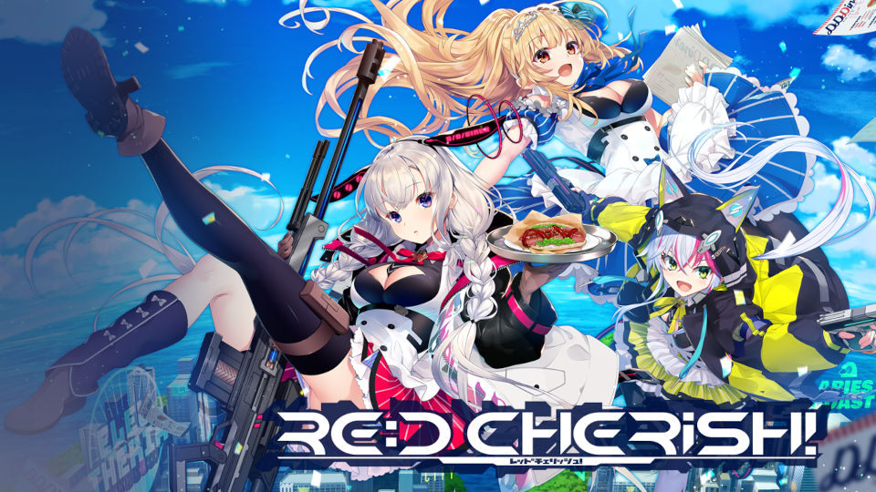
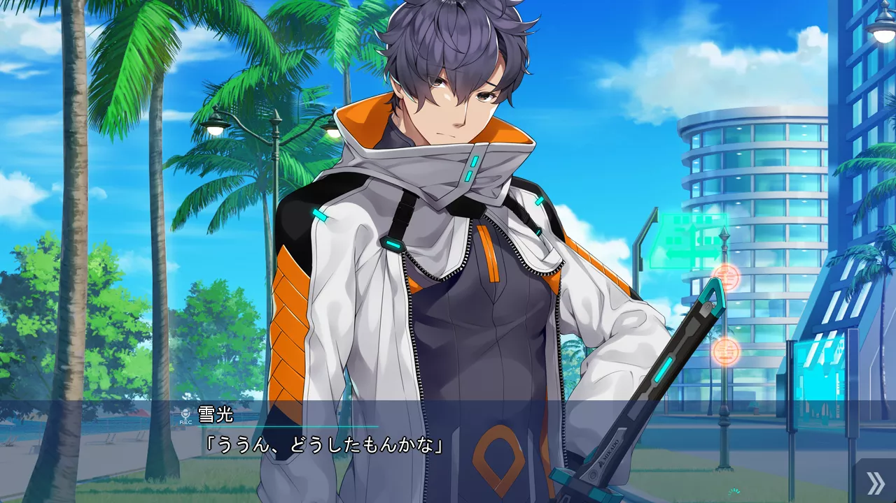

<style>
.ar16x9{
  aspect-ratio: 16/9;
}
body {
    background: var(--bg-url) no-repeat fixed center;
    background-size: cover;
    /*-webkit-font-smoothing: unset;*/
}
#banner {
    background: url('')!important;
    background-color: transparent!important;
}
#toc {
     background-color: var(--board-bg-color);
     padding: 20px 10px 20px 20px;
     border-radius: 10px;
}
#board {
    backdrop-filter: blur(5px);
    -webkit-backdrop-filter: blur(5px);
   /* background-color: #3337 !important;*/
}
.full-bg-img > .mask {
  background-color: rgba(0,0,0,0) !important;
}
.page-header  {
  background-color: rgba(0,0,0,0.5);
  padding: 3px;
  border-radius: 5px;
}
:root {
  --board-bg-color: rgba(255,255,255,0.85);
  --bg-url: url('../image/REDCherish/bg-l.webp')
}
[data-user-color-scheme='dark'] {
  --board-bg-color: rgba(0,0,0,0.85);
  --bg-url: url('../image/REDCherish/bg-d.webp') 
}
::selection {
    background-color: #fc0;
}
.page-header .mt-1 span.post-meta {
    /* 隱藏嚇人的字數統計 */
    display: none;
}
rt {
	font-size: 0.7rem;
}

</style>

`作者：桐遠暮羽`



## At A Glance

賽博朋克美少女的人生夙願就是拿反器材狙擊步槍和火箭發射器 把城市黑幫、電腦中級嗨客和電子吸血鬼全部 #繩之以法！

<p id="coverimage-warp">
  
</p>


| 資訊一覽     |                 |
| :----------- | :------------------------------------ |
| **開發商**   | CRYSTALiA                 |
| **遊戲時長** | 25H（估計）                     |
| **攻略人數** | 3                     | 
| **類型**     | 賽博朋克 戰鬥            |
| **難度**     | 低（直接選人）                   |
| **分級**     | R-18（性行爲，恐怖）      |
| **遊戲引擎** | Softpal ADV System           |

*提示：由於本作無官方漢化且外來語過多，俺將根據俺的經驗和譯音表進行恰當翻譯。*

## 故事
 
這是 2066 年，雖然距離賽博元年 2077 年還有 11 年，
然而賽博朋克之風早已席捲世界，到處都能看到做了義體移植手術的人。

大洋上的島國 ***Eleutheria***（希臘語「自由」；下文簡稱自由城），是賽博改造人們的聖地。
無論是想要在大腦中植入電腦，還是器官癢癢了想要換器官，或者是想要加裝戰鬥義體，
各種各樣的需求在自由城都可以得到滿足。

男主角 ***雪光*** 原本隸屬於日本的特務機關「烏拉格」，但是在一次保鏢任務中他犯了致命錯誤導致目標死亡，
在要遭受烏拉格的審判甚至是追殺的時候，他毅然放棄了在日本的一切，隻身一人逃往了自由城。



自由城，是一個可以實現一切夢想，甚至是可以爲所欲爲的地方。
剛踏上了自由城的男主角，遭遇了一個白髮少女 ***尤妮卡***，
尤妮卡也是一個苦命人，她的父親在保護自己經營的賽博餐館的戰鬥中被黑道所殺，
在那之後她也一直被黑幫不斷糾纏。

然而，尤妮卡並沒有放棄「讓賽博餐館東山再起，圓父親的遺願」的夢想。
失去了一切的男主角雪光，爲尤妮卡的心靈所打動（指要脅），決定獻出一切，甚至是生命，
爲實現尤妮卡的夢想掃清所有障礙。

無論是黑幫，還是潛藏在自由城後面的更大的陰暗。


## 登場人物

<style>
  .charname {
    font-size: 150%;
  }
  .namearea hr {
    margin: 1.5rem 0;
  }
  .sp-character img, .img-shade {
    filter: drop-shadow(0 0 6px #000c);
  }
  .sp-character {
    border-radius: 20px;
    overflow: hidden;
    box-shadow: 0 5px 11px 0 rgb(0 0 0 / 18%), 0 4px 15px 0 rgb(0 0 0 / 15%);

    -webkit-backdrop-filter: blur(1px);
    backdrop-filter: blur(1px);
    
    /*background-color: var(--chara-card-color);*/
    
    background-color: transparent;
    background-image: var(--this-bg);
    background-position: center;
    background-repeat: no-repeat;
    background-size: cover; 

  }
  .sp-character .char-overlay {
    background-color: var(--chara-card-color);
    min-height: 400px;
    background-image: var(--right-bg);
    background-repeat: no-repeat;
    background-position: top 20px right calc(100% * 0.3 - 130px);
    background-size: auto 600px;

    margin: 0;
    padding: 0;
  }
  :root { /* 配色 */
    --chara-card-color: #ffffffcf;
  }
  [data-user-color-scheme='dark'] {
    --chara-card-color: #1a1a1aa6;
  }
  @media screen and (max-width: 767px) {
    .namearea hr {
      margin: 1rem 0;
    }
    .pc-left {
      -webkit-backdrop-filter: blur(3px);
      backdrop-filter: blur(3px);
      
      background: var(--chara-card-color);
      transition: opacity 0.3s;
    }
    .pc-left.touch {
      opacity: 0.1;
    }
    .sp-character {
     /*background: unset;*/
      /*-webkit-backdrop-filter: unset;
    backdrop-filter: unset;*/
    }
    .sp-character .char-overlay {
      min-height: 375px;
      /* background-size: contain;*/
      background-position: top 30px right 0px; 
    }
    :root { /* 配色 */
      --chara-card-color: #ffffff87;
    }
    [data-user-color-scheme='dark'] {
      --chara-card-color: #1a1a1aa6;
    }
  }
</style>


<div class={`row sp-character ${uid}`} style={`--this-bg: url(../image/REDCherish/chars/bg.webp)`}>
  <div class="col-12 char-overlay row" style={`--right-bg: url(../image/REDCherish/chars/${no}.webp)`}>
    <div class="pc-left col-12 col-md-8">
      <div class="namearea col-12 pt-2">
        <div class="charname font-serif font-weight-bold font-italic">
          {name}
        </div>
        <div class="yomi font-italic">
          {yomi}
        </div>
        <hr />
      </div>
      <div class="infoarea col-12" html={html}>
      </div>  
    </div>
  </div>  
</div>


<sp-character no=00 name="真鶴みさき" yomi="Misaki" uid="Misaki">
  <p>
    兒時玩伴的其中一員，似乎和男主角關係最好。
  </p>
  <p>
    由於家庭關係不和而不喜歡待在家裏，<br>
    所以自然而然地成爲了玩伴小團體的一員。
  </p>
  <p>
    Misaki 會劍術，是一個又酷又美麗的少女，性格還具有正義感，<br>
    是本作的黑長直擔當。
  </p>
</sp-character>


## 遊戲 OP

請觀賞遊戲 OP。


Galgame 金曲：<a href="/music/?id=46" target="_blank">🔗️夏の色が消えるとき</a>


## H 場景


../image/REDCherish/hcg/00.webp
../image/REDCherish/hcg/01.webp
../image/REDCherish/hcg/02.webp
../image/REDCherish/hcg/03.webp


## 遊戲畫面


../image/REDCherish/scn/03.webp
../image/REDCherish/scn/04.webp
../image/REDCherish/scn/05.webp
../image/REDCherish/scn/06.webp
../image/REDCherish/scn/00.webp
../image/REDCherish/scn/01.webp
../image/REDCherish/scn/02.webp


## 一句話點評


## 還在猶豫是否下載？

我手上沒有漢化版，並且剛開始的劇情上面也已經說過了，所以我有點不想放試玩錄像。

## 遊戲攻略提示


## 資源和下載


日文原版：

```
magnet:?xt=urn:btih:
```

文件名：


## Linux 玩家體驗


<script>
  //document.documentElement.setAttribute('data-user-color-scheme', 'dark');
  // function loadbigimg(){
  //   let cover = document.getElementById('coverimage');
  //   let btn =  document.getElementById('changesrc');
  //   let bigurl = cover.getAttribute('originimg');
  //   cover.setAttribute('src', '');
  //   cover.setAttribute('src', bigurl);
  //   cover.parentElement.setAttribute('href', bigurl);
  //   btn.parentElement.removeChild(btn);
  // }
  document.addEventListener("DOMContentLoaded", function(){
    let pclefts = document.querySelectorAll('.pc-left');
    pclefts.forEach((el) => {
      el.addEventListener('touchstart', function(){
        el.classList.add('touch');
      })
      el.addEventListener('touchend', function(){
        el.classList.remove('touch');
      })
    });
    //setTimeout(() => document.documentElement.setAttribute('data-user-color-scheme', 'light'), 1000)
  })
</script>
