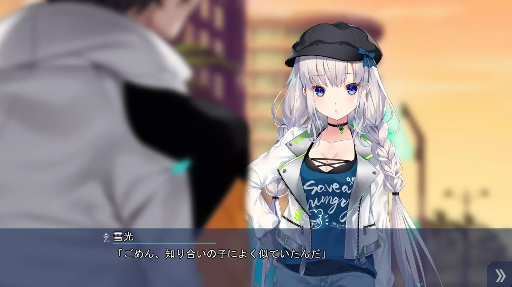
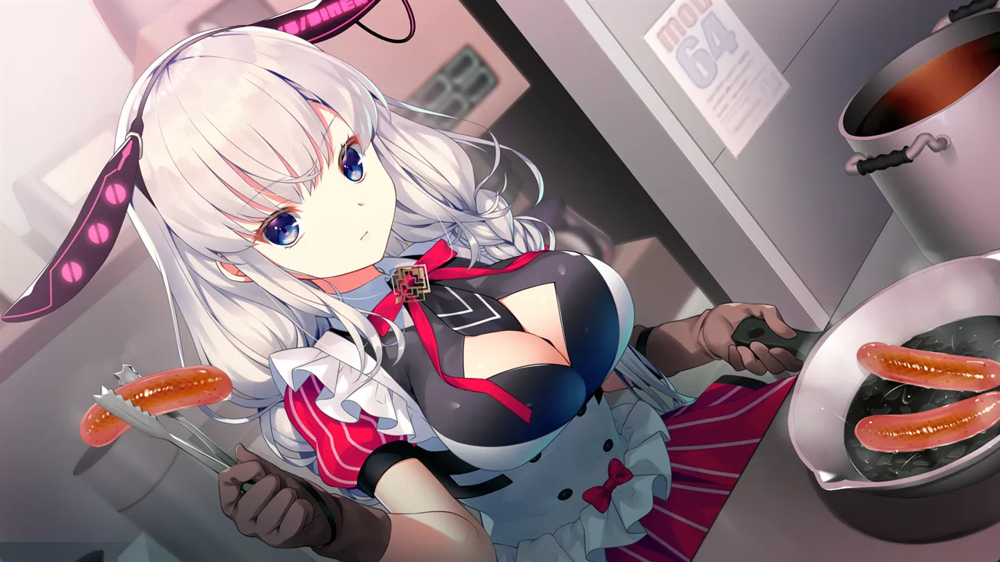
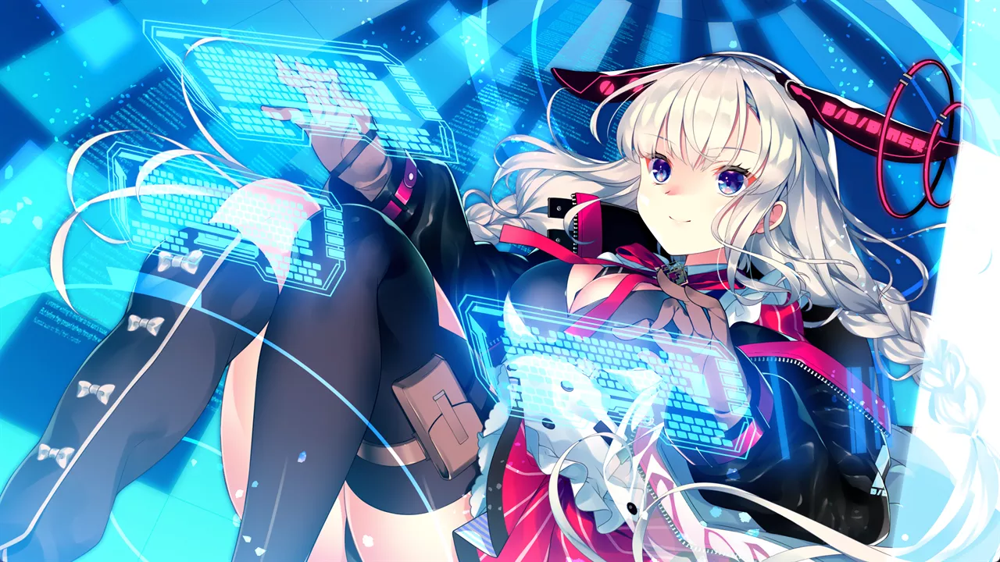
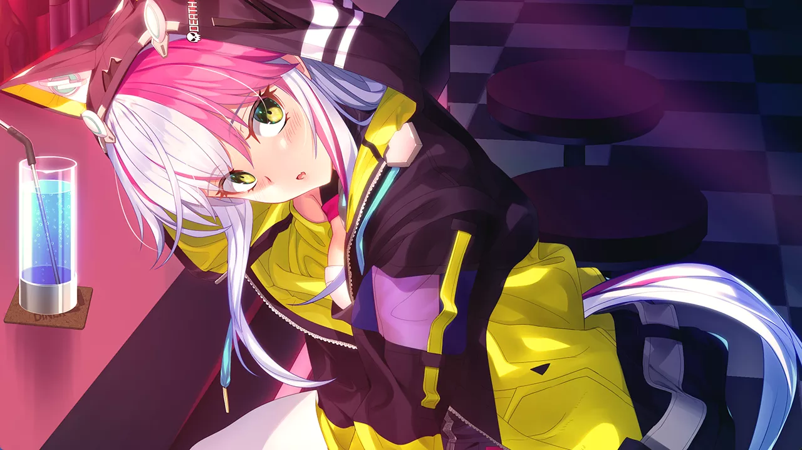
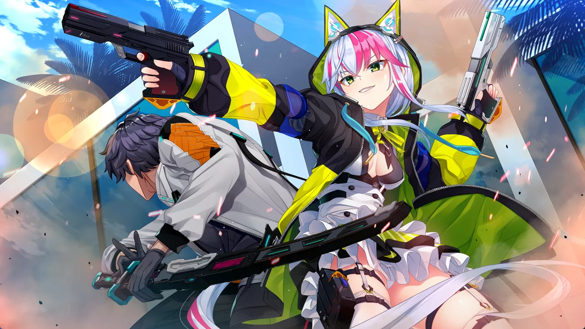
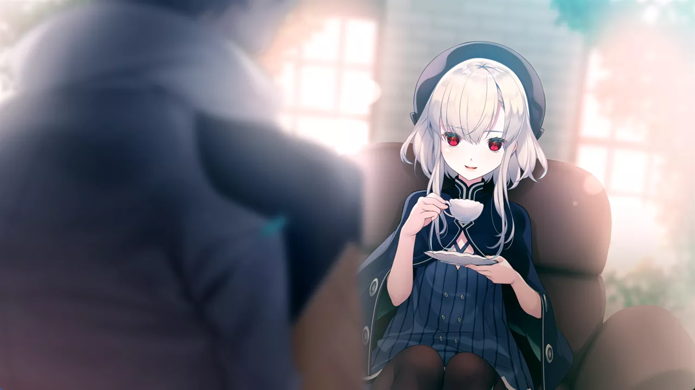

<style>
.ar16x9{
  aspect-ratio: 16/9;
}
body {
    background: var(--bg-url) no-repeat fixed center;
    background-size: cover;
    /*-webkit-font-smoothing: unset;*/
}
#banner {
    background: url('')!important;
    background-color: transparent!important;
}
#toc {
     background-color: var(--board-bg-color);
     padding: 20px 10px 20px 20px;
     border-radius: 10px;
}
#board {
    backdrop-filter: blur(5px);
    -webkit-backdrop-filter: blur(5px);
   /* background-color: #3337 !important;*/
}
.full-bg-img > .mask {
  background-color: rgba(0,0,0,0) !important;
}
.page-header  {
  background-color: rgba(0,0,0,0.5);
  padding: 3px;
  border-radius: 5px;
}
:root {
  --board-bg-color: rgba(255,255,255,0.85);
  --bg-url: url('../image/REDCherish/bg-l.webp')
}
[data-user-color-scheme='dark'] {
  --board-bg-color: rgba(0,0,0,0.85);
  --bg-url: url('../image/REDCherish/bg-d.webp') 
}
::selection {
    background-color: #f99;
}
.page-header .mt-1 span.post-meta {
    /* 隱藏嚇人的字數統計 */
    display: none;
}
rt {
	font-size: 0.7rem;
}

</style>

`作者：桐遠暮羽`


## At A Glance

賽博朋克美少女的人生夙願就是拿反器材狙擊步槍和火箭發射器 把城市黑幫、電腦中級嗨客和電子吸血鬼全部 #繩之以法！

<p id="coverimage-warp">
  
</p>


| 資訊一覽     |                 |
| :----------- | :------------------------------------ |
| **開發商**   | CRYSTALiA                 |
| **遊戲時長** | 25H（估計）                     |
| **攻略人數** | 3                     | 
| **類型**     | 賽博朋克 戰鬥            |
| **難度**     | 低（直接選人）                   |
| **分級**     | R-18（性行爲）      |
| **遊戲引擎** | Softpal ADV System           |

## 故事
 
這是 2066 年，雖然距離賽博元年 2077 年還有 11 年，
然而賽博朋克之風早已席捲世界，到處都能看到做了義體移植手術的人。

大洋上的島國 ***Eleutheria***（希臘語「自由」；下文簡稱自由城），是賽博改造人的聖地。
無論是想要在大腦中植入電腦，還是器官癢癢了想要換器官，或者是想要加裝戰鬥義體，
各種各樣的需求在自由城都可以得到滿足。

男主角 ***雪光*** 原本隸屬於日本的特務機關「烏拉格」，但是在一次保鏢任務中他犯了致命錯誤導致目標死亡，
在要遭受烏拉格的審判甚至是追殺的時候，他毅然放棄了在日本的一切，隻身一人逃往了自由城。


自由城，是一個可以實現一切夢想，甚至是可以爲所欲爲的地方。
剛踏上了自由城的男主角，遭遇了一個白髮少女 ***尤妮卡***，
尤妮卡也是一個苦命人，她的父親在保護自己經營的賽博餐廳的戰鬥中被黑道所殺，
在那之後她也一直被黑幫不斷糾纏。



然而，尤妮卡並沒有放棄「讓賽博餐廳東山再起，圓父親的遺願」的夢想。
失去了一切的男主角雪光，爲尤妮卡的心靈所打動（指要脅），決定獻出一切，甚至是生命，
爲實現尤妮卡的夢想掃清所有障礙。

無論是黑幫，還是潛藏在自由城背後的更大的陰暗。


## 登場人物

<style>
  .charname {
    font-size: 150%;
  }
  .namearea hr {
    margin: 1.5rem 0;
  }
  .sp-character img, .img-shade {
    filter: drop-shadow(0 0 6px #000c);
  }
  .sp-character {
    border-radius: 20px;
    overflow: hidden;
    box-shadow: 0 5px 11px 0 rgb(0 0 0 / 18%), 0 4px 15px 0 rgb(0 0 0 / 15%);

    -webkit-backdrop-filter: blur(1px);
    backdrop-filter: blur(1px);
    
    /*background-color: var(--chara-card-color);*/
    
    background-color: transparent;
    background-image: var(--this-bg);
    background-position: center;
    background-repeat: no-repeat;
    background-size: cover; 

  }
  .sp-character .char-overlay {
    background-color: var(--chara-card-color);
    min-height: 400px;
    background-image: var(--right-bg);
    background-repeat: no-repeat;
    background-position: bottom -60px right calc(100% * 0.3 - 160px);
    background-size: auto 450px;

    margin: 0;
    padding: 0;
  }
  .sp-character.ykmt .char-overlay {
    background-color: var(--chara-card-color);
    min-height: 400px;
    background-image: var(--right-bg);
    background-repeat: no-repeat;
    background-position: bottom -250px right calc(100% * 0.3 - 175px);
    background-size: auto 650px;

    margin: 0;
    padding: 0;
  }
  :root { /* 配色 */
    --chara-card-color: #ffffffcf;
  }
  [data-user-color-scheme='dark'] {
    --chara-card-color: #1a1a1aa6;
  }
  @media screen and (max-width: 767px) {
    .namearea hr {
      margin: 1rem 0;
    }
    .pc-left {
      -webkit-backdrop-filter: blur(3px);
      backdrop-filter: blur(3px);
      
      background: var(--chara-card-color);
      transition: opacity 0.3s;
    }
    .pc-left.touch {
      opacity: 0.1;
    }
    .sp-character {
     /*background: unset;*/
      /*-webkit-backdrop-filter: unset;
    backdrop-filter: unset;*/
    }
    .sp-character .char-overlay {
      min-height: 375px;
      /* background-size: contain;*/
      background-position: bottom 0px right -50px; 
    }
    .sp-character.ykmt .char-overlay {
      min-height: 375px;
      background-size: 500px;
      background-position: bottom -150px right -50px; 
    }
    :root { /* 配色 */
      --chara-card-color: #ffffff87;
    }
    [data-user-color-scheme='dark'] {
      --chara-card-color: #1a1a1aa6;
    }
  }
</style>


<div class={`row sp-character ${uid}`} style={`--this-bg: url(../image/REDCherish/chars/bg.webp)`}>
  <div class="col-12 char-overlay row" style={`--right-bg: url(../image/REDCherish/chars/${no}.webp)`}>
    <div class="pc-left col-12 col-md-8">
      <div class="namearea col-12 pt-2">
        <div class="charname font-serif font-weight-bold font-italic">
          {name}
        </div>
        <div class="yomi font-italic">
          {yomi}
        </div>
        <hr />
      </div>
      <div class="infoarea col-12" html={html}>
      </div>  
    </div>
  </div>  
</div>


<sp-character no=00 name="尤妮卡" yomi="Unica・ユニカ" uid="unica">
  <p>
    自由城的打工人少女，當然是個賽博改造人。
  </p>
  <p>
    由父親獨自撫養長大，在自家餐廳被橄欖之後一直被黑幫刁難不斷，<br>
    所以她的餐廳復興夢顯得異常遙遠和渺小。<br>
    熟練的料理技能也無處發揮。
  </p>
  <p>
    尤妮卡暗地裏其實還是個中級電腦黑客，<br>
    對付比如說日本這種 IT 垃圾國家簡直不在話下。<br>
    但是她並不想通過網路犯罪來賺錢。
  </p>
  <p>
    喜歡用狙擊槍放黑槍和開摩托車。
  </p>
</sp-character>
<br>
<sp-character no=01 name="洛姬" yomi="Rouge・ルージュ" uid="rouge">
  <p>
    自由城的大小姐少女，當然也是個賽博改造人。
  </p>
  <p>
    家裏是開高級賽博餐廳的，<br>
    高級到無論是政府高官還是企業老總都會經常光顧。<br>
    洛姬也在店裏面幫忙，練就了一身優雅的接客本領。
  </p>
  <p>
    但是她其實看餐廳很不爽，一直在策劃着謀權篡位：<br>
    把現在的老闆（老媽）趕下臺，然後自己獨掌大局。
  </p>
  <p>
    武器當然是最貴的，自動步槍、榴彈發射器甚至是火箭筒都可以往裙子裏面藏。
  </p>
</sp-character>
<br>
<sp-character no=02 name="德絲佩拉朵（德絲）" yomi="Desperado・デスペラード" uid="des">
  <p>
    自由城的流浪少女，貧民窟出身，當然也是個賽博改造人。
  </p>
  <p>
    從小就沒有雙親，在貧民區裏被黑幫撫養長大，<br>
    在那邊學會了各種戰鬥技巧，練就了射擊技能。<br>
    視自己的幫派兄弟如親人，只要一起戰鬥你就是我的 Family。<br>
  </p>
  <p>
    體型事個蘿莉然而性格卻事個暴躁老哥，喜歡一言不合就掏槍，<br>
    火併，然後就你死我活。
  </p>
  <p>
    使用兩把老式手槍，手動瞄準就能槍槍爆頭，外掛人，，，
  </p>
</sp-character>
<br>
<sp-character no=03 name="久阪 雪光" yomi="本作男主角" uid="ykmt">
  <p>
    被除名的前日本特務，簡稱「雪光之災」，當然也是個賽博改造人。
  </p>
  <p>
    帶着半自暴自棄的想法逃來自由城，一開始他並不知道接下來要幹什麼，<br>
    直到他遇到了尤妮卡。
  </p>
  <p>
    弘揚日本傳統文化，戰鬥只喜歡用武士刀，方便在女主角面前進行以刀搏槍的裝逼，簡稱掉腦袋切切，，，
  </p>
</sp-character>


## 遊戲 OP

請觀賞遊戲 OP，很賽博，很帶感，，，

<video controls preload="metadata" width='100%' poster="../image/REDCherish/op.webp">
    <source src="https://s3static-zone0.galgamer.eu.org/video-2d35/REDCherish/RED-OP.mp4" type="video/mp4">
</video>

Galgame 金曲：

上面的 OP： <a href="/music/?id=49" target="_blank">🔗️BLOOD/ORDER</a>
遊戲的 ED： <a href="/music/?id=48" target="_blank">🔗️B.SEAB.SKY/DAY</a>


這個專輯就是本作的原聲帶。

## 遊戲 CG

<p>
  
</p>

<p>
  
</p>

<p>
  
</p>

<p>
  
</p>

<p>
  
</p>

<p>
  
</p>

<p>
  
</p>

<p>
  
</p>

<p>
  
</p>

<p>
  
</p>

<p>
  
</p>

<p>
  
</p>


## H 場景


../image/REDCherish/hcg/00.webp
../image/REDCherish/hcg/01.webp
../image/REDCherish/hcg/02.webp
../image/REDCherish/hcg/03.webp
../image/REDCherish/hcg/04.webp
../image/REDCherish/hcg/05.webp


## 遊戲畫面


../image/REDCherish/scn/00.webp
../image/REDCherish/scn/01.webp
../image/REDCherish/scn/02.webp
../image/REDCherish/scn/03.webp
../image/REDCherish/scn/04.webp
../image/REDCherish/scn/05.webp
../image/REDCherish/scn/06.webp
../image/REDCherish/scn/07.webp
../image/REDCherish/scn/08.webp
../image/REDCherish/scn/09.webp
../image/REDCherish/scn/10.webp


## 一句話點評

這是我第一次玩 CRYSTALiA 的遊戲。說實話最初我對這家公司的印象並不是很好，因爲牠們把刀戰少女（絆きらめく恋いろは）的冷飯炒了 6 部甚至是 5 部作品，然後之前我嘗試開始玩刀戰少女的時候，開局就是大量不明所以的專有名詞噴射到我臉上，設定就是女主們拿刀互毆，再加上 720P 糊成狗的畫面和文字，玩了 30 分鐘就勸退了。

那麼這次我要推薦 RE:D Cherish! 的原因也很簡單，就是因爲 CRYSTALiA 一雪前恥了。這部遊戲發行於 2022 年，想必牠們已經是充分吸收了著名遊戲 Cyberpunk 2077 的精髓，並且融入到了遊戲之中，才能設計出賽博味那麼衝的自由城。

遊戲故事圍繞着賽博改造人之間的戰鬥和女主角的開店夢而展開，那麼很順理成章地，男主角爲守護女主角而戰，再加上男主角一上來就是實力強到逆天的前特務人員，就讓整個故事有一種爽文的味道。雖然有點離譜，但是他爽啊！這一點就和主角是屌絲起家的 Cyberpunk 2077 不太一樣。

爲了俘獲女主角的芳心，那麼就肯定不能缺少戰鬥和裝逼場景。光是說男主角多強多屌而不展現出來無疑是空洞的。Galgame 不像 3A 遊戲，沒法用炫酷的實時特效渲染戰鬥場面，但好在 CRYSTALiA 是這方面的專家，本作中他們巧妙地用區區幾幀的特效圖案、武器插圖和人物動作立繪進行排列組合，配上文字描寫和音效，居然就在 Galgame 裏面實現了栩栩如生的戰鬥場面，準確地說，是在玩家的腦海裏形成了栩栩如生的戰鬥場面，總之看上去沒有絲毫違和感。這一點是其他的 Galgame 公司望塵莫及的。

最後，再往男主角裏面加一點幽默感，劇情也就輕鬆有趣了，女主角們的心也被拿捏了，一個無可挑剔的 Galgame 男主角和令人舒適的 Galgame 也就誕生了。

這是個我覺得非常愉快的遊戲，推薦給各位...！

## 還在猶豫是否下載？

我手上沒有漢化版，並且剛開始的劇情上面也已經說過了，所以放一個日後小故事。
劇情是男主角向德絲下達了「不可以色色！」命令。

<video controls preload="metadata" width='100%' poster="../image/REDCherish/movie.webp">
    <source src="https://s3static-zone0.galgamer.eu.org/video-2d35/REDCherish/RED-movie.mp4" type="video/mp4">
</video>

## 遊戲攻略提示

請最後再攻略尤妮卡。

## 資源和下載

目前還沒有漢化版，發揮你中級的日語能力吧！

**日文原版：**

```
magnet:?xt=urn:btih:b9a9e41b40e06767d6597893be620b9778bd2056
```

文件名：[220225][1150853][CRYSTALiA] RE：D Cherish！ 初回版 パッケージ版& 豪華版特典

**備用連結：**

```
magnet:?xt=urn:btih:380821e8447a1ad2dd4459e0129508374c698244
```

文件名：[220225] [CRYSTALiA] RE：D Cherish！ 初回版 + Bonus + Update

牠有一個升級補丁，記得打。你也可以前往 [🔗官網](https://crystalia.amusecraft.com/red/download/red_update.zip) 下載。

## 附贈 4K 尺寸壁紙

這些壁紙在上面的資源裏面也有，這裏放 webp 格式的。

<details>
  <summary>點此展開</summary>

<p>
  
</p>

<p>
  
</p>

<p>
  
</p>

<p>
  
</p>

<p>
  
</p>

<p>
  
</p>

<p>
  
</p>

<p>
  
</p>

<p>
  
</p>

<p>
  
</p>

<p>
  
</p>

<p>
  
</p>

</details>

## Linux 玩家體驗

Mac 上的 wine-crossover 瘋狂亂碼，改地區沒用，然後 OP 播放不了，我覺得可以不用試了。

<script>
  //document.documentElement.setAttribute('data-user-color-scheme', 'dark');
  // function loadbigimg(){
  //   let cover = document.getElementById('coverimage');
  //   let btn =  document.getElementById('changesrc');
  //   let bigurl = cover.getAttribute('originimg');
  //   cover.setAttribute('src', '');
  //   cover.setAttribute('src', bigurl);
  //   cover.parentElement.setAttribute('href', bigurl);
  //   btn.parentElement.removeChild(btn);
  // }
  document.addEventListener("DOMContentLoaded", function(){
    let pclefts = document.querySelectorAll('.pc-left');
    pclefts.forEach((el) => {
      el.addEventListener('touchstart', function(){
        el.classList.add('touch');
      })
      el.addEventListener('touchend', function(){
        el.classList.remove('touch');
      })
    });
    setTimeout(() => document.documentElement.setAttribute('data-user-color-scheme', 'dark'), 1000)
  })
</script>
