`作者: Patchouli Knowledge`

「我が名は鳳凰院凶真。狂気のマッドサイエンティストにして、世界の支配構造を破壊する男。失敗など、ありえん」
 
「El．Psy．Kongroo！」
 
「特に、意味は無い」

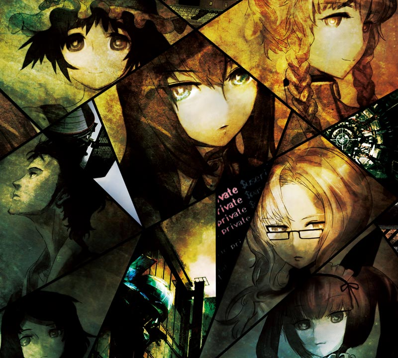

| 資訊一覽     |                  |
|:--------:|:---------------- |
| **開發商**  | 5pb.&Nitro+ |
| **遊戲時長** | 100 H          |
| **類型**   | 中二 劇情 穿越 科學 燃     |
| **難度**   | 較高            |
| **分級**   | 全年齡             |

## 故事梗概

當代大學生典範，整日無所事事的東京電機大學大學生***岡部 倫太郎***和他的朋友***橋田 至一***，再拉上自己的青梅竹馬***稚名 真由理***在一家二手顯像管工房的樓上成立了“未來發明研究所”，每日的活動目標就是發明奇奇怪怪的東西以賺錢。
2010年7月28日，爲了混學分和打發時間的岡部和橋田去聼講座，在那遇到了年僅18嵗就隨便發 paper 的天才少女***牧瀨紅莉栖***並爭吵了起來，但令岡部奇怪的是，幾個小時前他剛在其他地方看到這個紅髮少女倒在血泊當中，更離譜的是，這一切在橋田一周前收到的短信上都寫的清清楚楚。

經過查驗后，岡部發現他們在無意間發明了可以向過去發送短信的“時間機器”！就這樣，時間綫開始變動……
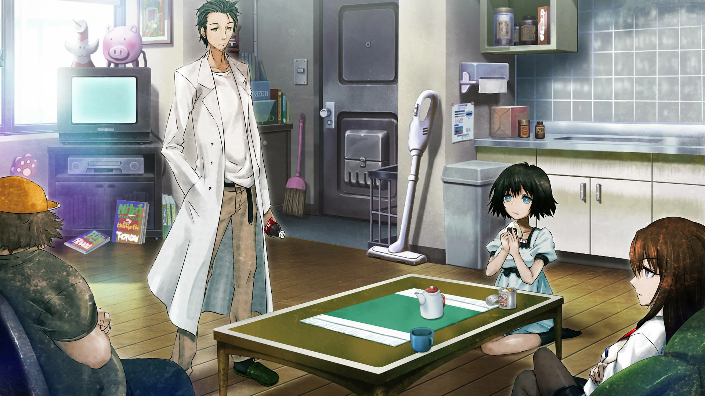

## 人物介紹



  

    

      

        

          {name}
        

        

          {yomi}
        

        

      

      

      
  
    

  
  



<sp-character no=0 name="LabMem No.001:岡部 倫太郎" yomi="CV: 宮野 真守" uid="a">
  

    本作男主，都上大學了還中二到無可救藥，可以説是 ACG 最著名的中二病角色。 
  

    每天就穿個白大褂，不修邊幅，看起來邋邋遢遢的，再加上時不時的中二語錄，不是熟人鬼才想靠近。 
  

  

    雖然看起來瘋瘋癲癲，但做事意外的正經，而且爲了同伴無論犧牲自己多少次都義不容辭。
  

  

    平時就喜歡喝Dr.Pepper和提出一些天馬行空的點子和桶子研究。
  

</sp-character>
 

<sp-character no=1 name="LabMem No.002:稚名 真由理" yomi="CV: 花澤 香菜" uid="a">
  

    岡部的青梅竹馬，口頭禪是“嘟嘟嚕”，16嵗，JK。 
  
	
    濃眉大眼，説話不緊不慢，平時在女僕咖啡廳打工，沒事就在研究所吃喝玩樂陪著岡部，是個愛吃不胖的天然少女。 
  

  

    雖然對技術方面一竅不通，但直覺很準總能一下看出問題所在，當主角團陷入消沉時也想活躍氣氛但總是收效甚微。
  

  

    最喜歡的就是岡部、炸鷄塊和雷Net的吉祥物烏帕。
  

</sp-character>
 

<sp-character no=2 name="LabMem No.003:橋田 至" yomi="CV: 関 智一" uid="a">
  

    岡部的高中兼大學同學，標准的肥宅。 
  

    發言輕浮且充滿著各種讓人聽不懂的2ch用語，時不時還會忽悠女角色們說色色的臺詞，因此經常被助手罵，可以對著任何他覺得萌的事物原地發情，口味非常的廣。 
  

  

    同時還是超級駭客，可以説是主角團最强大腿，從黑機關服務器獲取資料到時光機器研發，基本都是他在 C ，計算機才能堪稱逆天。
  

  

    喜歡巨乳。
  

</sp-character>
 

<sp-character no=3 name="LabMem No.004:牧瀨 紅莉栖" yomi="CV: 今井 麻美" uid="a">
  

    11嵗就前往海外留學，跳級進入美國的維克多·康德利亞大學的天才少女，18嵗就可以在《science》上發paper的級別。 
  
 
	在秋葉原上關於時間旅行的講座上被岡部懟后相識，並被岡部各種騷話忽悠進了研究所，一起研究時光機器。 
  

  

    十分堅持理論并且爭强好勝，經常說一大堆聼不懂的理論出來，但同時也對未知領域充滿了好奇，很容易就被岡部煽動並開始研究，并且極度傲嬌（後期就只剩嬌了）。
  

  

	和岡部一樣喜歡喝Dr.Pepper，受其影響也逐漸中二，表面正經背地裏也是個死宅和網絡鍵盤俠，
  

</sp-character>
 

<sp-character no=4 name="LabMem No.005:桐生 萌郁" yomi="CV: 后藤 沙绪里" uid="a">
  

    一家小報紙的編輯，爲了取材而尋找傳説中的PC“IBN5100”與岡部結識。 
  

    十分抗拒與別人交流，幾乎不説話，即使和人面對面也要通過手機短信的方式與人溝通，打字速度非常快，被岡部稱之爲“閃光的指壓師”，但短信的語句卻十分的開朗與其外在形成了鮮明的反差。 
  

  

    手機就是她的命根子，很喜歡寫作。
  

</sp-character>
 

<sp-character no=5 name="LabMem No.006:漆原 琉華" yomi="CV: 小林 優" uid="a">
  

    秋葉原柳林神社當家的兒子，但被父親當女兒養了。 、
  

    畫女硬説男系列，極度缺乏自信，很容易臉紅嬌羞，沒有主見別人説啥就是啥。 
  

  

    岡部爲了讓他自信起來，收其作爲自己的徒弟，每日教他奇怪的劍術和說各種中二語錄。
  

  

    喜歡岡部，也因此對岡部的要求和“教誨”也全部無條件接受。
  

</sp-character>
 

<sp-character no=6 name="LabMem No.007:秋葉 留未穗" yomi="CV: 桃井 晴子" uid="a">
  

    在秋葉原女僕咖啡廳打工的貓兒少女，是真由理的同事，常有名為菲利斯，很少使用真名。 
  

  

    比岡部還要中二和電波，是唯一一個會和岡部一起發癲的人，十分堅持自己的貓娘人設，深諳宅文化，在秋葉原十分有人氣。
  

  

    堪比讀心的察言觀色能力，玩弄人心的小惡魔。
  

</sp-character>
 

<sp-character no=7 name="LabMem No.008:阿萬音 鈴羽" yomi="CV: 田村 由香裏" uid="a">
  

    在研究所樓下打工的元氣少女，還兼職了許多工作因此被岡部稱爲“打工戰士”。 
  

  

    雖然很少談及自己但很關心他人，做事雖然有點粗心，但在某些時候卻十分的利索，似乎很擅長戰鬥和野外生存。
  

  

    非常喜歡自行車，用自己的打工工資買了輛很貴的自行車，每天不是工作就是在保養自己的自行車。
  

</sp-character>
 

## 遊戲 OP & TV OP

動畫來自被牆的油管和steam，請翻牆



<iframe id='y2b' loading="lazy" src="https://www.youtube-nocookie.com/embed/SBQprWeOx8g" title="YouTube video player" frameborder="0" allow="encrypted-media; picture-in-picture" allowfullscreen></iframe>

## 簡評

  
優點：

  </img>

 * 劇情、人設、音樂都是 ADV 天花板的存在，看了動畫慕名而來的你絕對不會失望。
 * 倫太郎堪稱所有中二少年的夢想&終極追求，看起來像是龍傲天，但完整玩下來就只有 respect。
 * 十分適合新手推，畫風不算萌系就算被看到也不會社死，但難度較高請適當參考攻略。
 * 個人綫有許多動畫中所沒有的細節，讓配角們更加生動有血色。（打工戰士綫筆者非常喜歡）
 

  
缺點：

  </img>

 * 硬要説就是前期有點小無聊需要鋪墊，配上整體灰暗的界面色調，可能有點勸退，不過畢竟該作名聲如此大，這點還是可以忍耐的，但對於 ADV 的常規文本量來説只是小 case 。（這點放在 TV 中足足長達八集，依然無法抵擋其好評如潮）

有關石頭門的安利chui介紹bao文章已經多如牛毛，筆者拙劣的文筆根本不夠格（絕對不是擺爛，是該作玩過的人太多了質量有多頂都有目共睹），所以也不必多説什麽，直接拉到底看下載鏈接吧。 XD

| 評分        |      |
|:---------:|:----- |
| **人設**    | 10/10 |
| **立繪 & CG** | 10/10 |
| **劇情**    | 10/10 |
| **音樂**    | 10/10 |
| **綜合**    | 10/10 |

## CG鑑賞

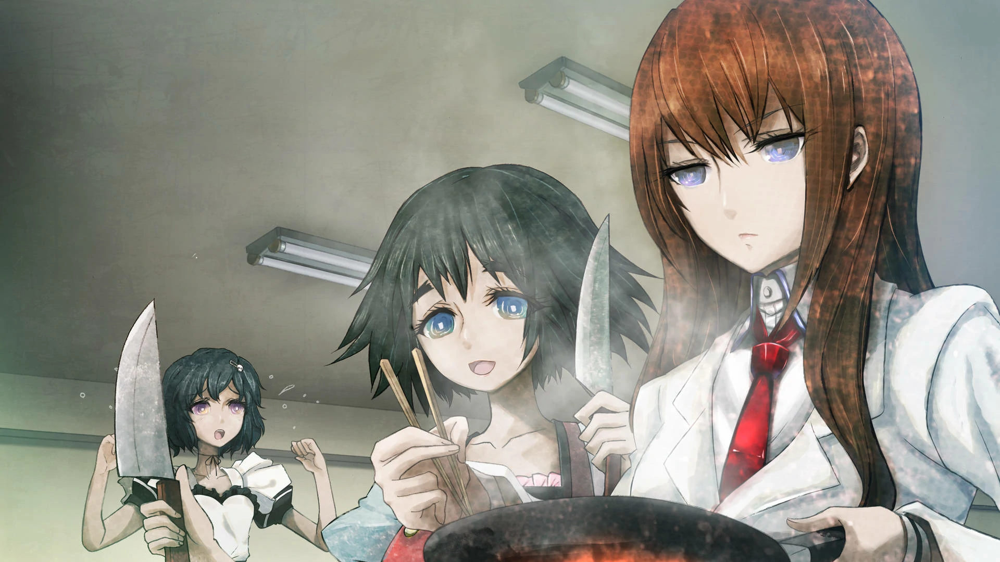

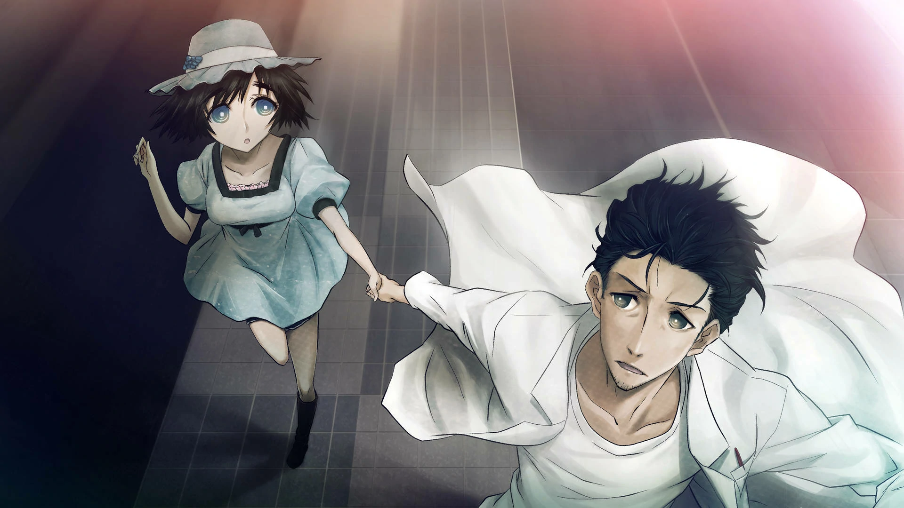

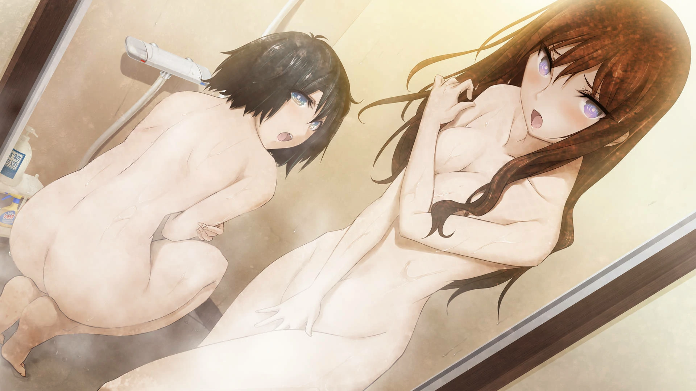

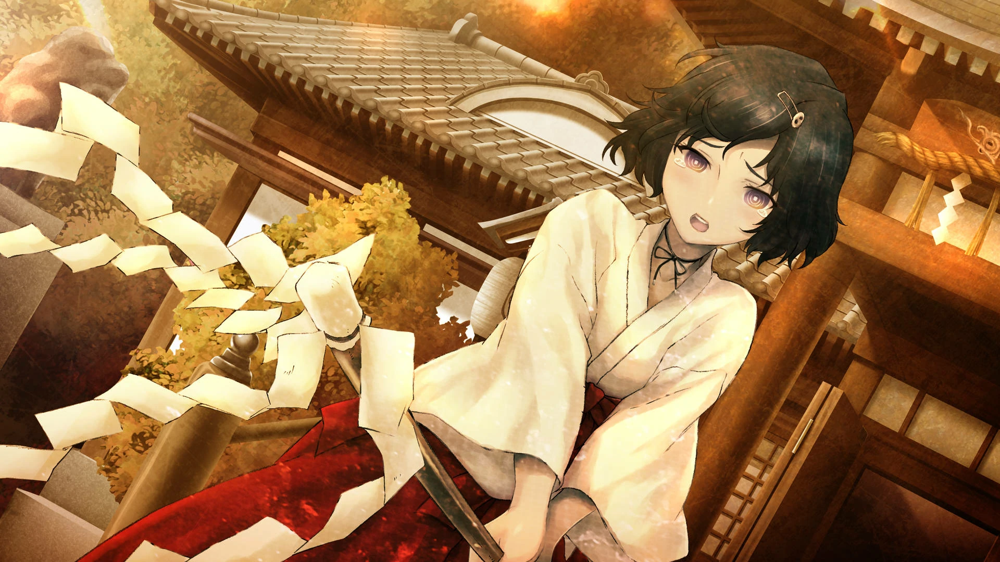

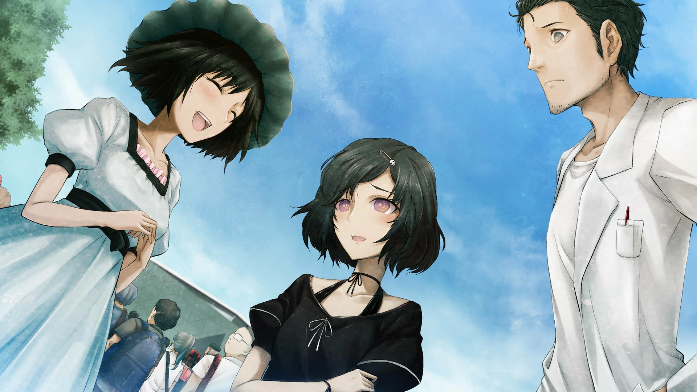

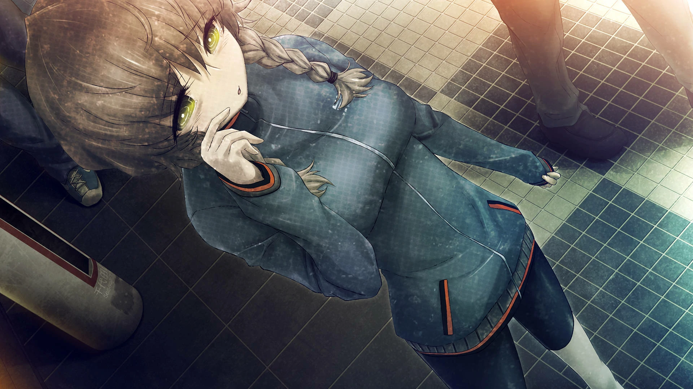

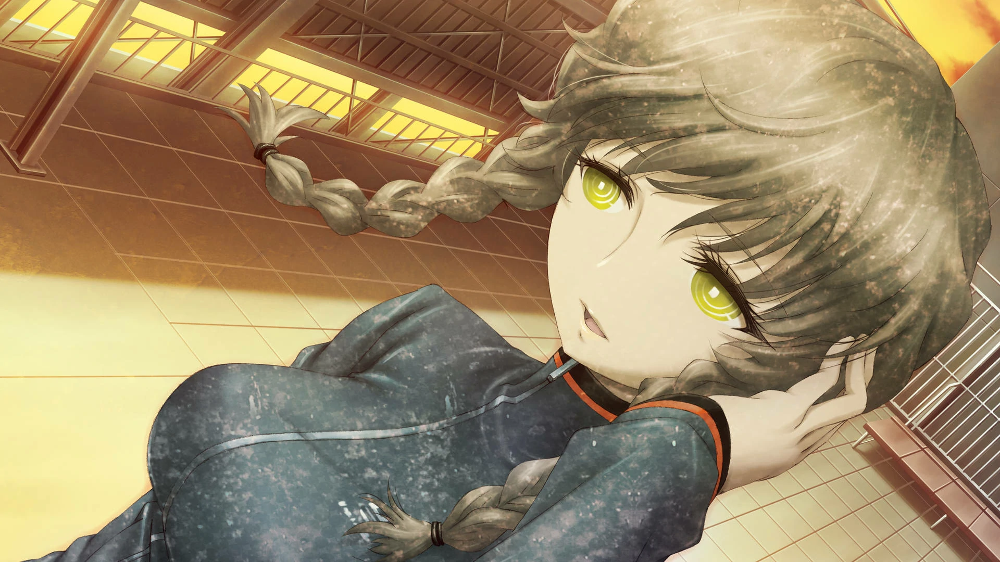

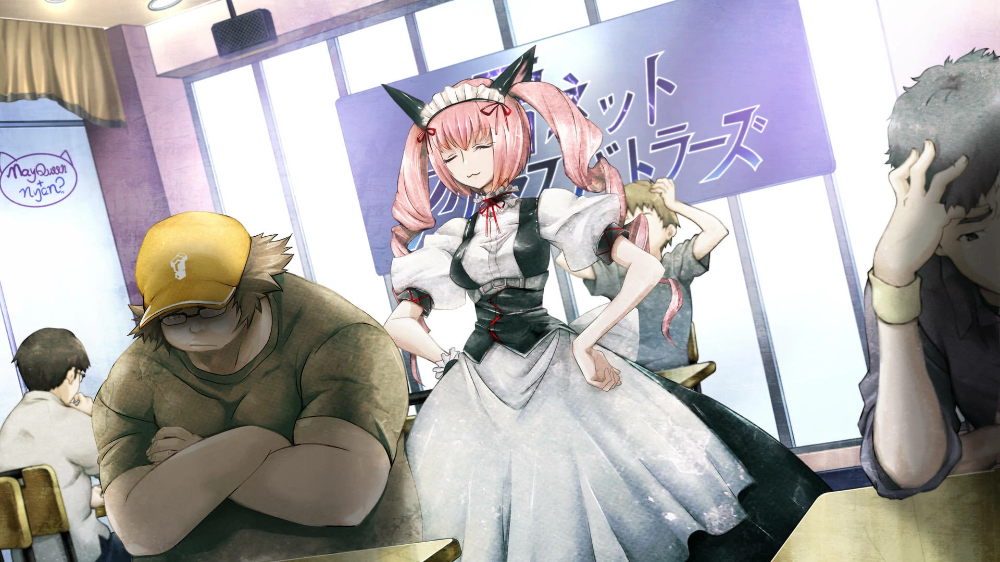

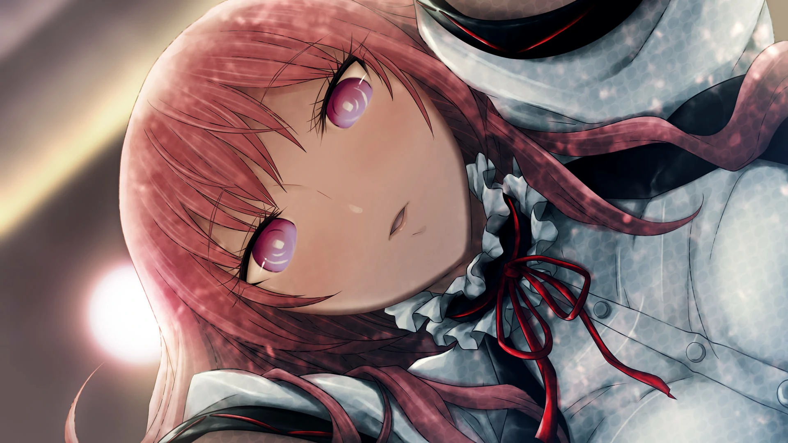

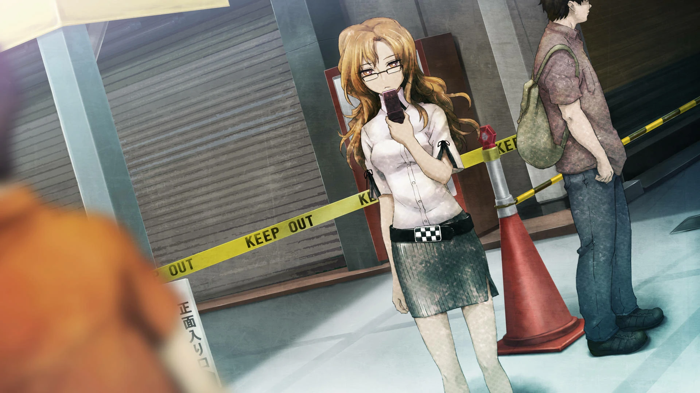

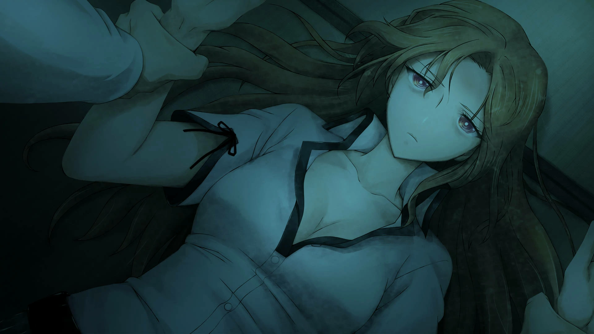

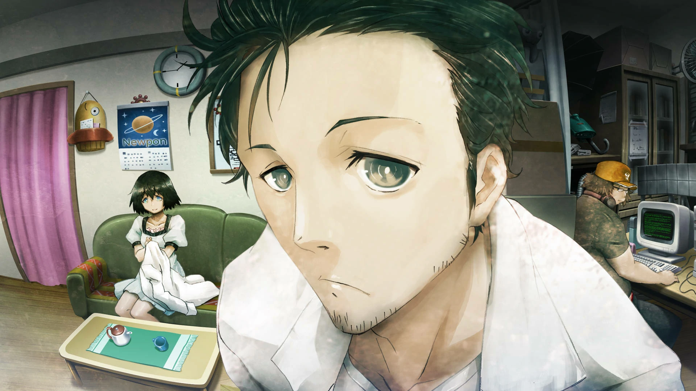

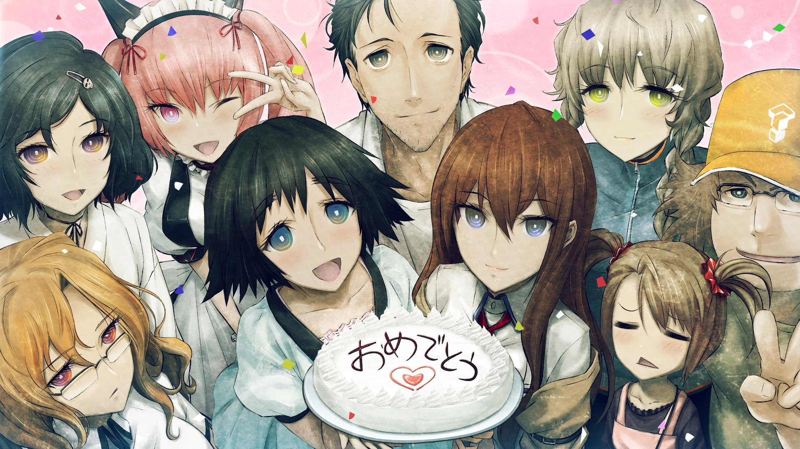

## 遊戲資源



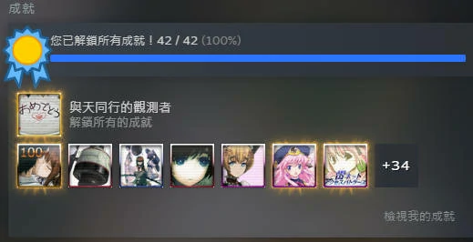

盜版： 

