`作者: Patchouli Knowledge`

  該作為 SG 正統續作，以下内容將會對 SG 完全劇透 
  請務必通關 SG 后再閲讀該文/游玩該作 

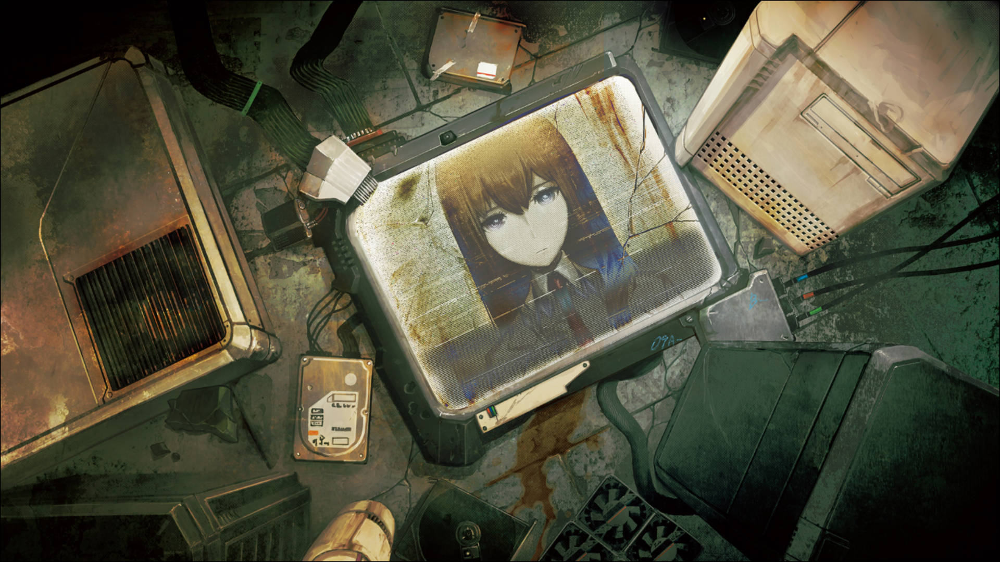

| 資訊一覽     |                  |
|:--------:|:---------------- |
| **開發商**  | 5pb.&Nitro+ |
| **遊戲時長** | 40 H          |
| **類型**   | 中二 劇情 穿越 科學 AI     |
| **難度**   | 一般            |
| **分級**   | 全年齡             |

## 故事梗概

該作為繼承了前作“β世界綫”的結局，即真由理存活，紅莉栖死亡的世界。而我們的狂氣的科學家倫太郎也不再中二，陷入深深的自責，一蹶不振。

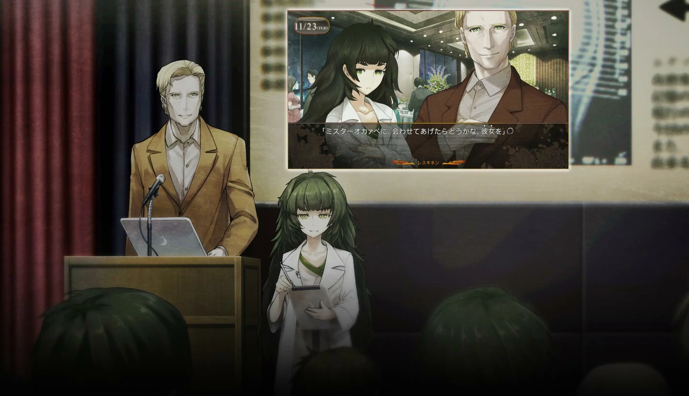
機緣巧合下參加了助手的教授和學姐開辦的講座，並相互認識，在教授熱情的邀請下，成爲了 AI 助手“Amadeus”的測試員

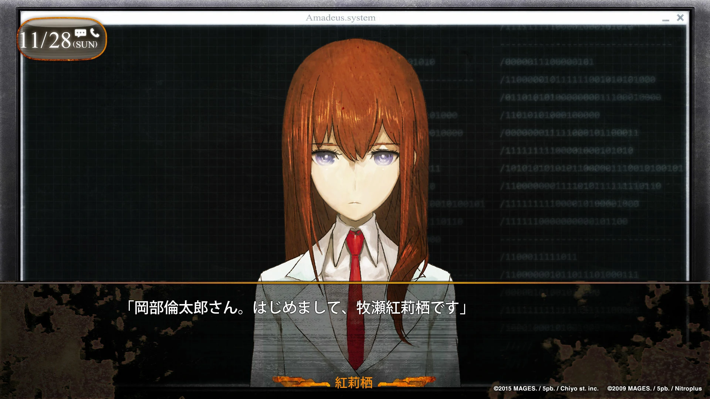
從最壞的結局出發，現在事情又有了新的發展，等待著倫太郎的是希望，抑或是……
## 人物介紹（前作人物不再介紹



  

    

      

        

          {name}
        

        

          {yomi}
        

        

      

      

      
  
    

  
  



<sp-character no=0 name="LabMem No.009:比屋定 真帆" yomi="CV: 矢作 紗友裏" uid="a">
  

    紅莉栖的研究室前輩。 
  

  

    身高僅有140cm，嬌小的身材常被人誤認爲是小學生，本人也對此十分在意。 
  

  

    做事很精明幹練，有些嫉妒自己的後輩紅莉栖的才華，但也非常喜歡她，對其死無法釋懷。
  

  

    活在紅莉栖的陰影之下，其實也是天才。
  

</sp-character>
 

<sp-character no=1 name="LabMem No.010:椎名 篝" yomi="CV: 潘 惠美" uid="a">
  

    長相酷似紅莉栖的少女（唯一的區別大概是胸部和瞳色 
  
	
  

    失去了所有記憶，但和真由理很是親近。 
  

</sp-character>
 

<sp-character no=2 name="LabMem No.011:阿万音 由季" yomi="CV: 田村 由香里" uid="a">
  

    真由理 COS 社團的同好，即將畢業的大四學生。 
  

  

    人美心善，積極向上，給人非常强的親和力，連同性都覺得十分美麗。 
  

  

    無論哪條世界綫最後都會和桶子在一起並生下鈴音，堪稱最强的世界綫收束。
  

</sp-character>
 

## 遊戲 OP & TV OP

動畫來自被牆的油管和 Steam，請翻牆



 

<iframe id='y2b' loading="lazy" src="https://www.youtube-nocookie.com/embed/9CUbbXTVZdw" title="YouTube video player" frameborder="0" allow="encrypted-media; picture-in-picture" allowfullscreen></iframe>

## 簡評

  
優點：

  </img>

 * 根據廣播劇和小説補全了 SG 的許多大坑，在玩家都知道結局是怎樣的情況下依然將懸疑感做得很好。
 * 很好的繼承了 SG 的高質量音樂和畫風，並適當降低了通關難度。
 * “僞科學”(口胡)上的處理依然十分優秀，在前作世界綫的基礎上增添了 AI 等。
 

  
缺點：

  </img>

 * 部分情節節奏過度有些快，前作部分角色邊緣化，内容略顯單薄（畢竟文本量大約只有前作的一半
 * 有些情節有 bug ，但都是爲了不吃前作的書。

前作過於耀眼，導致這部續作自然會被部分人評價爲狗尾續貂。從一部 ADV 的角度來説該作絕對是優秀水準的，但誰讓它叫 SG0 呢。通關 SG 后該作是絕對不可以錯過的，但請不要用 SG 的水準去要求，稍稍降低一點點期待，SG0也能帶給你大滿足。（這裏不得不提一嘴動畫組真的盡心盡力，SG0 的 TV 依然是超神發揮，完全不輸 SG 的 TV。）

| 評分        |      |
|:---------:|:----- |
| **人設**    | 9/10 |
| **立繪 & CG** | 10/10 |
| **劇情**    | 8/10 |
| **音樂**    | 10/10 |
| **綜合**    | 9/10 |

## CG鑑賞

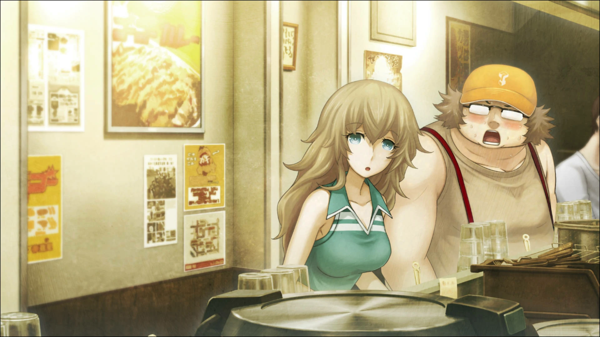

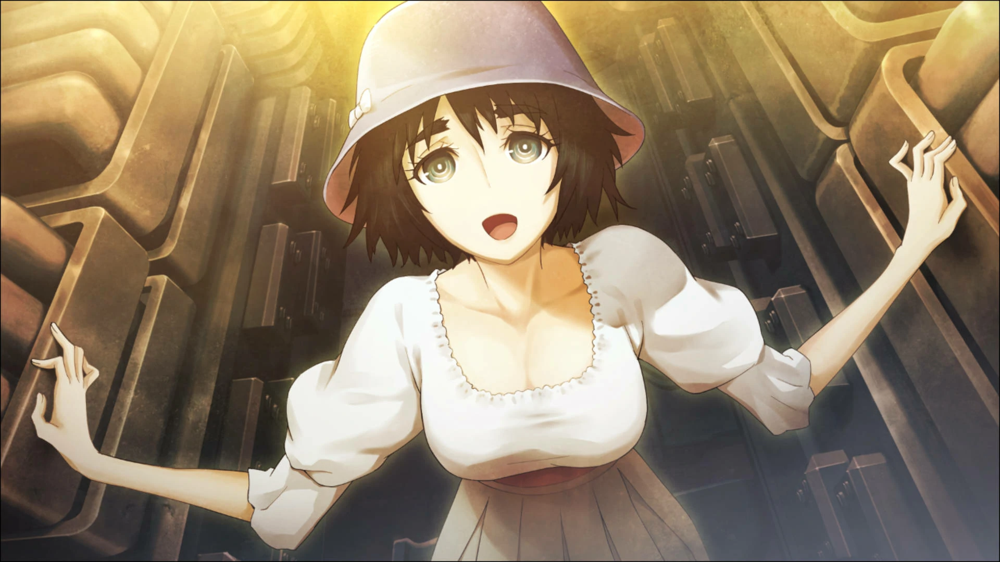

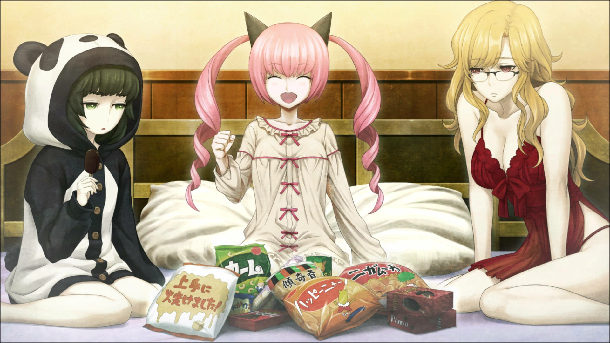

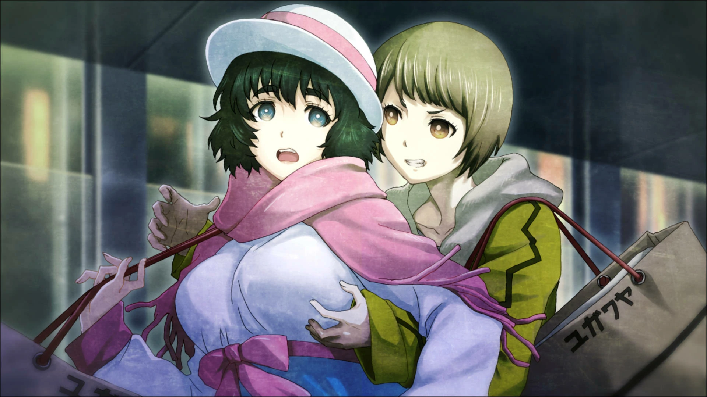

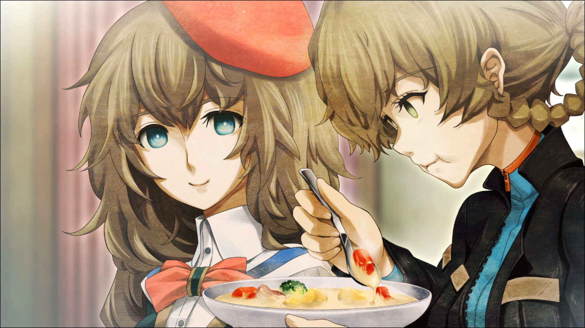

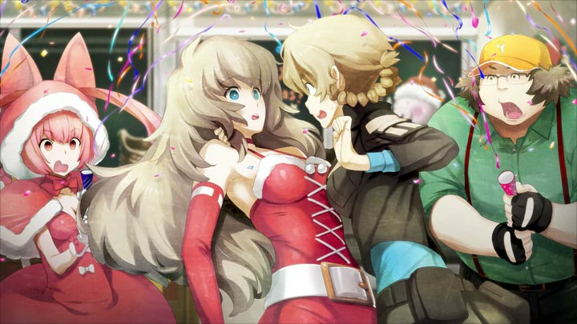

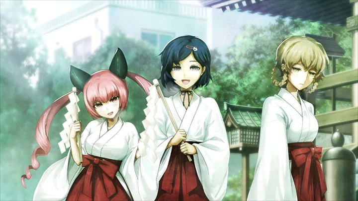

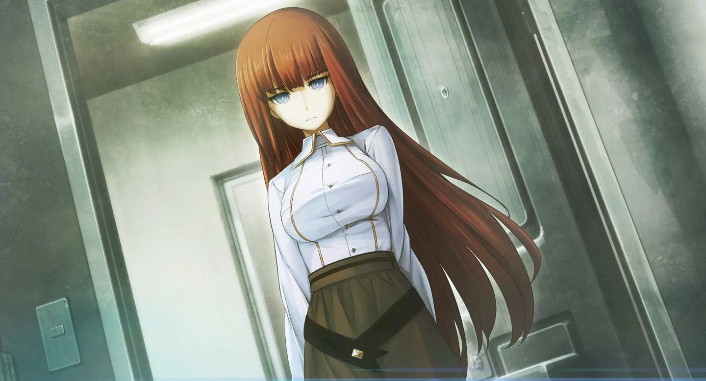

## 遊戲資源



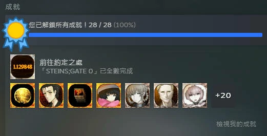

盜版： 

