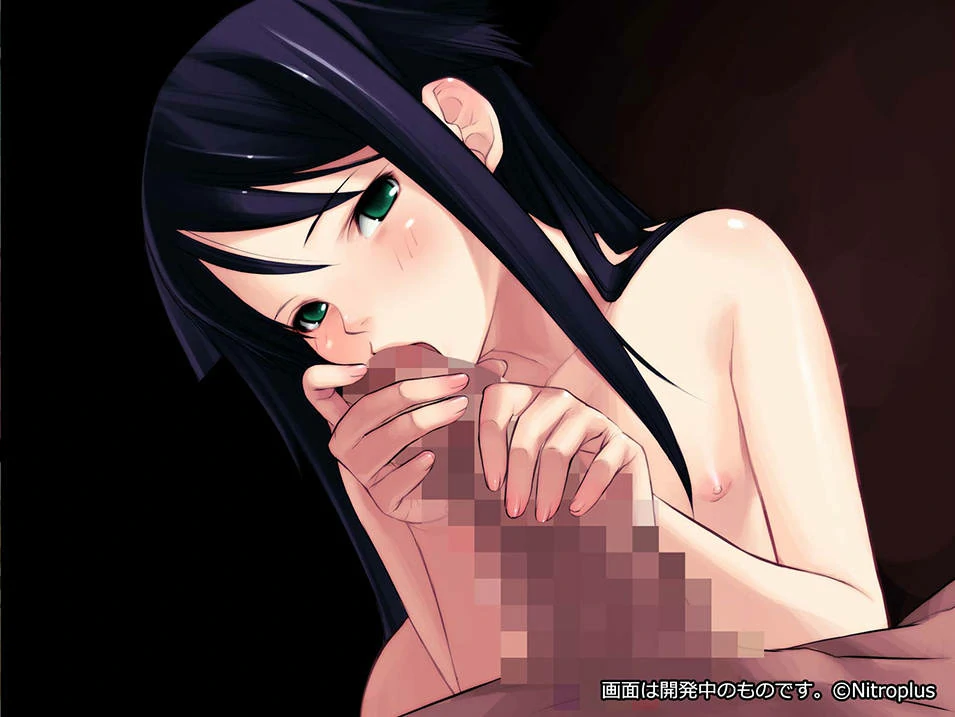
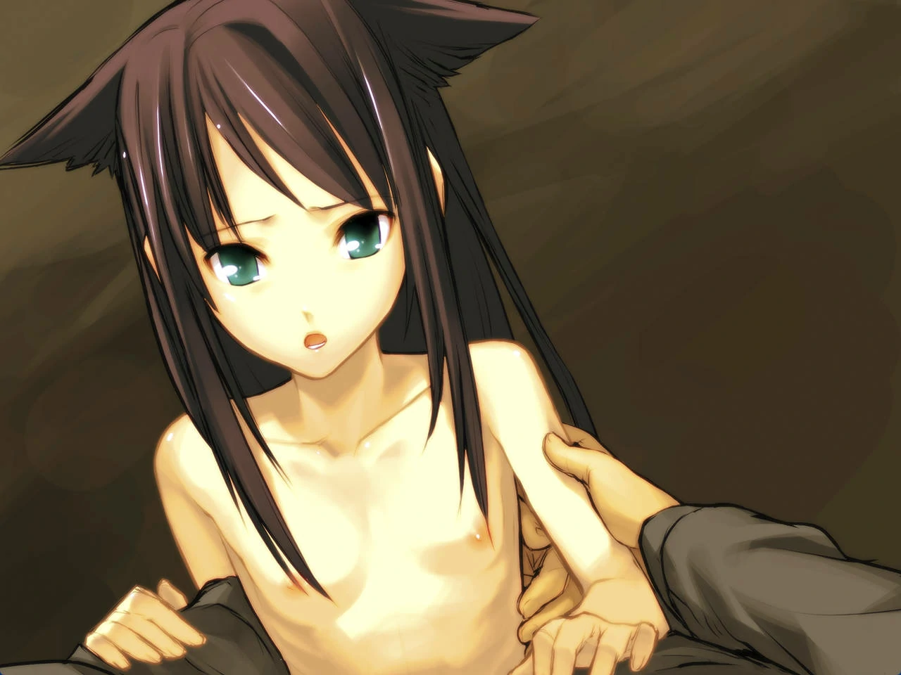

`作者: Patchouli Knowledge`

| 資訊一覽     |                  |
|:--------:|:---------------- |
| **開發商**  | Nitro+ |
| **遊戲時長** |4-5 H          |
| **類型**   | 劇情 純愛 虐殺 輕微NTR     |
| **難度**   | 無            |
| **分級**   | R-18G             |

## 故事梗概

普通的醫大學生***匂坂郁紀***在一場事故中失去了父親并且瀕臨死亡，經過緊急搶救后勉强保住了性命，但爲了保住性命同時還對顱内進行了手術，這導致他對整個世界的認知發生了翻天覆地的變化：整個世界在他的視角下變成肉塊和肉泥覆蓋，吃的喝的乃至其他所有人都變成了不可名狀的怪物，他人的言語在他耳中也變成了難以分辨的邪惡嚅囁。

就在這如此絕望，恐怖的世界，一個身著白色連衣裙的長髮少女出現在他眼前……

## 人物介紹

### 匂坂 郁紀（cv：冰河流）

 

本作男主，隨處可見的普通大學生，出事前有好哥們、互有好感的女孩、光明的未來，然後一場車禍卻將他的生活一下打入了地獄……

    
### 沙耶（cv：川村 翠梨）

 

在男主陷入絕望后突然出現的神必少女，標准的蘿莉體型，總是身著一襲白色連衣裙，十分主動吃定了男主，性欲非常强。

    
### 戶尾 耕司（cv：片岡 大二郎）

 

男主的好基友，在男主出事并且行爲變得怪異后依然對男主不離不棄，幻想著男主某一天可以恢復正常。

    
### 津久葉 瑤（cv：矢澤 泉）

 

單戀男主，在男主出事后對其怪異行爲感到擔心，但仍不想放棄，和耕司都想盡辦法讓男主恢復正常。

## 遊戲 OP

 

<iframe id='y2b' loading="lazy" src="https://www.youtube-nocookie.com/embed/mgk8XTe2lEw" title="YouTube video player" frameborder="0" allow="encrypted-media; picture-in-picture" allowfullscreen></iframe>

動畫來自被牆的 steam



## 簡評

  
優點：

  </img>

 * 故事短小精悍，很快就玩完了也就兩個選項三個結局，基本沒什麽劇情 bug。
 * 雖然你早早就在各種論壇知曉該作大名，并且一進游戲就知道這游戲的設定，知道 Saya 究竟為何物，但整個故事依然會給你帶來不小的後勁，屬於是上乘小品。
 

  
缺點：

  </img>

 * 有輕微 NTR，純愛戰神慎入
 * 有大量 R18G 鏡頭，無法接受者請注意在設置中隱藏
 * 畫風即使經過重置依然殘念，但是 Saya 畫得還是很可愛的

| 評分        |      |
|:---------:|:----- |
| **人設**    | 9/10 |
| **立繪 & CG** | 7/10 |
| **劇情**    | 8/10 |
| **音樂**    | 7/10 |
| **綜合**    | 8/10 |

## CG鑑賞

  

  

  

  

  

  

  

## 遊戲資源

有官方中文，可以退款大法白嫖游戲。



👆🏻明顯就是本作過於強力被 Steam 屏蔽了，請自行前往 https://store.steampowered.com/app/702050/The_Song_of_Saya/

