<script defer src="../js/Senmomo/velocity.js"></script>
<script defer src="../js/Senmomo/page_to.js"></script>
<script defer src="../js/Senmomo/sakura_config.js"></script>

<script src="/js/cplayer.min.js"></script>
<script defer src="../js/Senmomo/music.js"></script>

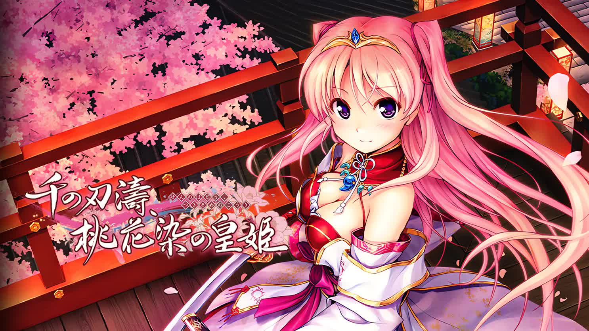

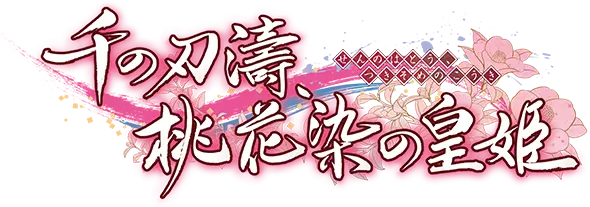

<p class="text-center">
  <span>花謝，花飛 </span><br>
  <span>散落，飄去</span><br>
  <span>桃色的花瓣飄散零落，一片，又一片</span><br>
  <span>啊，我深愛的人兒</span><br>
  <span>你爲何還要繼續戰鬥，甚至不惜爲此起誓不再哭泣</span>
</p>

`作者：Hiyatoki`

**貫徹到歷史盡頭的忠義、跨越千年的戀歌**

——歡迎來到千の刃濤、桃花染の皇姫的安利文章

## At A Glance

| 资讯一览 | |
| :-------- | :---- |
| **开发商** | AUGUST |
| **攻略人数** | 5+4 |
| **游戏时长** | 30-40h |
| **难度** | 低 |
| **分级** | R-18 |
| **游戏引擎** | BURIKO General Interpreter |

- ***『千の刃濤、桃花染の皇姫』***是`AUGUST會社`歷代作品中唯二的嚴肅題材作品其中的一部（另一部是***『穢翼のユースティア』*** 穢翼的尤斯蒂婭）。

- 本作的藝術風格以和風為主調，但背景設定在科技發達的現代。

- 在本作中你既可以看到華麗的和風著裝、街道建築、擁有傳說般神奇力量的武士和巫女們，也能看到各式電子設備、現代熱兵器之類的現代元素。

## CG速覽


../image/Senmomo/cg_intro/cg1.webp
../image/Senmomo/cg_intro/cg2.webp
../image/Senmomo/cg_intro/cg3.webp
../image/Senmomo/cg_intro/cg4.webp


<div class="row m-1">
  <div class="col-12 col-md-6 p-1 round">
    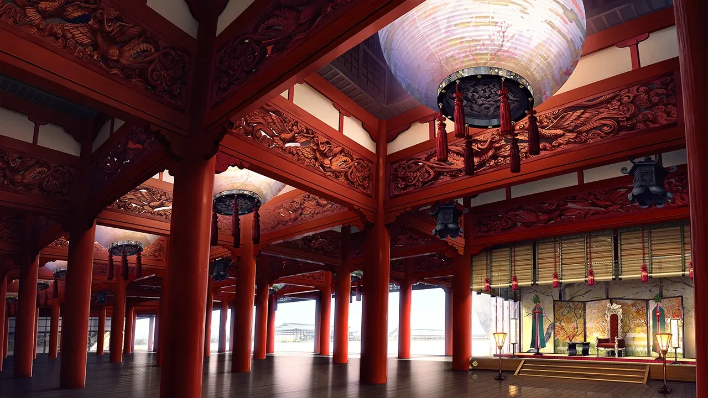
  </div>
  <div class="col-12 col-md-6 p-1 round">
    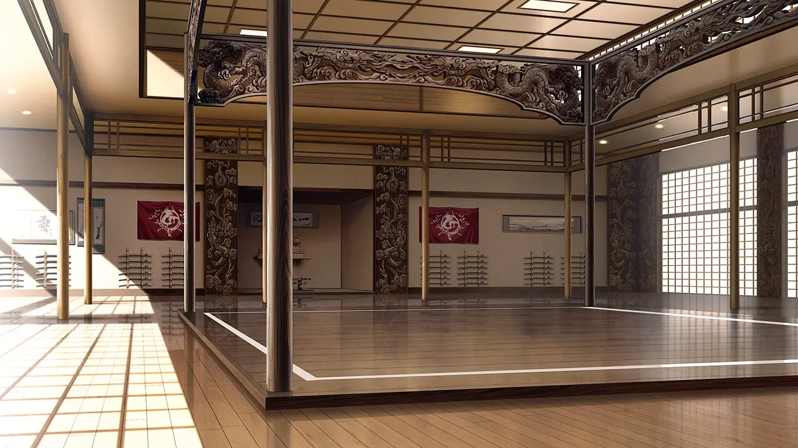
  </div>
  <div class="col-12 col-md-6 p-1 round">
    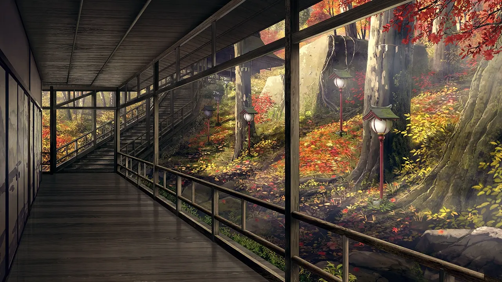
  </div>
  <div class="col-12 col-md-6 p-1 round">
    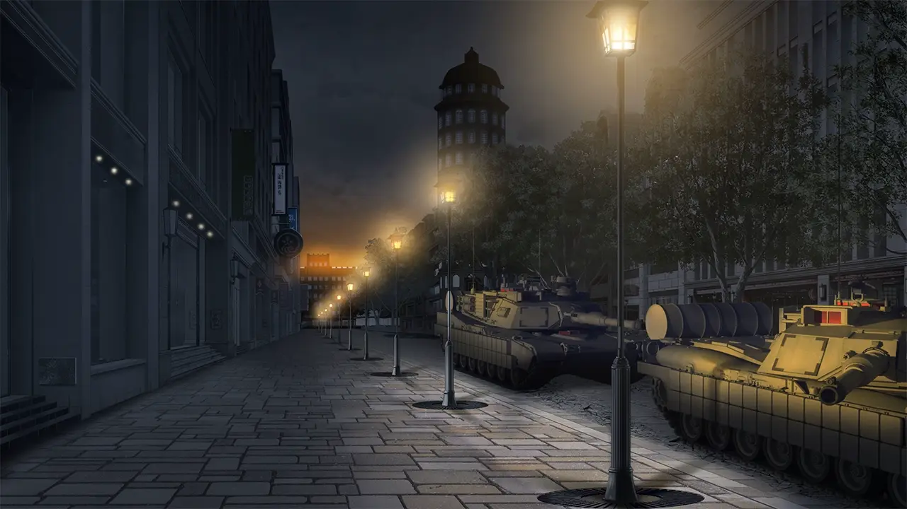
  </div>
</div>

## 故事

### 故事概要

由皇族血統統治並延續的了兩千余年的皇國，在朝夕之間落入敵夷之手，皇國人寧靜的日常被打破，並從此天翻地覆。

唯一的皇族血脈和帝位繼承人『**宮國朱璃**』被迫流離失所。

由於她在戰前一直被藏於皇宮之中，知曉其真實身份的人除了宰相**小此木**之外，包括上一任女帝，也就是她的母親『**蘇芳帝**』，都在戰亂中失去了生命。而小此木投靠了敵國，成了傀儡政府的掌權人。

只身一人的她正尋求著能助她奪回國家的力量。

為了召集全國的力量反抗敵國，戰後幸存的武人們仍在進行著地下活動。

其中一員是在戰後失去了所有記憶的武人『**鴇田宗仁**』。他一邊揮舞著千錘百煉的白刃，一邊試問着自己應該效忠的主公究竟在何方。

直到那一天，在命運的指引下，二人相遇了。

前路有怎樣的艱險等著他們，而皇國又會迎來怎樣的命運，無人知曉。

### 世界觀背景概要

故事設定在一個架空歷史的世界

***豊葦原瑞籬內皇國***（以下簡稱**皇國**）在兩千年皇家血脈的世襲制統治中，憑借**咒壁**所生成的咒術屏障，使無數侵略者無功而返。

***奧爾布萊特共和國***（以下簡稱**共和國**）是一個擁有強大軍事力量的國家。共和国以「解放壓製下的人民 」為名義的侵略戰爭，在二十余年間**已將全球半數的領土納入囊中**。

皇國歷**2173**年，皇國的咒壁機能突然中止，共和國迅速入侵並占領了皇國。

從此『天神庇佑的國家』之傳說被打破，皇國政府由共和國掌控，主權喪失，女帝駕崩，『**翡翠帝**』登基。

由宰相小此木在共和國的限製下運作皇國傀儡政府，在掌權期間血腥鎮壓了大量嘗試反抗的皇國公民。


## 主要登場人物

<sp-char name="Akari" cv="遥そら">
  <p>
    本作的真女主，皇國第一皇女。你能在她一舉一動中感受到貴族的氣質。<br>
    但她并非高嶺之花，與她邂逅后你會發現她其實是一個感情和表情都很豐富的少女。
  </p>
  <p>
    行動力強，有自己的主張，有相當的膽量和勇氣，在必要時展現出的威嚴不輸給歷史上任何一位君王。<br>
    對於武人的死板和不解人情表示應付不來。
  </p>
  <p>
    會炸毛和氣鼓鼓。
  </p>
</sp-char>
<br>
<sp-char name="Kanami" cv="猫村ゆき">
  <p>
    中階武人鴇田家的親生女兒，宗仁是其義兄。<br>
    戰後，宰相小此木以幫助其尋找義兄爲條件，讓她作爲皇國傀儡女帝【翡翠帝】登基，並指示她在各種公共場合的活動。
  </p>
  <p>
    她惹人憐愛的身姿和優雅的舉止、清爽的嗓音，讓皇國上下無不爲之傾倒，正是這樣的她安撫了皇國人戰後受傷的心靈。<br>
    有玩家形容她是“小家碧玉”，我覺得十分貼切，明明是帝王，但給人一種鄰家小妹的感覺。這一點可以在她的BGM得以一窺。
  </p>
  <p>
    三年閒每天都會以日記的形式記錄對哥哥的思念，是重度兄控（有點病嬌）。
  </p>
</sp-char>
<br>
<sp-char name="Hotori" cv="波奈束風景">
  <p>
    武人三大家族之首稻生家的獨女，是宗仁的幼馴染。在戰後由於家主稻生融下落不明，擔任起奉刀會領袖。
  </p>
  <p>
    走如清風，立如松，聲如鈡，登峰造極的劍技，無論是作爲一名武人還是一名領袖她都是無可挑剔的。<br>
    在外人面前如一位冰山美人，但在宗仁面前會變成一隻粘人的小貓咪。
  </p>
  <p>
    富有正義感，奉行對君主的忠義，性格上有些一根筋。<br>
    在戰前向宗仁告白，但是宗仁的失憶連著她的告白一起，帶走了約定好在戰後的答復。
  <p>
</sp-char>
<br>
<sp-char name="Kotone" cv="小鳥居夕花">
  <p>
    傳承了千年的巫女家族椎葉家最後的傳人，被翡翠帝任命為齋巫女，即勅神殿首席巫女。
  </p>
  <p>
    性格天真開朗又率真，有些冒失（無憂無慮 大大咧咧 咋咋呼呼）。像是會到處蹦蹦跳跳的小動物。<br>
    和她在一起你會感覺周圍的環境都被她點亮，包括你自己。<br>
    是大胃王+巨乳+蘿莉屬性。常常被食物鈎住脚尖。
  </p>
  <p>
    是想要對所有人都溫柔的博愛之人。
  </p>
</sp-char>
<br>
<sp-char name="Elsa" cv="奏雨">
  <p>
    艾爾莎·瓦倫丁<br>
    共和國總督兼共和國軍總司令 沃倫·瓦倫丁 的女兒 。<br>
    天京中央師團團長、治安負責人、主角一行人所就讀學校的學生會長。
  </p>
  <p>
    處事圓滑，性格和談吐都很溫和，受到大家的尊敬，在指揮軍隊和處理政事都游刃有餘。<br>
    主張廢除帝制實行民主主義，不贊同武人的忠義理論，不喜歡皇國的文化（除了浴場）。
  </p>
  <p>
    曾多次獲得射擊比賽的冠軍，參與共和國的武器研發。<br>
    帶有小惡魔屬性，有點抖S。
  </p>
</sp-char>
<br>
<div class="row sp-character Sojin tce0" style="--this-bg: url(../image/Senmomo/chars/Sojin/bg.webp)">
  <div class="col-12 char-overlay row" style="background-color: #ffffff87">
    <div class="pc-right col-12 col-md-8 ml-auto">
      <div class="namearea col-12 pt-2 px-2">
        <div class="nameblock">
          <div class="namepic" style="background-image: url(../image/Senmomo/chars/Sojin/name.webp)">
          </div>
          <div class="yomi font-italic">
            CV：春野風
          </div>
        </div>
        <hr class="my-2" />
      </div>
      <div class="infoarea col-12 px-2">
        <p>
          本作男主。
          在精神和身體上都十分幹練的武人，劍術高超，擔任稻生家道館的教練。<br>
          但從戰爭的重傷恢復後，家人和記憶都不知所蹤，劍技也大不如從前。<br>
        <p>
          戰時出於未知目的趕往皇宮解救宮國朱璃，但後來對此一無所知。<br>
          與朱璃相遇後，即使他毫無印象，但他身體裏的聲音告訴他，<br>
          要保護這個女孩，她就是你爲之效忠的主公。
        </p>
        <p>
          筆者PS：本作是有男主配音的，雖説確實符合一位孔武有力的戰士，但是有點過於有精神我就把它關了，，，</p>
      </div>
    </div>
  </div>
</div>

### 一些設定

#### 武人

- 繼承了太祖之血，擁有驚人身體素質的皇國人。武人由血脈相承，身上會出現象征著武人血統和力量來源的咒紋，但出現刻印的大都為男性，鮮有出現女性武人。

- 武人能一躍十余米，擁有極快的反應速度和移動速度，刀切子彈是小菜一碟，搭配**咒裝刀**能以一敵百余全副武裝的現代士兵，在戰場上令人聞風喪膽。

- 盡管如此，武人還是算步戰單位，戰時武人聚集地「武人街」被**轟炸機**偷襲，武人及其家屬共三萬余人遇難，戰後武人僅剩兩百人。

#### 咒術

- 依靠神力實現奇跡，使用時會減少壽命，所以咒術使用者多為年輕女性，即**巫女**。
經過訓練的巫女可以使用各種各樣效果的咒術，如攻擊咒術和治愈咒術。
- 咒裝具，由巫女使用咒術為其附魔而得的用具。
  - **咒裝刀**是其中的一種。咒裝刀可以強化使用者的身體能力，對攻擊附加各種效果，或有特殊技能。咒裝刀戰前有約兩千振，戰後悉數被共和國沒收。
  - 咒裝刀通過咒紋輸送力量，所以只有武人才能操作。
- 咒壁，以巖壁為載體的巨型咒裝具，其生成的屏障在皇國歷史的兩千年中保護其不受外敵入侵,由皇祖緋彌之命主持建造。


## 路綫圖

點擊查看前後章節👇

<div class="route-map">
  <x-row>
      <x-col src="../image/Senmomo/route/r1.webp"/>
      <x-col src="../image/Senmomo/route/r2.webp"/>
      <x-col src="../image/Senmomo/route/r3.webp"/>
      <x-col src="../image/Senmomo/route/r4.webp"/>
      <x-col src="../image/Senmomo/route/r5.webp"/>
      <x-col src="../image/Senmomo/route/r6.webp"/>
  </x-row>
  <p> JavaScript 錯誤，無法顯示路線圖</p>
</div>
<br>

- 本作的綫路結構和穢翼一樣是梯狀結構，由於加重了真女主綫的筆墨，致使其他角色的劇情線內容略顯單薄。
- 本作的核心劇情從第四章開始，如果想體驗本作的深層故事，請務必在推完自己喜歡的角色后玩到第四章『**邯鄲之夢**』。

## CG鑒賞

### 場景背景

<div class="row m-1">
  <div class="col-12 col-md-6 p-1 round">
    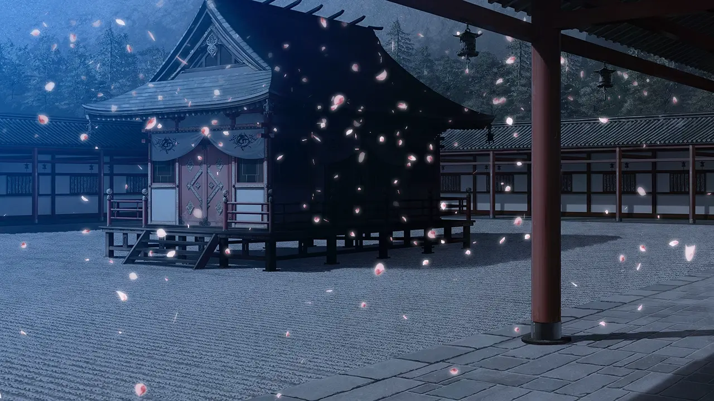
  </div>
  <div class="col-12 col-md-6 p-1 round">
    
  </div>
  <div class="col-12 col-md-6 p-1 round">
    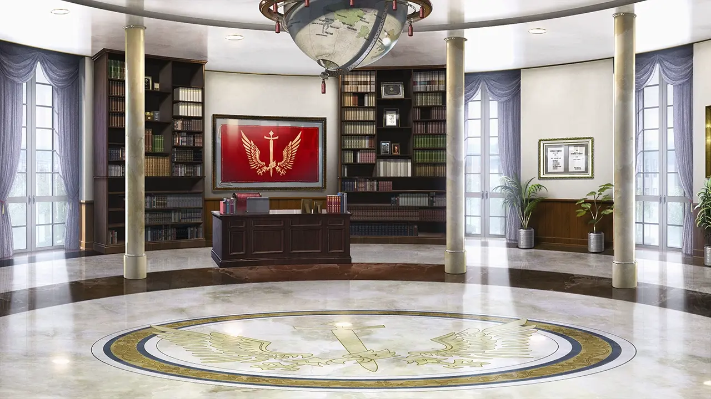
  </div>
  <div class="col-12 col-md-6 p-1 round">
    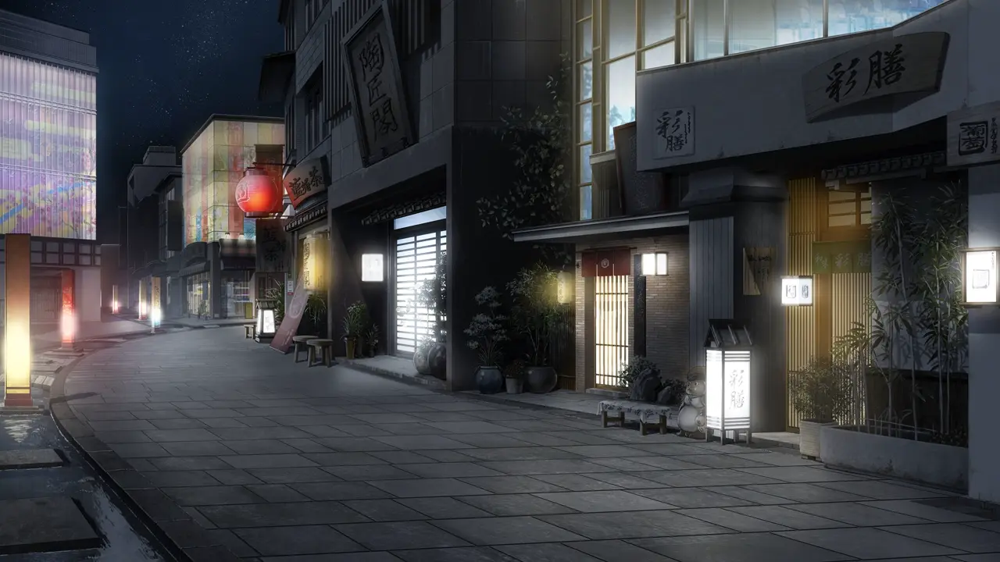
  </div>
  <div class="col-12 col-md-6 p-1 round">
    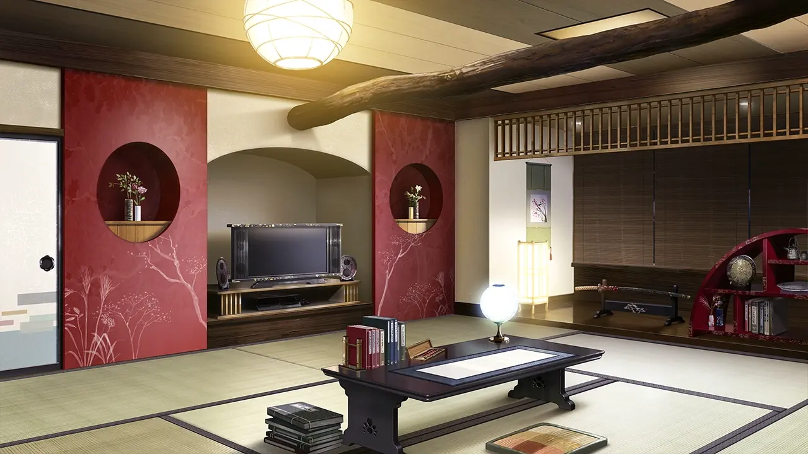
  </div>
  <div class="col-12 col-md-6 p-1 round">
    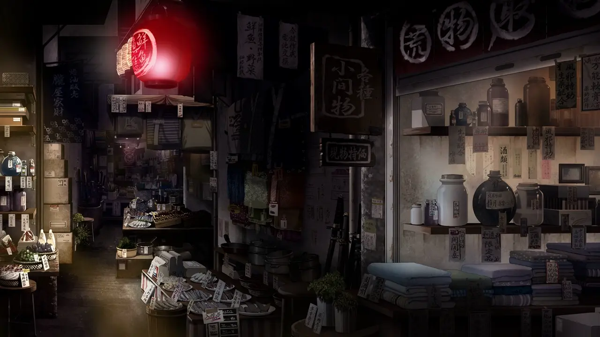
  </div>
  <div class="col-12 col-md-6 p-1 round">
    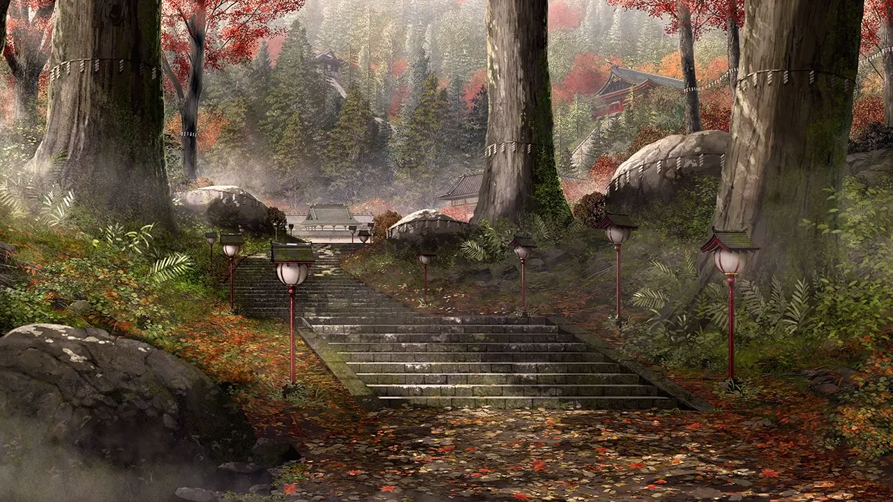
  </div>
  <div class="col-12 col-md-6 p-1 round">
    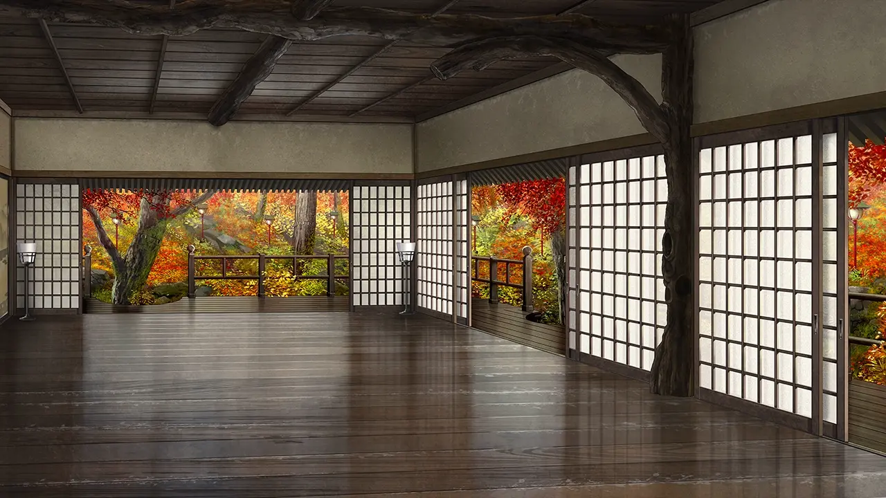
  </div>
</div>

### 游戲中CG


../image/Senmomo/cg/r1.webp
../image/Senmomo/cg/r2.webp
../image/Senmomo/cg/r3.webp
../image/Senmomo/cg/r4.webp

<br>

../image/Senmomo/cg/a1.webp
../image/Senmomo/cg/a2.webp
../image/Senmomo/cg/a3.webp

<br>

../image/Senmomo/cg/m1.webp
../image/Senmomo/cg/m2.webp
../image/Senmomo/cg/m3.webp
../image/Senmomo/cg/m4.webp


### R-18 CG


../image/Senmomo/cg/hcg/h1.webp
../image/Senmomo/cg/hcg/h2.webp
../image/Senmomo/cg/hcg/h3.webp
../image/Senmomo/cg/hcg/h4.webp
../image/Senmomo/cg/hcg/h5.webp


<br>

### 游戲中現代兵器鑒賞


本作中出現的現代兵器都是現實中存在的，但幾乎沒有對外形作任何改動，所以甚至能辨認出具體型號。


<div class="row m-1">
  <div class="col-12 col-md-6 p-1 round">
    
    <p>
      Heckler & Koch G36 5.56×45mm 突擊步槍<br>
      該槍為德國聯邦國防軍自1997年以來的標準服役步槍，2022年將由 HK416A8 取代。<br>
      圖中為短槍管的K(Kurz)型號 G36K
    </p>

  </div>
  <div class="col-12 col-md-6 p-1 round">
    
    <p>
      同樣是來自德國 HK 公司的MP5衝鋒槍<br>
      圖中為自帶握把的 MP5K 型號
    </p>
  </div>
  <div class="col-12 col-md-6 p-1 round">
    
    <p>
      來自奧地利的 Glock 17 9x19mm 半自動手槍
    </p>
  </div>
  <div class="col-12 col-md-6 p-1 round">
    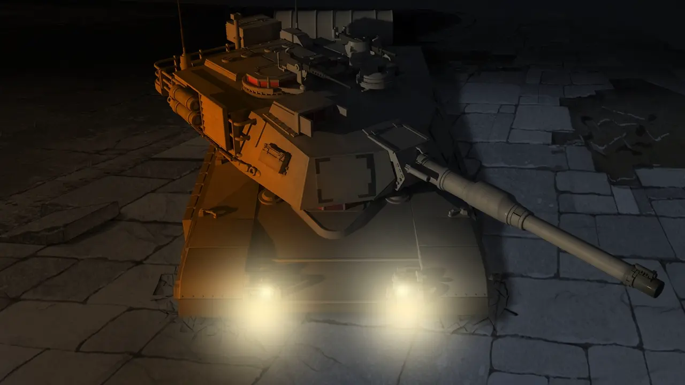
    <p>
      美軍 M1A2 主戰坦克
    </p>
  </div>
  <div class="col-12 col-md-6 p-1 round">
    
    <p>
      AH-1F Cobra 武裝直升機
    </p>
  </div>
  <div class="col-12 col-md-6 p-1 round">
    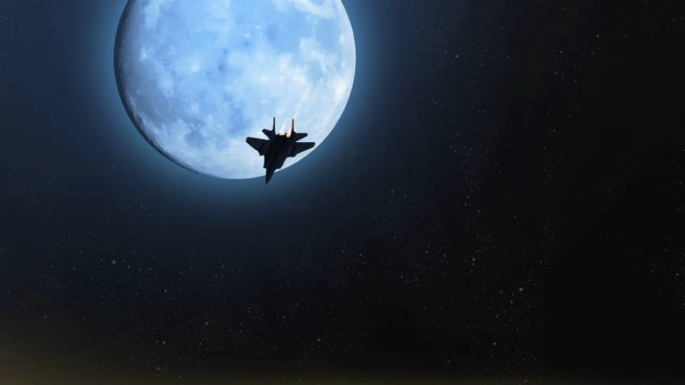
    <p>
      F-15E Strike Eagle 戰鬥機
    </p>
  </div>
</div>

## 遊戲 OP

<video controls preload="metadata" width='100%' poster="../image/Senmomo/cover.webp">
  <source src="https://s3static-zone0.galgamer.eu.org/video-2d35/senmomo/op.mp4" type="video/mp4" />
  <p> To view this video please enable JavaScript</p>
</video>

## 音樂鑒賞

我玩過的另一部和風作品是千戀萬花，同樣是現代背景的和風游戲，這兩部作品的粉絲群體之間也誕生出不少梗。從音樂方面來説，千戀萬花的音樂偏向流行和搖滾，皇姬的音樂則是加了甲方很喜歡的大氣弦樂（本人不是專業的，只是業餘見解），以下是我挑選的幾首，請聼聼看。

---
<div id="player0"></div>
<p>
  這一首是翡翠帝的出場BGM，上文所提的“小家碧玉”也許在其中能得以體現。
</p>

---

<div id="player1"></div>
<p>
  古杜音的出場BGM，稍顯活潑的風格。
</p>

---

<div id="player2"></div>
<p>
  Title界面BGM，恢弘大氣。
</p>

---

<div id="player3"></div>
<p>
『邯鄲之夢』追憶篇的BGM，箏聲、笛聲、鼓聲，聲聲入人心。
</p>

---

<div id="player4"></div>
<p>
  本作ED，這首是其他女主角的結局ED，真女主另有特殊ED。
</p>

---

<div id="player5"></div>
<p>
  本作 Fan Disc 花あかり 的ED。<br>
  跨越千年的戀歌就此劃上休止符，交由後人繼續編織悠遠的物語。
</p>

---

歌詞版本請移步本站曲庫：[點擊前往](/music)

## 點評

本作的音樂和美術都相當精緻，强大的美工和作曲給玩家構建了一個令人神往而又充滿危機的幻想世界，跟隨著主角們的脚步，體會角色感情的觸動，一起決定皇國的未來。

本人的Galgame閲歷并不是很深，我知道這部作品雖説是嚴肅題材，但是還是屬於萌拔作品。五位女主每位均有四個H場景，可能有人留意我在資訊欄裏寫攻略人數為“5+4”，是因爲還有四位次要女主角的H場景是放在余談裏的。本作的Fan Disc『**千の刃濤、桃花染の皇姫 花あかり**』更是加到12位女主角，有立繪的都能上（男主屬於是打樁機了）。

在劇情上有些細節在後來看來是經不起推敲的，不過本作劇情仍然能算萌拔中比較好的。劇情結構在路綫圖部分已經説明，這裏不再贅述。

總的來説本作有一條明綫一條暗綫，明綫就是主角們召集力量推翻共和國的統治，重新建立國家。但是很可惜在這方面沒有安排像樣的劇情，明明可以做成政治手腕間的明爭暗鬥，但實際上各方勢力的較量就和過家家一樣。

暗綫是一曲跨越兩千年的戀歌，也就是真女主綫的内容。至於兩千年謂何，戀歌謂何，玩家們請自行去游戲中尋找答案吧。

聽聞傳言本作其實八月社打算做成名副其實的史詩，但由於預算等各種原因在篇幅上進行了刪減。

誠然，在滿城桃花雨那一幕，我還是有所動容，如果故事在這一幕結束，那將成爲和穢翼一樣的悲情結局。

如果你對劇情的要求和品味比較高，那麽這部作品可能會讓你有些失望。但是本作有大量的特效演出和絕贊的CG和音樂，在視聽方面一定會讓你滿意。

感謝看到這裏的你，希望本篇文章能夠幫助你決定要不要玩這款游戲。


### 个人评分 

| 项目           |  得分    |
| :---------------- | :--- |
| **人设**          | 7   |
| **cg**       | 10  |
| **立繪**       | 9  |
| **音乐** | 9   |
| **声优表现** | 8   |
| **剧情**          | 7   |
| **综合**          | 7.5  |

## 游戲版本介紹

| | **初回限定版** | **初回限定版** | **通常版** |
| :----------------- | :-------------------- |:------------------ |:---------------------|
| **年份** | 2016 | 2017 | 2016 |
| **語言** | 日語 | 英語 | 日語 |
| **平臺？** | PC | **PS4** | PC |
| **有漢化？** | 有 | 無 | 有 |
| **全人物語音？** | 有 | 我不知道 | 有 |
| **分辨率** | 1280x720 | 1920x1080 | 1280x720 |
| **推薦？** | 推薦 | | 推薦 |

[點擊此處以查看詳情](https://august-soft.com/hatou/products.html)

一般玩家能接觸到的應該是彌生月漢化組的漢化版，也建議普通玩家游玩這個版本。

聽聞官方中文版將由[Hikari Field](https://store.hikarifield.co.jp/)代理發行。具體消息暫未公佈。

## 還在猶豫是否下載？來看看游玩錄屏吧

<video controls preload="metadata" width='100%' poster="../image/Senmomo/cover.webp">
  <source src="https://s3static-zone0.galgamer.eu.org/video-2d35/senmomo/senmomo.mp4" type="video/mp4" />
  <p> To view this video please enable JavaScript</p>
</video>

## 資源和下載

- 運行原版可能需要` Locale Emulator `進行轉區

千の刃濤、桃花染の皇姫**初回限定版**的磁力鏈接，第二個爲備用

```
magnet:?xt=urn:btih:f17f8e66477496e6f71e5797f6a0ef2d1cd41a59
magnet:?xt=urn:btih:093e191308a74eb52ef314d75e745358ec1be620
```

Fan Disc 『**千の刃濤、桃花染の皇姫 花あかり**』 的磁力鏈接

```
magnet:?xt=urn:btih:406fa9b40857064f5b1c35395ae017ad733a3eb9
```
---

以上兩者的漢化補丁:
<p>
  
</p>

<!-- //以下都是代碼 -->



<div class="gengapiece">
  <a class="fancybox fancybox.image" href={`../image/Senmomo/chars/${name}/gga${no}.webp`} itemscope=""
    itemtype="http://schema.org/ImageObject" itemprop="url" data-fancybox="default" rel="default" one-link-mark="yes">
    </img>
  </a>
</div>





<div>
  <style>
    {
      ` .${name}.tce0 .char-overlay {
        --right-bg: url(../image/Senmomo/chars/${name}/tce1.webp);
      }

      .${name}.tce1 .char-overlay {
        --right-bg: url(../image/Senmomo/chars/${name}/tce2.webp);
      }
    
      .${name}.tce2 .char-overlay {
        --right-bg: url(../image/Senmomo/chars/${name}/tce3.webp);
      }
    
      `
    }
  </style>

  <div class={`row sp-character ${name} tce0`} style={`--this-bg: url(../image/Senmomo/chars/${name}/bg.webp)`}>
    <div class="col-12 char-overlay row">
      <div class="pc-right col-12 col-md-8 ml-auto">
        <div class="namearea col-12 pt-2 px-2">
          <div class="nameblock">
            <div class="namepic" style={`background-image: url(../image/Senmomo/chars/${name}/name.webp);`}>
            </div>
            <div class="yomi font-italic">
              CV：{cv}
            </div>
          </div>
          <div class="illublock">
            <div class="gengablock">
              <gga-piece name={name} no="1"></gga-piece>
              <gga-piece name={name} no="2"></gga-piece>
              <gga-piece name={name} no="3"></gga-piece>
              <gga-piece name={name} no="4"></gga-piece>
              <gga-piece name={name} no="5"></gga-piece>
            </div>
            <div class="swarea">
              <div class="yomi font-italic">
                切換立繪：
              </div>
              <div class="btarea">
                <div class="bt0 tcebt">
                </div>
                <div class="bt1 tcebt">
                </div>
                <div class="bt2 tcebt">
                </div>
              </div>
            </div>
          </div>
          <hr class="my-2" />
        </div>
        <div class="infoarea col-12 px-2" html={html}>
        </div>
      </div>
    </div>
  </div>

  <script>
    tachieSwitch({`"${name}"`});
  </script>

</div>



<style>
  .ar16x9 {
    aspect-ratio: 16/9;
  }

  .btarea {
    display: flex;
    justify-content: flex-end;
    flex-wrap: wrap;
  }

  .Sojin.tce0 .char-overlay {
    --right-bg: url(../image/Senmomo/chars/Sojin/tce0.webp);
  }

  .tcebt {
    background-color: transparent;
    background-image: url(../image/Senmomo/bt.png);
    width: 18px;
    height: 18px;
    margin: 0 4px;
    cursor: pointer;
  }

  .nameblock,
  .gengablock {
    display: flex;
    justify-content: space-between;
    flex-wrap: wrap;
  }

  .swarea {
    align-self: flex-end;
    margin-left: auto;
  }

  .illublock {
    display: flex;
    justify-content: space-between;
    flex-wrap: wrap
  }

  .gengapiece {
    margin: 4px 4px;
  }

  .namepic {
    background-color: transparent;
    background-repeat: no-repeat;
    height: 68px;
    width: 330px;
  }
</style>

<script>
  function tachieSwitch(charName) {
    let char = document.querySelector(".sp-character." + charName);
    let bts = new Array();
    for (var i = 0; i < 3; i++) {
      (
        function () {
          var temp = i;
          bts[temp] = document.querySelector(".sp-character." + charName + " .bt" + String(temp));
          bts[temp].addEventListener('click', function () {
            if (!(char.classList.contains("tce" + String(temp)))) {
              char.classList.remove(char.classList.item(3));
              char.classList.add("tce" + String(temp));
            }
          }
          );
        })();
    }
  }

</script>

<script>
  //document.documentElement.setAttribute('data-user-color-scheme', 'dark');
  document.addEventListener("DOMContentLoaded", function () {
    let pcrights = document.querySelectorAll('.pc-right');
    pcrights.forEach((el) => {
      el.addEventListener('touchstart', function () {
        el.classList.add('touch');
      })
      el.addEventListener('touchend', function () {
        el.classList.remove('touch');
      })
    });
    setTimeout(() => document.documentElement.setAttribute('data-user-color-scheme', 'light'), 500);
    setTimeout(function () {
      document.documentElement.style.setProperty('--delayed-opacity', 1);
    }, 2000);
  })
</script>

<style>
  /* 调整页面的 CSS */
  body {
    /* 设置页面的背景图片为 --bg-url */
    background: var(--bg-url) no-repeat fixed center;
    background-size: cover;
  }


  #banner {
    /* 去除页面顶部标题区域的那一团粉红色 */
    background: url('') !important;
    background-color: transparent !important;
  }

  .full-bg-img>.mask {
    /* 去除页面顶部标题区域的淡黑色半透明层 */
    background-color: rgba(0, 0, 0, 0) !important;
  }

  #toc {
    /* 设置目录区域的底板背景颜色为 --board-bg-color */
    background-color: var(--board-bg-color);
    padding: 20px 10px 20px 20px;
    border-radius: 10px;
  }

  #board {
    /* 设置文章正文区域的背景半透明模糊级别为 5px */
    backdrop-filter: blur(5px);
    -webkit-backdrop-filter: blur(5px);
  }

  .page-header {
    /* 设置文章标题文字区域的淡黑色半透明底板 */
    background-color: rgba(0, 0, 0, 0.5);
    padding: 3px;
    border-radius: 5px;
  }

  /* 分别设置亮色和暗色模式下的背景图片和正文底板颜色 */
  :root {
    --board-bg-color: rgba(255, 255, 255, 0.85);
    --bg-url: url('../image/Senmomo/momo.webp');
    --delayed-opacity: 0;
  }

  [data-user-color-scheme='dark'] {
    --board-bg-color: rgba(0, 0, 0, 0.8);
    --bg-url: url('../image/Senmomo/momo.webp')
  }

  .page-header .mt-1 span.post-meta {
    /* 因爲加了很多代碼，所以字數很膨脹，隱藏嚇人的字數統計 */
    display: none;
  }

  #carousel-cover {
    aspect-ratio: 100/71;
  }

  /* show later */
  .page-header,
  #board,
  .scroll-down-bar,
  #toc {
    opacity: var(--delayed-opacity);
    transition: opacity 0.3s;
  }
</style>

<style>
  .charname {
    font-size: 150%;
  }

  .namearea hr {
    margin: 1.5rem 0;
  }

  .sp-character img,
  .img-shade {
    filter: drop-shadow(0 0 6px #000c);
  }

  .infoarea,
  .swarea,
  .yomi{
    color: black;
    text-shadow: 0 0 3px white ;
  }

  .sp-character {
    border-radius: 20px;
    overflow: hidden;
    box-shadow: 0 5px 11px 0 rgb(0 0 0 / 18%), 0 4px 15px 0 rgb(0 0 0 / 15%);

    /* -webkit-backdrop-filter: blur(1px);
    backdrop-filter: blur(1px);
    
    background-color: var(--chara-card-color); */
    
    background-color: transparent;
    background-image: var(--this-bg);
    background-position: center;
    background-repeat: no-repeat;
    background-size: cover;

  }

  .sp-character .char-overlay {
    background-color: var(--chara-card-color);
    min-height: 400px;
    background-image: var(--right-bg);
    background-repeat: no-repeat;
    background-position: top 0 left calc(100% * 0.2 - 120px);
    background-size: 325px;

    margin: 0;
    padding: 0;
  }

  :root {
    /* 配色 */
    --chara-card-color: transparent;
  }

  [data-user-color-scheme='dark'] {
    --chara-card-color: transparent;
  }

  @media screen and (max-width: 767px) {
    .namearea hr {
      margin: 1rem 0;
    }

    .pc-right {
      -webkit-backdrop-filter: blur(3px);
      backdrop-filter: blur(3px);
    
      background: var(--chara-card-color);
      transition: opacity 0.3s;
    }
    
    .infoarea ,
    .swarea,
    .yomi{

    color: black;

    -webkit-user-select: none;

    -moz-user-select: none;
    
    -o-user-select: none;
    
    user-select: none;

    text-shadow: 0 0 3px white ;
    }

    .pc-right.touch {
      opacity: 0.05;
    }
    
    .sp-character {
      /*background: unset;*/
      /*-webkit-backdrop-filter: unset;
    backdrop-filter: unset;*/
    }
    
    .sp-character .char-overlay {
      min-height: unset;
      background-size: 320px;
      background-position: top 0px left 0px;
    }
    
    :root {
      /* 配色 */
      --chara-card-color: transparent;
    }
    
    [data-user-color-scheme='dark'] {
      --chara-card-color: transparent;
    }
  }
</style>