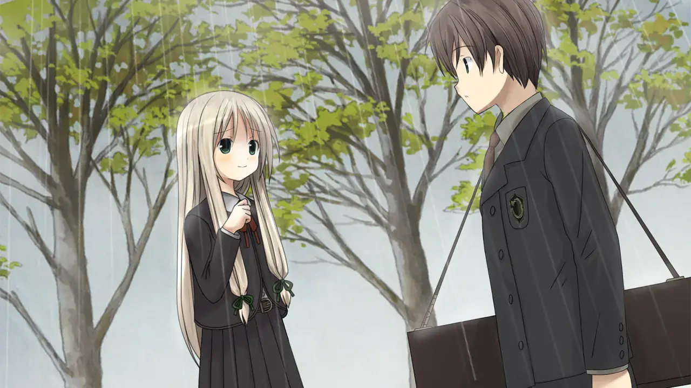

`作者：ling`

| 资讯一览     |                     |
| :----------- | :------------------ |
| **开放商**   | 工画堂黑猫组      |
| **可攻略人数** | 4                 |
| **游戏时长** | 20 - 30H             |
| **类型**     |  剧情 音游 |
| **难度**     | 有手就行             |
| **分級**     | 全年龄              |

## 作品简介

同年生的男孩与双胞胎的女孩们,因为住得很近的关系,彼此家人之间很自然地也有来往。
男孩偶尔展现**符德鲁琴**(虚构的，不用在意，是乐器就对了)的才华,而双胞胎的妹妹则有歌唱方面的才华。
姐姐却没有任何的才华。
所以双方的家人一直认为，妹妹比较适合男孩。但不知从何时起，男孩与双胞胎的姐姐交往了，只有孩子们之间认为这是理所当然的事情。
有才华的两人为了实现梦想打算去**音乐之城-琵欧伯**，**在琵欧伯音乐学院**中学习，剩下的一人,留在出生长大的小城市追求她自己的梦想。
维系这对恋人的是一周一次的信，这是面对克服不了距离的。
这三人便是你**库里斯·霍尔顿**，姐姐**雅琍耶妲·费瑞**和妹妹**朵鲁蒂尼妲·费瑞**。

**音乐之城-琵欧伯**，也被称为雨城，曾经有过一直下雨的记录。
现在踏入了这座城市，也下着延绵不断的雨，但这个城市里没人撑伞，似乎大家都习惯了的这里。
在这里落脚的时候遇到了一位自称为**音乐的妖精**的**芙铃**，即便它似乎有点奇怪奇怪，但你直接接受了它的存在，它也缓解了**你**与**雅琍耶妲·费瑞**的距离上所带来了孤独。

转眼已经俩年了，如果能够顺利毕业，就能够回到故乡与**雅琍耶妲·费瑞**重逢了。
想从这个学校毕业，要在演奏厅举行发表会，演奏自创的歌曲，并且还要有歌声合奏，需要有搭档。
不能今年毕业的话就要多呆一年，在最后的俩个月里，要找到合适的人选一起合奏才行。

天空一如既往的下着雨...

## 主要登场人物

<!--- 最外層的圓角卡片 -->
  

  <!--- 和最外層圓角卡片一樣大的 div，目的是能夠將人物立繪以背景圖片的形式設置 -->
    

    <!--- 展示人物信息的 div，靠右，在 PC 上佔 8 寬度，餘下的 4 寬度顯示上層的人物立繪 -->
    <!-- 手機上佔據全部的 12 寬度，並且設置背景模糊，使得上層人物立繪隱約可見 -->
      

        

        芙铃
        

        

          CV：笠原弘子
        

        

      

      

      
自称为音乐妖精，在这座城市落脚后房间里出现的神秘妖精，会凭空出现和消失，并且只有你能看到。

      
虽然很奇怪，但是它的存在一开始就被你直接接受了。

      
由于是音乐妖精，会定期拜托进行合奏，她负责歌唱，有着天使的声音的评价。

      
在生活方面会提醒你一些细节，总之非常可爱！

      

    

  

 

  

    

      

        

          朵鲁蒂尼妲·费瑞
        

        

          CV：中原麻衣
        

        

      

      

        
你的青梅竹马，雅琍耶妲的妹妹，有着歌唱方面的天赋，和你一起前往在琵欧伯音乐学院进行学习。

        
会很贴心的关心你，并且为了你，她是你最后可用的候补人员。

      

    

  

 

  

    

      

        

          雅琍耶妲·费瑞
        

        

          CV：中原麻衣
        

        

      

      

        
你的青梅竹马也是你的恋人，朵鲁蒂尼妲的姐姐，独自一人留在故乡。

        
由于距离遥远，只能与你进行书信来往，而互相的信件送达需要一周。

      

    

  

## 游戏 OP



## 简评(无剧透)

----

有坏女人和坏男人，当心啊!!!!!!!!!!!

---

### 剧情

剧情方面是三部分组成

在第一部分，是进行分别邀请三位女生参加毕业演奏的三条线，推荐顺序为：**黎瑟西雅·帢萨里利**(**黎瑟**) -> **法珞希黛·佛瑟多**(**法珞**) -> **朵鲁蒂尼妲**·费瑞(**朵鲁妲**)
**黎瑟**和**法珞**的顺序可以调换，从剧情考虑，建议还是先不要**法珞**，**朵鲁妲**必须是第三个，并且**朵鲁妲**的俩个结局必须全过了(具体是在12月18日，并且建议先选**还不知道**)，理由是和第二部分挂钩

第二部分是从第一部分中的**朵鲁妲**线路中以**朵鲁妲**的视角展开的，会透露很多主角不清楚的事情，也是最重要的部分，具体不透露，需要先过了三人的路线，重新开始的时候有**a fine**选项，进行这部分

第三部分的内容是**芙铃**，具体不透露，如果第二部分会伤到你，那么这部分可以治愈你，由打通第二部分而附加的选项进入该部分

有刀子也有糖，篇幅不算长，剧情内容相对简单，有些设定不难猜出来，个人感觉挺不错的，很推荐玩。

### 画风 & 声优

本作的原版是2004的，但是在2017有重制版，画风挺好的，虽然没有绚丽的cg，个人挺喜欢这作画风。

声优这方面，中原麻衣这位可能知名一点，具体我8懂，没缺点就对了。

### 音乐

音乐这方面尤为出众，角色曲歌词和角色的剧情关联度极高，关键还很好听，具体你听了就知道了！

### 音游部分

关于难度总的来说有手就行啊，最难也就30key，同时最多按俩个key，人有一双手十根手指，正常也就finger0工作，finger1也工作很少见，你说是不是有手就行。
值得一提，毕业演奏的结果关系到结局，如果没有手请在设置中调低难度或者直接开启自动演奏。

---

在我搓js之前，其实我也就玩了一条线，玩完后感觉花时间搓js是值得的！
主要内容都在第二部分，剧情虽然篇幅不长，但完成度已经让我满意了
最后的结局是happy end，糖在最后面，请一定要推完，虽然是全年龄，也是有那么一两行文字有涉及h那方面的，色批们快玩！

### 个人评分  

| 项目           |  得分    |
| :---------------- | :--- |
| **人设**          | 9.5   |
| **cg&立绘**       | 8  |
| **音乐&声优**     | +∞  |
| **剧情**          | 8    |
| **综合**          | +∞  |

## 游戏 CG

 

## 还在犹豫是否下载？

<video controls preload="metadata" width='100%' poster="../image/Symphonic_Rain/movie.webp">
    <source src="https://s3static.galgamer.eu.org/video-2d35/symphonicrain/sr.mp4" type="video/mp4">
</video>

## 资源和下载

Steam链接



dlsite链接

<https://www.dlsite.com/soft/work/=/product_id/VJ011520.html/>

## 写在最后

我们对其音游系统试图复刻，搓了一个web版本的，由于不是很懂这些，可能很拉跨...
<a href="https://github.com/sena-himeno/renaissance" >这是github的链接</a>
<a href="" >这里是传送门</a>

