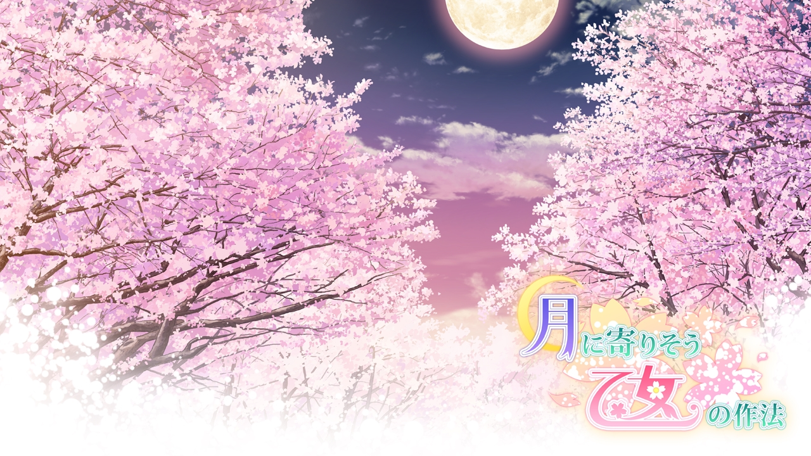
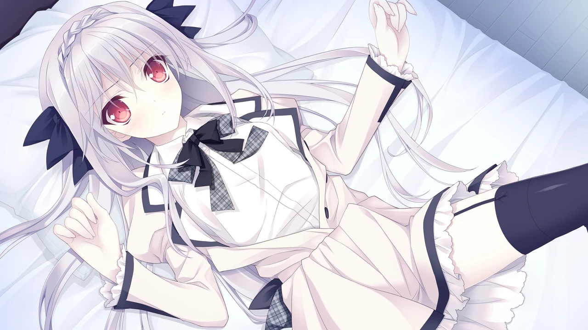
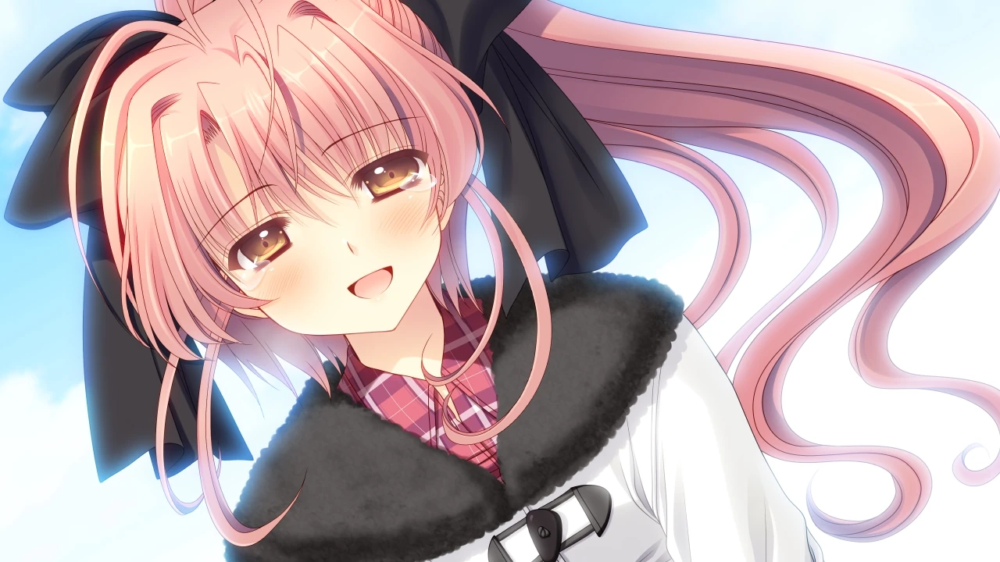
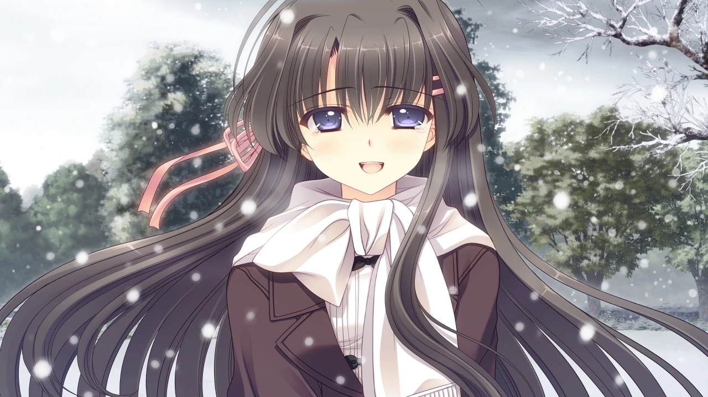
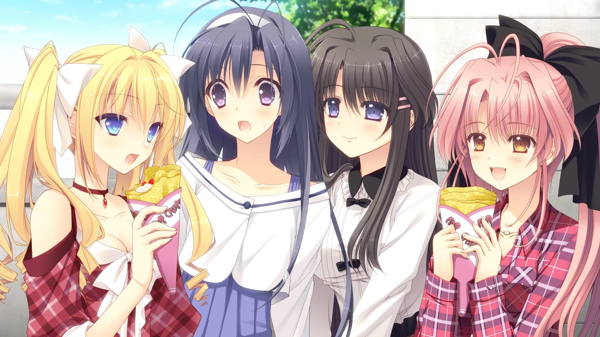
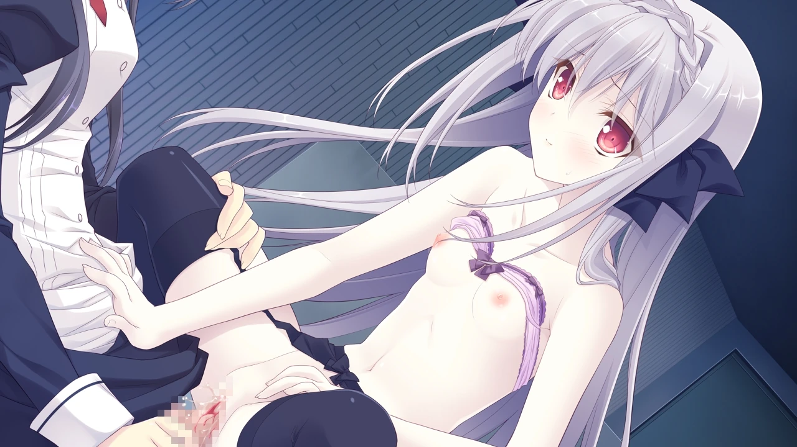
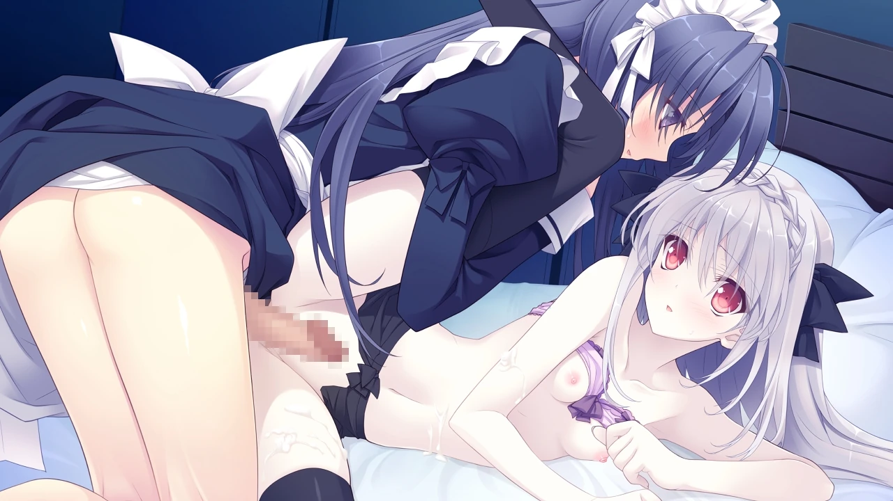
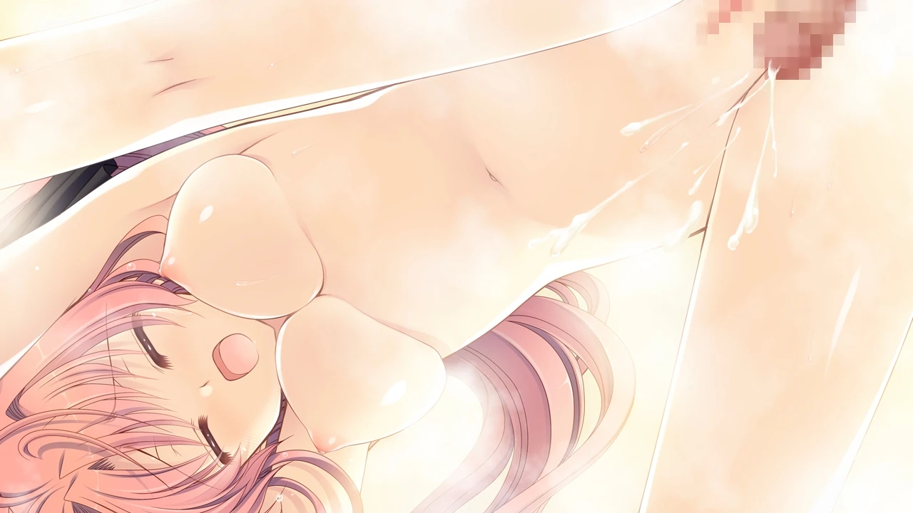
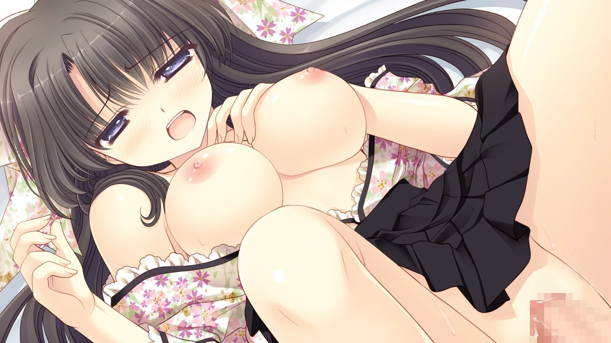

`作者：SacalWiki`

跨过阴郁的过去，迎接闪闪发光的未来吧

| 資訊一覽     |                 |
| :----------- | :------------------------------------ |
| **開發商**   | Navel |
| **攻略人數** | 4         |
| **遊戲時長** | 15-25h        |
| **類型**     | 恋爱冒险       |
| **難度**     | 中 |
| **分級**     | R-18      |
| **遊戲引擎**   |     QLIE       |

## 故事

 大藏游星，是大藏家老爷的情人的儿子，
 在家里受尽排挤，被正妻驱逐到法国的酒庄从事繁重的体力劳动，
 一年后，体弱多病的母亲撒手人寰，他一时万念俱灰，
 这时他邂逅了著名服装设计师让·皮埃尔·史丹利，
 后者帮游星重新燃起了对生活的热情，
 二人道别时，大哥--大藏衣远出现，将他带到日本。

 四年过去，尽管游星以史丹利为目标不断努力着，
 但他的才能还是没有得到哥哥的认可。
 这天他赋闲在家，从妹妹--大藏里想奈那里得知，
 史丹利在日本开了一所服装设计专门学校，但是只收女生，
 在妹妹的鼓励下，他决心女装就读这所学校以追逐服装设计的梦想，
 妹妹给出的方案是，让他去作为女仆入学。
 游星化名为「小仓朝日」，顺利通过了樱公馆的女仆面试，
 就这样，朝日娘的女校生活拉开帷幕~

## 登场人物



  

    

      

        

          {name}
        

        

          {yomi}
        

        

      

      

      
  
    

  
  



<sp-character no=0 name="小仓朝日" yomi="kokura asahi" uid="asahi">
  

    本作男主，作为樱小路露娜的女仆入学， 
    在压抑的环境里长大，但为人开朗，性格认真，勤劳能干，还是个天然呆。
  

  

    虽然学习服装设计是哥哥的命令，但是朝日娘很快喜欢上了这行。 
     
    学习和家务都很完美，深得众人信赖。
  

  

    朝日娘得到了樱公馆众人的喜爱，但是这样的女装生活能持续多久呢？
  

</sp-character>
 
<sp-character no=1 name="樱小路露娜" yomi="sakurakouji runa" uid="runa">
  

    <del>露娜sama</del>樱公馆&朝日娘的主人，说话带刺但很会照顾人。
  

  

    用自己的钱买下了樱公馆，从本家独立出来， 
    因为出众的相貌和不输本家的财力被父母嫉妒， 
    在服装设计方面有天分而且很努力。
  

  

    会在朝日娘心情低落的时候进行照顾&性骚扰。
  

</sp-character>
 
<sp-character no=2 name=花之宫瑞穗" yomi="hananomiya mizuho" uid="mizuho">
  

    黑发大和抚子，温文尔雅，面对危机时又有沉着冷静的一面。
  

  

    出生于传统的日本家庭，举止庄重，外表柔弱但也有威严的一面， 
    虽然厌恶男性，但还是在朝日娘被怪蜀黍搭讪时为其解围。 
  

  

    朝日娘单推人，毫不掩饰对朝日娘的喜爱甚至对其发动夜袭。
  

</sp-character>
 
<sp-character no=3 name="尤希尔·弗洛·让梅尔" yomi="yurusyuuru furuuru jyanmeeru" uid="yurusyuuru">
  

    金发但不傲娇的巴黎女郎，天真直率，积极乐观。
  

  

    过去曾被露娜捉弄得团团转，为了和露娜竞争而特地来日本留学， 
    受到称赞会毫不犹豫地发出愉悦的女王三段笑：哦~吼~哦~哦~ 
    在很多方面都表现出与露娜的竞争意识，多次试图挖角朝日娘。
  

</sp-character>
 
<sp-character no=4 name="柳之濑凑" yomi="yanagase minato" uid="minato">
  

    朝日娘刚来日本时认识的朋友，元气满满，热情亲切，本作少女情怀担当。
  

  

    曾经是个假小子，为暗恋对象而开始学习服装设计并努力变可爱。 
    仍然保持着发家致富前的淳朴的金钱观和价值观，没有大小姐的架子。 
    对朝日娘和里想奈倾诉了单相思之苦，澎湃的少女情怀和巨大的心脏刺激令朝日娘当场昏倒。
  

  

    那么，朝日娘和凑会如何处理这份感情呢？
  

</sp-character>
 
<sp-character no=5 name="大藏里想奈" yomi="ookura risona" uid="risona">
  

    朝日娘的妹妹，重度兄控，死宅，朝日娘的女装指导。
  

  

    哥特萝莉装爱好者，长期翘课，通过网游和炒股认识了露娜。 
    对豪门内斗和虚伪的亲戚感到厌恶，因此特别喜欢纯真的朝日娘。 
    第三人称自称，感情变化不大，提到和朝日娘有关的话题会动摇。
  

</sp-character>

## 遊戲 OP

动画来自 Steam



## 遊戲 CG

  

  

  

  

  

  

  

## H 場景

  

  

  

  

  

  

  

## 笔者给新玩家的现身说法的推荐

刚玩这作我是非常迷惑的，完全欣赏不来，
序章给人一种王子复仇记的感觉，但是男主的深仇大恨在后来的剧情里几乎没有体现，
而是画风一转，变成了青春恋爱喜剧，
我接着玩了下去，然后意外的发现，这作其实非常治愈，
男主的过去很阴郁，但他没有因此变成一个阴郁的人，他开朗乐观，还有些小沙雕，
女装后，他优秀的内在素质得到了充分的展现，得到了一众可攻略角色的认可，
但是女装总有暴露的一天，这是玩家们隐隐能感应到的刀子，
这作在这里处理的极好，信任的种子开花结果，达成美好结局。

我高一刚分完班的时候，曾经和女同桌保持着不错的关系，
然而我熬夜打游戏手冲，上课昏昏欲睡的时候，我那里硬起来了(
她看到了以为我起了邪念，开始疏远我，也把这事儿在班里讲开，
然后我名声就臭了，大部分人都开始疏远我，
不过我后来还是交到了一些不错的朋友，其中包括：
温柔且成绩拔尖的女班长，海王校草，etc
他们一开始也是和我刻意保持着距离，但是时间一长，
慢慢发现我是个挺老实的人，也就成了好友(
到了现在其实我并没有特别恨当时那个女同桌，
但是阴郁的性格却是形成了，到了几年后的现在，释怀与否，
其实就是看我自己愿不愿意放过自己，但我终究是没有放过自己，
任由无尽的梦魇在漫长的黑夜里将我性格里柔软的部分吞噬殆尽。

男主却放下了阴郁的过去，向未来迈进，
我曾经在交流群里说过，我感觉男主特别的软弱(
现在看来，放得下过去的朝日娘才是真正的强大，
我这种才是真正的小丑，各位别学我(

## 资源和下载



萊茵圖書館：

