`作者：桐羽`

EPUB 電子書魔改過程記錄

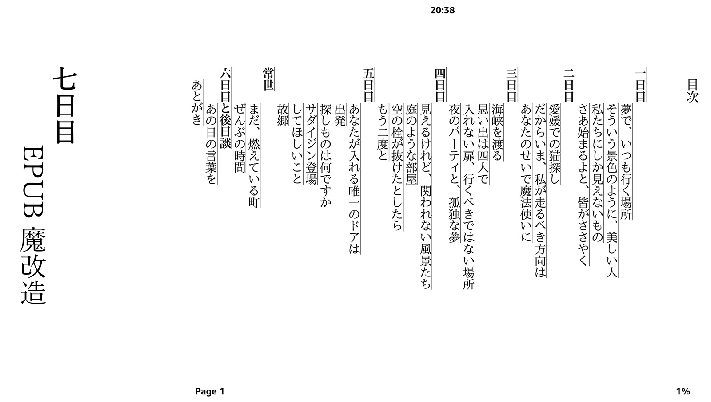

## 0. 背景

俺沒事就會看廁紙，看廁紙的歷史可以追溯到十年甚至是九年前的刀劍神域時期，當時電視動畫正在熱播並且以下省略一萬字，於是一不小心的俺就把十幾卷的刀劍神域廁紙在 Kindle 上看完了（印象中還是輕之國度的翻譯版本）。所以說閱讀廁紙也是俺諤次元活動的一大部分。

然而讀書人多少都是有點怪癖的，比如說俺在開始閱讀日文的廁紙之後，就發現如果廁紙不豎排並且裝訂右側，則不文學，比如說下面這本俺買的二手新海誠廁紙：

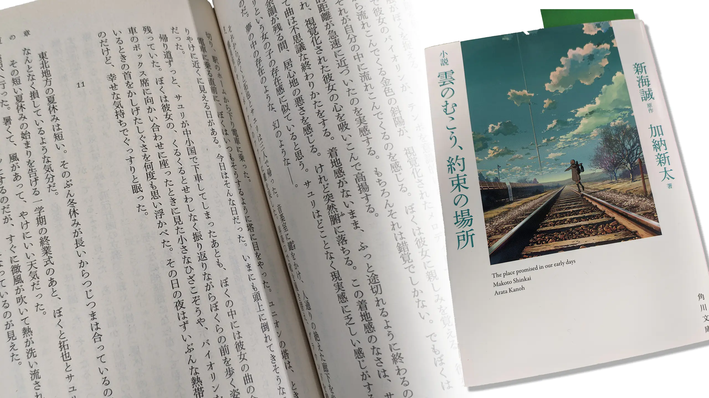

這些豎排文字看着看着就覺得自己變得文學了起來，並且若俺用神力把這本書左右拉開成一長條，那俺閱讀時候的目光就可以直接從最右邊暢通無阻地看到最左邊，舒服。

有同學可能就會問了，要是我用神力把橫排的書垂直上下拉開成一長條，不就可以一眼從上看到下了嗎？這位同學俺請你出去。

然而有一天俺看到了一本神力扯不開的書：

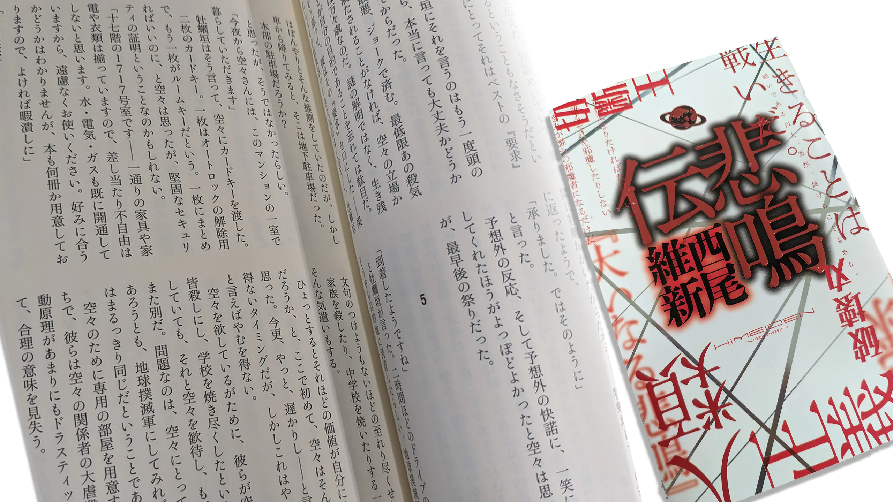

西尾維新還是太抽象了，而且這種情況不會出現在 Kindle 上，電子書纔是俺們的討論範圍。
那麼要是俺拿到了一本電子書，並且覺得不太滿意，應該怎麼處理呢？這就是本文的重點了，即如何魔改 EPUB 電子書。

## 1. 文學素養的比較

我隨便掏出兩本電子書

一本是 小説 天気の子 (角川文庫) - 新海 誠.epub


../image/note-makeEbook/tenki/00.webp
../image/note-makeEbook/tenki/01.webp
../image/note-makeEbook/tenki/02.webp

<br>

可以看到牠是豎排佈局，排版整齊，就像俺一樣文學素養很高，

另外一本是 Sword Art Online 009 Alicization Beginning - 川原礫.epub


../image/note-makeEbook/sao09/00.webp
../image/note-makeEbook/sao09/01.webp
../image/note-makeEbook/sao09/02.webp
../image/note-makeEbook/sao09/03.webp
../image/note-makeEbook/sao09/04.webp

<br>

這是一本不知道是哪裏找來的民間譯本，牠不僅封面圖片比例異常，使用橫排佈局，中英文之間還沒有空格，全部粘連在一起。

衆所周知『刀劍神域』作品中各種怪異英文是層出不窮，所以肯定會出現中英混排的情況，
難道小學英語老師沒教過你們英文單詞的前後必須要留空格嗎？這就導致這本書文學素養很低。

接下來就讓俺來解決以上問題，提高文學素養把！

## 2. 使用的工具

 * Calibre 電子書管理系統：[🔗點此下載](https://calibre-ebook.com/download)

Calibre 不僅可以管理所有電子書，還內置了一個閱讀器和一個電子書編輯器。

 * 一臺 Kindle：[🔗點此購買](https://www.amazon.co.jp/Kindle-Paperwhite-6-8インチディスプレイ-色調調節ライト搭載-広告つき/dp/B08N41Y4Q2)

有了電子書，當然需要一臺 Kindle 來閱讀啦！
什麼？你說你有 iPad？這位同學你文學素養不夠，俺請你出去。

 * 待會要用到的一些文件 

## 3. 提高文學素養

接下來俺們就要正式開工了，如果你已經安裝了 Calibre 並且往裏面添加了電子書，那麼就會顯示出下面的界面。

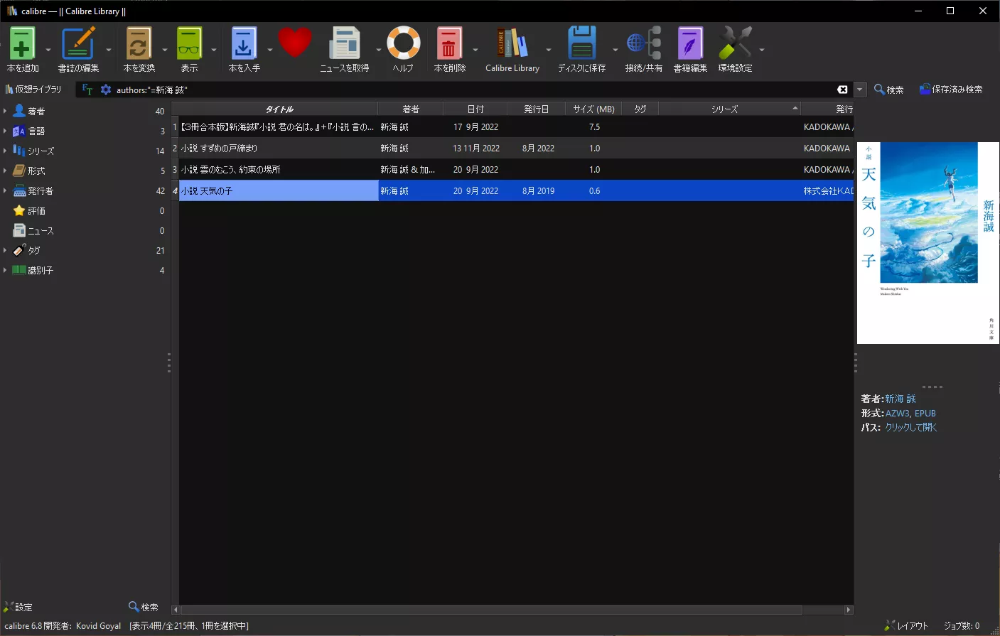

然後選中一本書，點右上角的打開編輯器，就可以進入編輯器界面了。

**關於 EPUB：**EPUB 電子書實際上是一個 zip 壓縮包，解壓以後就可以看到裏面的文件了。組成書籍內容的包括裏面的

 * HTML 文件：書籍的正文和排版樣式
 * CSS 文件：書籍的排版樣式
 * 圖片：插圖不必多說
 * 字體：電子書可以內嵌自己的字體

除此之外還有一些可能沒見過的其他格式的文件，牠們記錄了書籍的 metadata 和目錄章節信息等。

用編輯器打開上面那本刀劍神域，如圖：

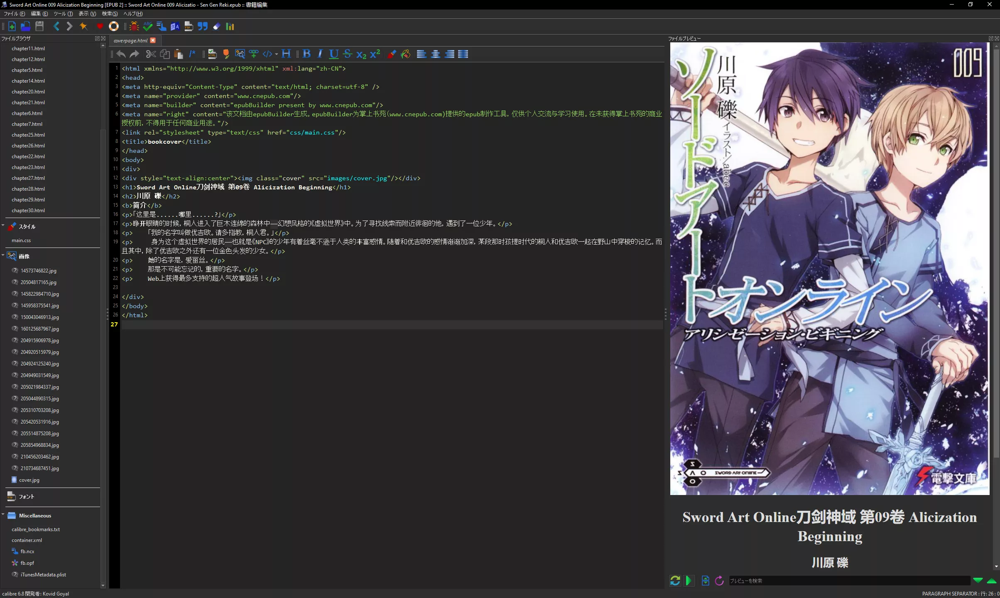

其中左邊是文件列表，中間是編輯器，右邊是內容預覽。用 Calibre 編輯電子書的優勢就在於編輯時可以隨時預覽，並且不需要手動解壓 zip。

觀察文件列表，上面是一大堆 HTML，中間有一個 main.css，下面是一堆插圖，最下面則是一些 metadata 的文件。

阿要是你有摸過 HTML 和 CSS，那麼很容易就會發現排版電子書和製作網頁差不多，甚至更簡單，因爲書上只有簡單的圖片和文字。
但是值得一提的是，編輯器中看到的 HTML 和最終在閱讀器中看到的 HTML 可能會有所差異，整體、大致上的排版應該是一樣的，但是細微之處的處理還是會根據你說使用的閱讀器有所不同，不同的閱讀器可能會套用自己的排版規則。

比如說這本書封面圖扭曲的問題，我們右鍵 Calibre 閱讀器的界面，選擇審查元素（沒錯，牠是個 Chrome...），然後發現：

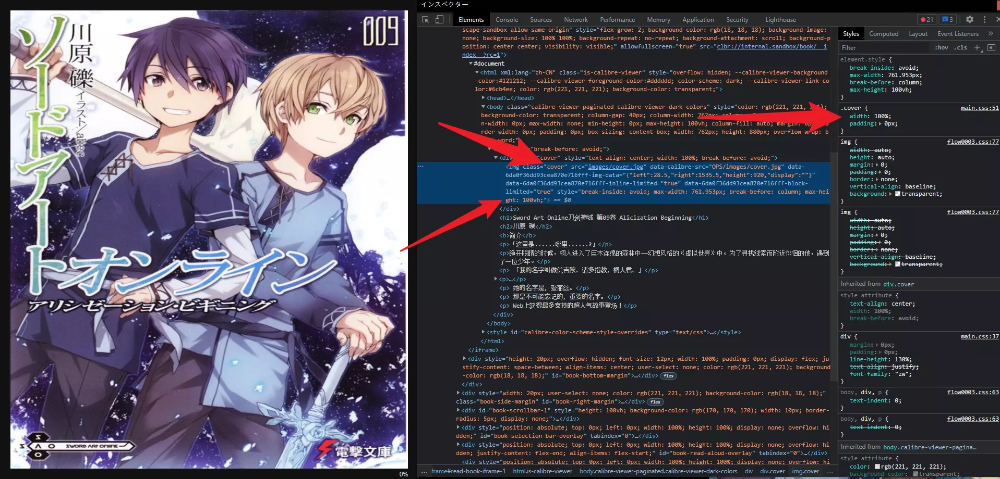

這張 cover 圖設定寬度是 100%，然後 Calibra 擅自加入了一個 max-height 也等於一百（這個是原書上沒有的），就導致該圖片在高度不夠的窗口上被擠壓了，，，
所以說這個小問題不用修理，說不定換到 Kindle 上看就自己好了呢？

**接下來解決文字排列方向的問題：**

首先，點擊工具欄上的 Tool 菜單，在裏面選擇「🌹」圖標的「美化所有文件」的選項，這能讓 HTML 代碼更加易讀。如圖：

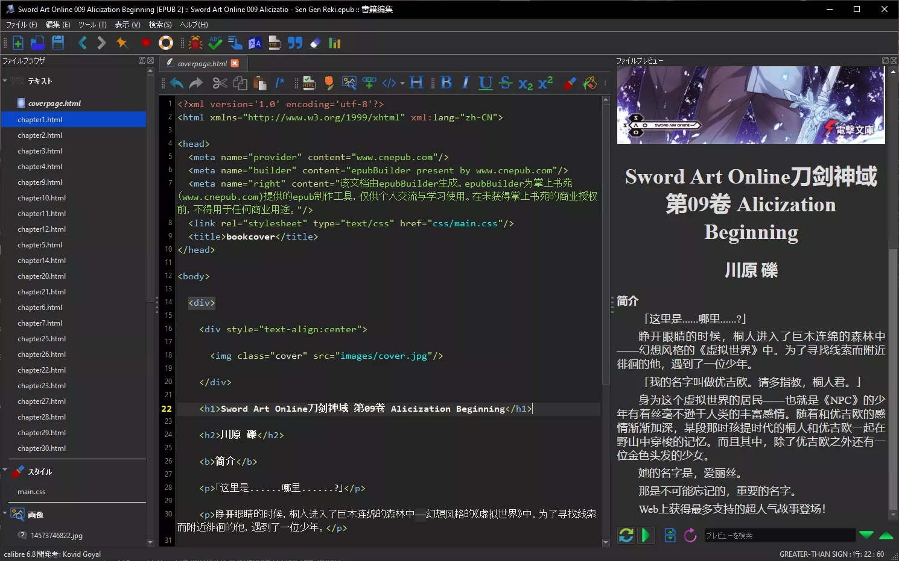

根據 CSS 的規則，想要讓文字縱向排列並且從右往左，可以設置 writing-mode 屬性：

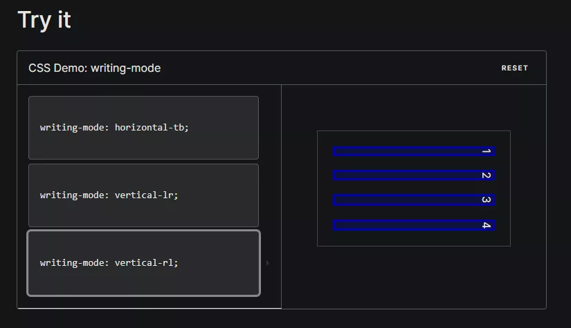

至於這個屬性要設在哪裏，俺也懶得故弄玄虛了，直接說結論。
前幾天俺拆了一本角川書店的日文廁紙，從裏面拿到了幾個 CSS 文件，就我上面給的那些 flow000x.css，我粗略地看了一眼，裏面甚至還留了註釋，節選一段給各位看看：

```CSS
/* ファイル情報
----------------------------------------------------------------
【内容】
KADOKAWA リフロー型標準スタイル

【バージョン】
ver.1.3.0

【細目】
・既存クラス上書き指定
・ページ設定

【更新履歴】
2019/09/25
・奥付のEPUB ファイルバージョン表記指定「.release-version」を追加。
　あわせて上の行のデジタル発行日「.release-date」の margin-top の値を変更

・奥付の「連絡先（サポート）情報」に
　注意書き用の「.support-note-01」～「.support-note-04」を追加

2018/06/01 ver.1.2.0
・既存クラス上書きのリンク指定を削除
・奥付（追加要素）の「.p-colophon2」を追加
...
*/
```

這些文件指定了從封面，圖片，目錄到各章標題、正文的排版，事無鉅細。牠們出版的每一本電子書基本上都包含了這些 CSS 讓排版變得美觀，屬於是能批量提高文學素養的文明利器了屬於是，所以對於一本文學素養不夠的書，俺們只需要把這些 CSS 當作補丁全部打進去就直接完事了，科科。

在這之前，俺們還是要先看看牠們到底是怎麼設置豎排文字的。

在 flow0004.css 中有寫道：

```CSS
/*
2012/08/21 ver.1.0b1
・公開版
---------------------------------------------------------------- */
/* 組み方向指定
---------------------------------------------------------------- */
/* 横組み用 */
html, .hltr {
  -webkit-writing-mode: horizontal-tb;
  -webkit-writing-mode: horizontal-tb;
}
/* 縦組み用 */
.vrtl {
  -webkit-writing-mode: vertical-rl;
  -webkit-writing-mode: vertical-rl;
}
```

然後在每一章的正文 HTML 的根標籤（即 \<html\>）有寫道

```HTML
<html xmlns="..." xmlns:epub="..." xml:lang="ja" class="vrtl" lang="ja">
```

可見只需要把 vrtl 的 class 設置在需要被豎排排版的章節上即可。

先把那些 CSS 導入到刀劍神域的編輯器裏面：

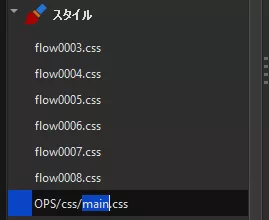

注意這裏的文件實際上是有目錄結構的，建議通過「重新命名」的方式把新增的文件放到和原有文件的同一目錄下，
然後打開原有的 main.css：

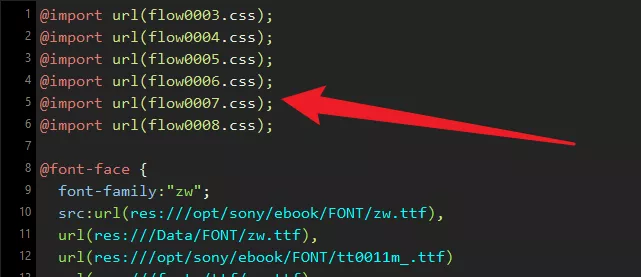

...在最頂上把剛才那些 CSS 給 import 進去。

之後打開一章正文，

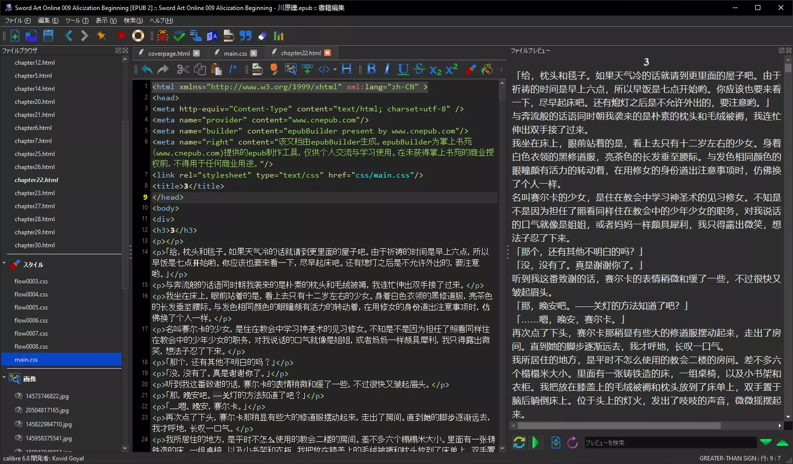

在 html 的標籤處把 vrtl 設置進去，

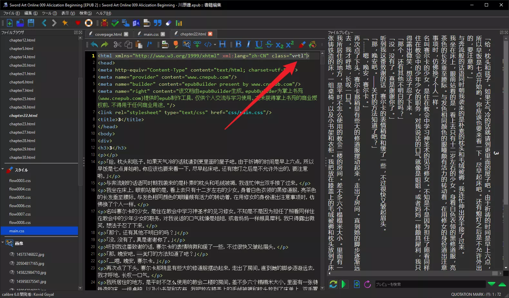

OK 啦！此時文學素養已經大幅提高了，但是還有一點不足之處，請再觀察上圖的正文區域。
有沒有覺得文字排列過於緊湊，閱讀起來有點頭痛？這是沒有段落間距所導致的。

你正在閱讀的這個網頁除了基本的行間距以外，還另外設定的段落間距，以便讀者區分不同的段落，
俺覺得這種優化帶來的提升在豎排文字中更明顯。

俺們的網頁：

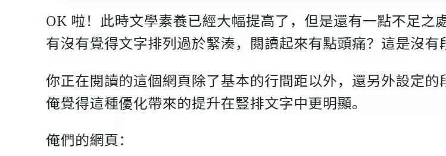

編寫時候的代碼：

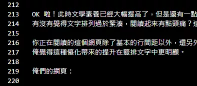

可能有人就想問了那我們是不是要給電子書原文的每一段都按一個回車鍵？
可以是可以，但是多少有點。所以俺們採用增加段落 \<p\> 標籤之間的間隔來完成此操作。

打開 main.css，定位到

```CSS
p {
  text-align: justify;
  text-indent: 2em;
  line-height: 130%;
  margin-top: 5pt;
  margin-bottom: 5pt;
}
```

可見牠原來也已經設置了上下方的 margin，但是由於俺們的文字已經變成豎排，所以需要重新設置左右方向的 margin 纔是真正的段間距。

改成：

```CSS
p {
  text-align: justify;
  text-indent: 2em;
  line-height: 130%;
  margin: 1em 0.75em;
}
```

有沒有變得舒服？

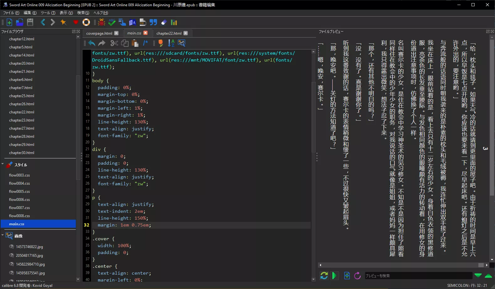

把每一章正文的 HTML 都加上 vrtl，俺們的工作就已經差不多完成了。

**解決從右往左翻頁的問題：**

日本和臺灣的小說一般都是豎排文字 + 從右往左翻頁，也就是在右側進行裝訂，給人一種從右邊一路掃到左邊的快感。

要達到這一點當然也需要特殊設定的。但是 CSS 救不了我們，因爲網頁和書不一樣，都是用滑鼠進行上下或者左右滑動，沒有明確的「上一頁」「下一頁」這樣的導航，所以設定 EPUB 的翻頁方向有別的方法。

直接上結論：

還記得之前俺說過 EPUB 包含了一些 metadata 文件嗎，把編輯器的文件查看器拉到最底下就能看到了，這本刀劍神域裏面是長這樣子的：

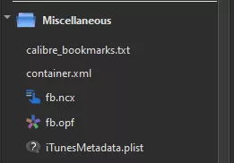

光從名字上看，可以知道第一個是 calibre 生成的文件，最後一個是 iTunes 的文件，然後俺們打開 container.xml 一看：

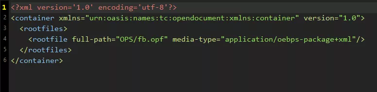

牠裏面指定了一個 rootfile，名叫 fb.opf，這裏就是本書的 metadata 數據了，包括了標題，作者，封面和章節信息，以及哪一章在哪個文件和牠們的順序等非常重要的信息，往下拉，能看到一個 spine 標籤：

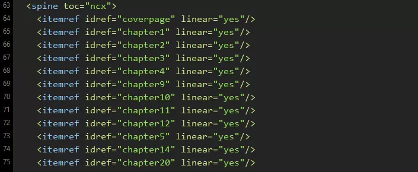

往裏面加上一個屬性 page-progression-direction="rtl" 就可以從右往左翻頁了，別問我是怎麼知道的，我網上查的，，，

```HTML
  <spine toc="ncx" page-progression-direction="rtl">
```

如此，該書籍在 Kindle 上閱讀的時候就是從右往左翻頁了。此時的文學素養就已經很高了，你可以點保存然後把 EPUB 拷進 Kindle 享受精品閱讀時光了。

## 4. 中英字符間的空格

<p class="text-danger" style="font-size: 150%">
  為什麼你們就是不能加個空格呢？
</p>

> 漢學家稱這個空白字元為「盤古之白」，因為它劈開了全形字和半形字之間的混沌。另有研究顯示，打字的時候不喜歡在中文和英文之間加空格的人，感情路都走得很辛苦，有七成的比例會在 34 歲的時候跟自己不愛的人結婚，而其餘三成的人最後只能把遺產留給自己的貓。畢竟愛情跟書寫都需要適時地留白。

> 與大家共勉之。

奈何有些人早就已經把小學英語老師的諄諄教誨給拋之腦後了，
形成了中英字符之間不打空格的惡習（沒錯，這是一個惡習）。
當然如果你在用 Word 和 LaTeX 之類的打字軟件，那麼已經內置了調整中英字符間距的功能，不另加空格也可以。

但是在書寫 HTML 或者網路聊天的時候，在中英字符之間增加空格是做人的基本底線。
對於沒有底線的人的文字，俺們有一個開源項目：

https://github.com/vinta/pangu.js

JS 版適用於網路瀏覽器，當然，您正在觀看的本網站已經內置了該 JS 版本，牠爲沒有底線的作者的文章提供自動修正。
對於本機的文件，牠提供了 Python 版本：

https://github.com/vinta/pangu.py

用法也寫在上面了：

```shell
$ echo "未來的某一天，Gmail配備的AI可能會得出一個結論：想要消滅垃圾郵件最好的辦法就是消滅人類" >> path/to/file.txt
$ pangu -f path/to/file.txt >> pangu_file.txt
$ cat pangu_file.txt
未來的某一天，Gmail 配備的 AI 可能會得出一個結論：想要消滅垃圾郵件最好的辦法就是消滅人類
```

至於該怎麼把該程序用於 EPUB 電子書，很簡單，把 EPUB 用 zip 解開，然後把裏面的每一個正文 HTML 文件都跑一遍該程序，最後再壓縮回去，完成！

## 結語

這篇文章簡單介紹了如何對 EPUB 進行簡單的編輯，這些內容都來自俺自己的經驗，
希望這篇文章能對你的精品閱讀時光有所幫助，
而且 Calibre 是一個十分有趣的軟件，俺希望你多用，，，

本文用到的文件下載：