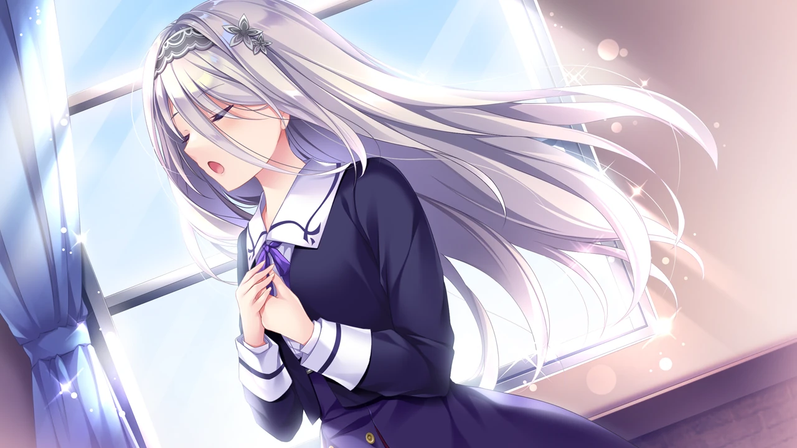

| 資訊一覽     |                 |
| :----------- | :------------------------------------ |
| **開發商**   | ensemble |
| **攻略人數** |   5     |
| **遊戲時長** | 15-20h |
| **類型**     | 女装潜入 治愈       |
| **難度**     |  低  |
| **分級**     | R-18      |
| **遊戲引擎**   |     AdvHD       |


## 故事梗概

海外学剑归来的男主角**空木日向**接受了 教授骑士道的女校--银兰学院 的邀请，
女装化名为**卯花陽菜**，以学生&剑术助教的双重身份入学，
陽菜开局便击败了所向披靡的三年生**天海伊夜**，成为轰动全校的名人，
观众席上的娇小学妹**椋木梨理**燃起强烈战意，金发的法国留学生**クレール・メルル(Claire Merle)**则是若有所思，
在同桌**小柴杏奈**无意的介绍中，陽菜发现了小时候无情拒绝自己的青梅**宮守睦月**，
"日向一直都比我更可爱呀，结婚什么的是不可能的啦。"
然而，睦月的身上似乎隐藏着难以言表的秘密...

PS：解锁つーちゃん（宮守睦月）线需要先通关其他四位角色的个人线。


## 登场人物

<style>
  .charname {
    font-size: 150%;
  }
  .namearea hr {
    margin: 1.5rem 0;
  }
  .sp-character img, .img-shade {
    filter: drop-shadow(0 0 6px #000c);
  }
  .sp-character {
    border-radius: 20px;
    overflow: hidden;
    box-shadow: 0 5px 11px 0 rgb(0 0 0 / 18%), 0 4px 15px 0 rgb(0 0 0 / 15%);

    -webkit-backdrop-filter: blur(1px);
    backdrop-filter: blur(1px);
    
    background-color: var(--chara-card-color);
    
    /* background-color: transparent;
    background-image: var(--this-bg);
    background-position: center;
    background-repeat: no-repeat;
    background-size: cover; */

  }
  .sp-character .char-overlay {
    background-color: var(--chara-card-color);
    min-height: 400px;
    background-image: var(--right-bg);
    background-repeat: no-repeat;
    background-position: top 0px right calc(100% * 0.3 - 130px);
    background-size: auto 480px;

    margin: 0;
    padding: 0;
  }
  :root { /* 配色 */
    --chara-card-color: #ffffffcf;
  }
  [data-user-color-scheme='dark'] {
    --chara-card-color: #1a1a1aa6;
  }
  @media screen and (max-width: 767px) {
    .namearea hr {
      margin: 1rem 0;
    }
    .pc-left {
      -webkit-backdrop-filter: blur(3px);
      backdrop-filter: blur(3px);
      
      background: var(--chara-card-color);
      transition: opacity 0.3s;
    }
    .pc-left.touch {
      opacity: 0.1;
    }
    .sp-character {
     /*background: unset;*/
      /*-webkit-backdrop-filter: unset;
    backdrop-filter: unset;*/
    }
    .sp-character .char-overlay {
      min-height: unset;
      /* background-size: contain;*/
      background-position: top 0px right 0px; 
    }
    :root { /* 配色 */
      --chara-card-color: #ffffff87;
    }
    [data-user-color-scheme='dark'] {
      --chara-card-color: #1a1a1aa6;
    }
  }
</style>


<div class={`row sp-character ${uid}`} style={`--this-bg: url(../image/otohime/chars/${no}b.webp)`}>
  <div class="col-12 char-overlay row" style={`--right-bg: url(../image/otohime/chars/${no}.webp)`}>
    <div class="pc-left col-12 col-md-8">
      <div class="namearea col-12 pt-2">
        <div class="charname font-serif font-weight-bold font-italic">
          {name}
        </div>
        <div class="yomi font-italic">
          {yomi}
        </div>
        <hr />
      </div>
      <div class="infoarea col-12" html={html}>
      </div>  
    </div>
  </div>  
</div>


<sp-character no=0 name="卯花 陽菜" yomi="unohana hina" uid="hina">
  <p>
   为了变得帅气而学剑十年的本作主角。<br>
  </p>
  <p>
   从小和睦月一起在合唱团活动，<br>
   告白被拒带来的沉重打击开始了他的学剑生涯。<br>
  </p>
  <p>
   目前在银兰学院教剑&学习。<br>
  </p>
</sp-character>
<br>
<sp-character no=1 name="小柴 杏奈" yomi="koshiba anna" uid="anna">
  <p>
   陽菜的同桌，也是的邻居，单方面喜欢日向。
  </p>
  <p>
   ensemble经典之温柔同桌， <br>
   主动和陽菜搭话，帮陽菜快速适应了学校，<br>
   也得到陽菜的指导成为骑士科二年生第二名。 <br>
    <br>
  </p>
</sp-character>
<br>
<sp-character no=2 name="天海 伊夜" yomi="amami iyo" uid="iyo">
  <p>
   与陽菜师出同门，连续两年最优秀骑士得主。
  </p>
  <p>
   初次见面被陽菜击败，之后研究出了对策的剑法，<br>
   谦虚直率，家里经营神社，她正是该神社的巫女，<br>
   人气很高，经常受到各种表白信，而且会一一认真回信。<br>
  </p>
</sp-character>
<br>
<sp-character no=3 name="クレール メルル" yomi="claire merle" uid="claire">
  <p>
   来自银兰学院的法国姊妹校的法国留学生。
  </p>
  <p>
   喜欢跟人贴贴，对气味很敏感，<br>
   为了追随自己憧憬的银兰学院董事长，及本身喜爱日本香道文化，<br>
   在银兰学院留学中。<br>
  </p>
</sp-character>
<br>
<sp-character no=4 name="椋木 梨理" yomi="mukunoki riri" uid="riri">
  <p>
   刻苦认真的一年生，时常戏弄陽菜取乐。
  </p>
  <p>
   傲娇，通常会拒绝别人的好意，<br>
   有上进心，起早贪黑练剑术，<br>
   坚持管陽菜叫"老师"，然后欣赏陽菜不自在的样子。<br>
  </p>
</sp-character>
<br>
<sp-character no=5 name="宮守 睦月" yomi="miyamori mutsuki" uid="mutsiki">
  <p>
   日向的青梅竹马，银兰学院的歌姬。
  </p>
  <p>
   以神奇方式拒绝日向后一直后悔，不久退出合唱团，<br>
   但一直在练习唱歌，目前担任银兰学院的歌姬，<br>
   去年因不明原因辞退了歌姬一职。<br>
</sp-character>


## 游戏 CG（不含 R-18）





## 推荐理由

ensemble新作，叙事节奏拿捏的非常好，剧情也非常不错，强烈推荐

题外话：ensemble是真的有够喜欢骑士 ，
这是ensemble第三部以骑士为主题的作品，前两部分别是：乙女が奏でる恋のアリア，乙女騎士♥いますぐ私を抱きしめて

本作出现了一个概念：アリア(Aria)，
该词最早出现于ensemble九年前的作品 乙女が奏でる恋のアリア ，
Aria是　歌姫救出譚（プリンチペッサ・プレギエーラ<principessa/preghiera>） 的别称，
讲述了一个小国的擅长歌唱的公主「Aria」接到了隔壁大国的邀请函，
想请她一展歌喉，喜爱唱歌的公主高兴地答应了，演出也非常成功，
但在归途中，公主遭遇了嫉妒她歌声的贵族雇佣的亡命之徒的袭击，
女骑士们在保护公主的战斗中失散了，最后只有一名身负重伤的女骑士带着公主逃进了森林，
在这绝望的时刻，公主用美妙的歌声指引分散的女骑士们集合起来，解决了困境。

👆该剧是银兰学院和 乙女が奏でる恋のアリア 的深皇学院的保留节目，每年学院祭都会演一遍。
如果你玩过本作之后意犹未尽，强烈建议继续玩 乙女が奏でる恋のアリア 。


## 资源和下载

生肉，无汉化但是ensemble的生肉向来不难啃，她家的作品笔者全都是啃的生肉。
本体：
```
magnet:?xt=urn:btih:86c0b699844215237c0748b599d10d50c4d0efb0&dn=%E2%94%822D.G.F.%E2%94%82%5B230728%5D%5B1224232%5D%5Bensemble%5D%20%E4%B9%99%E5%A5%B3%E3%81%AE%E5%89%A3%E3%81%A8%E7%A7%98%E3%82%81%E3%81%94%E3%81%A8%E3%82%B3%E3%83%B3%E3%83%81%E3%82%A7%E3%83%AB%E3%83%88%20%E3%83%91%E3%83%83%E3%82%B1%E3%83%BC%E3%82%B8%E7%89%88%20%2B%20Crack%20%5B4391MB%5D&tr=http%3A%2F%2Fsukebei.tracker.wf%3A8888%2Fannounce&tr=udp%3A%2F%2Fopen.stealth.si%3A80%2Fannounce&tr=udp%3A%2F%2Ftracker.opentrackr.org%3A1337%2Fannounce&tr=udp%3A%2F%2Fexodus.desync.com%3A6969%2Fannounce&tr=udp%3A%2F%2Ftracker.torrent.eu.org%3A451%2Fannounce
```
小剧场　二つのアリア ，联动了 乙女が奏でる恋のアリア
```
magnet:?xt=urn:btih:6da1381f6f6c56f019f258c97a9784c63e01c804&dn=%E2%94%822D.G.F.%E2%94%82%5B230728%5D%5B1224232%5D%5Bensemble%5D%20%E4%B9%99%E5%A5%B3%E3%81%AE%E5%89%A3%E3%81%A8%E7%A7%98%E3%82%81%E3%81%94%E3%81%A8%E3%82%B3%E3%83%B3%E3%83%81%E3%82%A7%E3%83%AB%E3%83%88%20%E6%97%A9%E6%9C%9F%E8%B3%BC%E5%85%A5%E3%82%AD%E3%83%A3%E3%83%B3%E3%83%9A%E3%83%BC%E3%83%B3%E7%89%B9%E5%85%B8%20%5B455MB%5D&tr=http%3A%2F%2Fsukebei.tracker.wf%3A8888%2Fannounce&tr=udp%3A%2F%2Fopen.stealth.si%3A80%2Fannounce&tr=udp%3A%2F%2Ftracker.opentrackr.org%3A1337%2Fannounce&tr=udp%3A%2F%2Fexodus.desync.com%3A6969%2Fannounce&tr=udp%3A%2F%2Ftracker.torrent.eu.org%3A451%2Fannounce
```
玩生肉你需要转区工具Locale Emulator，网上有很多教程所以这里就不展开说明。

<style>
details {
    border: 1px solid #aaa;
    border-radius: 4px;
    padding: .5em .5em 0;
}

summary {
    font-weight: bold;
    margin: -.5em -.5em 0;
    padding: .5em;
}

details[open] {
    padding: .5em;
}

details[open] summary {
    border-bottom: 1px solid #aaa;
    margin-bottom: .5em;
}
</style>

<script>
  //document.documentElement.setAttribute('data-user-color-scheme', 'dark');
  document.addEventListener("DOMContentLoaded", function(){
    let pclefts = document.querySelectorAll('.pc-left');
    pclefts.forEach((el) => {
      el.addEventListener('touchstart', function(){
        el.classList.add('touch');
      })
      el.addEventListener('touchend', function(){
        el.classList.remove('touch');
      })
    });
    //setTimeout(() => document.documentElement.setAttribute('data-user-color-scheme', 'light'), 1000)
  })
</script>
