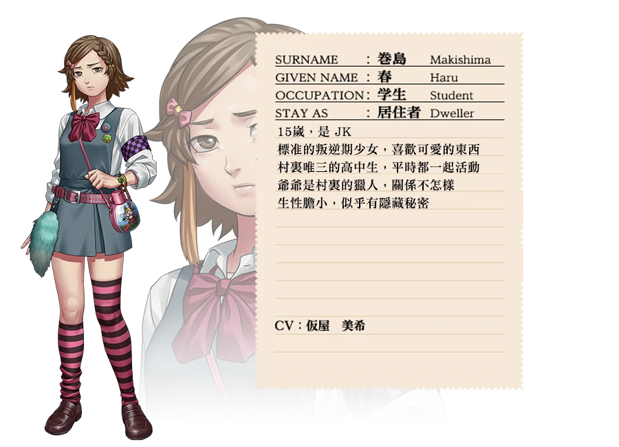

`作者: Patchouli Knowledge`

| 資訊一覽     |                  |
|:--------:|:---------------- |
| **開發商**  | KEMCO |
| **遊戲時長** |25-30 H          |
| **類型**   | 劇情 懸疑 推理 鄉村     |
| **難度**   | 普普通通            |
| **分級**   | 全年齡             |

## 故事梗概

普通的醫大學生***房石 陽明***（欸我玩的上一個[游戲](https://galgamer.moe/article/10023)的主角好像也是醫大學生，這在日本懸疑作品中真是一個出場率極高的身份）失戀后騎著自己的機車四處散心，沒想到深夜在完全沒信號的荒郊野嶺中機車宕機，只能沿著小溪摸黑前進。
也不知過了多久終於來到小溪盡頭，被路過的女大學生***芹澤 千枝實***幫助帶回宿舍暫住一晚，芹澤爲人開朗大方，熱情招待了男主后便答應次日送其到鎮上可以回家。
但怎想到各種事故頻頻發生，男主一直滯留到***第二天傍晚***，突然大霧四起，村民們也慌張不已的躲進家中閉門不出，芹澤則是將男主關在田邊的茅厠中懇求男主千萬不要在夜中外出，最後留下一句“千萬要活下來”，便匆匆離去。
第三天清晨，村中果然死人了，而村民們則要按照祖訓開始荒誕的儀式“黃泉忌之宴”討論出誰是昨夜的殺人凶手並吊死，根據傳説，每天只能吊死一人，當吊死所有凶手后霧氣才會散去，互相殘殺才會結束。現實版***“狼人殺”***，開始了……

## 人物介紹（登場人物過多只挑主角）

### 房石 陽明

### 芹澤 千枝實

### 回末 李花子

### 卷島 春

## 遊戲 OP

 

<iframe id='y2b' loading="lazy" src="https://www.youtube-nocookie.com/embed/LJ2zB8V7liM" title="YouTube video player" frameborder="0" allow="encrypted-media; picture-in-picture" allowfullscreen></iframe>

動畫來自被牆的 steam



## 簡評

  
優點：

  </img>

 * 劇情緊張刺激，峰回路轉，毫無尿點，邏輯基本都可自洽并且沒有挖坑不填。
 * 人物塑造堪稱滿分，每個參與狼人殺的村民都特色鮮明，做出的發言與行爲都符合人設，讓玩家很快就可以融入游戲。
 * 音樂畫面都十分頂級，氣氛烘托的非常棒，CG畫風雖然偏寫實狂野，但非常精細，游戲内樹狀圖系統非常好用方便玩家及時查閲。
 

  
缺點：

  </img>

 * 結局相比過程略顯平淡但十分合理，也不能硬說是缺點。
 * 有不少血腥場景描述（但沒有直觀的畫面描寫），無法接受者請注意在設置中隱藏

| 評分        |      |
|:---------:|:----- |
| **人設**    | 10/10 |
| **立繪 & CG** | 8/10 |
| **劇情**    | 10/10 |
| **音樂**    | 9/10 |
| **綜合**    | 10/10 |

## CG鑑賞

  

  

  

  

  

## 遊戲資源

無官方中文，可以退款大法白嫖游戲。



[漢化補丁](https://www.bilibili.com/video/BV1Yz4y1r7Cn)，可直接兼容steam版，打上就可以玩，支持正版謝謝喵~

