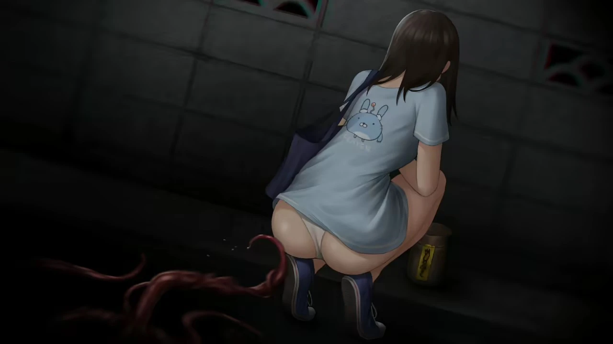
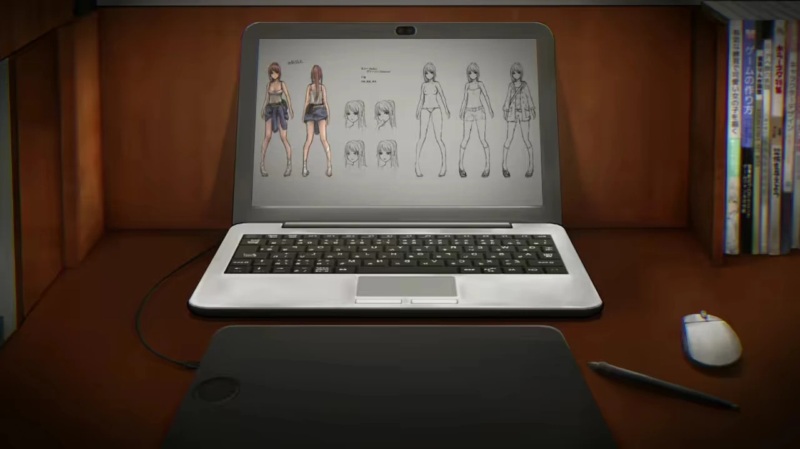
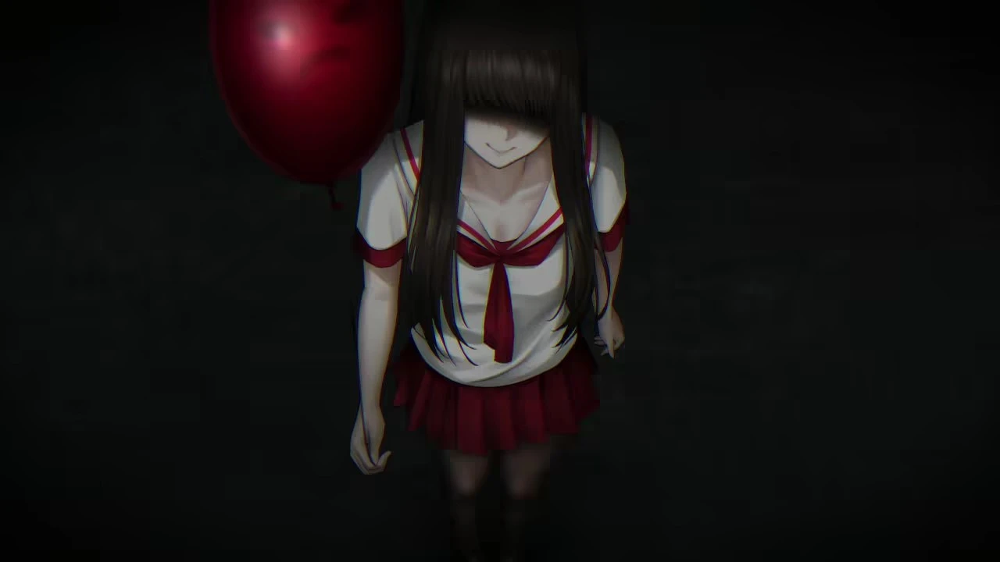
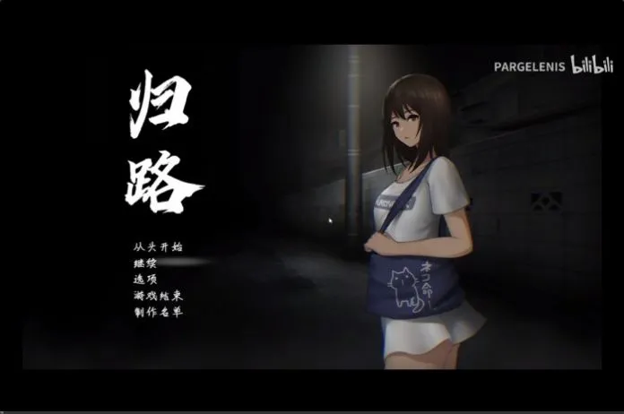
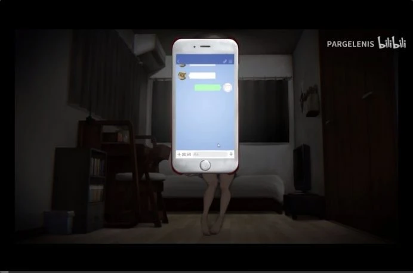
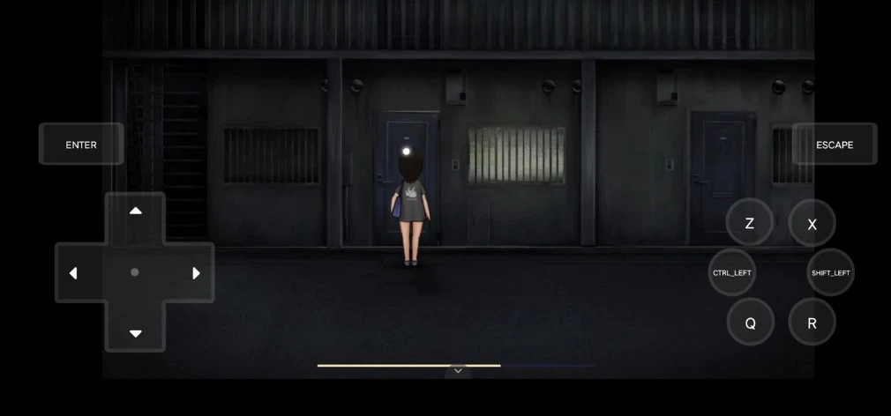
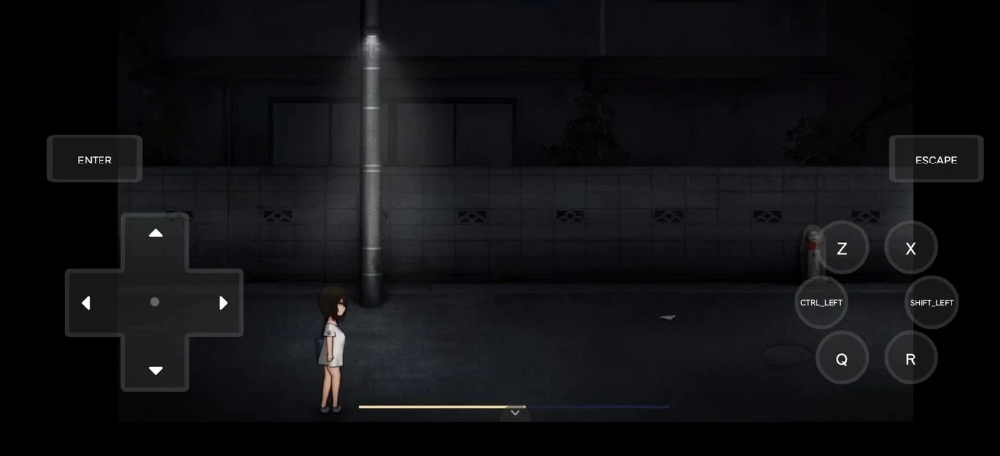

`作者：木卫一`

## At A Glance

即使不是在徐州，走夜路也是很危险的。

  

| 資訊一覽 | |
| :----------- | :------------------------------------ |
| **開發商** | 神乳/旅猫キャンプ |
| **遊戲時長** | 2H |
| **画师** | 黒音りんか |
| **類型** | 角色扮演 |
| **難度** | 中（解密） |
| **分級** | R-15（裸露） |

## 故事

你是一个在东京1room独居的女子大生，
目前正在为成为独立游戏制作人而努力着，
受限于简陋的居住环境，你不得不每天步行到公共澡堂入浴。

走在从澡堂回家的路上，偶尔一只乌鸦扑腾飞起，
长风吹起你如乌鸦湿羽般的黑发，出浴后的微红肌肤雾气氤氲，散发出馥郁的香波味道…，

本应当是十分香艳的场景，可不知为何，
徘徊在归家之路上的古灵精怪，投下意味深长的浮光掠影。

  
點此展開

  游戏基本上就是刚住进新公寓的女主角因为房间沒浴室必须每天跑公众浴池， 
  然后在回家路上一路遇到的各种毛毛怪怪的事

## 登場人物



  

    

      

        

          {name}
        

        

          {yomi}
        

        

      

      

      
  
    

  
  



<sp-character no=0 name="女主角" yomi="独居东京的女子大生">
  

    身上还留着海滩旅行的晒痕。
  

  

    很喜欢猫，不论是朋友拍的猫视频， 
    还是电视台放送的虚拟角色杀人猫。
  

  

    每晚都往返于大众浴池洗澡， 
    困扰于归路上时时发生的灵异现象， 
    如果不好好应对的话，会掉进无法逃离的深渊吧
  

</sp-character>
 
<sp-character no=1 name="澡堂女侍" yomi="迷糊的澡堂女招待">
  

    也许是值夜班的关系 
    每次见她都一副没睡醒的样子
  

</sp-character>
 
<sp-character no=2 name="吉普赛人" yomi="吉普赛人打扮的女占卜师">
  

    打扮暴露，肉体色情； 
    但是没什么重要剧情。
  

  

    可能是为后续更新准备的角色。
  

</sp-character>

## 遊戲 PV

<video controls preload="metadata" width='100%' poster='../image/thewayhome/op.webp'>
  <source src="https://s3static-zone0.galgamer.eu.org/video-2d35/thewayhome/thewayhome.mp4" type="video/mp4">
</video>

## 遊戲 CG

  

  

  

  

  

  

## 遊戲畫面

## 點評

归路（日文：還道 英文：The way home)是日本神乳社团制作
发售于21年7月29，该社团还制作过灵岛传说等一系列RPG作品，
是一个流程极短的R15向RPG类恐怖色情类游戏。

作者黒音りんか同时也是游戏的绘师，
https://twitter.com/kuronerinka/status/1420662750783578114?s=21
以小遊戲來說整體美術的完成度頗高，細節也相當多。

泳裝曬痕女主色气诱人，有很多裸露镜头，但没有性场景，
除了移動跟小任務時是SD人物(也很可愛)外，
畫面都會透過CG呈現。

全作通過鍵盤上下左右+enter操作，很簡單，但一些场景还是会考验到玩家的反应能力。

游戏着重于制造恐怖的氛围，因此没有跳吓镜头，
有多个结局，达成happy ending需要一点技巧。

毕竟是色情和恐怖题材游戏，玩的时候一定要戴耳机啊。

## 更新信息

在写本篇时检查了下该游戏的Dlsite页面，意外发现本作居然于上月末更新了一次

<blockquote id="update">
  2022年06月29日

  タイトル変更
  新規イラスト追加
  ギャラリー追加
  チャプター選択機能追加
  テキストのリニューアル
  コンテンツ改善
</blockquote>

价格也上涨了1000JPY，可见未来根据作者心情还有可能继续追加内容

## 資源和下載

莱茵图书馆：



