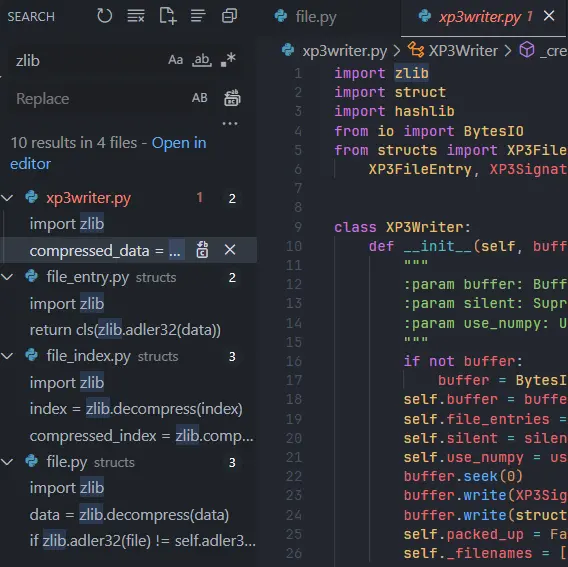

<b>Contributor：</b> 
冬夜†  Hiyatoki† 
†{kiriha, hiyatoki}@galgamer.eu.org

吉里吉里作爲每天都要打交道的親密夥伴，俺們不應該對牠一無所知．
這只是我們的第一步．

| 資訊一覽     |                 |
| :----------- | :------------------------------------ |
| **遊戲引擎** | Kirikiri Z      |
| **難度**     | sora 說高    |

## 1. 這篇文章的由來

吉里吉里（下文簡稱 krkr）是 Galgame 業界廣爲使用的遊戲引擎，牠本身開源，因此很多 Galgame 公司都在牠的基礎上進行了二次開發．
我們的生命之光柚子社那如同教科書一般的遊戲系統設計就是基於 krkr 進行的開發．雖然不知道這個系統牠們外包給了誰做，但是這裏就請各位稍微忽略一下這一點，把掌聲送給柚子社，，，

之前 Galgamer Core 內部萌生了魔改某遊戲的想法，該遊戲使用 krkr Z 製作，我們要做的事情只是修改遊戲文件．衆所周知 krkr 引擎的遊戲文件封包是 XP3 格式，所有的遊戲文件包括背景立繪音樂玉音都打包在 XP3 裏面，就像壓縮文件一樣．網上也有很多針對 XP3 進行解包打包的開源 app，但是不幸的是該遊戲的 XP3 封包存在某種程度的加密，如果我們想要進行自動化的編譯，那就只能自己寫腳本，或者是對現有的開源工具進行修改，使其兼容這個加密．無論我們採用哪一種方法，我們都必須要在一定程度上瞭解 XP3 這個格式．

針對這個問題，俺到羣裏面提了一嘴說道我們需要研究一下 XP3，結果不到兩分鐘我們的かばん先生就丟出來一個 GARbro 的連結，我說不行，我們的知識庫必須得充實一下，妳們這些水怪別老是整天水群了，快點給我動起來啊啊啊啊啊！

群友們我真是對不起妳們，直接就把鍋甩到妳們身上．

## 2. 研究方向

### 2.1 基本思路

行吧，那就開始研究把，但是在研究之前先要上網收集信息，看看有沒有甚麼前人的研究足跡和論文，這能夠節省我們無腦突進這個領域的時間．

krkr 本身是個開源的東西，GARbro 也是開源的東西，還有一大堆開源的 XP3 工具，最壞的情況下我們只需要去啃牠們的代碼就行了，然後這篇文章的標題就會叫做『GARbro 代碼讀後有感』而不是『Uncover XP3』了．但是問題是，

  啃別人的代碼比啃屎還難受啊！

尤其是在對內部原理沒有個大概瞭解的情況下，讀代碼根本起不到任何幫助，尤其是那些沒有註釋和文檔的臭大糞．於是我就去找看看有沒有別人寫過的文章和教程．

靠北，怎麼沒有啊．

所以最終還是要自己另闢蹊徑，打開一扇新大門，，，

好的現在請發揮一下大學物理實驗，信號與系統實驗，數字信號處理實驗等十萬個甚至是九萬個實驗課的精神，弘揚大學實驗的指導思想，設計出有針對性的實驗，讓我們用最短的力氣解出 XP3 的內部結構．

先來看看我們手頭上的實驗工具．

  1. 破解版 010editor 
      這是一個文件編輯器，可以編輯一切格式的文件
  2. GARbro 修改版和牠的 [🔗代碼](https://github.com/crskycode/GARbro)
      雖然我不想看牠的代碼，但是我可以方便地用牠來生成各種各樣的 XP3 文件，屬於是一種前人的研究成果，只是這個研究成果沒有任何的文檔和說明．
  3. krkrrel.exe：krkr 官方提供的 xp3 文件打包器，這個文件可以在 Kirikiri 2 的 [🔗開發包](http://krkrz.github.io/download/kr2_232r2.zip) 裏面找到．
  4. [🔗krkr-xp3](https://github.com/awaken1ng/krkr-xp3) 一個開源的 XP3 解包打包器，語言是 Python．牠不怎麼支持加密的 xp3 文件，但是足以夠用來研究明文的 XP3 文件格式．

再來看看我們手頭上掌握的情報．

  1. XP3 支持包含文件和目錄，
  2. XP3 支持儲存文件名
  3. XP3 支持針對文件的壓縮
  4. XP3 支持***基於文件***的加密（存疑，見下）
  5. XP3 支持針對索引的壓縮
  6. 沒了，我們對 XP3 的理解只是停留在表面而已．

雖然網上沒有針對 XP3 的介紹，但是同爲封包文件，就沒有其他文件類型的介紹嗎？zip 有沒有？7z 有沒有？於是我就去找了一下 zip 的文件結構圖．

如果到這邊你已經看得是一頭霧水了的話，說明你還不是很董文件是甚麼意思．雖然我們每天都有看到電腦上的文件，但是我們卻很少思考文件裏面的本質到底是甚麼．我也有點不董該怎麼解釋文件是甚麼，所以就去問了 AI．牠說：

 > 文件的內部都是一堆字節，字節是電腦儲存資料的基本單位，每個字節由八個位元組成，位元是電腦能夠識別的最小單位，只有 0 和 1 兩種值。不同的文件格式有不同的規則來解釋這些字節的含義，例如，文本文件是一種最簡單的文件格式，它把每個字節對應到一個字符，例如英文字母、數字或標點符號。其他類型的文件，例如圖片、音樂或影片文件，則需要更複雜的規則來將字節轉換為圖形、聲音或動畫。因此，要正確地打開和使用一個文件，你需要知道它的格式和相應的程式

我希望你看董了這段話，如果還是不董，你可以先用記事本隨便打兩行字，保存成 txt，然後再用上面提供的 010editor 破解版打開你剛剛的 txt．打開以後點右下角的 Text 選項，在菜單裏面改成 Hex．再觀察一下，估計就能理解了．

回到剛剛的 ZIP 文件，圖 2.1 和 2.2 看上去有點複雜，而且還不太一樣，但是牠們都傳遞了一個重要信息，那就是 ZIP 文件內部是這樣安排的：

 1. 第一個文件信息頭部
 2. 第一個文件
 3. 第二個文件信息頭部
 4. 第二個文件
 5. ...
 6. 第 n 個文件信息頭部
 7. 第 n 個文件
 8. 索引
 9. 索引尾部

其中，索引尾部有一個指針指向文件索引，然後文件索引裏面有指針指向各個文件的信息頭部．因此軟件在讀取 zip 的時候就可以先讀取尾部的指針，找到索引，再按圖索驥找到各個文件了．

  🤔指針 
  你可以把指針理解成頁碼，告訴你 xx 文件在書本的多少多少頁．

我覺得 XP3 應該和 ZIP 有類似的結構，有多個文件入口和一個索引，索引裏面有多個項目分別指向文件的地址．雖然我毫無根據但是自信滿滿，，，

### 2.2 打包工具介紹

#### 2.2.1 GARbro

-   打包選項
    -   版本選擇：可選：1、2；
    -   是否壓縮内容
    -   是否壓縮目錄
    -   保留目錄結構
    -   加密算法

打包時只要包含有文件夾都要勾選保留文件結構這個選項，不勾選時適用與對單個文件或選中多個文件進行打包。

壓縮内容顧名思義，而壓縮目錄應該就是對索引進行壓縮。

#### 2.2.2 官方 Releaser

-   打包選項
    -   可以指定文件類型為：壓縮内容；包含在檔案但不壓縮；排除在檔案外；只能選擇後綴。
    -   大於指定大小的文件不壓縮
    -   壓縮索引
    -   展開プロテクト：勾選后索引會有保護屬性，提取時會有提示
    -   **OggVorbisコードブック共有化：勾选此项，将共享OggVorbis文件（.ogg文件）的向量量化码书。由于OggVorbis文件通常在多个文件之间共享相同的码书，因此可以将它们合并为一个以节省空间。** 
      👆🏻Vorbis 文件中有一個部分用來儲存指導解碼器如何解碼的數據。當聲音文件被同一個編碼器批量生成時，這些指南數據很可能都是一樣的。Galgame 的語音文件就屬於這種情況。因此在打包 XP3 的時候可以將這些指南數據僅儲存一次來節省空間。
-   其餘選項見 [🔗Releaserについて](https://krkrz.github.io/krkr2doc/kr2doc/contents/Releaser.html)

#### 2.2.3 krkr-xp3

-   選項
    -   模式：解包打包
    -   `-flatten` ：和 `GARbro` 的 Retain Directory Structure 應該是一個意思。
    -   `--dump-index`轉儲檔案的索引
    -   選擇加密算法

## 3. 實驗過程

現在開始進行一系列實驗，儘可能地確定 XP3 文件的性質和結構．
這篇文章涉及到的都是無加密無壓縮的 XP3，只有先搞清楚了最基本的結構之後，才能理解更加複雜的．

### 3.1 壓縮算法實驗

* 雖然本文章不涉及壓縮的 XP3，但是暫且列出實驗結果．
目的：確定 XP3 封包之中的壓縮算法．
原理：將壓縮後的 XP3 數據和使用 Bandizip 壓縮後的數據進行對比，以確定壓縮算法．
方法：先觀察 krkr-xp3 和 GARbro 的代碼，找出使用壓縮庫的部分．
然後使用記事本創建一個 hello world 文件，分別使用 GARbro 進行打包壓縮和 Bandizip 的壓縮進行對比．

查看 krkr-xp3 的代碼，發現牠引入了 zlib 這個庫，搜索 GARbro 的代碼，也有這個字樣的代碼負責解壓縮的功能．

-   測試用文本文件單獨打包成 `gz` 格式后，與官方及 `GARbro` 的壓縮打包進行對比，壓縮算法基本可以確認是 gz 的 `deflate`
- 

-   壓縮文本文件使用工具為 `BandiZip`，進行兩次測試，只有選擇最大壓縮擋位才能和 `xp3` 匹配得上。
-   `zlib` 的壓縮等級一共有 0-9 十個等級，在 krkr-xp3 的代碼中可以看到如左圖所示片段

### 3.2 測試文件結構和内容

../image/xp3-research-1/