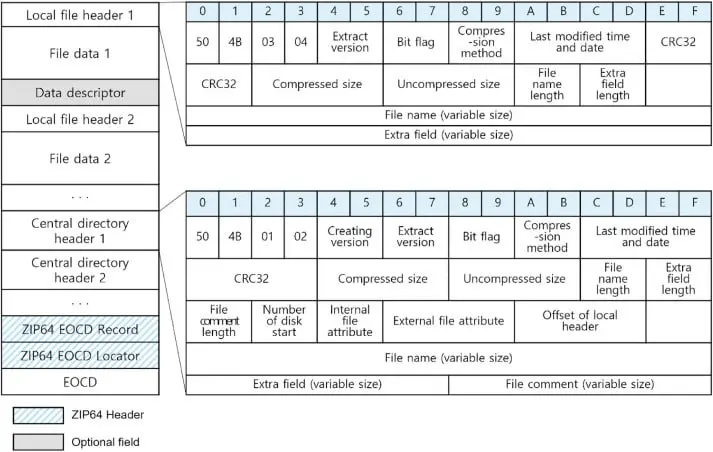
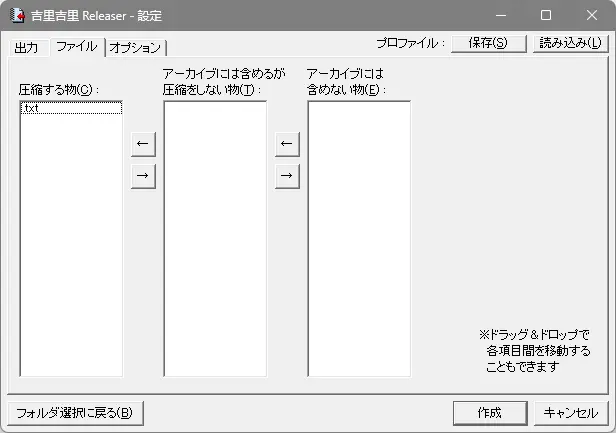
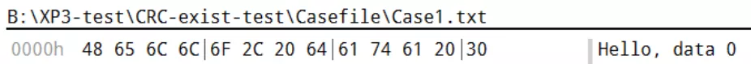
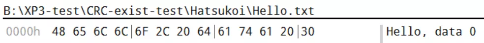

<style>
  :root {
    --my-bg-url: url('');
  }
  body {
    background-image: var(--my-bg-url);
    background-repeat: no-repeat ;
    background-position: left 0px top 75px;
    background-size: 50% auto;
  }
  @media screen and (max-width: 767px) { /* 手機版佈局 */
    body {
      background-image: unset;
      background-repeat: unset ;
      background-position: unset;
      background-size: unset;
    }
  }
  .page-header  {
    background-color: rgba(0,0,0,0.5);
    padding: 3px;
    border-radius: 5px;
  }
  .page-header .mt-1 span.post-meta {
    /* 隱藏嚇人的字數統計 */
    display: none;
  }
  .full-bg-img > .mask {
    background-color: rgba(0,0,0,0) !important;
  }
  :root {
  --color-mode: 'light';
  --body-bg-color: #a5dee4;
  --board-bg-color: rgba(255,255,255,0.8);
  --text-color: #3c4858;
  --sec-text-color: #718096;
  --post-text-color: #2c3e50;
  --post-heading-color: #1a202c;
  --post-link-color: #0366d6;
  --link-hover-color: #30a9de;
  --link-hover-bg-color: #f8f9fa;
  --navbar-bg-color: #3a8fb7;
  --navbar-text-color: #fff;
}
[data-user-color-scheme='dark'] {
  --body-bg-color: #2c4058;
  --board-bg-color: rgba(7, 0, 0, 0.85);
  --text-color: #c4c6c9;
  --sec-text-color: #a7a9ad;
  --post-text-color: #c4c6c9;
  --post-heading-color: #c4c6c9;
  --post-link-color: #1589e9;
  --link-hover-color: #30a9de;
  --link-hover-bg-color: #364151;
  --navbar-bg-color: #3a8fb7;
  --navbar-text-color: #d0d0d0;
}
</style>

<div class="alert alert-success" role="alert">
<b>Contributor：</b><br>
冬夜†  Hiyatoki†<br>
†{kiriha, hiyatoki}@galgamer.eu.org
</div>

吉里吉里作爲每天都要打交道的親密夥伴，俺們不應該對牠一無所知．
這只是我們的第一步．


| 資訊一覽     |                 |
| :----------- | :------------------------------------ |
| **遊戲引擎** | Kirikiri Z      |
| **難度**     | sora 說高    |


## Chapter 1. 這篇文章的由來

吉里吉里（下文簡稱 krkr）是 Galgame 業界廣爲使用的遊戲引擎，牠本身開源，因此很多 Galgame 公司都在牠的基礎上進行了二次開發．
我們的生命之光柚子社那如同教科書一般的遊戲系統設計就是基於 krkr 進行的開發．雖然不知道這個系統牠們外包給了誰做，但是這裏就請各位稍微忽略一下這一點，把掌聲送給柚子社，，，

之前我們萌生了魔改某遊戲的想法，需要修改遊戲文件．該遊戲使用 krkr Z 製作，衆所周知 krkr 引擎的遊戲文件封包是 XP3 格式，所有的遊戲文件包括劇本，背景，立繪，音樂和玉音都打包在一個 XP3 裏面，如同壓縮文件一樣．

網上也有很多針對 XP3 進行解包打包的開源 app，比如說 GARbro．GARbro 還支持多種不同遊戲公司開發的遊戲的 XP3 文件和牠們的加密方式．當然，我們可以直接心懷感恩地直接使用 GARbro，只是用完之後確實學不到甚麼東西，留下一個空空的腦袋．
明明我們每天都要用到 krkr，但是我們卻對她一無所知，這是不能接受的．因此我們都必須要在一定程度上瞭解 XP3 這個格式．萬一之後我們需要更深人的研究，今天的努力就會成爲我們今後的墊腳石，大概把．

我們的知識庫必須得充實一下，妳們這些水怪別老是整天水群了，快點給我動起來啊啊啊啊啊！

## Chapter 2. 研究方向

### 2.1 基本思路

行吧，那就開始研究把，但是在研究之前先要上網收集信息，看看有沒有甚麼前人的研究足跡和論文，這能夠節省我們無腦突進這個領域的時間．

krkr 本身是個開源的東西，GARbro 也是開源的東西，還有一大堆開源的 XP3 工具，最壞的情況下我們只需要去啃牠們的代碼就行了，然後這篇文章的標題就會叫做『GARbro 代碼讀後有感』而不是『Uncover XP3』了．但是問題是，

<div class="alert alert-warning" role="alert">
  啃別人的代碼比啃屎還難受啊！
</div>

尤其是在對內部原理沒有個大概瞭解的情況下，讀代碼根本起不到任何幫助，尤其是那些沒有註釋和文檔的臭大糞．於是我就去找看看有沒有別人寫過的文章和教程．

<div class="alert alert-danger" role="alert">
靠北，怎麼沒有啊．
</div>

所以最終還是要自己另闢蹊徑，打開一扇新大門．然後再把走過的路記錄下來，讓後來人不至於迷失了方向．

好的現在請發揮一下大學物理實驗，信號與系統實驗，數字信號處理實驗等十萬個甚至是九萬個實驗課的精神，弘揚大學實驗的指導思想，設計出有針對性的實驗，讓我們用最短的時間和最少的力氣解出 XP3 的內部結構．

先來看看我們手頭上的實驗工具．

  1. 破解版 010editor 
      這是一個文件編輯器，可以編輯一切格式的文件．
  2. GARbro 修改版和牠的 [🔗代碼](https://github.com/crskycode/GARbro)
      雖然我不想看牠的代碼，但是我可以方便地用牠來生成各種各樣的 XP3 文件，屬於是一種前人的研究成果，只是這個研究成果沒有任何的文檔和說明．
  3. krkrrel.exe：krkr 官方提供的 xp3 文件打包器，這個文件可以在 Kirikiri 2 的 [🔗開發包](http://krkrz.github.io/download/kr2_232r2.zip) 裏面找到．
  4. [🔗krkr-xp3](https://github.com/awaken1ng/krkr-xp3) 一個開源的 XP3 解包打包器，語言是 Python．牠不怎麼支持加密的 xp3 文件，但是足以夠用來研究明文的 XP3 文件格式．


再來看看我們手頭上掌握的情報．

  1. XP3 支持包含文件和目錄
  2. XP3 支持儲存文件名
  3. XP3 支持針對文件的壓縮
  4. XP3 支持***基於文件***的加密
  5. XP3 支持針對索引的壓縮
  6. 沒了，我們對 XP3 的理解只是停留在表面而已．


雖然網上沒有針對 XP3 的介紹，但是同爲封包文件，就沒有其他文件類型的介紹嗎？zip 有沒有？7z 有沒有？於是我就去找了一下 zip 的文件結構圖．




如果到這邊你已經看得是一頭霧水了的話，說明你還不是很董文件是甚麼意思．雖然我們每天都有看到電腦上的文件，但是我們卻很少思考文件裏面的本質到底是甚麼．我也有點不董該怎麼解釋文件是甚麼，所以就去問了 AI．牠說：

 > 文件的內部都是一堆字節，字節是電腦儲存資料的基本單位，每個字節由八個位元組成，位元是電腦能夠識別的最小單位，只有 0 和 1 兩種值．不同的文件格式有不同的規則來解釋這些字節的含義，例如，文本文件是一種最簡單的文件格式，它把每個字節對應到一個字符，例如英文字母、數字或標點符號．其他類型的文件，例如圖片、音樂或影片文件，則需要更複雜的規則來將字節轉換為圖形、聲音或動畫．因此，要正確地打開和使用一個文件，你需要知道它的格式和相應的程式

我希望你看董了這段話，如果還是不董，你可以先用記事本隨便打兩行字，保存成 txt，然後再用上面提供的 010editor 破解版打開你剛剛的 txt．打開以後點右下角的 Text 選項，在菜單裏面改成 Hex．再觀察一下，估計就能理解了．

哈哈我知道你懶，所以我準備了一個文本文件叫做 Bonjour.txt，牠的內容是 UTF-8 編碼的：

```
Hello, 我是一個文本文件 world
```

然後用 010 editor 打開看：


圖中的 `48 65 6C 6C 6F 2C 20` 是 Hello 逗號然後空格，接下來的八個中文字，每個佔三個字節，加起來就有 24 個字節，最後是 空格然後 world．我希望你真的看懂了，如果不董，你需要去複習一下電腦是怎麼樣保存數據的叻，，，

所以這篇文章在幹的事情是在嘗試解析 XP3 文件中的各個字節的含義．


回到剛剛的 ZIP 文件，圖 2.1 和 2.2 看上去有點複雜，而且還不太一樣，但是牠們都傳遞了一個重要信息，那就是 ZIP 文件內部是這樣安排的：

 1. 第一個文件信息頭部
 2. 第一個文件
 3. 第二個文件信息頭部
 4. 第二個文件
 5. ...
 6. 第 n 個文件信息頭部
 7. 第 n 個文件
 8. 索引
 9. 索引尾部

其中，索引尾部有一個指針指向文件索引，然後文件索引裏面有指針指向各個文件的信息頭部．因此軟件在讀取 zip 的時候就可以先讀取尾部的指針，找到索引，再按圖索驥找到各個文件了．

<div class="alert alert-success" role="alert">
  <span class="alert-heading" style="font-size: 125%;">🤔指針</span><br>
  你可以把指針理解成頁碼，告訴你 xx 文件在書本的多少多少頁．
</div>

我覺得 XP3 應該和 ZIP 有類似的結構，有多個文件入口和一個索引，索引裏面有多個項目分別指向文件的地址．雖然我毫無根據但是自信滿滿，，，


### 2.2 打包工具介紹

#### 2.2.1 GARbro


-   打包選項
    -   版本選擇：可選：1、2；
    -   是否壓縮内容
    -   是否壓縮目錄
    -   保留目錄結構
    -   加密算法

打包時只要包含有文件夾都要勾選保留文件結構這個選項，不勾選時適用與對單個文件或選中多個文件進行打包．

壓縮内容顧名思義，而壓縮目錄應該就是對索引進行壓縮．

#### 2.2.2 官方 Releaser





-   打包選項
    -   可以指定文件類型為：壓縮内容；包含在檔案但不壓縮；排除在檔案外；只能選擇後綴．
    -   大於指定大小的文件不壓縮
    -   壓縮索引
    -   展開プロテクト：勾選后索引會有保護屬性，提取時會有提示
    -   **OggVorbisコードブック共有化：勾选此项，将共享OggVorbis文件（.ogg文件）的向量量化码书．由于OggVorbis文件通常在多个文件之间共享相同的码书，因此可以将它们合并为一个以节省空间．** 
      👆🏻Vorbis 文件中有一個部分用來儲存指導解碼器如何解碼的數據．當聲音文件被同一個編碼器批量生成時，這些指南數據很可能都是一樣的．Galgame 的語音文件就屬於這種情況．因此在打包 XP3 的時候可以將這些指南數據僅儲存一次來節省空間．
-   其餘選項見 [🔗Releaserについて](https://krkrz.github.io/krkr2doc/kr2doc/contents/Releaser.html)


#### 2.2.3 krkr-xp3


-   選項
    -   模式：解包打包
    -   `-flatten` ：和 `GARbro` 的 Retain Directory Structure 應該是一個意思．
    -   `--dump-index`轉儲檔案的索引
    -   選擇加密算法

## Chapter 3. 實驗過程

現在開始進行一系列實驗，儘可能地確定 XP3 文件的性質和結構．
這篇文章涉及到的都是無加密無壓縮的 XP3，只有先搞清楚了最基本的結構之後，才能理解更加複雜的．

### 3.1 壓縮算法實驗

* 雖然本文章不涉及壓縮的 XP3，但是暫且列出實驗結果．
目的：確定 XP3 封包之中的壓縮算法．
原理：將壓縮後的 XP3 數據和使用 Bandizip 壓縮後的數據進行對比，以確定壓縮算法．
方法：先觀察 krkr-xp3 和 GARbro 的代碼，找出使用壓縮庫的部分．
然後使用記事本創建一個 hello world 文件，分別使用 GARbro 進行打包壓縮和 Bandizip 的壓縮進行對比．

查看 krkr-xp3 的代碼，發現牠引入了 zlib 這個庫，搜索 GARbro 的代碼，也有這個字樣的代碼負責解壓縮的功能．


  -  測試用文本文件單獨打包成 `gz` 格式后，與官方及 `GARbro` 的壓縮打包進行對比，壓縮算法基本可以確認是 gz 的 `deflate`
  


  -  壓縮文本文件使用工具為 `BandiZip`，進行兩次測試，只有選擇最大壓縮擋位才能和 `xp3` 匹配得上．
  -  `zlib` 的壓縮等級一共有 0-9 十個等級，在 krkr-xp3 的代碼中可以看到如左圖所示片段


### 3.2 測試文件結構和内容

目的：觀察 XP3 文件中是否有非常顯眼的結構性數據
原理：隨便打包幾個文件，然後進行觀察，如果 XP3 中有重複的，相似的數據結構，應該很容易看出來．
方法：用上述的三種打包工具打包一些文件．

這裏是我準備的文件和目錄．


然後對比三者打包出來的 XP3 文件如圖：


  - `GARbro` 和 官方的打包結果完全匹配，但 krkr-xp3 的包和前兩者不一樣的地方很多，我嘗試用 `GARbro` 的 version 1 選項去匹配，也都有很多不一樣的地方．
  - 👆🏻註：根據 2.2 小節一開始的三張圖的分析，krkr-xp3 和 GARbro 的打包內容的差異大的原因是，這兩者寫入索引 entry 的時候使用了不同的順序來寫入各個字段．
  - 但是 krkr-xp3 的包使用 `GARbro` 是可以正常讀取裏面的内容的．

我們在 XP3 的尾部找到了一些結構很相似的數據，如圖．


上圖是疑似索引的一部分，封包中的每一個文件都有一個這樣的索引，都有幾個關鍵字段：File; info; segm; adlr，只是目前還不清楚牠們的作用．

### 3.3 校驗和存在測試

目的：大多數壓縮文件都存在校驗和數據來確定文件是否損壞，現在要測試 XP3 文件中是否存在校驗和．
環境：無壓縮無加密 Version 2 XP3 封包（GARbro）
原理：將測試文件的內容更改並保持相同文件長度，分別封入 XP3 並使用盜版 010editor 進行對比．

錯誤排查：

  1. GARbro 提示找不到某個文件夾中的文件，無法打包
    原因：嘗試打包文件夾，又沒有勾選「保持目錄結構」
  2. GARbro 提示文件被佔用，無法打包
    原因：GARbro 自帶的文件查看器（右邊的部分）佔用了文件😁
    解決方法：選中一下上面的三個點，關閉文件查看器，如圖：


好的我們開始實驗，

**Step 1: 文件 1 和牠的母文件夾，打包成 pack1.xp3：**



**Step 2: 然後更改相同長度的文件內容，不更改文件路徑，打包成 pack2.xp3:**


pack1.xp3 🆚️ pack2.xp3 如下圖


初步觀察：除了文件內容的不同之處以外，文件末尾的疑似 adlr 字段處也有 4 字節的不同

**Step 3: 在 Step 1 的基礎上，更改文件名和路徑，但是保持相同的長度，然後打包成 pack3.xp3：**



Pack1.xp3 🆚️ pack3.xp3:


初步結論：只有路徑的儲存部分存在不同．

**Step 4: 在 Step 3 的基礎上再次更改路徑，這次使用多層文件夾使得路徑長度變化，打包成 pack4.xp3:**


pack1.xp3 🆚️ pack4.xp3


初步結論：有多處變化，最大的一處是文件路徑的部分，以及牠們上面的零星幾個字節的變化．

Step 1 的路徑，長度 36 (0x24) 個字節，包含 18 (0x12) 個 ASCII 文字：

```lua
006Ch  43 00 61 00 73 00 65 00 66 00 69 00 6C 00 65 00  C.a.s.e.f.i.l.e. 
007Ch  2F 00 43 00 61 00 73 00 65 00 31 00 2E 00 74 00  /.C.a.s.e.1...t. 
008Ch  78 00 74 00                                      x.t.
```

Step 4 的路徑，長度 72 (0x48) 個字節，包含 36 (0x24) 個 ASCII 文字：

```lua
006Ch  48 00 61 00 74 00 73 00 75 00 6B 00 6F 00 69 00  H.a.t.s.u.k.o.i. 
007Ch  2F 00 4D 00 79 00 2F 00 53 00 75 00 70 00 65 00  /.M.y./.S.u.p.e. 
008Ch  72 00 43 00 6F 00 6F 00 6C 00 2F 00 50 00 61 00  r.C.o.o.l./.P.a. 
009Ch  74 00 68 00 2F 00 48 00 65 00 6C 00 6C 00 6F 00  t.h./.H.e.l.l.o. 
00ACh  2E 00 74 00 78 00 74 00                          ..t.x.t.
```

我們知道了

  1. XP3 支持多層文件夾和路徑
  2. 存在校驗和對文件內容進行校驗，但是似乎並沒有針對文件索引（路徑）的校驗和，也沒有針對 XP3 文件整體的校驗和，至少在本實驗的設定條件下．
  3. XP3 中的文件結構和目錄信息是通過在索引中的 info 字段實現的，即只儲存一個字符串作爲路徑信息．因此當需要還原目錄結構的時候，就必須要完整讀取整個索引，拿到了所有文件的路徑以後才能重建整個目錄結構．

其實實驗到這邊，我們可以再去看一眼 GARbro 的代碼，然後把探明的區域標出來了．但是我還有幾個實驗，我想全部做完以後再一起看．


### 3.4 Unicode 文件名測試

目的：測試 xp3 封包的文件名編碼在針對變長 Unicode 文字的時候會怎樣處理，我有點懷疑 Shift-JIS 編碼的 krkrrel 無法正常工作．

環境：無壓縮無加密 Version 2 XP3 封包（GARbro）和 krkrrel.exe

不太董 Unicode 的請看這裏： [🔗文件名編碼和 Code Page](https://galgamer.notion.site/Code-Page-216097bc165548e39743b834caeeb2c6) 

測試用字符串：

```lua
Galgame 🉐️交流羣𠮷𠮷𠮷美少女とおまえ￥👆🏻👩‍👩‍👧‍👧Unicode
```

UTF-8 編碼


UTF-16 LE BOM，可以看到開頭的 FF FE 提示小端字節序．


Shift-JIS


可以看到首先嗝屁的是 Shift-JIS，不僅不支持 Emoji 不說，還不支持𠮷𠮷，所有相關的字符全部變成了 3F．接下來將這三個文件移動到 Casefile 文件夾下，然後進行打包．

**Step 1: 使用 GARbro 打包成 garbro.xp3，但是出現了嗝屁的現象**


**Step 2: 使用 krkrrel.exe (Locale Emulator 轉區運行)**

（嗝屁了，打包出了一個空文件）

不得已，刪除文件名中的所有 emoji 和𠮷𠮷𠮷，實驗才能繼續

**Step 3: 使用轉區的 krkrrel 生成 krkrrel.xp3**
**Step 4: 使用不轉區的 krkrrel 生成 krkrrel-en.xp3**
**Step 5: 使用 GARbro 生成 garbro.xp3**

我先對比了 krkrrel.xp3 和 krkrrel-en.xp3 發現兩者內容完全一致，所以可以認定是否轉區對 krkrrel 正常編解碼文件名沒有影響．

對比 krkrrel.xp3 和 GARbro.xp3 如下圖：


文件絕大部分地方都一致，不同之處在於：

  1. 文件頭部的一些內容（暫時不知道含義）
  2. 索引中各個文件的偏移量

**結論：**XP3 文件打包器能夠正確打包 2 字節的 UTF-16 文件名，不存在編碼問題．對於 4 字節的 UTF-16 字符，手頭上的打包器無法兼容，但是並不能直接確定 XP3 格式本身不支持 4 字節的 UTF-16 字符．

## Chapter 4. XP3 索引項初步分析

經過一些對比對照實驗，我們收集了足夠的情報，現在開始分析，這個過程來🉐️比我們想象中的要快．

### 4.1 索引項結構分析

現在再回去觀察 GARbro 的代碼：

https://github.com/crskycode/GARbro/blob/master/ArcFormats/KiriKiri/ArcXP3.cs#L466

這裏疑似是 XP3 的打包函數，因爲牠叫做 Create，拉到下面建立索引 entry 的部分，牠事一個大的 foreach 循環，然後和 XP3 文件進行對比：

讓我們先來分析索引項結構：


還差 info 和 segm 部分幾個疑似文件大小字段的含義沒有理解，不知道爲什麼一個文件大小字段要出現那麼多次．

這麼一個索引項，XP3 封包之中的每一個文件都有一個，用來表示該文件的信息和位置偏移量．

### 4.2 關於索引的中字段的繼續研究

先引入一段 GARbro 的代碼：

https://github.com/crskycode/GARbro/blob/dd3d7069195ebbd36eeb97c4cc6e432e79bf5683/ArcFormats/KiriKiri/ArcXP3.cs#L142-L340

請看行`142-340` 

這是一個超大型 `while` `if` `else` `switch`循環

先講目前看得大概懂得部分：

- 先看 行 `157`：這是一個 if 判斷，驗證`entry_signature` 是否爲我們前文所獲知的字段之一 “`File`”．
- 判斷為 `false` 時則進入到下面的幾個 `else if` 判斷中，也就是行`288-336` ，可以看到有一些**其他廠商自定義的字段**
    - **推測**：
        - 每個<索引片段>具有一個`entry_signature` 作爲入口的標志，官方打包指定這個入口標志為一個 `File` 字段．
        - 這個字段是可以某種程度上自定義的．


- 進入到 `160` 的`while`循環：牠創建了一個 `uint`類型的變量叫 `section`（四個字節），每次循環將其賦值為 `header.ReadUInt32()` ．
- `header`是一個叫 **🔗[BinaryReader](https://learn.microsoft.com/en-us/dotnet/api/system.io.binaryreader?view=net-7.0)** 的東西，`ReadUInt32`的意思是：從當前 stream 的位置往後讀一個`uint32`（四個字節）, 並將 stream 的位置後移四個字節．
👆🏻註：對 C 語言熟悉的同學，可以理解爲文件指針．讀取的相應的數據以後，指針將會自動向後移動，這樣就不需要讀取完力以後再手動移動力．
- **然後緊接著往後讀了八個字節作爲** `section_size`．
- 接下來的一段應該是規避 `info` 的長度大小對不上？
- 最後是`header.BaseStream.Position` + `section_size` 來儲存一個 `next_section_pos`．
- **注意此時 `header`並沒有移動，只是提前記下了待會要移動的位置**．
    - **結論**：
        - 所謂 section 就是字段、及其所包含信息的一組信息．
        - 在代碼中，`section` 這個變量是這組信息的字段名，也就是開頭四個字節的字符串（info, segm, adlr）．
        - `section_size` 是緊跟在字段名後面的八個字節，為這組信息的長度．**所以 3.3 中的兩段疑似固定字節其實是 `segm`和 `adlr`的固定長度**，比如 alder 校驗碼是固定為四個字節長．而這個 `while`函數根據這個 size 來確定字節流的移動位置．


- 接下來牠把讀取到的 `section` 交給一個 switch 判斷牠是否為 `info`, `segm`, `adlr` 其中的一個，並按所識得的 section 的種類，根據其信息模板提取 section 中的各種信息．如果都沒匹配上這裏 default 操作是直接 break 跳出．
- 最後 根據前面的 `next_section_pos` 移動 header 字節流．
    - **結論**：
        - 由於牠是依次 switch 判斷，字段之間的位置不一不影響讀取．
        - 字段名匹配不上的會直接跳出，所以允許出現自定義字段．但要保證讀取過程的話，自定義字段的格式也要符合標準，即：字段名-信息長度-信息．
        - 放一萬個 `adlr` 字段會發生什麽：`entry.Hash` 會是最後那個 `adlr`中的信息．

- **總結/猜測/疑問**：
    - `File` 這個字段應該比其他字段要高一個檔次，程序通過這個字段來識別一個索引片段的開頭．所以即使其他字段可以調換位置，`File` 字段必須在最前面．
    - `GARbro`并不是 `krkr`引擎，實際游戲運行時對 xp3 的讀取肯定會有一些出入．`GARbro`被設計為萬能解包器，可能適用於 `GARbro`的醜陋 `xp3`到了實際游戲并不一定 work，上述的自定義字段可能也是游戲廠商對 `krkr`引擎進行了一定程度的魔改．


## Chapter 5. XP3 頭部和文件數據部分

在知道 xp3 自身的文件頭和索引後，剩下未知的部分：

```
<XP3Header><???><文件内容><???><文件内容> ··· <文件内容><???><索引項><索引項> ··· <索引項>
```

### 5.1 文件數據部分的「大致形狀」

首先我準備了一個文件夾，幾個文件和子文件夾如圖，然後把牠們封進 XP3．


然後查看 XP3 的文件內容部分如圖：


初步結論：
- 文件内容貌似是連在一起的，那麽剩下的未知的部分還剩文件頭與文件内容、文件内容與索引之間的神必部分
- <XP3Header> **<???>** <文件内容> ··· <文件内容> **<???>** <索引項> <索引項> ··· <索引項>

如前文 3.3 節所述，XP3 中並沒有真正的目錄結構，牠的目錄信息是通過在索引中的 info 字段實現的，即只儲存一個字符串作爲路徑信息．因此當需要還原目錄結構的時候，就必須要完整讀取整個索引，拿到了所有文件的路徑以後才能重建整個目錄結構．

### 5.2 XP3 文件首部

XP3 首部的 Magic Bytes 如下所示，長度是 11 (0xB) 字節

```lua
0000h  58 50 33 0D 0A 20 0A 1A 8B 67 01  XP3.. ..‹g.
```

當然也有 EXE 形式的 XP3 包，那種只是在普通的 XP3 數據前面加入一個可執行的 EXE 頭部，因此這裏不做考慮，我們只研究普通的 XP3 包．


### 5.3 索引指針

在上面的 3.4 Unicode 實驗 中，我們發現 XP3 的首部區域有兩種不同的格式，如下圖．
經過調試 GARbro 我得知了兩種頭部的大概含義．
（特地裝了一個 10 個 G 的 Visual Studio 來調試牠）

方便起見．把剛才那張圖再列出如下：


我將圖中上半部分的頭部格式稱爲類型 1，牠十分簡單，就只包含一個 XP3 Magic Bytes 和一個索引指針，如下圖．


按照索引指針就可以一瞬到達索引區域．

然後圖中下半部分的頭部格式稱爲類型 2，牠的結構是這樣子的：


可以看到類型 1 中的索引指針的位置被替換成了一個神必指針，這個指針一般指向 0x17，也就是圖中寫有 0x80 的位置．GARbro 先跟隨牠遇到的第一個指針，如果目標區域是 0x80，則確認是類型 2，然後從 0x80 的位置往後推九個 byte，就能拿到真正的索引指針．

索引指針在 GARbro 中被稱爲 `dir_offset`．

索引的開始字節不是 0 就是 1，不存在和 0x80 相同的情況，所以這種讀取方式不會引起歧義．
上面的恆爲 1 或者 恆爲 0 由我閱讀 GARbro 代碼得出， 暫時不知道其含義，也不知道牠是不是真的恆爲 0 或者 1．要查明這些還需要閱讀 krkrz 的代碼．

關於索引區域的格式，會在接下來的章節中細說．

## Chapter 6. XP3 文件索引區域

跟隨 5.3 中得到的指針就可以來到 XP3 文件的索引部分．

### 6.1 XP3 索引的整體結構

XP3 文件索引分爲未壓縮索引和壓縮索引，牠們的整體結構分別如下所示．

首先是未壓縮索引：


然後是被壓縮的索引：


剛才我們說到，讀取了文件頭部的索引指針後跟隨過來，遇到的第一個字節是一個「是否壓縮」的 flag．不壓縮是 0，壓縮是 1，只有兩種情況．因此要是讀到了一個 0x80 則表示這不是索引區域，因此 GARbro 得以區分索引指針和神必指針．

flag 跟下來的一個 int64 指的是索引數據區域在 xp3 文件中的長度，如果這是一個壓縮的索引，還會出現一個 int64 的字段指示索引數據被解壓後的真實長度．

索引數據區域內包含有多個索引項，具體請參見上面 3.3 和 3.4 的研究．需要注意的一點是，我們目前還無法確定***索引項之間***是否是「固實」的，即牠們之間有沒有可能存在空隙或者被可能塞入垃圾數據；同時，***索引項的內部的各個字段之間***是否「固實」我們也是不知道的，這部分還需要研究 krkrz 代碼的實現．

追加：根據 GARbro 的代碼，牠通過讀取 entry_size 來決定跳轉下一個索引項的位置，通過讀取一個索引項內部的各個 section_size 來決定跳轉下一個 section 的位置．因此 GARbro 的實現中，這兩者應該都不是固實的．

研究到這邊，我覺得我們可以開始編寫 010editor 的模板腳本了．

## 總結

到此爲止，XP3 封包文件的基本結構已經分析得非常透徹了，現在總結如下．

 1. 封包有一個頭部，包含一個指向索引區域的指針．
 2. 索引區域包含一個是否壓縮的 flag，區域大小，以及多個索引項．
 3. 每個索引項分別記錄各個文件的大小，路徑，是否壓縮和加密，以及校驗和，並且有一個指針指向該文件的在封包中的地址．

當我們知道了這些基礎知識，纔有能力繼續去分析各個廠商的魔改版 XP3 格式，以及牠們所使用的加密和保護．
希望本文能對你有幫助．

另外，我們將在 Uncover XP3 後篇介紹 Kirikiri 引擎遊戲中普遍使用的壓縮和加密方式，敬請期待．