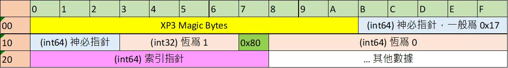

<style>
  :root {
    --my-bg-url: url('');
  }
  body {
    background-image: var(--my-bg-url);
    background-repeat: no-repeat ;
    background-position: left 0px top 75px;
    background-size: 50% auto;
  }
  @media screen and (max-width: 767px) { /* 手機版佈局 */
    body {
      background-image: unset;
      background-repeat: unset ;
      background-position: unset;
      background-size: unset;
    }
  }
  .page-header  {
    background-color: rgba(0,0,0,0.5);
    padding: 3px;
    border-radius: 5px;
  }
  .page-header .mt-1 span.post-meta {
    /* 隱藏嚇人的字數統計 */
    display: none;
  }
  .full-bg-img > .mask {
    background-color: rgba(0,0,0,0) !important;
  }
  :root {
  --color-mode: 'light';
  --body-bg-color: #a5dee4;
  --board-bg-color: rgba(255,255,255,0.8);
  --text-color: #3c4858;
  --sec-text-color: #718096;
  --post-text-color: #2c3e50;
  --post-heading-color: #1a202c;
  --post-link-color: #0366d6;
  --link-hover-color: #30a9de;
  --link-hover-bg-color: #f8f9fa;
  --navbar-bg-color: #3a8fb7;
  --navbar-text-color: #fff;
}
[data-user-color-scheme='dark'] {
  --body-bg-color: #2c4058;
  --board-bg-color: rgba(7, 0, 0, 0.85);
  --text-color: #c4c6c9;
  --sec-text-color: #a7a9ad;
  --post-text-color: #c4c6c9;
  --post-heading-color: #c4c6c9;
  --post-link-color: #1589e9;
  --link-hover-color: #30a9de;
  --link-hover-bg-color: #364151;
  --navbar-bg-color: #3a8fb7;
  --navbar-text-color: #d0d0d0;
}
</style>

<div class="alert alert-success" role="alert">
<b>Contributor：</b><br>
<b>首席研究者：</b>不願意透露姓名的正經大學電腦系畢業前途光明的美少女<br>
<b>助手：</b>辣妹系黑屁<br>
<b>技術顧問：</b>偶像百合美少女
</div>


| 資訊一覽     |                 |
| :----------- | :------------------------------------ |
| **遊戲引擎** | Kirikiri Z      |

本文是 Uncover XP3 系列的第二篇．如果你是第一次閱讀這個系列，建議先去看看 Uncover XP3 前篇．我們在那邊詳細介紹了 Kirikiri 引擎的 XP3 封包的文件結構，會對你理解本文有幫助．

## 前言

在前篇中，我們詳細介紹了 XP3 文件的內部格式．牠包含了一個文件頭，一個索引區域和一個文件數據區域，這些項目之間由指針連結，因此從文件頭開始，順着指針就可以到達文件的各個部分．


在這篇文章中，我們將進一步深入研究 XP3 文件．於是接下來各章的內容安排如下．

第七章將介紹 XP3 內部的文件壓縮方式和索引壓縮方式；
第八章將首先介紹一些簡單的密碼學基礎知識，然後詳細介紹 Kirikiri 引擎的加解密方式，和牠的插件的代碼實現，最後給出該加密系統的整體概觀；
第九章將使用逆向工程的方法對現實世界的 Kirikiri 遊戲的加密進行簡單分析．但是由於時間倉促，留下了許多懸而未決的問題，這些問題將一併列出．

## Chapter 7. 從非壓縮格式到壓縮格式

在前篇中我們主要對沒有壓縮的 XP3 封包格式進行了分析，本章則將詳細分析 XP3 文件中使用的壓縮方式．

本章的作者是電腦系美少女．

### 7.1 緒論

之前我們說道，XP3 包含的每一個文件都有一個對應的索引項來儲存該文件的 Metadata．現在重新將該索引項的結構總結如下圖所示．


可见其中有四个字段与大小有关：

- `entry.UnpackedSize`
- `entry.Size`
- `segment.Size`
- `segment.PackedSize`

在之前的测试中，这些字段都是一样的。这次我们来测试内容压缩的xp3文件中，这些信息会有什么变化。

### 7.2 文件內容的壓縮

> 我们准备了两个简单的纯文本文件用于接下来的测试。


首先使用GARBro分别进行压缩与无压缩打包：


为了对比，使用 BandiZip 分别使用最高等级压缩：


接下来我们使用010 Editor进行文件比较，发现有重合部分，即压缩后数据。


> 

我们根据[前文](xp3-research-1.md#53-索引指針)探讨的 xp3 结构，得到的压缩后文件内容数据为：

```
0028h  78 DA [F3 48 CD C9 C9 57 08 CF 2F CA 49 51 04 00]  xÚóHÍÉÉW.Ï/ÊIQ.. 
0038h  1C 49 04 3E 78 DA [0B 0A 42 02 89 00] 21 BF 04 8C  .I.>xÚ..B.‰.!¿.Œ
```

我们发现这两段文件相比于 .gz 中的压缩数据，分别在开头多了两个字节，结尾多了四个字节。

其中 `78 DA` 是 zlib 的魔数，表示最大压缩。

后面四个字节是ADLR字段的校验码


让我们试试自己用原文件进行校验计算


我们再回来看看四个大小字段


看样子它们分别存储压缩前后的长度，但两组信息貌似是一样的？接下来我们尝试对索引区域也进行压缩。

### 7.3 索引區域的壓縮

同时启用内容与索引压缩后：


根据第六章的整体结构结论，可以看到 `01`（索引已压缩）, `0x68`（压缩后索引大小），`0xF6`（压缩前索引大小）和其后 `78 DA` 前缀，压缩后的索引数据。

> 冬夜叔叔编写了神必小程序解压文件索引，Voilà

<details>
  <summary>神必小程序</summary>

```python
import zlib
import re

def compress_data(data):
    compressed_data = zlib.compress(data,level=9)
    return compressed_data

def decompress_data(data):
    decompressed_data = zlib.decompress(data)
    return decompressed_data

def pad_text(text, length):
    padded_text = text.ljust(length)
    return padded_text

def format_text(left_text, right_text):

    left_lines = [left_text[i:i + 48] for i in range(0, len(left_text), 48)]
    right_lines = [right_text[i:i + 16] for i in range(0, len(right_text), 16)]

    max_lines = max(len(left_lines), len(right_lines))

    formatted_lines = []

    for i in range(max_lines):
        left_line = left_lines[i] if i < len(left_lines) else ''
        right_line = right_lines[i] if i < len(right_lines) else ''

        left_line = pad_text(left_line, 48)

        line_number = hex(i*16)[2:].zfill(4) + 'h'

        formatted_line = '{:<6s} {:<48s}   {:<16s}'.format(line_number,left_line, right_line)
        formatted_lines.append(formatted_line)

    result = '\n'.join(formatted_lines)
    return result

def process_input(input,option):
    bytes_object = bytes.fromhex(input)
    processed_data = compress_data(bytes_object) if option else decompress_data(bytes_object)
    hex_string_output = ' '.join(['{:02X}'.format(byte) for byte in processed_data])
    printable = processed_data.decode('latin-1',errors='ignore')
    printable = re.sub(r'[\x00-\x1F]', '.', printable)
    print("\n結果為：\n")
    print("       0  1  2  3  4  5  6  7  8  9  A  B  C  D  E  F     0123456789ABCDEF\n")
    formatted_text = format_text(hex_string_output,printable)
    print(formatted_text)
    print("\n==========================================================================\n")
    print("For copy to clipboard:\n")
    print(hex_string_output+"\n\n"+printable)
    print("\n==========================================================================\n")

command = input("1. 壓縮\n2. 解壓\n")

if(command=="1"):
    while True:
        hex_string_input = input("請輸入需要壓縮的十六進制字符串：\n")
        process_input(hex_string_input,True)
elif(command=="2"):
    while True:
        hex_string_input = input("請輸入需要解壓的十六進制字符串：\n")
        process_input(hex_string_input,False)
```

</details>

将文件索引压缩后的数据替换为解压后数据，再与未压缩索引的文件对比：


结果符合第六章我们的结论。

再比较检验和：


`A1 17 19 13`，与前文压缩后数据中 `zlib` 添加的Adler32检验和一致。

> 值得注意的是，Adler32 的校驗和在文件中儲存的字節序有兩種情況，`A1 17 19 13` 是 010editor 的計算結果，暫且把牠當作 `0xA1171913`，然後 `zlib` 在儲存的時候使用的是 `Big Endian`，即從前往後是 `A1 17 19 13` ，而 XP3 在打包時候針對原文件計算的校驗和，儲存在索引項中 `adlr` 字段中的時候是 `Little Endian`，即 `13 19 17 A1`。

### 7.4 小結

在上文，我们验证了第六章的结论，即压缩后的索引信息结构如下：


## Chapter 8. Kirikiri 加密系統

### 8.1 緒論

### 8.2 密碼學背景

### 8.3 加解密插件的實現

### 8.4 Kirikiri 引擎的文件讀取邏輯

### 8.5 解密系統的全景圖

### 8.6 小結


## Chapter 9. 現實世界中的逆向工程分析

### 9.1 再回顧：解密部分邏輯中的數據結構

### 9.2 基於 Kirikiri 2 的解密插件的簡單分析

### 9.3 基於 Kirikiri Z 的嵌入式解密

### 9.4 尚未解決的問題


## 總結
