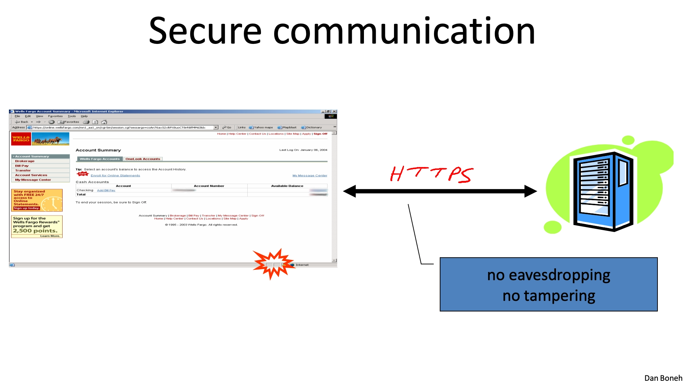

<style>
  .ar8x3{
    aspect-ratio: 8/3;
  }
  :root {
    --my-bg-url: url('');
  }
  body {
    background-image: var(--my-bg-url);
    background-repeat: no-repeat ;
    background-position: left 0px top 75px;
    background-size: 50% auto;
  }
  @media screen and (max-width: 767px) { /* 手機版佈局 */
    body {
      background-image: unset;
      background-repeat: unset ;
      background-position: unset;
      background-size: unset;
    }
  }
  .page-header  {
    background-color: rgba(0,0,0,0.5);
    padding: 3px;
    border-radius: 5px;
  }
  .page-header .mt-1 span.post-meta {
    /* 隱藏嚇人的字數統計 */
    display: none;
  }
  .full-bg-img > .mask {
    background-color: rgba(0,0,0,0) !important;
  }
  :root {
  --color-mode: 'light';
  --body-bg-color: #a5dee4;
  --board-bg-color: rgba(255,255,255,0.8);
  --text-color: #3c4858;
  --sec-text-color: #718096;
  --post-text-color: #2c3e50;
  --post-heading-color: #1a202c;
  --post-link-color: #0366d6;
  --link-hover-color: #30a9de;
  --link-hover-bg-color: #f8f9fa;
  --navbar-bg-color: #3a8fb7;
  --navbar-text-color: #fff;
}
[data-user-color-scheme='dark'] {
  --body-bg-color: #2c4058;
  --board-bg-color: rgba(7, 0, 0, 0.85);
  --text-color: #c4c6c9;
  --sec-text-color: #a7a9ad;
  --post-text-color: #c4c6c9;
  --post-heading-color: #c4c6c9;
  --post-link-color: #1589e9;
  --link-hover-color: #30a9de;
  --link-hover-bg-color: #364151;
  --navbar-bg-color: #3a8fb7;
  --navbar-text-color: #d0d0d0;
}
</style>

<div class="alert alert-success" role="alert">
<b>Contributor：</b><br>
<b>首席研究者：</b>不願意透露姓名的正經大學電腦系畢業前途光明的樂隊美少女<br>
<b>助手：</b>發情系富婆<br>
<b>助手：</b>辣妹系黑屁<br>
<b>插圖：</b>黑屁系辣妹<br>
<b>技術顧問：</b>偶像百合美少女<br>
<b>助手：</b>Your AI powered copilot!
</div>


| 資訊一覽     |                 |
| :----------- | :------------------------------------ |
| **遊戲引擎** | Kirikiri Z      |

本文是 Uncover XP3 系列的後篇．如果妳是第一次閱讀這個系列，建議先去看看 [🔗Uncover XP3 前篇](/article/20021)．我們在那邊詳細介紹了 Kirikiri 引擎的 XP3 封包的基本文件結構，會對妳理解本文有幫助．

<div class="d-block d-md-none alert alert-danger" role="alert">
  <span class="alert-heading font-weight-bold" style="font-size: 130%;">⚠️請使用電腦閱讀</span>
  <p>
    接下來的內容包含有大量插圖和代碼，請使用電腦閱讀，或者打開桌面版視圖，以獲得最佳體驗．
  </p>
</div>

## 前言

在前篇中，我們詳細介紹了 XP3 文件的內部格式．牠包含了一個文件頭，一個索引區域和一個文件數據區域，這些項目之間由指針連結，因此從文件頭開始，順着指針就可以到達文件的各個部分．


在這篇文章中，我們將進一步深入研究 XP3 文件．於是接下來各章的內容安排如下．

第七章將介紹 XP3 內部的文件壓縮方式和索引壓縮方式；
第八章將首先介紹一些簡單的密碼學基礎知識，然後詳細介紹 Kirikiri 引擎的加解密方式，和牠的插件的代碼實現，最後給出該加密系統的整體概觀；

> 第九章將使用逆向工程的方法對現實世界的 Kirikiri 遊戲的加密進行簡單分析．但是由於時間倉促，留下了許多懸而未決的問題，這些問題將一併列出．

## Chapter 7. 從非壓縮格式到壓縮格式

在前篇中我們主要對沒有壓縮的 XP3 封包格式進行了分析，本章則將詳細分析 XP3 文件中使用的壓縮方式．

本章的作者是發情系富婆．

### 7.1 緒論

之前我們說道，XP3 包含的每一個文件都有一個對應的索引項來儲存該文件的 Metadata．現在重新將該索引項的結構總結如下圖所示．


可见其中有四个字段与大小有关：

- `entry.UnpackedSize`
- `entry.Size`
- `segment.Size`
- `segment.PackedSize`

在之前的測試中，這些字段都是一樣的．這次我們來測試內容壓縮的 XP3 文件中，這些信息會有什麼變化．

### 7.2 文件內容的壓縮

我們準備了兩個簡單的純文本文件用於接下來的測試．


首先使用 GARBro 分別進行壓縮與無壓縮打包：


為了對比，使用 BandiZip 分別使用最高等級壓縮：


接下來我們使用 010 Editor 進行文件比較，發現有重合部分，即壓縮後數據．


我們根據 [🔗Uncover XP3 前篇](/article/20021 中探討的 xp3 結構，得到的壓縮後文件內容數據為：

```
0028h  78 DA [F3 48 CD C9 C9 57 08 CF 2F CA 49 51 04 00]  xÚóHÍÉÉW.Ï/ÊIQ.. 
0038h  1C 49 04 3E 78 DA [0B 0A 42 02 89 00] 21 BF 04 8C  .I.>xÚ..B.‰.!¿.Œ
```

我們發現這兩段文件相比於 .gz 中的壓縮數據，分別在開頭多了兩個字節，結尾多了四個字節．

其中 `78 DA` 是 zlib 的頭部標誌，表示最大壓縮．

後面四個字節是 zlib 添加的 Adler32 校驗和，可以看到和 XP3 的 adlr 字段一致．


讓我們試試自己用原文件進行校驗和計算


最後，我們再回來看看索引項中的四個大小字段．


看樣子這些大小字段分別存儲壓縮前後的長度，但兩組信息貌似是一樣的．

### 7.3 索引區域的壓縮

接下來我們嘗試對索引區域也進行壓縮．
同時啟用內容與索引壓縮後：


根據第六章的整體結構結論，可以看到 `01`（索引已壓縮）, `0x68`（壓縮後索引大小），`0xF6`（壓縮前索引大小）和其後 `78 DA` 前綴，壓縮後的索引數據．

> 寫個神必小程序解壓文件索引，Voilà

<details>
  <summary>神必小程序</summary>

```python
import zlib
import re

def compress_data(data):
    compressed_data = zlib.compress(data,level=9)
    return compressed_data

def decompress_data(data):
    decompressed_data = zlib.decompress(data)
    return decompressed_data

def pad_text(text, length):
    padded_text = text.ljust(length)
    return padded_text

def format_text(left_text, right_text):

    left_lines = [left_text[i:i + 48] for i in range(0, len(left_text), 48)]
    right_lines = [right_text[i:i + 16] for i in range(0, len(right_text), 16)]

    max_lines = max(len(left_lines), len(right_lines))

    formatted_lines = []

    for i in range(max_lines):
        left_line = left_lines[i] if i < len(left_lines) else ''
        right_line = right_lines[i] if i < len(right_lines) else ''

        left_line = pad_text(left_line, 48)

        line_number = hex(i*16)[2:].zfill(4) + 'h'

        formatted_line = '{:<6s} {:<48s}   {:<16s}'.format(line_number,left_line, right_line)
        formatted_lines.append(formatted_line)

    result = '\n'.join(formatted_lines)
    return result

def process_input(input,option):
    bytes_object = bytes.fromhex(input)
    processed_data = compress_data(bytes_object) if option else decompress_data(bytes_object)
    hex_string_output = ' '.join(['{:02X}'.format(byte) for byte in processed_data])
    printable = processed_data.decode('latin-1',errors='ignore')
    printable = re.sub(r'[\x00-\x1F]', '.', printable)
    print("\n結果為：\n")
    print("       0  1  2  3  4  5  6  7  8  9  A  B  C  D  E  F     0123456789ABCDEF\n")
    formatted_text = format_text(hex_string_output,printable)
    print(formatted_text)
    print("\n==========================================================================\n")
    print("For copy to clipboard:\n")
    print(hex_string_output+"\n\n"+printable)
    print("\n==========================================================================\n")

command = input("1. 壓縮\n2. 解壓\n")

if(command=="1"):
    while True:
        hex_string_input = input("請輸入需要壓縮的十六進制字符串：\n")
        process_input(hex_string_input,True)
elif(command=="2"):
    while True:
        hex_string_input = input("請輸入需要解壓的十六進制字符串：\n")
        process_input(hex_string_input,False)
```

</details>

將文件索引壓縮後的數據替換為解壓後數據，再與未壓縮索引的文件對比：


結果符合第六章我們的結論．

再比較檢驗和：


`A1 17 19 13`，與前文壓縮後數據中 `zlib` 添加的 Adler32 檢驗和一致．

值得注意的是，Adler32 的校驗和在文件中儲存的字節序有兩種情況，`A1 17 19 13` 是 010editor 的計算結果，暫且把牠當作 `0xA1171913`，然後 `zlib` 在儲存的時候使用的是 `Big Endian`，即從前往後是 `A1 17 19 13` ，而 XP3 在打包時候針對原文件計算的校驗和，儲存在索引項中 `adlr` 字段中的時候是 `Little Endian`，即 `13 19 17 A1`．


### 7.4 是先加密還是先壓縮？

還有一個令人感興趣的問題是，如果我們在發佈 XP3 時同時啓用了加密和壓縮，那麼是先加密還是先壓縮呢？要弄清楚這個問題，其實只需要用 GARbro 分別進行無壓縮和無加密的打包，然後對比一下兩個 XP3 文件的二進制數據和對應的校驗和就可以了．但是在開始實驗之前，先讓我講一下我對這個問題的猜測．

數據壓縮的原理是，對於一團數據，如果我們能夠找到牠內部的規律，並且讓這個規律可以用更少的數據來表示，那麼我們就可以對數據進行壓縮．文本文件的數據非常規律，裏面只有固定的字母和符號，所以可以輕易實現非常好的壓縮效果．

用 010editor 打開一個文本文件，並且觀察其內容如下圖 7.4.1 所示：


圖中的右半邊是文件的內容，左半邊是文件的二進制數據，然後最左邊帶有顏色的長條是該文件的「地形圖」，牠將相近的字節用相近的顏色表示．可以看到，文件的內容是非常規律的，所以地形圖中的顏色也是非常規律的．

然後我再用 010editor 打開一個被加密的文件，並且觀察其內容如下圖 7.4.2 所示：


可以看到，加密文件的內容是非常隨機的，所以地形圖中的顏色也是非常隨機的．這就導致整個文件看上去毫無規律，所以壓縮的效果會非常差．

綜上所述，我們可以得出一個結論，那就是「先壓縮再加密」的效果會比「先加密再壓縮」的效果要好．

然而，事情有這麼簡單嗎？講個笑話，日本人的 IT 水平真的是太差了，他們的 XP3 文件格式就是先加密再壓縮的．讓我用一個實驗就驗證這個事實．

我準備了一個文件，裏面有 256 個字節，每個字節都是 `0xAA`，然後我

 1. 計算牠的 Adler32 校驗和，得到 `0x5AFBAA01`，
 2. 用 GARbro 單獨壓縮這個文件，得到一個文件如圖 7.4.3 所示．
 3. 用 GARbro 單獨加密這個文件，得到一個文件如圖 7.4.4 所示．
 4. 用 GARbro 同時加密和壓縮這個文件，得到一個文件如圖 7.4.5 所示．


可以看到 256 個字節被壓縮成了 12 個字節（圖中的淺藍色的部分），壓縮率達到了 4%，這是非常好的壓縮率．


我選擇了 GARbro 提供的千戀萬花加密，可以看到加密之後的數據非常地隨機，，，
非常地隨機，，，
隨機，，，

？？？妳這個加密怎麼這麼陽春？？？原文件裏面的特徵都完整地保留了下來，這樣壓縮的效果肯定會非常好捏．纔怪！！妳這讓我文章很難寫！！！

> 之後我還嘗試了其他的加密方式，結果都是一樣的，所以我就不再多做介紹了．

然後我一臉苦逼地計算了這 256 個 `0x3A` 的校驗和，牠是 `0x1FB33A01`


可以看到，壓縮的效果非常好．我已經徹底無話可說了，日本人的垃圾加密 + 垃圾壓縮方式起到了負負得正的效果，難道這一切不是在計算之中嗎？？

話說回來，圖中的粉紅色圓圈是 zlib 計算的原數據的校驗和，牠就是上面**被加密過**的數據的校驗和．
圖中的藍色圓圈是 XP3 生成器計算的原數據的校驗和，牠就是上面**沒被加密過**的數據的校驗和．

所以，牠真的是先加密再壓縮的，，，我真的無話可說了，，，

### 7.5 小結

本章中我們驗證了文件內容的壓縮算法，牠使用了 zlib 進行最大程度的壓縮，並且 zlib 會在壓縮之後的數據中添加一個 `78 DA` 的頭部和一個 Adler32 校驗和的尾部．

同時我們也驗證了索引區域的壓縮也使用了和文件數據壓縮完全一樣的壓縮算法．最後，總結壓縮後的索引區域的結構如下圖：


最後，我們驗證了日本人令人智熄的加密方案，牠們是先加密再壓縮的．

## Chapter 8. Kirikiri 加密系統

XP3 文件的加密是 Kirikiri 的一個重要功能，是分析 XP3 文件時候的一個繞不開的部分．
雖然有點中二，俺還是想說：

<div class="alert alert-danger" role="alert">
  <span class="alert-heading font-weight-bold font-italic" style="font-size: 130%;">我們要正式開始了</span>
  <p>
    接下來的內容可能會有點抽象，尤其是對於不是電腦系的羣友．我將盡我所能詳細解說，但是如果妳還是覺得過於費解的話，妳可以看完下面的緒論就放心地跳過——不董這些抽象玩意不會影響到妳玩 Galgame！
  </p>
</div>

本章的作者是辣妹系黑屁．

### 8.1 緒論

到上章爲止我們介紹了 XP3 使用的數據壓縮方式．除此之外，krkr 還給 Galgame 公司提供了一個接入加密功能來保護 XP3 數據的機會，那就是本章要介紹的加密功能．

雖然缺少官方的文檔和說明，但是 krkr 的加密是一個內置的功能，但是並不是完全內置，牠以外接加密算法的形式運行，如圖所示：


勘誤：krkr 的加解密不是處理一個連續的文件流，而是處理一個外面遞進來的數據塊．

當需要啓用加密功能時，妳需要自己實現一個加密函數和配套的解密函數，然後以某種方式遞給 krkrrel 或者 krkr 引擎．

在 krkr 2 時代，一個比較常見的方法是把妳的加密函數和解密函數分別製作成兩個 dll，然後 export 妳的函數入口點（🈯️將妳的 dll 內部函數暴露出來，供其他程序調用），這樣官方的 XP3 生成器 krkrrel 和 krkr 就都可以調用妳寫的代碼了．

就這樣，遊戲公司在發佈遊戲的 XP3 文件時，會使用 krkrrel 對遊戲數據進行打包，而此時 krkrrel 會調用遊戲公司提供的加密插件對數據進行加密．最後遊戲公司在發佈遊戲時，會將配套的解密插件連同遊戲一起發佈給玩家．玩家在遊玩的時候，krkr 會調用遊戲公司提供的解密插件完成對遊戲數據的解密和讀取．

關於如何實現這麼一組插件 dll，我將在下面的 8.3 小節詳細說明．
這裏先列出一個參考文獻，牠對如何開發 krkr 的加解密插件進行了介紹．妳可以先不用看．

> 🔗吉里吉里/KAGでのデータ暗号化方法例
> http://keepcreating.g2.xrea.com/DojinDOC/HowToCode.html

### 8.2 密碼學背景

不過在開始談加解密插件的實現之前，我想先介紹一些密碼學裏面的基礎知識，希望能幫助羣友理解後文的內容．

<br>

<span class="alert-heading font-weight-bold text-danger" style="font-size: 110%;">👒 密碼和密鑰有什麼區別？</span>

密碼（Password）和密鑰（Key，注意不要唸作密匙，，，）是兩個容易混淆的概念．妳平時在各種網站上或者連 Wi-Fi 的時候輸入的密碼，像什麼 123456，password，妳的手機號或者前女友的生日，其實都是「口令」，是一個只有妳才知道的暗號，牠並不直接參與加密的運算．

妳的密碼可能長下面這樣：

```
123456
password
13065778103
19980721
...
```

而密鑰是一串數據（字節），並且直接參與加解密的**數學運算**．密鑰並不能直接打印或者寫出來，妳也不需要去牢記牠，因爲有一些算法可以幫妳用密碼來生成密鑰，這樣妳就可以用密碼來加密妳的文件了．

妳的密鑰用二進制查看器可能是長這樣的（假設長度是 16 個 byte）：

```
       0  1  2  3  4  5  6  7  8  9  A  B  C  D  E  F   ASCII
0000h  29 6B D6 EB 2C A9 03 21 BB EF 5F 5F 4C FC 10 EC  )kÖë,©.!»ï__Lü.ì 
這個部分是密鑰↗️
```

下文的加解密需要我們直接和密鑰打交道．最後再次提醒，不要用手機號和前女友的生日來做密碼，因爲知道這些的不只是妳一個人...！

<br>

<span class="alert-heading font-weight-bold text-danger" style="font-size: 110%;">👒 什麼是異或（XOR）？</span>

異或（又稱爲 XOR，Exclusive OR 或者互斥或）是一個運算符，牠的符號是 ⊕．
簡單地說，牠的功能就是找不同．如果我把一個 bit 的 1 和 0 輸入 XOR，那麼就會得到下面的結果：

<div>Table 8.2 異或真值表</div>

| 第一個輸入 | 第二個輸入 | 輸出 | 真假？ |
| --- | --- | --- | --- | 
| 0 | 0 | 0 | 假 |
| 0 | 1 | 1 | 真 |
| 1 | 0 | 1 | 真 | 
| 1 | 1 | 0 | 假 | 

可以看到，當兩個輸入不一樣的時候，XOR 纔會輸出 真，因此本質上就是找不同．

讓我們 XOR 一下 byte（也就是 8 個 bit）：

```
      10110100
XOR   00101101 
---------------
  =   10011001
```

可以看到，當上下的兩個 byte 的位不同的時候，輸出結果纔是 1．因此對更長的內容計算 XOR 的時候，本質上就是對各個 bit 進行逐個 XOR．

現在我們對圖像進行 XOR 運算．畫布上白色的像素代表 0，黑色的像素代表 1．
下圖中，A 和 B 是原圖像，C 是 XOR 的輸出結果．可見 A 和 B 相同的部分（尤其是黑色的實線正方形邊框）經過 XOR 後在 C 中已經归零．


從圖中我們還能發現，連續進行兩次相同的 XOR 運算，即 A ⊕ B ⊕ B，會得到原數據 A．利用這個性質，我們可以設計一個簡單的加密．

首先原數據是 A，加密密鑰是 B，經過 A ⊕ B 的計算即可得到密文 C．
解密時，計算 C ⊕ B 即可得到原文 A．

最後，放一個動畫來幫助第一次聽說 XOR 的羣友加深印象．

<video class='mb-3' playsinline="" autoplay="" muted="" loop="" controls="" width='100%'>
    <source src="https://s3static-zone0.galgamer.eu.org/video-2d35/xp3-2/xor1.mp4" type="video/mp4">
</video>
<p class="image-caption">Fig 8.2.2 使用 XOR 進行加解密</p>

妳可能會問爲什麼我要在一開始就介紹 XOR 的概念，那是因爲 XOR 實在是過於重要，牠在各種加解密算法中被大量使用．包括各個 Galgame 廠商自己實現的加密算法，這些算法的前半部分可能在幹各種各樣的事情，但是最後一步多少都是在通過 XOR 進行加密或者解密．

<br>

<span class="alert-heading font-weight-bold text-danger" style="font-size: 110%;">👒 對稱加密法</span>

接下來要介紹的是對稱加密．簡單地來說牠使用相同的密鑰來加密和解密，如圖所示：


有人可能就要說了，這不是廢話嗎？沒有一樣的密鑰還能解密❓確實，在對稱加密的世界加密和解密需要同一個密鑰，但是還有一種非對稱加密，這種加密需要兩個密鑰，用其中一個進行加密之後，用另外一個才能解密．由於本文中針對 XP3 數據的加密都是對稱加密，所以非對稱的部分先略過．有興趣的羣友可以自己去看看維基百科．

<br>

<span class="alert-heading font-weight-bold text-danger" style="font-size: 110%;">👒 爲什麼需要加密？</span>

有了對稱加密法之後，我們再來思考一下加密的目的是什麼．從蕞一般的場景來說，加密的目的是爲了保證通信的安全，確保數據不被竊聽或者篡改．比如大家都非常熟悉的 HTTPS，牠保護了用戶上網的流量不被竊聽，如下圖：



> 容我盜竊一張斯坦福的 Cryptography I 課程的 PPT

但是在 krkr 的世界中並不需要進行通信，那麼加密的目的或者說加密的意義在哪裏呢？設想一下，現在屏幕前的妳加密自己的文件的目的是什麼？是不是想要防止別人偷看和篡改？於是這種情況就成了「現在的妳」想要和「未來的妳」進行通信，並且防止通信內容（色圖）遭到泄漏和篡改，如圖：


> 容我再盜竊一張

此時再回到 krkr 就不難理解牠們進行加密的目的是什麼了．**遊戲公司想要和未來購買遊戲的玩家的電腦中的 krkr 進行安全通信，防止遊戲數據被泄露或者篡改**，說白了就是防止玩家提取遊戲中的數據．然而要達到這一點，光有加密和密碼學技術是不夠的，不然現在 E-Hentai 裏面也不會各種遊戲 CG 滿天飛了．

草，感覺這一小節講了一個衆所周知而且很顯而易見的事情，請原諒我的廢話，，，

<br>

<span class="alert-heading font-weight-bold text-danger" style="font-size: 110%;">👒 流式加密</span>

上面鋪墊了半天，終於到了我真正想講的重點了，希望妳還記得對稱加密是什麼．

對稱加密可以分為兩種類型：流式加密和塊式加密．
我們關心的是流式加密．流指的是一串很長很長的字節流．想象把一個文件拉成長長的一串字節，然後字節可以繼續拉開成 bit，如下圖所示．

<video class='mb-3' playsinline="" autoplay="" muted="" loop=""  controls="" width='100%'>
    <source src="https://s3static-zone0.galgamer.eu.org/video-2d35/xp3-2/filecontent2.mp4" type="video/mp4">
</video>
<p class="image-caption">Fig 8.2.6 文件可以看作字節流</p>


然後再使用**「密鑰流生成函數」**，這個函數吸收一個密鑰，然後產生無限長的密钥流．這個密钥流也是一串字節．並且具有無限的長度．
簡單地說，只要知道了密鑰，就可以生成那個唯一的密钥流．**如同高中數學中的數列一樣**，給定一個確定的生成規律，妳就可以無限地往後遞推；或者直接給定一個通項公式，妳就可以求出數列中的任意一位，如下圖所示．

<video class='mb-3' playsinline="" autoplay="" muted="" loop=""  controls="" width='100%'>
    <source src="https://s3static-zone0.galgamer.eu.org/video-2d35/xp3-2/genstream.mp4" type="video/mp4">
</video>
<p class="image-caption">Fig 8.2.7 生成函數產生密鑰流</p>

最後，將密鑰流和需要加密的原文件進行逐個 bit 的 XOR，完成加密，如圖．

<video class='mb-3' playsinline="" autoplay="" muted="" loop=""  controls="" width='100%'>
    <source src="https://s3static-zone0.galgamer.eu.org/video-2d35/xp3-2/xorenc.mp4" type="video/mp4">
</video>
<p class="image-caption">Fig 8.2.8 流式加密過程</p>

看到這裏妳可能會匪夷所思，爲什麼這麼一個簡單的 XOR 也可以達到加密的效果．爲了說明這一點，讓我們再觀察一下表 8.2．

<div>Table 8.2 異或真值表</div>

| 第一個輸入 | 第二個輸入 | 輸出 | 真假？ |
| --- | --- | --- | --- | 
| 0 | 0 | 0 | 假 |
| 0 | 1 | 1 | 真 |
| 1 | 0 | 1 | 真 | 
| 1 | 1 | 0 | 假 | 

假設第一個輸入是原文，第二個輸入是密鑰流，輸出是加密後的數據．現在我們拿到了加密後的數據，無論牠是 0 還是 1，對應的原文都有 0 或者 1 兩種可能．如果我們不知道密鑰流對應的位是 0 還是 1，那麼將無法猜測原文到底是 0 還是 1，因爲牠們各佔 50% 的可能性．

解密時，根據上面介紹的雙重 XOR 恢復原文的性質，只需要把密文和密鑰流再進行一下 XOR，就可以拿到原文了． 

> 這裏的示例來自 chacha20 流式加密算法，牠簡單高效而且常用．
> 我使用的密鑰事
> ```ascii
> 00 01 02 03 04 05 06 07 08 09 0A 0B 0C 0D 0E 0F
> 10 11 12 13 14 15 16 17 18 19 1A 1B 1C 1D 1E 1F
> ```
> 我使用的 nonce（一次性序列）事
> ```ascii
> AA AA AA AA AA AA AA AA AA AA AA AA
> ```
> 通過調整 chacha20 的計數器，可以一瞬 seek 到密鑰流的任意位置，意思是牠事有「通項公式」的．這裏把計數器初始化爲 0.
> 上面這些只是我的示例！Galgame 公司也不一定使用 chacha20 進行加密，妳要是不董 chacha20 也不影響妳繼續閱讀本文．

最後再來思考一下，如果要從把文件的正中間——比如說從第 1000 個字節開始到 1200 個字節爲止——進行解密，要怎麼做．
可以把步驟列出來如下：

 - **來到文件流的第 1000 個字節**（fancy 一點的說法是：seek 到文件流的第 1000 個的位置）
 - **seek 到密鑰流的第 1000 個的位置**
 - **把上面兩個流開 XOR！直到第 1200 個字節爲止**

一步一步第來看，首先我們要 seek 文件，這很簡單，因爲告訴硬盤往後轉個 1000 個字節就完事了．但是要 seek 密鑰流就沒那麼簡單了，因爲密鑰流是生成函數生成的，並且具有無限的長度（妳可以理解成無窮項的數列）．當然，如果這個生成函數有通項公式，那麼就可以一瞬計算出第 1000 項是什麼；但是如果不幸這個函數沒有通項公式的話，妳就必須要從頭開始往後遞推了．

> 數學 nerd 不要欺負我，我指的是沒有初等函數形式的通項公式．

如果是那種不幸的情況，步驟就要變成下面這樣了：

 - **seek 到文件流的第 1000 個的位置**
 - **這密鑰流沒有「通項公式」沒法 seek 啊**．只能從頭開始往後遞推計算，直到第 1000 項．
 - **把上面兩個流開 XOR！直到第 1200 個字節爲止**

於是密鑰流生成函數的好壞直接關係到加密算法的好壞，好的生成函數可以直接 seek 節省不必要的運算，並且更加難以破解．

然而，世界上有一些加密算法，牠們在解密的時候，不僅需要使用密鑰流進行 XOR，**並且還需要知道前一塊數據的內容**，如圖所示：


這種解密下一塊數據要依賴上一塊數據的加密算法，會使得文件不能直接從中間開始解密，有的時候甚至必須要從頭開始運算．

------

還有另外一種塊式加密，牠是把原文切割成相等大小的小塊分別加密，這裏就不多介紹了．

密碼學是一門很有趣的學科，如果妳有興趣，可以去看一下斯坦福的 Cryptography I 公開課．

> 🔗Cryptography I Course (Stanford) | Coursera
> https://www.coursera.org/learn/crypto
> 

我只看了一點沒看完，麻煩羣友學完了教我，嚶嚶，，，

### 8.3 加解密插件的實現

好啦，上面鋪墊了老半天，重點終於要來啦．我們知道了 krkr 的加解密函數都要做成 dll 插件，並且分別暴露加解密函數的入口點．但是開始說明如何實現之前，讓我再鋪墊一下關於 Windows APP 編程的基礎知識．

什麼是 DLL？DLL 內部是一大堆函數，妳可以理解成一個函數庫．當把一些常用函數打包到 DLL 裏面以後，就可以從多個 EXE 程序裏面進行調用，這樣就節省了將完全一樣的代碼塞進多個 EXE 程序而浪費掉的儲存空間．然後使用 DLL 的另外一個優點就是主程序可以在需要的時候才進行調用，實現了類似於插件的效果，如圖 8.3.1 所示：


DLL 裏面的函數必須要導出接口（暴露函數入口點），這樣才能被其他程序調用．
而這個 krkr 的加解密函數內部如何實現，則是完全由插件作者自己決定的．

幸運的是，krkr 2 的官方倉庫裏面提供了一個加解密插件的模板，我們可以觀察牠的代碼，來了解一下 krkr 的加解密插件的實現．

首先牠有一個 readme 說明在這裏：

> [🔗牠們的 GitHub 倉庫](https://github.com/krkrz/krkr2/blob/master/kirikiri2/branches/2.32stable/kirikiri2/src/plugins/win32/xp3filter/changes.txt)
> 

牠裏面提到，我們寫的加解密函數在接收參數的時候，不會接收到文件名和文件路徑，而是接收到文件的校驗和，從而使得對每個文件使用不同的加密方式成爲可能．

- 讓我聯想到 Ambitious Mission 的 XP3 內部不再儲存文件名

讓我們觀察一下解密插件（xp3dec）的 [🔗main.cpp](https://github.com/krkrz/krkr2/blob/master/kirikiri2/branches/2.32stable/kirikiri2/src/plugins/win32/xp3filter/xp3dec/main.cpp) 文件．

在最開始的註釋處作者提到：這個解密函數是通過 krkr 的插件系統來加載的，因此如果要將解密函數打包成 dll 然後讓 krkr 進行動態連結，就必須要遵守『krkr 引擎插件開發規範』．這個規範在哪裏❓我暫時還沒有找到．但是我找到了官方文檔和一些別人寫的說明．

> 🔗プラグインについて
> https://krkrz.github.io/krkr2doc/kr2doc/contents/Plugins.html

> 🔗吉里吉里プラグインの作り方
> http://keepcreating.g2.xrea.com/DojinDOC/HowToWriteKrkrPlugin.html

> 🔗吉里吉里トランジションプラグインの作り方
> http://keepcreating.g2.xrea.com/DojinDOC/HowToWriteTransitionPlugin.html

僅供參考，我沒有仔細看過．讓我們回到 main.cpp 文件，牠包括了兩個頭文件：

```cpp
#include <windows.h>
#include "tp_stub.h"
```

第一個是 windows API，第二個應該是 krkr 內部定義的一些函數庫，這樣就可以在加解密過程中調用 krkr 的各種功能了．

關於 krkr API 的函數庫之後再說．

先拉到底下，可以看到一個 DllEntryPoint 的函數：

```cpp
int WINAPI DllEntryPoint(HINSTANCE hinst, unsigned long reason,	void* lpReserved)
{
	return 1;
}
```

根據 AI 的解釋：

> 根據網絡搜索結果，int WINAPI DllEntryPoint 是一個可選的動態鏈接庫（DLL）的入口點函數。
> int 是函數的返回值類型，表示整數。

> WINAPI 是一個宏，定義了函數的調用約定為 __stdcall 。這種調用約定要求函數的參數從右向左入棧，並由函數自身清理棧。WINAPI 和 CALLBACK 以及 APIENTRY 都是用來定義 __stdcall 調用約定的宏。

> DllEntryPoint 是函數的名字，它是一個佔位符，您可以在構建DLL時指定實際使用的名字。

> 這個函數有三個參數：hinstDLL 是DLL模塊的句柄，fdwReason 是調用函數的原因代碼，lpvReserved 是保留參數。
> 這個函數的作用是在系統啟動或終止一個進程或線程時，為每個加載的DLL調用該函數。它也可以在使用 LoadLibrary 和 FreeLibrary 函數加載或卸載DLL時被調用。它可以用來執行一些簡單的初始化和清理任務。

意思是，當 Windows 程序在加載或者卸載 DLL 時，如果有這麼一個入口點函數存在，那麼系統就會主動調用一次這個函數．這個函數可以執行一些初始化的任務之類的，但是完全沒有這個函數的 DLL 也是沒問題的．只是這個示例中，牠有這個入口函數．

最底下是兩個函數：

```cpp
extern "C" HRESULT _stdcall V2Link(iTVPFunctionExporter *exporter)
{
	// V2Link は、吉里吉里本体とリンクされるときに呼び出される関数です
	
	// スタブの初期化(必ず記述する)
	TVPInitImportStub(exporter);

	// TVPSetXP3ArchiveExtractionFilter 関数に
	// TVPXP3ArchiveExtractionFilter を指定し、コールバック関数を設定する
	TVPSetXP3ArchiveExtractionFilter(TVPXP3ArchiveExtractionFilter);

	return S_OK;
}
//---------------------------------------------------------------------------
extern "C" HRESULT _stdcall V2Unlink()
{
	// V2Unlink は、吉里吉里本体から切り離されるときに呼び出される関数です

	// 一応 TVPSetXP3ArchiveExtractionFilter に NULL を渡し、
	// コールバック関数の登録を解除する
	TVPSetXP3ArchiveExtractionFilter(NULL);

	// スタブの使用終了(必ず記述する)
	TVPUninitImportStub();

	return S_OK; 
}
```

根據和這個 cpp 文件同一個目錄下的 .def 文件，我們可以得知這個 dll 牠***導出***了兩個函數給操作系統，分別是 V2Link 和 V2Unlink．利用各種二進制分析工具（比如 IDA）查看編譯過後的 dll 的話，可以輕易地看見這兩個函數在***導出表***中．

**在 krkr 加載插件的時候，krkr 會主動調用妳編寫的 V2Link 函數，卸載時會調用妳編寫的 V2Unlink 函數．**因此在 V2Link 的函數中，妳可以通過調用 krkr 的 API 來進行一些函數替換，功能添加等操作，從而實現插件的效果．

上面的代碼中，牠在 V2Link 函數中調用了 `TVPInitImportStub` 函數，這個函數的作用是初始化一個函數庫，這個函數庫的作用是將 krkr 的 API 封裝成一個個函數，方便插件開發者使用．但是 `TVPSetXP3ArchiveExtractionFilter` 很明顯就是在通知 krkr 主程序，接下來請使用我指定的濾鏡函數，名字叫做 `TVPXP3ArchiveExtractionFilter` 來進行 XP3 的解密喲！．

至於爲什麼這兩個函數要叫做 Filter，可能牠是想把妳的加解密比喻成一個**濾鏡**，當明文數據通過加密濾鏡之後就變成了加密數據，反過來則是變回明文．而這個過程對 krkrrel 和 krkr 透明，牠們並不關心妳的內部實現，只要妳保證了牠們能拿到想要的數據就行，因此才叫做 Filter．如下圖所示：


哈哈這張圖完全是我意淫出來的，牠的數據流向根本不長這樣，但是我覺得這樣比較好理解，就這樣吧．

現在我們來看真正的解密函數 `TVPXP3ArchiveExtractionFilter` 函數，牠裏面包含了很多註釋，妳可以去看看．

```cpp
void TVP_tTVPXP3ArchiveExtractionFilter_CONVENTION
	TVPXP3ArchiveExtractionFilter(tTVPXP3ExtractionFilterInfo *info)
{
	// TVPXP3ArchiveExtractionFilter 関数は本体側から呼び出される
	// コールバック関数です。
	// 引数を一つ取り、それは tTVPXP3ExtractionFilterInfo 構造体へのポインタ
	// です。

	// TVPXP3ArchiveExtractionFilter は、後述の V2Link 関数内で
	// TVPSetXP3ArchiveExtractionFilter により設定されます。

	// ここでは単純に、xp3enc.dll のサンプルで作成された XP3 アーカイブを
	// 復号すべく、データをすべて FileHash の最下位バイトで XOR
	// することにします。

	// この関数は複数のスレッドから同時に呼び出される可能性があるので
	// 注意してください。

	/*
		tTVPXP3ExtractionFilterInfo のメンバは以下の通り
		* SizeOfSelf        : 自分自身の構造体のサイズ
		* Offset            : "Buffer" メンバが指し示すデータが、
		*                   : アーカイブに格納されているそのファイルの先頭からの
		*                   : どのオフセット位置からのものか、を表す
		* Buffer            : データ本体
		* BufferSize        : "Buffer" メンバの指し示すデータのサイズ(バイト単位)
		* FileHash          : ファイルの暗号化解除状態でのファイル内容の32bitハッシュ
	*/

	// 一応構造体のサイズをチェックする
	if(info->SizeOfSelf != sizeof(tTVPXP3ExtractionFilterInfo))
	{
		// 構造体のサイズが違う場合はここでエラーにした方がよい
		TVPThrowExceptionMessage(TJS_W("Incompatible tTVPXP3ExtractionFilterInfo size"));
			// TVPThrowExceptionMessage は例外メッセージを投げる関数
			// この関数は戻らない ( もっと呼び出し元をさかのぼった位置で
			// 例外が補足されるため )
	}

	// 復号
	tjs_uint i;
	for(i = 0; i < info->BufferSize; i++)
		((unsigned char *)info->Buffer)[i] ^= info->FileHash;
}
```

到目前爲止還是看不出牠加解密是不是以整個文件爲單位的．（很可能不是，詳細見下）

<span class="alert-heading font-weight-bold text-danger" style="font-size: 110%;">👒 krkr 到底支持何種程度的加密？</span>

之前我們說到 krkr 支持基於文件的加密，意思是 XP3 包裏面的每一個小文件都會獨立通過加解密濾鏡並單獨加解密．

<div class="alert alert-warning" role="alert">
  <p>
    我很想知道 krkr 的加解密是一定要以整個文件爲單位，還是可以單獨加解密一個文件中的區區一部分的 byte．但是我覺得是前者（❓我不是完全確定，但是應該八九不離十）．
  </p>
  <span>👆🏻然後我就被打臉了，牠事支持隨機存取（從文件中間直接開始解密）的．</span>
</div>

先說我錯誤的意淫，以整個文件爲單位的加解密，私以爲可能是出於以下的考慮：

  1. 避免讀取同一個文件的時候要重複調用解密函數．
  2. krkr 的讀取文件的邏輯是重複利用一條文件流，
  3. 從我貧瘠的密碼學理解來看，更安全的 CBC 式加密依賴於前面處理過的數據，因此要解密下一塊數據，就必須要知道上一塊數據的狀態，以此類推到第一塊數據．如果 krkr 的解密允許從文件的中間部分進行解密，那麼就不能使用 CBC❓，這樣加密安全性就會大打折扣，因此我覺得牠加解密應該是以文件爲單位的❓
**👆🏻說得根本不對，而且小日子的加密，要甚麼安全...！！**

於是讓我來仔細研究一下牠模板代碼裏面提供的解密函數（把註釋去掉再發一遍），
仔細看好了...！！

```cpp
void TVP_tTVPXP3ArchiveExtractionFilter_CONVENTION
	TVPXP3ArchiveExtractionFilter(tTVPXP3ExtractionFilterInfo *info)
{
	tjs_uint i;
	for(i = 0; i < info->BufferSize; i++)
		((unsigned char *)info->Buffer)[i] ^= info->FileHash;
}
```

這個函數的作用就是對 XP3 文件中的每一個文件進行解密，解密的方式就是對每一個字節進行 XOR 運算．這個函數的參數是一個結構體，結構體中包含了一個指向要解密的數據的指針，以及數據的大小．

👆🏻真是張口就來，要徹底理解這個函數，我們必須先弄清楚那個 info 結構體裏面到底是啥．

經過檢查代碼，我找到了這個結構體的定義，我也懶得發 [🔗代碼](https://github.com/krkrz/krkrz/blob/fd5c4baa6a2ef5978db1bd043634351f48667daf/base/XP3Archive.h#L27) 了，直接上圖：


假設我們用的 krkr 是 32 位的，那麼裏面的指針或者 uint 啥的就是 32 位的整數．

然後再回到剛才的代碼，牠寫道：

```cpp
((unsigned char *)info->Buffer)[i] ^= info->FileHash;
```

這是在幹嘛捏，首先牠先取出了緩衝區的第 i 個字節，然後對牠進行 XOR 運算，運算的對象是 info 結構體裏面的 FileHash（該文件的校驗和）．但是這個 FileHash 是 4 字節整數阿！那麼這個運算是怎麼進行的呢？直接給我看傻了．相信在座的各位如果不是 C++ 中級高手的話，應該也會被這個問題給搞傻．

哈哈貼心的我偷偷替各位看了一眼彙編代碼，發現這個運算是這樣的：

```x86asm
MOV   ECX, [ESI+0Ch]
MOV   DL, [ESI+14h]
XOR   [ECX+EAX], DL
```

再結合上面的結構體的圖，我們就可以大概猜到，ESI 是結構體的基地址，那麼 ESI+0Ch 就是結構體裏面的 Buffer 指針，ESI+14h 就是結構體裏面的 FileHash 校驗和．

然後牠把 Hash 複製到了 DL 中，DL 事 1 個字節的寄存器．然後牠把 Buffer 指針加上了 EAX，EAX 是一個從 0 開始的計數器，每次循環都會加 1，

所以最後參與 XOR 的就只有 FileHash 的低 8 位，即圖中的 0x14．

這個加密事陽春不堪，但也沒辦法，這只是個示例而已．可是真的有一些小日子遊戲公司就直接拿來用了，可能是因爲牠們沒錢請磚家罷，這就有點慘了．

從上面這個示例中我們可以看到，krkr 的加密插件系統是可以支持像這種單個字節 XOR 或者其他以單個字節爲單位的算法的．那麼這個系統的上限在哪裏呢？換句話說，牠能用的蕞牛逼的加密算法能複雜到甚麼程度？

要回答這個問題，我們需要再看看上圖 8.3.4 中的結構體，看看牠所提供的信息能讓我們製作出甚麼樣的加密算法來．


有用的信息就只有距離文件開頭的偏移量，緩衝區的內容和大小，以及文件的校驗和．
注意，在這個函數裏**我們無法讀取和這一塊數據相鄰的數據**，因此我們無法利用那些依賴前後數據的加密算法，比如 AES 的 CBC 模式．

但是，如果我們使用流式加密的話，就可以利用這個偏移量 seek 到密鑰流的任意位置，然後就可以對這一塊數據進行隨意解密．所以說妳想到了甚麼？

——ChaCha20...！！

哈哈扯遠了，krkr 誕生的時候，ChaCha20 還沒有發明出來，也許牠們可以採用一些更老的加密方式，比如說 RC4？但是 RC4 的密鑰流沒法隨便 seek，所以當妳需要前往任意一個位置的時候就必須要從頭開始計算整個密鑰流，這看起來太蠢了．

而且，由於小日子的 IT 水平過於感人，牠們可能根本就不會想到這些，也不會想要去調用甚麼加密庫，所以小日子遊戲的上限就是 XOR 運算，或者是一些類似的簡單運算．當然，這並不是 krkr 的上限，因爲我們還有極其先進 ChaCha20 可以用呢．

剛才我們只看了解密的部分，接下來讓我們來看看 krkr 提供的加密插件的模板，牠的代碼在這裏：

> [🔗/xp3filter/xp3enc/main.cpp](https://github.com/krkrz/krkr2/blob/master/kirikiri2/branches/2.32stable/kirikiri2/src/plugins/win32/xp3filter/xp3enc/main.cpp)

加密的部分跟解密一樣都是 XOR，所以我們來看看作者寫的註釋，我直接把重點摘錄出來了：

<div class="alert alert-info" role="alert">
  <span class="alert-heading font-weight-bold font-serif" style="font-size: 200%;">“</span>
  <p>
    暗号化は復号化時にパフォーマンス上の障害とならない程度に単純である
	必要があります。
  </p><p>
	また、仕様上、復号関数 (TVPSetXP3ArchiveExtractionFilter で指定する
	関数) は、一つのファイルに対し、任意のオフセットとサイズを伴って呼び
	出され、復号化は一回の呼び出し内で完結しなければなりません。つまり、
	その境界をまたがるような復号化、たとえばバイトの順序を入れ替えたり、
	前の入力バイトに依存した復号化処理は行うことができません。
  </p><p>
	これは、暗号化関数にも言えます。
	現実的には、バイトごとの XOR や 加算、減算程度のみ使用可能と考えてくだ
	さい。
  </p><p>
	ただし、ファイル中におけるオフセットとファイルごとにほぼ異なる値(ハッ
	シュ値)が与えられるので、ファイル中のオフセットに応じて局所的に暗号化
	をかけたり、ファイルのハッシュを利用してファイルごとに異なる暗号化を
	かけたりが可能です。
  </p>
</div>

牠自己也說了，加解密必須在一個函數調用中完成，因此加密算法調用的數據不能超越提供的緩衝區的邊界，**因此使用單個字節的簡單運算是最好的選擇**．

小日子，妳們的 IT 水平限制了妳們的想象力...！！

然後牠又說，由於每一個文件都會有一個不同的校驗和，因此我們可以利用這個校驗和來對每一個文件進行不同的加密，這裏就是發揮各個廠商的創意的地方了．

不過根據前文第 7.4 章的分析，就連柚子社這種大廠做出來的加密看上去就非常脆弱，就不要期待牠們能發揮出甚麼創意了（其實牠們事外包的，哈哈）．

### 8.4 從插件內部來調用 Kirikiri API

剛才我們探討了在 krkr 插件中使用各種加密算法的可行性，接下來我們來看看 krkr 的 API 是怎麼被插件進行調用的．

牠的解密插件中，調用了一個 `TVPSetXP3ArchiveExtractionFilter` 函數，這是 krkr 主程序提供的 API，讓我們來看看身爲一個 dll 的插件是怎麼真正反過來調用到這個位於主程序內部的函數的．

<span class="alert-heading font-weight-bold text-danger" style="font-size: 110%;">👒 TVPInitImportStub 事甚麼</span>

我們先要弄清楚那個通知 krkr 的主程序的函數 TVPSetXP3ArchiveExtractionFilter 是怎麼個用法．首先牠的定義很明顯是來自 tp_stub 的頭文件和對應的 cpp 文件，跟過去一看：
  
```cpp
inline void TVPSetXP3ArchiveExtractionFilter(tTVPXP3ArchiveExtractionFilter filter)
{
	if(!TVPImportFuncPtr52d30ac8479ef7e870b5aff076482799)
	{
		static char funcname[] = "void ::TVPSetXP3ArchiveExtractionFilter(tTVPXP3ArchiveExtractionFilter)";
		TVPImportFuncPtr52d30ac8479ef7e870b5aff076482799 = TVPGetImportFuncPtr(funcname);
	}
	typedef void (__stdcall * __functype)(tTVPXP3ArchiveExtractionFilter);
	((__functype)(TVPImportFuncPtr52d30ac8479ef7e870b5aff076482799))(filter);
}
```

這個是一個 inline 函數，直接包含在了 .h 的頭文件裏面．inline 函數在編譯的時候會直接轉換成機器碼插入到被調用的地方，而不使用 CALL 指令．意思是，上面這一團代碼會在編譯後直接插到 DLL 的代碼中間．

根據這裏的代碼，我可以大概猜測牠的功能：

  1. 首先牠確定了一個 TVPImportFuncPtr52d30ac8479ef7e870b5aff076482799 變量有沒有值．至於這是個甚麼東西，我們可以在 🔗[stub.cpp](https://github.com/krkrz/krkr2/blob/master/kirikiri2/branches/2.32stable/kirikiri2/src/plugins/win32/tp_stub.cpp) 裏面看到如下的場面：

<p>
  
</p>

這麼一堆類似的變量會在 DLL 的一開始被聲明，並且填入一個 NULL 的值，就如同停車位一樣．
提前預告一下，這些變量其實是函數指針，雖然現在是空值，但是在實際被使用的時候會裝入 krkr 主程序內部的 API 的函數地址．

  2. 如果發現這個神必變量不存在，那麼牠就執行了：
要求 `TVPGetImportFuncPtr` 函數查找一個叫做 `void ::TVPSetXP3ArchiveExtractionFilter(tTVPXP3ArchiveExtractionFilter)` 的名字的函數的指針，並且把這個地址設爲 TVPImportFuncPtr52d30ac8479ef7e870b5aff076482799 ．

  3. 最後牠間接調用了這個地址的函數，就是
`((__functype)(TVPImportFuncPtr52d30ac8479ef7e870b5aff076482799))(filter);`
從而通告 krkr 主程序，使用這個濾鏡來解密 XP3．

然後這個爲我們通過函數名查找函數地址的函數查找器（繞口令？）是長這樣的：

```cpp
void * TVPGetImportFuncPtr(const char *name)
{
	void *ptr;
	if(TVPFunctionExporter->QueryFunctionsByNarrowString(&name, &ptr, 1))
	{
		// succeeded
	}
	else
	{
		// failed
		static const char *funcname = "void ::TVPThrowPluginUnboundFunctionError(const char *)";
		if(!TVPFunctionExporter->QueryFunctionsByNarrowString(&funcname, &ptr, 1))
		{
			*(int*)0 = 0; // causes an error
		}
		typedef void (__stdcall * __functype)(const char *);
		((__functype)(ptr))(name);
	}
	return ptr;
}
```

雖然寫得很亂，但是還是能看出來牠從 `TVPFunctionExporter` 裏面掏出了一個轉換函數，就是牠幫我們找到了 API 的真實地址．

那麼 TVPFunctionExporter 從哪裏來？我們再看一眼解密插件中的代碼，在設置解密濾鏡的上一句，有一個 `TVPInitImportStub(exporter);`

這個函數的定義如下：

```cpp
bool TVPInitImportStub(iTVPFunctionExporter * exporter)
{
	// set TVPFunctionExporter
	TVPFunctionExporter = exporter;
	return true;
}
```

就是牠把給這個 TVPFunctionExporter 賦值了．

現在一切都清楚了，解密插件的經過我註釋的代碼可以寫成下面這樣：

```cpp
#include <windows.h>  // 加載 Windows API
#include "tp_stub.h"  // 加載 KRKR 的 API 原型

void TVP_tTVPXP3ArchiveExtractionFilter_CONVENTION
	TVPXP3ArchiveExtractionFilter(tTVPXP3ExtractionFilterInfo *info)
{
  // 這裏對 XP3 數據進行解密，我們先不管
	tjs_uint i;
	for(i = 0; i < info->BufferSize; i++)
		((unsigned char *)info->Buffer)[i] ^= info->FileHash;
}

// krkr 主程序在加載插件的時候調用這個函數，並且傳進來一個 exporter 的參數
// 這個函數使用 C 語言的函數名稱修飾導出到操作系統，
// 這個函數使用 stdcall 調用約定．
extern "C" HRESULT _stdcall V2Link(iTVPFunctionExporter *exporter)
{
	TVPInitImportStub(exporter);
	// exporter 這個參數裏面包含了如何找到 krkr 的 API 的地址的足夠信息
  // 使用這些信息，初始化一個 krkr 的 API 原型．

	TVPSetXP3ArchiveExtractionFilter(TVPXP3ArchiveExtractionFilter);
	// 使用剛才準備好的 API 原型，調用 krkr 的 API，設定解密濾鏡函數．

	return S_OK;
}

extern "C" HRESULT _stdcall V2Unlink()
{
	TVPSetXP3ArchiveExtractionFilter(NULL);
	TVPUninitImportStub();

	return S_OK; 
}
```

_stdcall 是「函數調用約定的聲明」，牠規定了函數在互相調用的時候，應該以什麼樣的規範來傳遞數據．常見的調用約定有以下的幾種：

<div>Table 8.4 調用約定比較表</div>

| 約定類型👉🏻 | __cdecl（C 規範） | pascal | stdcall | Fastcall |
| --- | --- | --- | --- | --- |
| 參數傳遞順序 | 從右到左 |  從左到右 | 從右到左 | 使用寄存器和棧 |
| 誰來平棧<br>(清除垃圾數據) | 調用者 | 子程序 | 子程序 | 子程序 |
| 函數名稱修飾 C | _funcname |  | _funcname@參數尺寸 | @funcname@參數尺寸 |
| 函數名稱修飾 C++ | ?funcname@@YA返回值和參數類型@Z |  | ?funcname@@YG返回值和參數類型@Z | ?funcname@@YI返回值和參數類型@Z |

extern “C” 指的雖然這裏寫得代碼都是 C++，但是暴露給外面的時候，請編譯器使用 C 規範來修飾函數名稱．如果不這樣做，函數名稱將會變成 ?V2Link@@YGxxxxxxx@Z，導致 krkr 主程序無法正確定位這個函數，並且無法加載插件．

至此，我們知道了 krkr 主程序在調用 dll 插件的時候，會遞進去一個符號查找器．這樣 dll 就可以通過這個符號查找器來查找 krkr 主程序內部的 API 了．

### 8.5 解密系統的全景圖

前文的 8.2 和 8.3 節說明了加密算法的原理和 krkr 的解密插件的實現，接下來我們來看看 krkr 是怎麼樣把這些東西組合起來的．

關於這個研究，逆向工程專家 morkt，也就是 GARbro 的作者在一篇帖子中提到了一些重要的信息，妳可以先去看看：

> [🔗Ask a question about decrypt · Issue #70 · morkt/GARbro](https://github.com/morkt/GARbro/issues/70)
> 

首先我們來看看 krkr 主程序是怎麼樣調用解密插件的，直接上代碼：

> 妳可以在 Kirikiri Z 的倉庫裏面看到這些代碼
> https://github.com/krkrz/krkrz/blob/fd5c4baa6a2ef5978db1bd043634351f48667daf/base/XP3Archive.cpp#L978

```cpp
tjs_uint TJS_INTF_METHOD tTVPXP3ArchiveStream::Read(void *buffer, tjs_uint read_size)
{
	EnsureSegment();

	tjs_uint write_size = 0;
	while(read_size)
	{
		while(SegmentRemain == 0)
		{
			// must go next segment
			if(!OpenNextSegment()) // open next segment
				return write_size; // could not read more
		}

		tjs_uint one_size =
			read_size > SegmentRemain ? (tjs_uint)SegmentRemain : read_size;

		if(CurSegment->IsCompressed)
		{
			// compressed segment; read from uncompressed data in memory
			memcpy((tjs_uint8*)buffer + write_size,
				SegmentData->GetData() + (tjs_uint)SegmentPos, one_size);
		}
		else
		{
			// read directly from stream
			Stream->ReadBuffer((tjs_uint8*)buffer + write_size, one_size);
		}

		// execute filter (for encryption method)
		if(TVPXP3ArchiveExtractionFilter)
		{
			tTVPXP3ExtractionFilterInfo info(CurPos, (tjs_uint8*)buffer + write_size,
				one_size, Owner->GetFileHash(StorageIndex));
			TVPXP3ArchiveExtractionFilter
				( (tTVPXP3ExtractionFilterInfo*) &info );
		}

		// adjust members
		SegmentPos += one_size;
		CurPos += one_size;
		SegmentRemain -= one_size;
		read_size -= one_size;
		write_size += one_size;
	}

	return write_size;
}
```

可見，牠使用了一個循環來讀取數據，每次讀取一個數據塊，然後調用解密濾鏡來解密這個數據塊．
請看代碼中的最後一個 if 的部分，牠把數據塊的偏移量 CurPos，數據塊的指針 buffer+write_size，數據塊的大小 one_size，以及文件的校驗和生成了一個 info 結構體，然後把這個結構體的指針傳進解密濾鏡函數中．

之後，解密濾鏡函數就會對這個數據塊進行解密，然後把解密後的數據**原地寫回到這個 buffer 中**．

整個過程，忽略解壓的部分，的執行過程如下圖所示：

<video class='mb-3' playsinline="" autoplay="" muted="" loop=""  controls="" width='100%'>
    <source src="https://s3static-zone0.galgamer.eu.org/video-2d35/xp3-2/wholeview2.mp4" type="video/mp4">
</video>
<p class="image-caption">Fig 8.5.2 解密系統的全景圖</p>

有心的遊戲公司可以直接把解密邏輯寫在主程序裏面，這樣就不需要解密插件了．如此一來，攻擊者便難以找到解密的邏輯，也就難以進行破解了．又或者牠們會嘗試使用各種方法掩蓋解密邏輯，最終得到一個金玉其外，敗絮其中的解密系統．

當然，這需要對 krkr 的主程序進行重新編譯，不過這又是另一個故事了．

### 8.6 小結

在這一章中，我們探討了 krkr 的加密系統．爲了說明牠們使用的加密方式，我首先介紹了簡單的密碼學背景（希望妳們都看懂了！），然後我們看了 krkr 的加密插件的示例代碼，分析了牠的加密方式，探討了牠的侷限性．

接着我們在 8.4 章看到了 krkr 是怎麼用一種巧妙的方法把自身的 API 傳遞給插件的，這揭露了 krkr 插件編寫的冰山一角．然後 8.5 章介紹了 krkr 是怎麼樣把解密插件整合到文件讀取邏輯之中去的．

在最後，我們向各位展示了 krkr 的解密系統的全景圖．

## Chapter 9. 現實世界中的逆向工程挑戰

雖然我還想繼續下去，但是這篇文章 (Markdown 寫的！) 已經達到了一千行，再加上在第九章中我還有許多問題沒有解決，因此我決定在這裏結束這篇文章...！！

## 寫在最後

這篇文章的編寫對我來說事一趟很長的旅程，也是一次巨大的挑戰．當初我在網上查找資料的時候，發現可供參考的資料幾乎沒有，這令我大跌眼鏡，因爲 krkr 是如此地流行，我以爲隨手一搜就能找到的．

然後我花了很多時間來 plan，來動員我們的首席研究員參與研究．我要再次感謝我們的首席研究員電腦系樂隊美少女，她一人承擔了快一半的調查工作，讓我能有更多的時間來起草這篇文章．

上了大學的人都知道，向別人介紹新知識是如此地難，要是別人很容易就能夠理解妳的話，大學裏面就不會有那麼多人掛科了...！！所以我最敬佩的人就是那些能夠把複雜的知識講得很簡單的人，他們是真正的大師．

點名表揚 YouTube 上的回形針頻道，edX 和 Coursera 上國外大學的公開課，是牠們一遍又一遍地教會了我．而今天輪到我了，爲此我花了大量時間來繪製各種圖表，竭盡全力把這些複雜的東西講明白．請問我有沒有向大師們靠近了那麼一點點呢...！！

謝謝妳看到這裏，讓我們在番外篇中再會！還有樂隊美少女妳記好了，我還會去找妳玩樂隊的...！！
（如果還有機會的話）