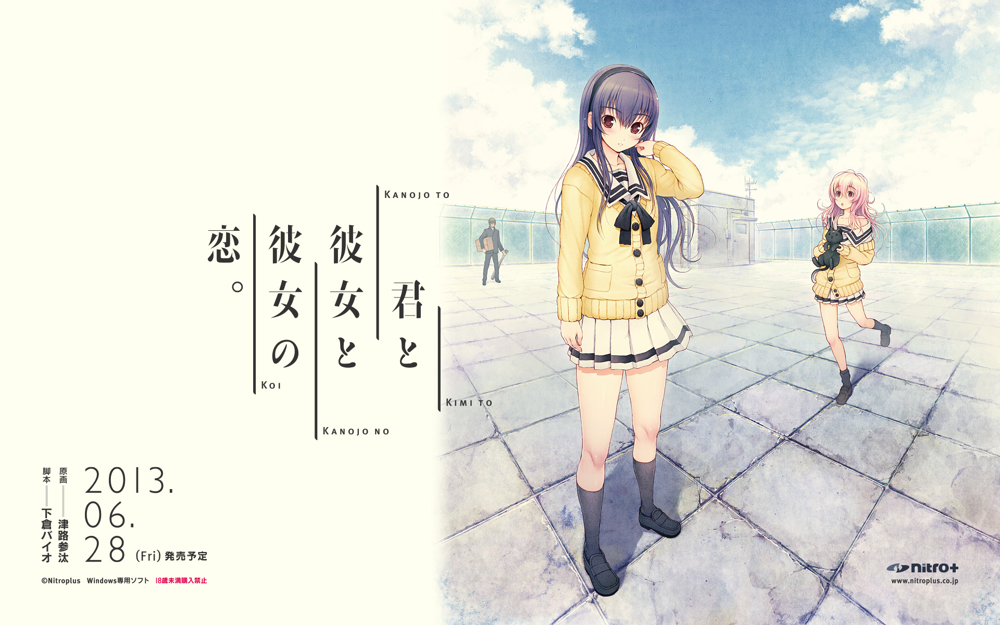
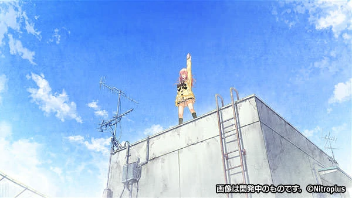
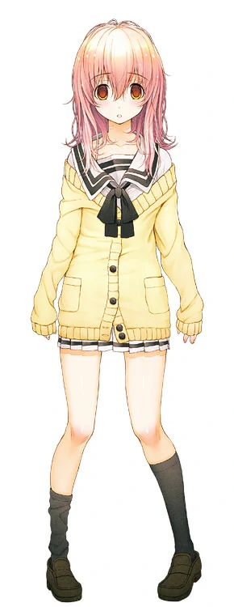
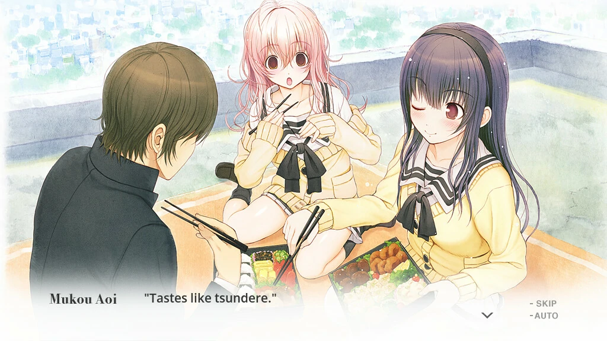
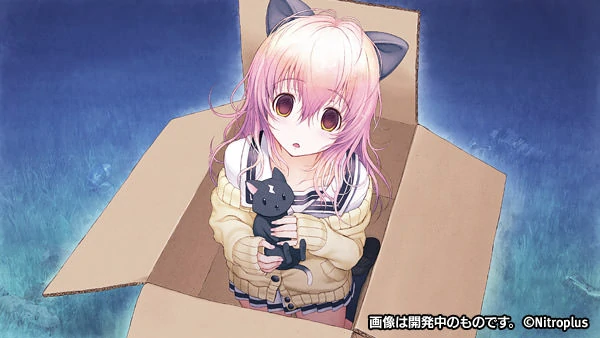
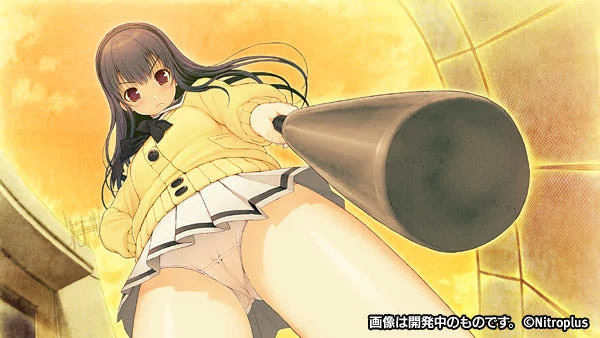
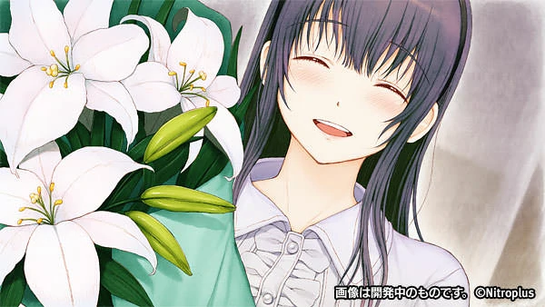

`作者: Patchouli Knowledge`

| 資訊一覽     |                  |
|:--------:|:---------------- |
| **開發商**  | Nitro+ |
| **遊戲時長** | 10 - 15 H          |
| **類型**   | 血腥 ntr 劇情        |
| **難度**   | 极高                |
| **分級**   | R-18             |

## 故事梗概

校園中毫無存在感，路人般的男主***須須木 心一***，平凡的度過每一天。就在這平凡的某天，男主的好基友***曙 雄太郎***把男主叫到樓頂。然而在天臺不是基友而是一個粉毛美少女，粉毛美少女上來就坐在男主身上問到***“要來，嗶哩嗶哩嗎？”***。原來這粉毛是同樣在班上毫無存在感的***向日葵***。
就在男主爲難時，男主的青梅竹馬***曾根 美雪***突然出現幫男主解圍。但從此，葵便開始不停的糾纏男主。

葵缺少生活常識，朋友這種東西自然也是沒有，因此男主和美雪從真善美出發，順理成章的和葵組成了lovelove小團體一起快樂的享受校園生活。

在男主和美雪的幫助下，葵逐漸拜托電波，向著正常女孩發展，而在此期間，男主和美雪這對青梅竹馬的感情也急劇升溫。三人小團體，一男兩女，資深宅宅們相信都會發生什麽了，经典二选一！爲什麽會變成這樣呢……第一次有了喜歡的人。
美雪還是葵，終極二選一，***你***究竟會選擇誰呢！？

## 人物介紹

### 向日 葵（cv：後藤 麻衣）
 

班上稀奇古怪的可愛粉毛電波美少女，總是拿著部沒用的手機説著不明所以的話。 人物形象無不凸顯著貓的元素十分惹人憐愛，做事也是將電波屬性貫徹到底，十分的脫綫。  似乎不把世間萬物放在眼裏，可在天臺第一次遇到男主便跨坐在男主身上，故事便由此展開……

### 曽根 美雪（cv：生天目 仁美）
 

男主的青梅竹馬，標准的學校女王人設，成績好，運動好，人緣好，是大家都喜愛的對象。 相對的，也是經典的對男主死心塌地，是個認真、細膩、純真的女孩子。  在和男主一起幫助葵的過程中開始為愛情和友情糾結，經典到爆二選一中的黑長直人設（CV就已經説明了一切）。

## 遊戲 OP

動畫來自被牆的steam，請翻牆



## 簡評

一部味十分純正的N+的劇情拔，短小精悍，獨特的游戲玩法，帶給玩家比心跳文學社更震撼的游戲體驗。（非捧一踩一，心跳文學社筆者也很喜歡，但君彼女的質量確實更勝一籌）

  
優點：

  </img>

 * 畫風真的超精緻，HCG做的很社保，劇情漸入佳境後的CG做的也十分傳神，將gal的游戲特性發揮到極緻。可愛到爆的葵，高嶺之花美雪，相信都可以輕鬆俘獲宅宅的心。
 * 跌宕起伏的劇情，雖然内容不多，但筆者玩完好幾天沒緩過來。（但前期有些無聊是真的）
 * N+傳統藝能，一直在探索實踐galgame新穎的游戲系統與表現形式，這部也不例外，絕對給你帶來不一樣的體驗。
 

  
缺點：

  </img>

 * 有嚴重的ntr情節，純愛黨慎入！
 * 中間有段過於繁瑣，需要好好的看攻略才能達到TE（不看攻略真的能達到TE嗎）

想要游玩該作應該都知道其在十二神器中的名号***“次元牢籠”***，沒錯，就是和心跳文學社同類型的游戲，都是以打破次元壁（第四面墻）而著名。儅玩家攻略完一周目后游戲才真正開始，這是絕對不能云的一款galgame（事實上某視頻網站做的互動視頻已經可以把游戲做到網頁，且也有很多人在做“云玩家”）。只有自己去親身體會，才能感受到這游戲帶給你的震撼。

| 評分        |      |
|:---------:|:----- |
| **人設**    | 9/10 |
| **立繪 & CG** | 10/10 |
| **劇情**    | 9/10 |
| **音樂**    | 8/10 |
| **綜合**    | 9/10 |

## CG鑑賞


../image/youandme/06.webp
../image/youandme/07.webp
../image/youandme/08.webp
../image/youandme/09.webp
../image/youandme/10.webp
../image/youandme/11.webp


## 遊戲資源



steam近期更新官方中文，但無R-18，且據説中文翻譯質量不行，可以用盜版替換大法。(最後再提一嘴，進入“正戯”后還是乖乖的查攻略比較好，攻略基本都是同一個版本直接檢索就好

盜版： 

