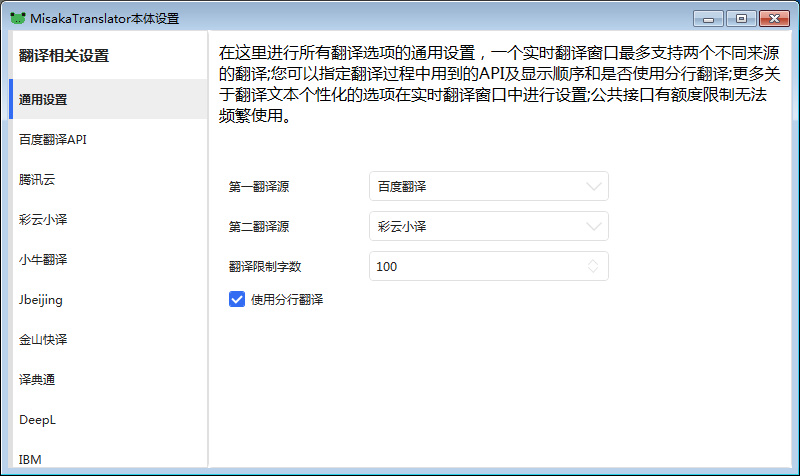
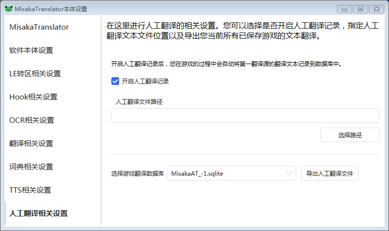

当你打开网盘时，面对几年前甚至十几年前的老旧galgame是否感到厌倦？当你喜欢的画师发布新作时，是否因为汉化组的咕咕而只能选择购买收藏而不能游玩？当你遇到喜欢的画风的galgame时，是否因为日语苦手只能一路快进HsH而不能体验剧情而烦恼？

不用担心，这时候您只需要[御坂翻译器](https://github.com/hanmin0822/MisakaTranslator)，就能边玩边学日语了

## 为什么选御坂翻译器

* 兼容性强：支持Hook+OCR两种方式提取游戏文本，能适配绝大多数游戏
* 可离线：支持完全离线工作(Hook模块离线、可选的Tesseract-OCR模块离线、三种离线翻译API)
* 高度可拓展的文本修复：针对Hook提取到的重复文本提供多种去重方式
* 提供更好体验的在线API：提供多种在线API(百度OCR+多种在线翻译API+多种公共接口翻译)
* 更高的OCR精度：支持在提交OCR前对图片进行预处理（多种处理方法）
* 分词及字典：支持Mecab分词和字典功能，可针对单词进行查询
* 翻译优化系统：支持人名地名预翻译，提高翻译质量，这个系统正在被不断完善
* 人工翻译系统：支持用户自己定义语句翻译并生成人工翻译文件以供分享
* 高效：使用C#开发，程序效率较使用Python开发的VNR要高
* 易用：UI亲切，易上手，有详细教程

重要的是，ta的彩云小译api语感好翻译质量高，加上一点人工校对导出翻译文件，小白也能一人即汉化组，实现人人有汉化

上面的是百度翻译，下面的是彩云小译：


## 御坂翻译器的前期配置

<a class="btn" href="https://github.com/hanmin0822/MisakaTranslator/releases" title="鼠标悬停显示链接"> github直达</a>
<a class="btn" href="https://github.com/xupefei/Locale-Emulator/releases" title="鼠标悬停显示链接"> 日文转区工具</a>


1. 下载解压后点击 MisakaTranslator-WPF.exe ，点击小齿轮 

2. 点击通用设置 按照下图设置


3. 人工翻译 开启后可以保存自定义词组和历史翻译，导出后就可以人人汉化组


### 彩云小译api


填入下列api ，点击测试api保存

```
3975l6lr5pcbvidl6jl2
```

### 百度翻译api注册


1. 登录自己的百度账户


2. 登陆进去后，进入**管理控制台**。如下图。首次进入他会提示你注册成百度翻译开发者。选择注册为“**个人开发者**”。然后按照下图填写信息。


3. 点击下一步后出现如下页面，一般文献翻译使用标准版即可，而且标准版是免费的。填写认证的时候建议直接认证，可以直接认证成功。（暂不认证也没事，都能注册成功。）


4. 注册成功后点击开通服务，然后点击通用翻译API，


5. 接下来填东西，简单写一下


6. 看到这里，显示成功了。咱们前往“管理控制台”。之后你每次登陆百度翻译开发平台，最上面都有这个选项“管理控制台”，那是你之后最常用的地方。


7. 到了管理控制台，选择左边的”开发者信息“。如下图所示，右侧的APP ID 和秘钥，就是咱们需要的东西。将它复制一份存放到你平时存放密码的地方吧


8. 将api填入下列框，点击测试api保存


## hook提取游戏文本

krkr引擎和ons引擎的游戏很好抓取，但是日文游戏有的会乱码需要转区工具
[点击这里学习使用转区工具](https://www.bilibili.com/read/cv6506213/)

1. 点击添加游戏，hook游戏向导


2. 一般选择游戏文件名 ，不确定可以打开任务管理器


3. 选择一个与游戏文本最接近的 


4. 没有特殊的话就一路确认了，就能自动翻译了


5. 需要自定义女主名字的话可以这样



