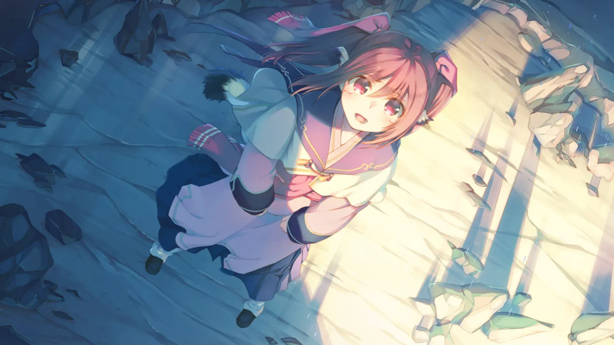
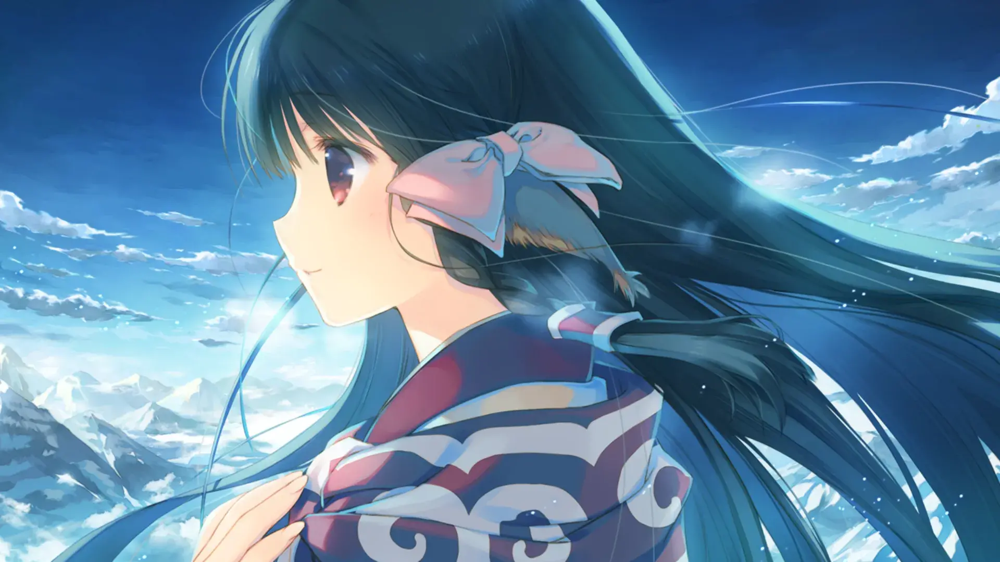
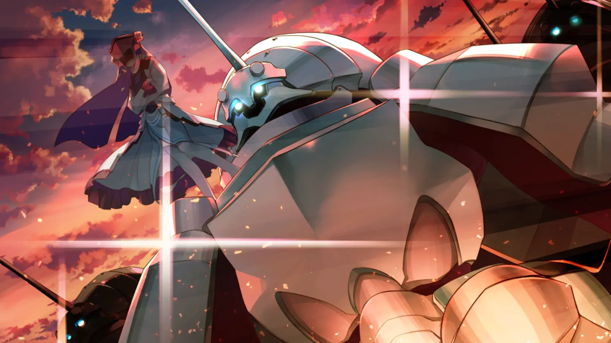
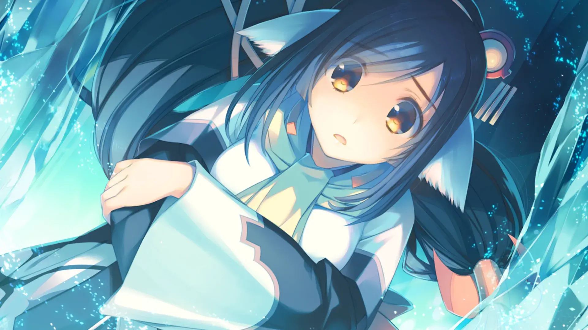
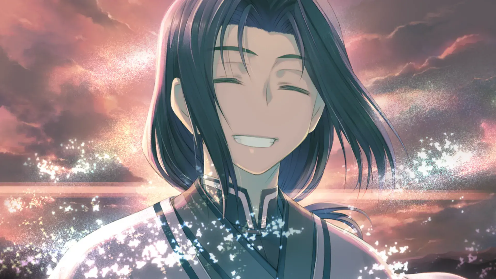
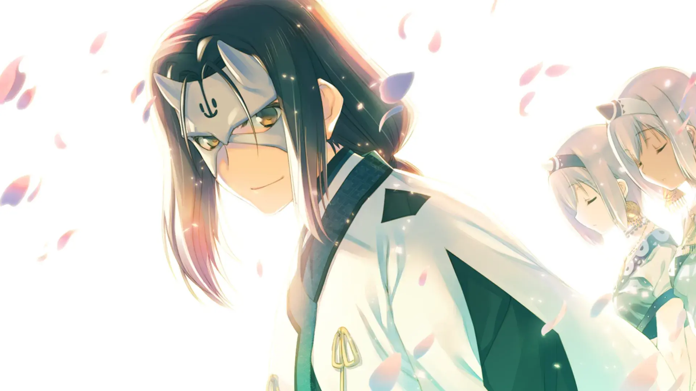

`作者：ling`

我终于... 我终于追到你了。
这一次 我可不会再让你逃跑了。

| 资讯一览     |                     |
| :----------- | :------------------ |
| **开放商**   | Leaf      |
| **可攻略人数** | 0                   |
| **游戏时长** | 20 - 30H             |
| **类型**     | 兽耳 SRPG |
| **难度**     | 中                  |
| **分級**     | R-15                |

注意:兽耳出没

本作是传颂之物-虚伪的假面的续作，游玩本作前需要先推了虚伪的假面。 

如果你尚未推完虚伪的假面，你需要注意一下，简介中会有对虚伪的假面进行剧透。

为了你的游玩体验，尚未游玩前作，建议ctrl+w进行回避。

## 作品简介

约定... 得实践... 在等我...

帝都中还暗藏着杀机，并非是武赖给杏树(公主殿下)下的毒药 无法发音并且心智迟钝的杏树现在什么都做不到。  
为了保护杏树大家只好前往奥修特尔的故乡，一无所有的边境之地恩那卡姆伊。

然而在前往恩那卡姆伊的过程中，被打倒的武赖意外的追了上来，奥修特尔只能迎战，打斗中奥修特尔为了保护猫音只能过度依赖假面的力量，因此化成盐巴，在这过程中奥修特尔将自己的身份托付给了你。

从接下面具的那一刻开始，为了大家，为了恩那卡姆伊，你只能选择扼杀原本的自己成为奥修特尔。 
奥修特尔死去由哈克死去取代。
"....抱歉，我最后没能遵守约定。"

哈克的死讯给大家带来的莫大的打击。
深受打击的久远，强忍着痛苦和大家道谢便离开了大家，走向了故土，在过程中打破了约定，释放了血脉中的力量。  

"即便失去一切，我也只能昂首向前"
此刻身为奥修特尔的你，不能表露出原来的自己，当下最重要的是保护杏树，便开始号召恩那卡姆伊的居民。
 
在回荡着"奥修特尔"欢呼声的广场上，星星之火存在于此。
在遥远的帝都，第二个杏树的出现，一场不可避免的、以战争形式呈现的争端，拉开了帷幕。

<video controls preload="metadata" width='100%' poster="../image/传颂之物二人的白皇/u2_end.webp">
    <source src="https://s3static-zone0.galgamer.eu.org/video-2d35/utawareta-mono/u2end.mp4" type="video/mp4">
</video>

## 主要登场人物

 
<!--- 最外層的圓角卡片 -->
  

  <!--- 和最外層圓角卡片一樣大的 div，目的是能夠將人物立繪以背景圖片的形式設置 -->
    

    <!--- 展示人物信息的 div，靠右，在 PC 上佔 8 寬度，餘下的 4 寬度顯示上層的人物立繪 -->
    <!-- 手機上佔據全部的 12 寬度，並且設置背景模糊，使得上層人物立繪隱約可見 -->
      

        

        久远
        

        

          CV：种田梨沙
        

        

      

      

      

        
久妈，药剂师，本作的女主。在和杏树打完后，回归队伍。

        
前期觉得你是哈克，但又不能肯定。

        
猫音的名义姐姐，特别喜欢泡澡。

    

  

  

 

  

    

      

        

        猫音
        

        

          CV：水濑祈
        

        

      

      

        
奥修特尔的妹妹，在奥修特尔将身份托付给你后，你的表面上妹妹(逐渐成为真妹)。

        
对你和奥修特尔非常自责，前期负责指导你成为奥修特尔。

      

    

  

 

  

    

      

        

        露露缇耶
        

        

          CV：加隈亚衣
        

        

      

      

        
九重里的皇欧甄的女儿，游戏中的女仆。

        
精通料理与泡茶和制作点心。

      

    

  

 

  

    

      

        

        乌露露、萨拉娜(双子)
        

        

          CV：佐仓绫音
        

        

      

      

        
无微不至照顾你的双子，是原本帝皇赏赐给你的，锁之巫女、

      

    

  

  

## 游戏 OP



## 简评

---

本作是传颂之物系列的收尾作，所承载的内容也是最多一部，遗憾的是本作并没有把设定补充完整。
不过结局和致逝者的摇篮曲相关联了，三部综合起来看的话，这个收尾也不算太差。 

回顾下前两作的名称，分别是致逝者的摇篮曲和虚伪的假面。相同点是名称都是关联结尾部分的剧情，并且都是字面意思(还都是泣系情节)，本作也不例外。 

---

本作剧情整体和致逝者的摇篮曲类似，本作是由夺回帝都为分割线，第一部分是围绕着你继承奥修特尔的身份，带领着大家从自保走向反攻。第二部分和致逝者的摇篮曲一样，揭开世界和你的过去的谜团。 

- 结构上仍是一贯的单线形式讲故事，不过本作的剧情发展是三作中，对提升血压方面效果最显著的一作。如果你尚未游玩致逝者的摇篮曲，本作的第二部分是选玩部分。在没有游玩致逝者的摇篮曲，直接游玩第二部分可能会给你带来数不胜数的问号和高不见顶的血压，所以为了体验，要么是三作连玩，要么在杏树封完官后alt+f4进行回避。

- 本作设定是也是一个遗憾的点，本作作为该系列的收尾作，但是没有把该系列中的设定交代完整，以沿用十几年前初代的设定为主(没有完善)。当然该系列突出的并非剧情而是在日常中刻画人物。 

- 本作日常就是该系列最强的了，虚伪的假面让主角拥有了第二个身份，而大家最需要的，是那个不属于自己的身份。在大家面前原本的哈克身份逐渐褪色和大家从哈克的死讯而悲伤的心境中走出来的过程中人物刻画的很到位，本作中喜闻乐见的泣系情节是该系列最多的一部。

---

作画方面，画风和质量强无敌，名副其实的高水准cg。背景图方面，并没有找到可以当壁纸的图，11年的隙间樱花与谎言都市都有着一张超绚丽的樱花都会图，这算得上作画出色作品的一个小瑕疵了。

音乐方面，依旧有着强无敌的Suara歌唱，bgm也依旧有着不少耐听的良曲，该系列一贯的出众点。该系列有着不少金曲，可以在该站的**Galgame金曲**页面中聆听这些金曲。 

游戏性还是有一贯的SRPG战旗要素，和虚伪的假面一样(致逝者的摇篮曲有一些操作要素和后两作不一样)，本作可以直接用CE(Cheat Engine)找BP数值修改，拉满各种属性，一周目也能无压力打各种关卡(最后的boss另说)。

----

总的来说，本作作为收尾作并没有完善好整个大背景有点不尽人意和第二部分后半段剧情发展有点让人一时难以接受之外，其他方面都比前两作都出色。尤其是日常，本作有着更复杂、刻画更为细腻的人物内心描写，代入感很强，空闲下来游玩该系列是一个很不错的选择！

再次重复，本系列有动漫但是其质量堪忧，缩减改动了不少地方(玩了游戏再看动漫内容可能会引起血压飙升的程度)，为了更好的体验，请务必！游玩游戏而不是看动漫，尤其是白皇，白皇所承载的内容是最多的一部(看了目前的八集，改的太离谱了)。

### 个人评分 

| 项目           |  得分    |
| :---------------- | :--- |
| **人设**          | 8   |
| **cg&立绘**       | 10  |
| **音乐&声优表现** | 10   |
| **剧情**          | 8   |
| **综合**          | 9  |

## 游戏 CG


../image/传颂之物二人的白皇/cg/1.webp
../image/传颂之物二人的白皇/cg/2.webp
../image/传颂之物二人的白皇/cg/3.webp


../image/传颂之物二人的白皇/cg/11.webp
../image/传颂之物二人的白皇/cg/12.webp
../image/传颂之物二人的白皇/cg/15.webp
../image/传颂之物二人的白皇/cg/17.webp


../image/传颂之物二人的白皇/cg/111.webp
../image/传颂之物二人的白皇/cg/112.webp
../image/传颂之物二人的白皇/cg/1114.webp
../image/传颂之物二人的白皇/cg/1115.webp
../image/传颂之物二人的白皇/cg/1116.webp


 

## 还在犹豫是否下载？

<video controls preload="metadata" width='100%' poster="../image/传颂之物二人的白皇/movie.webp">
    <source src="https://dl.galgamer.eu.org/assets/utawareru-mono/u3_game.mp4" type="video/mp4">
</video>

## 资源和下载 

死贵的Steam链接(可以使用退款大法，下载资源再打上绕过steam的补丁)



---

个人通关存档(包含虚伪的假面) 
将此文件目录解压到 `Documents\AQUAPLUS\受讚頌者 二人的白皇\` 目录下(虚伪的假面同理)
游玩时继承通关存档重新游玩 可缩减打斗时所需要的时长。



