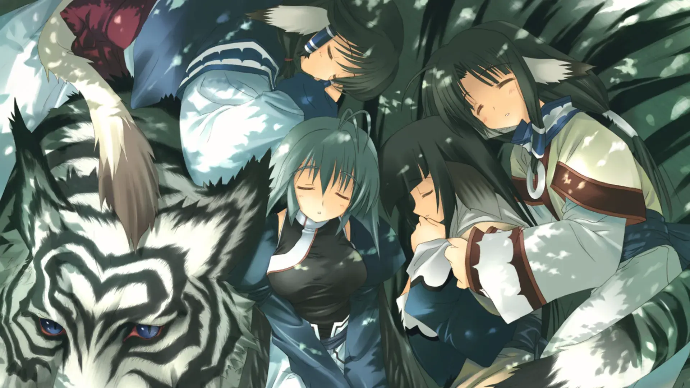
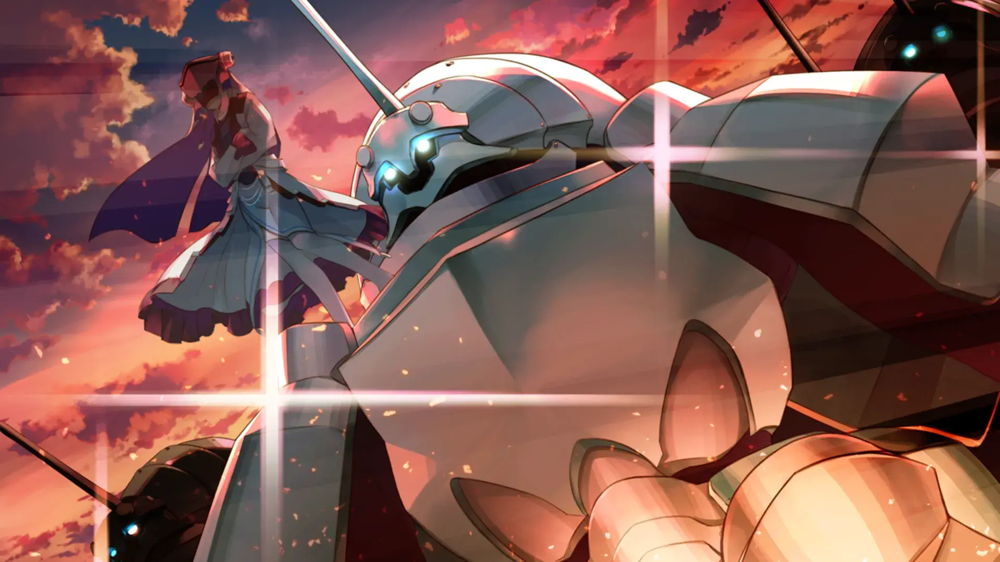

| 资讯一览     |                     |
| :----------- | :------------------ |
| **开放商**   | Leaf      |
| **可攻略人数** | 0                   |
| **游戏时长** | 20-30h              |
| **类型**     | 兽耳 SRPG |
| **难度**     | 中                  |
| **分級**     | R-15                |

注意:兽耳出没

## 作品简介

在森林中受了重伤失去了意识的**你**，被**艾露露**所救。

兽耳少女**艾露露**照护了你三天三夜，你才恢复意识，但**你**失去了记忆，连为什么受伤和自己的名字都想不起来了，并且的脸上还出现了一个无法拿摘下的面具。

**艾露露**的奶奶兼村长，**图斯库尔**，用自己死去的儿子的名字为失去记忆的你命名，从此你便叫**哈克奥罗**了。
因为你长得像死去的哈克奥罗，艾露露的妹妹**阿露露**会喊你作爸爸。

病情好转的你开始融入到这个村落中，这里的人们都有着尾巴和兽耳(可惜的是没有白毛)，过着早期文明一样的生活。
而你有着现代的知识，于是便用现代的知识为这个村子改善环境，村民们遇到问题的时候也会向你寻求建议，因此建立起一定的威望。

好景不长，在和敌对势力**努万基**的冲突中，村长图斯库尔为了保护阿露露失去了性命，你便担负起了引领全村人的责任。

图斯库尔的死对村民们影响很大，加上村民们被该地统治者百般刁难，因此你和村民们一同走向了起义的道路，
在纠结于自己究竟是谁的同时也开始步入到这乱世纷争之中。

## 主要登场人物

 
<!--- 最外層的圓角卡片 -->
  

  <!--- 和最外層圓角卡片一樣大的 div，目的是能夠將人物立繪以背景圖片的形式設置 -->
    

    <!--- 展示人物信息的 div，靠右，在 PC 上佔 8 寬度，餘下的 4 寬度顯示上層的人物立繪 -->
    <!-- 手機上佔據全部的 12 寬度，並且設置背景模糊，使得上層人物立繪隱約可見 -->
      

        

        艾露露
        

        

          CV：エルルゥ
        

        

      

      

      
兽耳少女，是阿露露的姐姐，在你身边照护你的人，对你十分关心。

      
她是一名药剂师，在失去奶奶后接替奶奶为村中的少女柚叶看病。

      

    

  

 

  

    

      

        

          阿露露
        

        

          CV：アルルゥ
        

        

      

      

        
艾露露的妹妹，十分怕生，但是因为你和她爸爸长得很像，会亲近你并喊你爸爸。

        
她能听懂动物说的话，在解决完森林之主的骚乱后，饲养着森林之主的幼崽。

        
特别喜欢吃蜂蜜。

      

    

  

 

  

    

      

        

          柚叶
        

        

          CV：中原麻衣
        

        

      

      

        
胧的妹妹，身体中寄宿着不安定的水神和火神，因此天生就被病魔所困扰。

        
失去了视力，但是她能依靠嗅觉去分辨每一个人。

        
你给她封闭的生活带来了许多新事物，因此她对你非常感谢，并且想给你生一个孩子作为存在的证明(也就是后两作的女主久远)

      

    

  

 

  

    

      

        

          藤香
        

        

          CV：三宅华也
        

        

      

      

        
非常强的剑客，对主人尤为忠诚，在化解误解之后加入你的后宫团。

        
由于缺少一些生活常识导致闹酵话，成为了本作笑点担当。

      

    

  

## 游戏 OP

<video controls preload="metadata" width='100%' poster="../image/传颂之物致逝者的摇篮曲/Cover.webp">
    <source src="https://s3static-zone0.galgamer.eu.org/video-2d35/utawareta-mono/utawareta-mono.mp4" type="video/mp4">
</video>

## 简评

首先，传颂之物系列的游玩顺序为:致逝者的摇篮曲 -> 虚伪的假面 -> 二人的白皇。 

本作与后两作并没有太大关联，虚伪的假面和二人的白皇是衔接的，也可以不玩本作直接玩后两作。不过二人的白皇的结局是和本作相关联的，为了提高体验感，在时间充足的情况下，建议三作连着玩。

本系列有动漫，但是其质量堪忧 缩减改动了不少地方(玩了游戏再看动漫内容可能会引起血压飙升的程度)。
为了更好的体验，请务必游玩游戏而不是看动漫。

PS:此作本人玩的是重置版 没有R18 就当没有R18了。

---

剧情方面整体可以分为两部分，以夏库克波尔族入侵其它国家为分割线。
第一部分是将一个小村落发展成一个巩固的国家(换句话说就是壮大你的后宫团)，而第二部分是揭开世界和你的过去的谜团。

- 结构上这作是单结局，没有可攻略人数，选项只能决定日常部分的先后顺序，好坏难说，没有选项算得上是懒癌福音？多结局的玩多了，剧情发展有些让人无语的地方但又没其他选项的时候，有点难受。当然本作是这三部中最不让人难受的(个人感受)。

- 设定上勉强算剧情作？前期给人就像是异世界开后宫的感觉，这里的人不是有着尾巴和耳朵就是有翅膀，但是后期(第二部分)会有反转(后科技时代要素)。

- 日常就是本作的卖点了，人物刻画得尤为细腻，日常十分有趣(长篇日常并不令人枯燥)，有着不少喜闻乐见的泣系环节。第一部分几乎没啥剧情，以刻画人物形象为主，第二部分的剧情总的来说还算是有看头。

---

作画上本作由于年代问题，重制版似乎只是提高了分辨率，在当下2022角度来看，画风和质量并不算优秀，不过有兽耳尾巴还奢求什么呢，而后两作画风和质量在当下2022年算是上乘作品。

音乐也是该系列的卖点，有着许多耐听的曲子，和剧情搭配的十分到位，例如在二人的白皇后期中，久远突然登场，响起不安定的神明这首歌，我直接沸腾.... (至于为什么是白皇中的场景，因为第一时间想到的就是那个场景，如图 超帅的久妈)。

声优方面，这作算得上优秀，毕竟让日常不枯燥，声优的配音也是一个重要部分(本人并不是声优鉴赏大佬，连声优人物都懒得去记，总之就是特别强就对了)。

游戏性上本作有着SRPG属性，本作难度相比后两作难度要高一点(毕竟后面两作能直接用CE修改BP这作我搜不出修改后的BP(误))，第一个周目会消耗一定时间，不过也不是特别难，不需要专门刷级，如果你忘记分配BP会让游戏难度大增。

---

综合来说剧情发展可能会让一些人可能难受之外，其它方面几乎没有缺点，如果你有闲暇时间/想放松下自己，这部作品是不错的选择，推完该作继续游玩该系列的后两作是超赞的选择。

### 个人评分 

|            |      |
| :---------------- | :--- |
| **人设**          | 9   |
| **cg&立绘**       | 10  |
| **音乐&声优表现** | 10   |
| **剧情**          | 9    |
| **综合**          | 9.5  |

## 游戏 CG


../image/传颂之物致逝者的摇篮曲/cg/0.webp
../image/传颂之物致逝者的摇篮曲/cg/1.webp
../image/传颂之物致逝者的摇篮曲/cg/2.webp
../image/传颂之物致逝者的摇篮曲/cg/3.webp


 


../image/传颂之物致逝者的摇篮曲/cg/10.webp
../image/传颂之物致逝者的摇篮曲/cg/11.webp
../image/传颂之物致逝者的摇篮曲/cg/12.webp
../image/传颂之物致逝者的摇篮曲/cg/13.webp


 


../image/传颂之物致逝者的摇篮曲/cg/110.webp
../image/传颂之物致逝者的摇篮曲/cg/111.webp
../image/传颂之物致逝者的摇篮曲/cg/112.webp
../image/传颂之物致逝者的摇篮曲/cg/113.webp


 

## 还在犹豫是否下载？

<video controls preload="metadata" width='100%' poster="../image/传颂之物致逝者的摇篮曲/Cover.webp">
    <source src="https://s3static-zone0.galgamer.eu.org/video-2d35/utawareta-mono/u-movie.mp4" type="video/mp4">
</video>

## 资源和下载 

死贵的steam链接


---

个人通关存档 
将此文件目录解压到 `Documents\AQUAPLUS\受讚頌者 給逝者的搖籃曲\` 目录下
游玩时继承通关存档重新游玩 可缩减打斗时所需要的时长。



