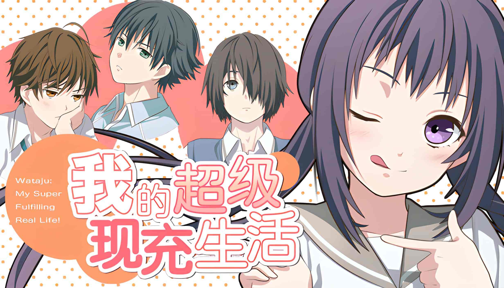
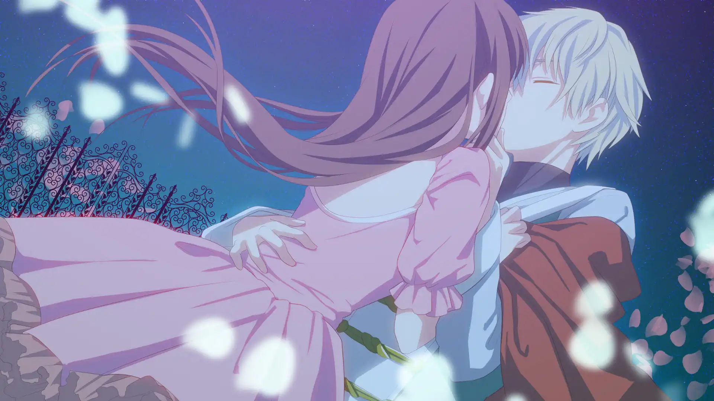
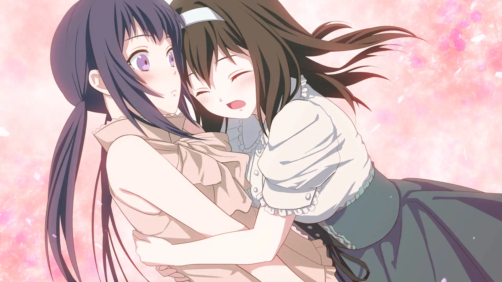

| staff      |                 |
| :--------- | --------------- |
| **開發商** | TetraScope      |
| **編劇**   | Kaiso           |
| **画师**   | neon            |
| **難度**   | 中（但没有 BE） |
| **分級**   | 全年龄          |

## 简介

她——天生丽质，聪明伶俐，平易近人。现在，这位完美无缺的现充女生将为大家带来一出欢声笑语的恋爱喜剧！（应该是吧？）

主要介绍的是身为超级现充的女主<b>姐崎 希美</b>在校园里度过的恋爱故事。
作为成绩优秀，担任学生会干部和班长的她，受尽全校同学的敬仰和老师的赞赏。

所谓现充，就是公认的「现实生活非常充实的人」，具有前面所说的那些特质的她，可以说非常符合一般人对现充的想象。
但在这光鲜亮丽的外表之下，她也有着无法向人诉说的烦恼和秘密（是什么呢？）。

此外女主的性格非常讨喜，游戏的中也会有表现出各种搞怪的表情，比如标题后面那个，推荐打完后去extra里摆弄下立绘（不过搞怪的表情并不能弄出来）。

本作结局一共7个，除了三位可攻略，还有一个结局是举止优雅押井有的<b>普通</b>结局

弟弟天国！可攻略角色有令人向往的学生会会长（的笨蛋弟弟），傲娇的伪骨科弟弟和突如其来的转校生（仓口步）。
粗略来说人设算得上是个性鲜明，虽然算是经典设定，但玩下去并无老套之感，从校园恋爱故事角度，本作基本上做到了把校园恋爱中的青涩与热烈之感体现的淋漓尽致。

本次介绍的是全语音版，甚至路人也有配音（但是女主没有）。
其中喜闻乐见的一点就是瑞穗和穗积作为兄弟俩是同一个配音，但是他们性格差异很大，不事先看到cv表完全听不出是同一个人。
一个是非常亚撒西的声线，另一个是一听就像是混社会的那种人的声线，同一个cv，一个角度说是省钱，另一个角度也非常的能体现兄弟俩的共同点与分歧（和后续剧情有关联）。

本游戏含有部分meta要素（但不算滥用，也不至于过于出戏），我也是因为之前看到一张图流传的「我不需要隼的CG」才来关注的游戏。

<a href="#个人简评" onclick="secret.open = true;个人简评.scrollIntoView({behavior: 'smooth'});return false">点我查看剧透内容</a>

此外全语音版有提供后日谈，短篇小故事，漫画，插画收集，押井有的烦恼咨询室等原版不存在的内容（还有隐藏彩蛋）。

## 角色介绍

<sp-character type="主角" color="#ff918b" filename="heroine" name="姐崎 希美" cv="なし">

本作的女主角。高二学生。在校内担任学生会副会长，以才貌兼备的形象备受全校学生的仰慕。

但也因为声望高人缘好，其他人总会把麻烦的差事推到她身上。本人对此也有些许吃不消，但她仍然会笑着接受所有的委托。她就是这样一个完美的女生。
</sp-character>

<sp-character type="攻略对象" color="#b01313" filename="shun" chara name="姐崎,あねさき|&nbsp;|隼,しゅん" cv="大黒雄斗">

与女主角无血缘关系的弟弟。是个帅哥。 

双手灵巧，做任何事都能面面俱到，也深受身边同学欢迎的现充男生。

尽管大多数时候态度神气自大，但一般不会反抗姐姐。将来的梦想似乎是当美容师。
</sp-character>

<sp-character type="攻略对象" color="#5186dc" filename="ayumu" chara name="仓口,くらぐち|&nbsp;|步,あゆむ" cv="渡部康大">

突然转到女主角班上的转校生。外表……看不出是不是帅哥。

作为阴角，刚转学就受到到其他人的孤立。

常常随身携带轻小说。
</sp-character>

<sp-character type="攻略对象" color="#0089a4" filename="hozumi" chara name="星名,ほしな|&nbsp;|穗积,ほづみ" cv="久保拓馬">

瑞穗的双胞胎弟弟。铁打的帅哥。

但说话粗鄙，态度恶劣，是个和瑞穗长得一模一样，性格却八竿子打不着，令人遗憾的男生。

他和瑞穗的关系似乎不太好。
</sp-character>

<sp-character type="非攻略对象" color="#009683" filename="mizuho" name="星名,ほしな|&nbsp;|瑞穗,みずほ" cv="久保拓馬">

高一个年级的学长。学生会会长。自不用说是一名帅哥。

总是带着笑容，待人处事也十分稳重。总而言之是个无可非议的2.1次元男生。也是女主角仰慕的对象。

虽然在学校里和女主角是公认的一对，但看上去他本人完全没有那个意思。
</sp-character>

<sp-character type="非攻略对象" color="#764ac7" filename="yu" name="押井,おしい|&nbsp;|有,ゆう" cv="野々井爽">

和隼同班的学弟。

言行举止比同龄人更成熟，和女主角相处的时候也很有绅士风度。

是个成绩优秀的优等生。
</sp-character>

<sp-character type="非攻略对象" color="#ff9900" filename="miho" name="折笠,おりかさ|&nbsp;|未步,みほ" cv="花咲芽依">

和女主角同班的朋友。从高一开始就和女主角结下了交情。

性格直爽，对什么事都很宽容。

观察力格外敏锐。
</sp-character>

<sp-character type="非攻略对象" color="#d14092" filename="shizune" name="柊,ひいらぎ|&nbsp;|闲音,しずね" cv="清水星来">

比女主角高一年级，在名门女子高中上学的女生。

拥有超尘出俗的美貌和清澈纯洁之心，女神一般的存在。
</sp-character>

## CG


../image/我的超级现充生活/cg/hozumi01.webp
../image/我的超级现充生活/cg/mizuho01.webp
../image/我的超级现充生活/cg/shun10a.webp



../image/我的超级现充生活/cg/yu01.webp
../image/我的超级现充生活/cg/yu02.webp



../image/我的超级现充生活/cg/st_il_02.webp
../image/我的超级现充生活/cg/st_il_06.webp
../image/我的超级现充生活/cg/st_il_09.webp
../image/我的超级现充生活/cg/st_il_12.webp


## 游戏 OP



## 个人简评

作为乙女作品，本作还是非常值得推荐的，重点是，它不像其他乙女作品那样把角色塑造成一些不正常的人类，例如有严重心理问题啦，女主角是病娇啦。
就算谈恋爱，也经常涉及一些监禁啊调教啊乃至r18g一类的，具体有哪些作品这里就不点名了，总之现在steam乙女游戏分类排名里，这部作品算是一股清流一般的存在。。。

虽然不是商业作品，但是诚意还是很足的，从各种细节的刻画上就能看出作者的投入。
尤其在剧情方面给人的感觉是比较流畅的，特别是剧情中的各种事件里，一些决定性分支之后收束的处理非常恰当，很少有脱节的感觉。
即使是对乙女作品和校园题材都算不上非常热衷的人来说也值得一玩。

画风方面，我一开始还不太习惯（毕竟习惯了现代动漫画风）。
不过这部作品是2014年发售（免费下载）的；
玩过一段时间之后，就习惯了，特别是后续的几张CG，可以说非常精彩。（以及OP和ED影片也很棒）

包含剧透内容，点击展开

首先解答开头的烦恼：女主虽然在学校里是个样样都很厉害的人，但是其实是个御宅族，喜好玩看轻小说，玩游戏，特别是乙女游戏（所以能把你的库存给我看一看吗），因而小学时朋友很少。
但是仓口步除外，是女主在小学结识的好朋友，曾经无话不谈。
然后上高中以后，为了摆脱过去的生活，在弟弟隼的帮助下，成功转变为「超级现充」的完美人设。
但是扮演人设给她带来了很多痛苦，比如经常被同学老师委任一些实际并不想做的事情，但是为了人设还得硬着头皮做下去。

我的攻略路线是隼——步——穗积，这不是推荐的顺序（看起来官推的结局是隼，因此应该放最后，不过嘛，完全是个人喜好）。

不过实际情况是，没看攻略前第一步就打出「永远的二次元」结局。。。

如开头所说，本作一共7个结局，3个HE，4个NE，而这永远的二次元就是所谓的共通线结局。
和某社游戏的单身线/基友线的感觉有点类似，第一次打出的时候还是比较惊讶的（强力建议先打这个！！！）。

游戏内建流程图，除了前几个选项需要探索之外，基本上只要回去看路线图就知道在哪条线上了。
不过我还是偷懒看了攻略，主要是这几个选项有一些前后依赖性，有时候前面的一个选项会导致后续直接跳过选项界面。

不过剧透到这里也差不多了，再剧透下去这游戏也没得玩了。

不行，我还想看

三条线中，我个人还是喜欢步线。
与爱着你的人支持互助，总有接纳真实自我的那个人存在。——「two as one」结局标题
但是步线的NE还是非常让人心痛💔，曾经的好友为了维护主角的人设，必须假装成不认识的样子。
这条线对于同学的排挤和冷暴力的描写最多（实际上共通线就有所体现）。
不过我觉得在结局的时候步应该已经知道（或者更早）姐崎就是之前的好友了。
结局标题「你理想中的我」真的很符合剧情，所以这应该算是BE吧，但是游戏到这里就戛然而止了。
也许最后也仍然会相认也说不定，变成地下小情侣吗？
（但是这条线路的文本量太少了）

隼线的话，萌弟属性的可以来试试（我不是），有一个NE甚至是真骨科。
不过相比之下我还是喜欢HE（弟弟天国！！！！），毕竟主角和隼之间关系的变化这点，把骨科之间的亲情变质的过程完全体现出来了。（哇好想有个这样的姐姐）
梦想当美容师，实际也是为了姐姐才做出的改变，不过关于这点，游戏里有更好的呈现，建议自己通一遍。
这条线路之所以成为官推线路，大概也是这条线路里主角的成长最大了吧。
其中一个NE大概算是有线，作为真骨科的有，看似无害但是其实态度非常强硬，还时不时语出惊人。
语音版新增的「押井有烦恼咨询室」也很趣，建议通关之后玩一下。
不过在彩蛋结局有关于押井有的大雷这点请注意。

本游戏最长的线路大概就是穗积线了，是传说中的四角恋，但是不像某些韩剧那样狗血。
四方最终还是归于和好，而且本线路只有一个HE结局。
仔细想想也合理，如果有别的结局的话，那也只能是互相谁都不认识了——毕竟，这两位女生虽然看似有冲突，实际完全都是误会。
看着希美为了追求会长而去读不感兴趣的推理小说，比起爱恋更多的是一种对真正「完美」形象的渴望与追求。
而在穗积面前，则能把自己的真实自我不加掩饰的暴露出来。
相信此时的玩家早已对角色们的真心了如指掌，可以说是旁观者清了。
（不过我相信这才是符合「乙女游戏」定位的线路吧，果然即使是同人作品，也会依照主流喜好来制作游戏）

ED: 
<audio id="ed" controls preload="metadata" src="https://s3static-zone0.galgamer.eu.org/audio-2d35/wtj_ed.mp3" type="audio/mp3"></audio>

## 下载

有免费的手机版，请到官网查看下载地址： https://wataju.net/index.html ，内购可以去广告和获得额外内容（fanbook）。





  

    
{type}

    
{
      name.split("|").map(part => {
        const [real, tran] = part.split(",");
        return <ruby>{real}<rt>{tran}</rt></ruby>;
      })
    }

    
CV: {cv}

    

    

    {chara != null && }
  

  

    
  





<svg xmlns="http://www.w3.org/2000/svg" style="display: none">
  <filter id="outline-filter" color-interpolation-filters="sRGB">
    <feMorphology in="SourceAlpha" result="DILATED" operator="dilate" radius="1" />
    <feMerge>
      <feMergeNode in="DILATED" />
      <feMergeNode in="SourceGraphic" />
    </feMerge>
  </filter>
</svg>