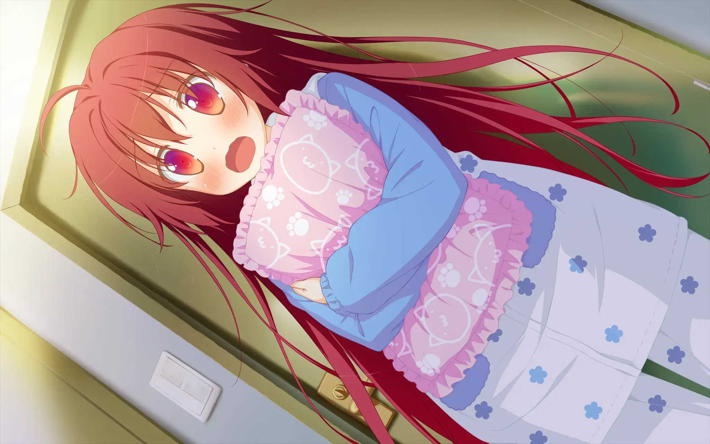
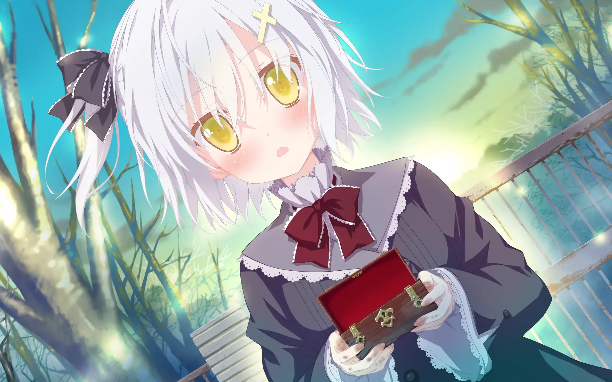
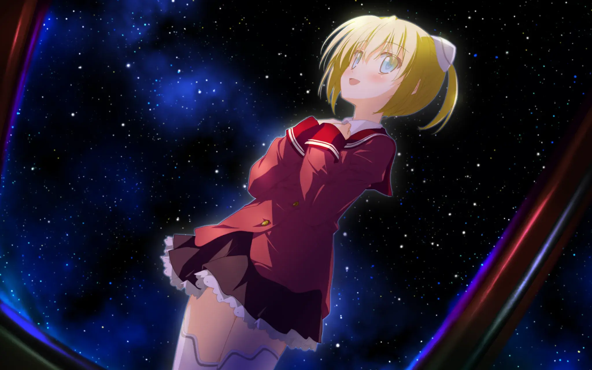
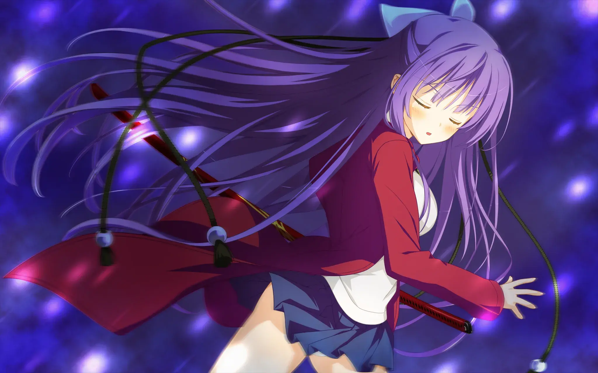

`ling`

| 资讯一览     |                     |
| :----------- | :------------------ |
| **开发商**   | FAVORITE     |
| **可攻略人数** | 6                   |
| **游戏时长** |  30h - 40h           |
| **类型**     | 校园 萝莉 精灵 白毛 | 
| **难度**     | 低                  |
| **分級**     | R-18                |

## 作品简介

常冬之城-**月之咲**，不变的冬日已经在这座城市中维持了俩年。
虽然一直会下雪，但是雪花不会堆积....
出于这异常的天气，**你** —— **榛名陆**与你的几位同僚奉命对其进行调查，在组织的安排下以转学的名义来到这座城市。
你与同僚都有不同的特殊的能力，并且由于你的主角光环，你可以通过轻吻其它能力者，使得对方能力暂时提升。
在这曾经居住过的城市(你的故乡)，你也如愿的遇到了昔日的玩伴**雪雪**。

在局长的关系安排下，**你**的住所定在了局长的女儿**落叶**家，但是局长的家庭有点特别，家里只有**落叶**和她的妹妹**叶月**。
由于未知原因，他们父女的关系并不好的样子，所以你的初始印象给对方很差...
但还是通过事件，提升了好感度，成功定居美少女的家中，打算着着接下来的生活。

融入这座城市后发现，这座城市也有着其它的能力者，昔日的记忆也逐渐被唤起...
飘雪不会堆积，融化在人心上...

## 主要登场人物

 
<!--- 最外層的圓角卡片 -->
  

  <!--- 和最外層圓角卡片一樣大的 div，目的是能夠將人物立繪以背景圖片的形式設置 -->
    

    <!--- 展示人物信息的 div，靠右，在 PC 上佔 8 寬度，餘下的 4 寬度顯示上層的人物立繪 -->
    <!-- 手機上佔據全部的 12 寬度，並且設置背景模糊，使得上層人物立繪隱約可見 -->
      

        

          雪々(雪雪)
        

        

          CV：桃园にな
        

        

      

      

      

        
只有在冬天才会存在的少女，是你儿时的重要玩伴。

        
是本作的女主，出现和消失方式踪都很神秘。
 
        
很萌很可爱(误)。
 
    

  

  

 

  

    

      

        

        橘 落葉
        

        

          小鸟居夕花
        

        

      

      

        
你上司的女儿，你的同居对象，是个学生。

        
由于父女关系有点特别，你给她的初始好感度似乎不高。

        
虽然嘴上有点说不，启示心里还是很关心你的。

      

    

  

 

  

    

      

        

        萤铃音
        

        

          CV：卯衣
        

        

      
  
      

        
你的同僚之一，拥有特殊能力，小时候和你一起在这座城市中长大，二人有着特殊的过往。

        
对待你的态度偏冷淡，但实际初始高感度拉满了。

      

    

  

 

  

    

      

        

        科罗娜
        

        

          CV：铃谷まや
        

        

      

      

        
学园中认识的同学，自称为机器人,并且似乎还真是机器人的样子。

        
有对星空的追求，并且很懂这方面。

      

    

  

  

  

    

      

        

        水之濑琴里
        

        

          CV：水ノ瀬 琴里
        

        

      

      

        
学园中认识的同学，与你同班，并且是能力者。

        
各方面都很强，像homura一样孤傲高冷。

        
有着不为人知的目的。

      

    

  

  

## 游戏 OP

<video controls preload="metadata" width='100%' poster="../image/星辰恋曲的白色永恒/other_img/SD.webp">
    <source src="https://s3static-zone0.galgamer.eu.org/video-2d35/shiroki-eien/towa.mp4" type="video/mp4">
</video>

## 简评(无剧透)

### 剧情
游玩的直观感受上，本作有点童话风，这方面有点挑人，内容方面大量日常，整体感受有点拖沓，这方面属于是对玩家的磨练了... 
个人感觉代入感不差，毕竟有loli 而且我们的女主**雪雪**是头号loli，并且有**忍**的bgm。

剧情本身方面，虽然说不上是剧情作，但抛开**雪雪**的线不谈，感觉还是算得上废萌了，不过尽管如此也能吊打那些屑废萌了。本作有一些北欧神话的要素，例如其中的**精灵**和**芬布尔之冬**，但只是借个名。
其它角色线也有不错的，例如**落叶**和**铃音**的个人线，但是那些线偏向于是一些恋爱向的线路，当然会涉及一定泣系要素收割感情，但不同于有些特别的雪雪线... 具体请自行游玩吧(雪雪线有剧情锁，攻略其它角色是前置条件)
虽然有一定泣系要素，但是结局都是甜的，放心游玩。

玩的话，一定要坚持推到雪雪线才行...

### 音乐
bgm作曲是有业界王牌作曲师**忍**负责，有着不少耐听的曲子，与剧情也很搭，就冲**忍**的作曲，你也值得玩下这部作品。
插入曲这方面，由业界金曲产出怪组合歌手-**ceui**作曲-**小高光太郎**在本作产出了一首金曲**雪のエルフィンリート**，这首金曲会在开头和结尾出现一次，十分动听，搭配剧情更佳，你可以在该站的金曲页面聆听这首歌，也可以在试玩中听到，开场就是这首歌。

CV方面不是很懂，总的来说找不到缺点，具体在试玩视频中自行参考下吧。
雪雪的配音是新田惠海，这个可能比较知名一点。

### CG和立绘

F社的画风，角色偏幼，F社的画师不是很懂，具体自行参考cg感受，总的来说这方面本人找不到缺点，硬要说的话，色彩大概....可能..有些地方怪怪的......

PS:雪雪的立绘还是很不错的。

---

综上，除了文本风格可能带来个人体验方面的问题，其它方面只有优点了。你可以把本作当废萌玩，在过程中你会发现有不少惊艳的地方，本作有点童话向，不知道能不能对上你的口味。
角色方面俩个白毛(**雪雪**和**铃音**)，这俩人都有需要攻略前置对象，才能攻略，俩个总有一个适合你!(如果你想要那三个还在上幼儿园的...你可能就需要来一发7.62x54mm特效药来满足一下你的想法了)

### 个人评分 

| 项目           |  得分    |
| :---------------- | :--- |
| **人设**          | 8   |
| **cg&立绘**       | 8  |
| **音乐&声优表现** | 10   |
| **剧情**          | 8   |
| **综合**          | 8.5  |

## 游戏 CG 

 

../image/星辰恋曲的白色永恒/cg/Y1.webp
../image/星辰恋曲的白色永恒/cg/Y2.webp
../image/星辰恋曲的白色永恒/cg/Y3.webp
../image/星辰恋曲的白色永恒/cg/Y4.webp
../image/星辰恋曲的白色永恒/cg/Y5.webp

 

../image/星辰恋曲的白色永恒/cg/Y11.webp
../image/星辰恋曲的白色永恒/cg/Y12.webp
../image/星辰恋曲的白色永恒/cg/Y13.webp
../image/星辰恋曲的白色永恒/cg/Y14.webp
../image/星辰恋曲的白色永恒/cg/Y15.webp

 

../image/星辰恋曲的白色永恒/cg/P1-1.webp
../image/星辰恋曲的白色永恒/cg/P1-2.webp
../image/星辰恋曲的白色永恒/cg/P1-3.webp
../image/星辰恋曲的白色永恒/cg/P2-1.webp
../image/星辰恋曲的白色永恒/cg/P2-2.webp
../image/星辰恋曲的白色永恒/cg/P2-3.webp

 

../image/星辰恋曲的白色永恒/cg/P3-1.webp
../image/星辰恋曲的白色永恒/cg/P3-2.webp
../image/星辰恋曲的白色永恒/cg/P3-3.webp

 

../image/星辰恋曲的白色永恒/cg/P4-1.webp
../image/星辰恋曲的白色永恒/cg/P4-2.webp
../image/星辰恋曲的白色永恒/cg/P4-3.webp
../image/星辰恋曲的白色永恒/cg/P4-4.webp
../image/星辰恋曲的白色永恒/cg/P4-5.webp
../image/星辰恋曲的白色永恒/cg/P4-6.webp

 

../image/星辰恋曲的白色永恒/cg/P5-1.webp
../image/星辰恋曲的白色永恒/cg/P5-2.webp
../image/星辰恋曲的白色永恒/cg/P5-4.webp
../image/星辰恋曲的白色永恒/cg/P5-5.webp

 

../image/星辰恋曲的白色永恒/cg/O1.webp
../image/星辰恋曲的白色永恒/cg/O2.webp
../image/星辰恋曲的白色永恒/cg/O3.webp

 

## 来点色图

  

  NSFW(你是废物)
  
  
 

../image/星辰恋曲的白色永恒/h-cg/YUKI_h01c2.webp
../image/星辰恋曲的白色永恒/h-cg/KOTORI_h05i.webp
../image/星辰恋曲的白色永恒/h-cg/ICHIKA_h01c4.webp
../image/星辰恋曲的白色永恒/h-cg/ICHIKA_e07a.webp
../image/星辰恋曲的白色永恒/h-cg/OCHIBA_h01e4.webp
../image/星辰恋曲的白色永恒/h-cg/RINNE_e02c1.webp
../image/星辰恋曲的白色永恒/h-cg/RINNE_e07e1.webp

 

## 还在犹豫是否下载？来看看游玩录像：

<video controls preload="metadata" width='100%' poster="../image/星辰恋曲的白色永恒/other_img/SD.webp">
    <source src="https://dl.galgamer.eu.org/assets/shiroki-eien/p_towa.mp4" type="video/mp4">
</video>

## 资源和下载 

<a href="https://www.ryuugames.com/astralair-no-shiroki-towa-vn-download/">ryuugames link(原版本体)</a>

<a href="https://t.me/KiritouKureha/1020">来自X'moe汉化组的汉化补丁</a>

---

